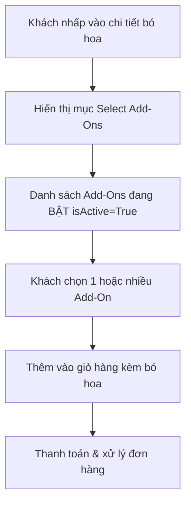

# Thiết Kế Phân Hệ Add-Ons (Sản Phẩm Kèm Theo - Bình Hoa, Socola, Gấu Bông, Bánh Kem)
## Dự Án: Nở Hoa Thả Bình (`telua_flower`)

---

## 1. Tổng Quan Phân Hệ (Overview)

Phân hệ **Add-Ons (Sản Phẩm Kèm Theo)** cho phép khách hàng mua thêm các phụ kiện đi kèm bó hoa để tăng giá trị món quà, đặc biệt hữu ích cho các dịp như **sinh nhật (bánh kem), lễ tình nhân (socola, gấu bông), khai trương (bình hoa, bóng bay)**.

Khi khách nhấp vào **chi tiết bó hoa**, hệ thống hiển thị mục **"Select Add-Ons To Make It Extra Special"** với danh sách các add-on đang bật, cho phép khách chọn thêm vào giỏ hàng.



---

## 2. Cấu Trúc Dữ Liệu (`config/anne/addons.json`)

Mỗi Add-On là một object trong mảng JSON, được Admin quản lý (thêm/sửa/bật-tắt/xóa mềm):

```json
[
  {
    "id": "addon_vase",
    "name": "Pretty Glass Vase",
    "nameVi": "Bình Hoa Thủy Tinh Xinh Xắn",
    "category": "vase",
    "price": 150000,
    "image": "https://images.unsplash.com/photo-1602143407151-7111542de6e8?w=200",
    "description": "Bình thủy tinh trong suốt cao cấp, tôn lên vẻ đẹp của bó hoa.",
    "sortOrder": 1,
    "status": "active",
    "isActive": true,
    "isDeleted": false,
    "createdAt": "2026-09-02T00:00:00Z",
    "updatedAt": "2026-09-02T00:00:00Z"
  }
]
```

### Bảng mô tả trường dữ liệu

| Trường | Kiểu | Bắt buộc | Mô tả |
| :--- | :--- | :---: | :--- |
| `id` | string | ✅ | Mã định danh duy nhất của Add-On |
| `name` | string | ✅ | Tên Add-On (tiếng Anh / mặc định) |
| `nameVi` | string | ❌ | Tên tiếng Việt hiển thị |
| `category` | string | ❌ | Nhóm: `vase`, `gift`, `cake`, `decoration`... |
| `price` | number | ✅ | Giá bán (VND) |
| `image` | string | ❌ | URL ảnh minh họa |
| `description` | string | ❌ | Mô tả ngắn |
| `sortOrder` | number | ❌ | Thứ tự hiển thị (nhỏ = lên trước) |
| `status` | string | ✅ | `active` / `inactive` / `deleted` |
| `isActive` | boolean | ✅ | `true` = hiển thị cho khách, `false` = ẩn |
| `isDeleted` | boolean | ✅ | Cờ xóa mềm |
| `createdAt` / `updatedAt` | string | ✅ | Timestamp ISO 8601 |

---

## 3. Phân Quyền Quản Lý (RBAC)

| Vai trò | Quyền hạn |
| :--- | :--- |
| `super_admin` | Toàn quyền: thêm, sửa, bật/tắt, xóa/khôi phục Add-On toàn chuỗi |
| `branch_manager` | Thêm, sửa, bật/tắt, xóa/khôi phục Add-On (áp dụng toàn chuỗi) |
| `florist` / `sales_consultant` | Chỉ xem danh sách Add-On (không quản lý) |
| `customer` | Chỉ xem Add-On đang bật & mua kèm |

---

## 4. API Endpoints

| Method | Endpoint | Quyền hạn | Mô tả |
| :--- | :--- | :---: | :--- |
| `GET` | `/api/flower/v1/addons` | Public | Lấy danh sách Add-Ons đang BẬT cho khách hàng (có ETag cache) |
| `GET` | `/api/flower/v1/admin/addons` | Admin, Manager | Lấy toàn bộ Add-Ons (kể cả đã xóa mềm) |
| `POST` | `/api/flower/v1/admin/addons` | Admin, Manager | Tạo mới Add-On |
| `PUT` | `/api/flower/v1/admin/addons/<id>` | Admin, Manager | Cập nhật Add-On |
| `PATCH` | `/api/flower/v1/admin/addons/<id>/toggle` | Admin, Manager | Bật/Tắt hiển thị (ON/OFF) |
| `DELETE` | `/api/flower/v1/admin/addons/<id>` | Admin, Manager | Xóa mềm Add-On |
| `PATCH` | `/api/flower/v1/admin/addons/<id>/restore` | Admin, Manager | Khôi phục Add-On đã xóa |

---

## 5. Luồng Hiển Thị & Thêm Vào Giỏ Hàng

### 5.1 Hiển thị trong chi tiết sản phẩm
Khi khách mở modal chi tiết bó hoa, frontend **trước tiên kiểm tra cấu hình bật/tắt toàn cục** qua `GET /api/flower/v1/addon-config` (xem mục 8). Nếu `showAddons = false`, khu vực add-on bị ẩn hoàn toàn. Nếu `true`, frontend gọi `GET /api/flower/v1/addons` và render mục **"Select Add-Ons To Make It Extra Special"** với các thẻ add-on (ảnh, tên, giá, nút chọn).

### 5.2 Thêm vào giỏ hàng
Khi khách chọn add-on và nhấn "Thêm Vào Giỏ Hàng", hệ thống thêm add-on như một item riêng trong giỏ hàng (tương tự sản phẩm), với `productId = addon_<id>`, `name`, `price`, `image`, `category = "addon"`.

### 5.3 Xử lý đơn hàng
Add-On được đưa vào mảng `items` của đơn hàng như sản phẩm thường, tính vào `subtotal` và `totalAmount`.

---

## 6. Quản Lý Trong Admin Portal

Admin portal có tab **"Add-Ons"** cho phép:
1. **Danh sách Add-Ons:** Bảng hiển thị ảnh, tên, giá, trạng thái (🟢 Đang bán / ⚪ Đã ẩn / 🔴 Đã xóa).
2. **Thêm / Sửa:** Modal nhập tên, giá, ảnh, mô tả, thứ tự.
3. **Bật/Tắt (1-Click Toggle):** Gạt nút ON/OFF để hiện/ẩn ngay lập tức.
4. **Xóa mềm / Khôi phục:** Chuyển trạng thái `deleted` và khôi phục lại.

---

## 7. File Liên Quan

| File | Vai trò |
| :--- | :--- |
| `config/anne/addons.json` | Dữ liệu Add-Ons |
| `config/anne/addonConfig.json` | Cấu hình bật/tắt hiển thị khu vực Add-On trên GUI (`showAddons`) |
| `src/data_service.py` | Hàm CRUD Add-Ons (`get_addons`, `create_or_update_addon`, `toggle_addon_active`, `delete_addon`, `restore_addon`) + `get_addon_config`, `save_addon_config` |
| `src/addon_service.py` | Service layer Add-Ons |
| `src/restful_blueprint_flower_connect.py` | API endpoints Add-Ons |
| `js/flower_app.js` | Render Add-Ons trong chi tiết sản phẩm + `isAddonSectionEnabled()` |
| `js/checkout.js` | Thêm Add-On vào giỏ hàng |
| `js/portal_admin.js` | Quản lý Add-Ons + tab cấu hình hiển thị (`loadAdminAddonConfig`, `saveAddonConfig`) |

---

## 8. Cấu Hình Bật/Tắt Hiển Thị Add-On Toàn Cục (`config/anne/addonConfig.json`)

Ngoài việc bật/tắt từng add-on riêng lẻ (`isActive`), hệ thống có **một công tắc tổng** để ẩn/hiện toàn bộ khu vực **"Sản Phẩm Kèm Theo"** trên giao diện khách hàng. Điều này hữu ích khi cửa hàng muốn tạm ngưng bán kèm mà không cần tắt từng add-on.

### 8.1 Cấu trúc dữ liệu

```json
{
  "showAddons": true,
  "label": "Sản Phẩm Kèm Theo (Add-on)",
  "description": "Hiển thị khu vực 'Chọn Sản Phẩm Kèm Theo Để Thêm Phần Đặc Biệt' trên trang chi tiết sản phẩm...",
  "updatedAt": "2026-09-02T00:00:00Z"
}
```

| Trường | Kiểu | Mô tả |
| :--- | :--- | :--- |
| `showAddons` | boolean | `true` = hiện khu vực add-on; `false` = ẩn hoàn toàn trên GUI khách |
| `label` | string | Nhãn hiển thị trong tab cấu hình |
| `description` | string | Mô tả ngắn của tính năng |
| `updatedAt` | string | Timestamp ISO 8601 lần cập nhật gần nhất |

### 8.2 API Endpoints

| Method | Endpoint | Quyền hạn | Mô tả |
| :--- | :--- | :---: | :--- |
| `GET` | `/api/flower/v1/addon-config` | Public | Lấy cấu hình `showAddons` cho storefront (ETag + Cache-Control 60s) |
| `GET` | `/api/flower/v1/admin/addon-config` | `super_admin`, `branch_manager` | Lấy đầy đủ cấu hình cho cổng quản trị |
| `PUT/POST` | `/api/flower/v1/admin/addon-config` | `super_admin` | Bật/tắt `showAddons` |

### 8.3 Tích hợp Frontend

- **Cấu hình hệ thống → Tab "Sản Phẩm Kèm Theo":** công tắc bật/tắt (`#addonVisToggle`), nút **Lưu Cấu Hình** gọi `saveAddonConfig()`; chỉ `super_admin` mở được modal Cấu hình hệ thống.
- **Thông báo:** Kết quả lưu hiển thị bằng **toast** (`notifyUser()` → `showToast()` trong `js/utils.js`) thay cho `alert()`: thành công báo đã BẬT/TẮT hiển thị (xanh), lỗi (đỏ).
- **Storefront:** `renderAddonsInModal()` gọi `isAddonSectionEnabled()` trước; nếu `false`, ẩn `#addonsSection` bất kể số lượng add-on đang bật.

