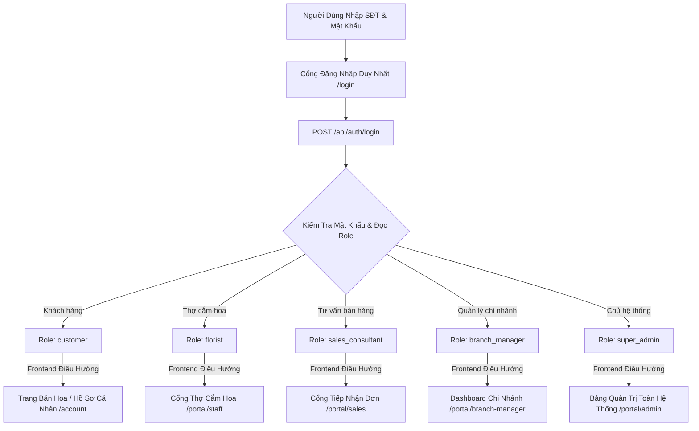
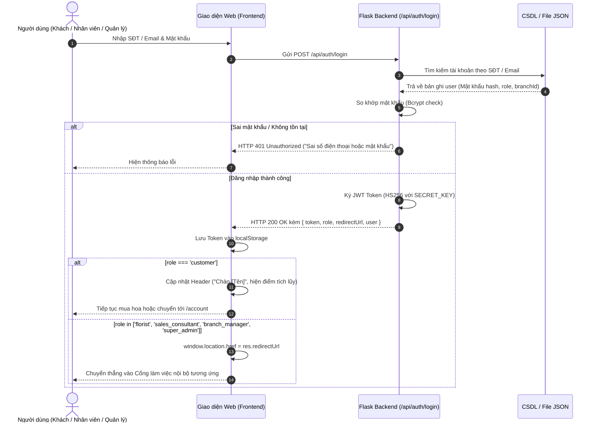
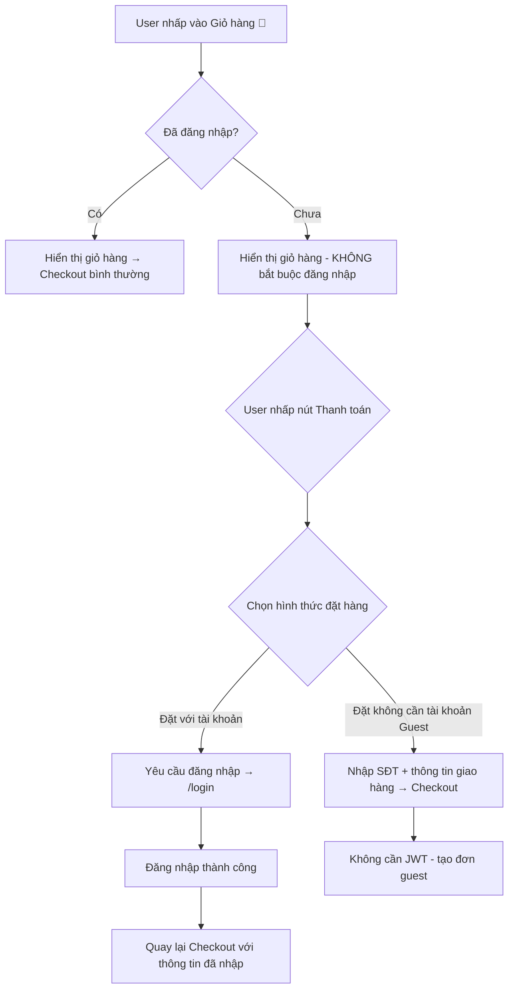

# Thiết Kế Kiến Trúc Đăng Nhập Đơn Nhất & Tự Động Phân Quyền (Single Login Portal & Dynamic RBAC)
## Dự Án: Nở Hoa Thả Bình (`telua_flower`)

---

## 1. Tổng Quan Kiến Trúc (Architecture Overview)

Hệ thống áp dụng mô hình **Cổng Đăng Nhập Duy Nhất (Single Login Entrypoint)**:
- Người dùng chỉ cần truy cập vào nút **"Tài khoản" / "Đăng nhập"** trên thanh Header (hoặc Modal đăng nhập trên điện thoại/máy tính).
- Người dùng nhập **Số điện thoại (hoặc Email)** + **Mật khẩu**.
- Hệ thống tự động xác thực danh tính, đọc vai trò (`role`) và mã chi nhánh (`branchId`), sau đó phát sinh mã bảo mật **JWT Token** và tự động điều hướng người dùng tới giao diện làm việc chính xác tương ứng.



---

## 2. Sơ Đồ Tuần Tự (Sequence Diagram)



---

## 3. Cấu Trúc JWT Token Payload & Bảo Mật

Token JWT được tạo bằng thuật toán mã hóa `HS256` với khóa bí mật (`SECRET_KEY`) lưu trong biến môi trường máy chủ.

### Cấu trúc JSON Payload:
```json
{
  "userId": "staff_001",
  "phone": "0909123456",
  "fullName": "Trần Thị Mai",
  "role": "branch_manager",
  "branchId": "branch_q10",
  "iat": 1724284800,
  "exp": 1724371200
}
```

> [!IMPORTANT]
> **Nguyên tắc bảo mật:** Khách hàng không thể tự ý sửa đổi trường `role` trên máy của mình. Nếu Token bị chỉnh sửa dù chỉ 1 ký tự, chữ ký số (Signature) sẽ bị sai và Backend sẽ từ chối toàn bộ request với mã lỗi `401 Unauthorized`.

---

## 4. Bảng Quy Tắc Ánh Xạ Điều Hướng (Dynamic Redirection Matrix)

| Vai trò (`role`) | Tên vai trò | Giao diện điều hướng (`redirectUrl`) | Mô tả màn hình hiển thị |
| :--- | :--- | :--- | :--- |
| `customer` | Khách hàng | `/` hoặc `/account` | Trang chủ mua hoa, cập nhật Header hiển thị tên khách và điểm tích lũy, sổ địa chỉ cá nhân |
| `florist` | Thợ cắm hoa | `/portal/staff` | Danh sách đơn hoa cần cắm theo ca, nút bấm chụp ảnh hoa thực tế tải lên hệ thống |
| `sales_consultant`| Tư vấn viên | `/portal/sales` | Danh sách đơn mới đổ về, thông tin ghi chú thiệp/banner, tra cứu lịch sử mua hàng của khách |
| `branch_manager` | Quản lý chi nhánh | `/portal/branch-manager` | Dashboard doanh số chi nhánh, phân ca nhân viên, quản lý xuất/nhập kho hoa tươi |
| `super_admin` | Quản trị viên | `/portal/admin` | Quản lý toàn bộ chuỗi showroom, cấu hình hệ thống, CRM toàn chuỗi, báo cáo tổng thể |

---

## 5. Cơ Chế Bảo Vệ Đa Tầng (Multi-Layer Security Guards)

### Tầng 1: Frontend Route Guard (Kiểm soát ở giao diện)
Trước khi hiển thị trang nội bộ (ví dụ: `/portal/admin`), mã JavaScript kiểm tra quyền:
```javascript
// Kiểm tra token và quyền trước khi render trang
function checkRoutePermission(allowedRoles) {
    const token = localStorage.getItem('auth_token');
    if (!token) {
        window.location.href = '/login';
        return false;
    }
    const payload = decodeJWTPayload(token);
    if (!allowedRoles.includes(payload.role)) {
        alert('Bạn không có quyền truy cập trang này!');
        window.location.href = payload.redirectUrl || '/';
        return false;
    }
    return true;
}
```

### Tầng 2: Backend API Decorator (Kiểm soát tại Server Flask)
Mỗi endpoint nghiệp vụ được bảo vệ bởi Python Decorator `@require_role`:
```python
from functools import wraps
from flask import request, jsonify
import jwt

SECRET_KEY = "your-secret-key"

def require_role(allowed_roles):
    def decorator(f):
        @wraps(f)
        def decorated_function(*args, **kwargs):
            auth_header = request.headers.get('Authorization')
            if not auth_header or not auth_header.startswith('Bearer '):
                return jsonify({"success": False, "message": "Chưa đăng nhập"}), 401
            
            token = auth_header.split(' ')[1]
            try:
                payload = jwt.decode(token, SECRET_KEY, algorithms=['HS256'])
            except jwt.ExpiredSignatureError:
                return jsonify({"success": False, "message": "Phiên đăng nhập đã hết hạn"}), 401
            except jwt.InvalidTokenError:
                return jsonify({"success": False, "message": "Token không hợp lệ"}), 401

            # Kiểm tra vai trò
            if payload.get('role') not in allowed_roles:
                return jsonify({"success": False, "message": "Không đủ quyền truy cập"}), 403

            # Đính kèm thông tin user vào request context
            request.current_user = payload
            return f(*args, **kwargs)
        return decorated_function
    return decorator

# Bảo vệ API quản lý ca trực và phân bổ công việc:
@app.route('/api/branch/<branch_id>/orders', methods=['GET'])
@require_role(['super_admin', 'branch_manager', 'florist', 'sales_consultant', 'shipper'])
def get_branch_orders(branch_id):
    user = request.current_user
    # An toàn vị trí cửa hàng:
    # - Trừ Super Admin: Không có vị trí cửa hàng cố định, toàn quyền truy xuất mọi chi nhánh.
    # - Nhân viên khác: Bắt buộc phải có branchId và chỉ được truy cập đúng chi nhánh trực thuộc.
    if not can_access_branch(user, branch_id):
        return jsonify({"success": False, "message": "Bạn không có quyền truy cập đơn hàng tại vị trí cửa hàng này"}), 403

    # Phân bổ công việc chuẩn Least Privilege tại Backend:
    # Backend kiểm tra vai trò (role, userId) và chỉ trả về đúng tệp công việc của người đó:
    # - florist: Chỉ nhận đơn hoa nghệ thuật (requiresArranging: true) trong tiến trình cắm (confirmed, arranging, photo_sent).
    # - sales_consultant: Chỉ nhận đơn mới (pending) và đơn chưa thu tiền (unpaid).
    # - shipper: Chỉ nhận đơn giao hàng (delivery) sẵn sàng hoặc đang giao.
    # - branch_manager: Xem toàn bộ đơn của chi nhánh để phân công (assignedTo).
    tasks = filter_tasks_for_staff(branch_orders, user)
    return jsonify({"success": True, "data": tasks})
```

---

## 5.1 Kiểm Tra An Toàn Vị Trí Cửa Hàng & Phân Bổ Công Việc (Store Location & Task Isolation)

| Nhóm Tài Khoản | Ràng Buộc Vị Trí Cửa Hàng (`branchId`) | Phạm Vi Dữ Liệu Được Trả Về |
| :--- | :--- | :--- |
| **Super Admin** | **Không ràng buộc** (`Branch: None` / Toàn chuỗi) | Xem mọi chi nhánh (`all`, `admin`, các showroom), điều phối đơn sang chi nhánh khác. |
| **Quản Lý Chi Nhánh** | **Bắt buộc** trùng khớp với chi nhánh quản lý | Toàn bộ đơn hàng của chi nhánh để phân công nhân sự (`assignedTo`) và giám sát ca trực. |
| **Thợ Cắm Hoa (`florist`)** | **Bắt buộc** trùng khớp với showroom trực thuộc | Chỉ các đơn **cắm hoa nghệ thuật** (`requiresArranging != False`) ở trạng thái chờ cắm/đang cắm/chờ duyệt ảnh. |
| **Tư Vấn (`sales_consultant`)** | **Bắt buộc** trùng khớp với showroom trực thuộc | Chỉ đơn mới chờ duyệt (`pending`) và đơn chưa thanh toán (`unpaid`). |
| **Giao Hàng (`shipper`)** | **Bắt buộc** trùng khớp với showroom trực thuộc | Chỉ đơn giao tận nơi (`delivery`) đã sẵn sàng giao hoặc đang trên đường giao. |


---

## 5.1 Luồng Giỏ Hàng & Thanh Toán — Kiểm Tra Đăng Nhập (Cart & Checkout Auth Flow)

> **Chính sách:** Khách hàng **KHÔNG bắt buộc đăng nhập** khi vào giỏ hàng. Hệ thống **chỉ kiểm tra / bắt đăng nhập khi khách nhấp nút Thanh toán (Checkout)** và chọn hình thức "Đặt với tài khoản".



### Giải thích luồng

| Bước | Hành vi |
| :--- | :--- |
| **Vào giỏ hàng** | Không kiểm tra đăng nhập — khách tự do xem/thêm/sửa giỏ hàng |
| **Nhấp Thanh toán** | Hiện lựa chọn: "Đặt với tài khoản" hoặc "Đặt không cần tài khoản (Guest)" |
| **Chọn "Đặt với tài khoản"** | Nếu chưa đăng nhập → redirect `/login`; sau khi đăng nhập → quay lại checkout, giữ nguyên giỏ hàng & thông tin đã nhập |
| **Chọn "Guest"** | Không cần JWT — chỉ nhập SĐT + thông tin giao hàng, tạo đơn guest |

### Lưu ý triển khai (Frontend)

```javascript
// Khi user nhấp nút Thanh toán và chọn "Đặt với tài khoản"
function handleCheckoutWithAccount() {
    const token = localStorage.getItem('auth_token');
    if (!token) {
        // Lưu giỏ hàng & thông tin đã nhập vào sessionStorage để khôi phục sau đăng nhập
        sessionStorage.setItem('pending_checkout', JSON.stringify(cartData));
        window.location.href = '/login?redirect=/checkout';
        return;
    }
    // Đã đăng nhập → tiếp tục checkout
    proceedCheckout();
}
```

> **Lưu ý:** Luồng này **không mâu thuẫn** với luồng Guest trong `PAYMENT_CANCELLATION_RETURN_DESIGN.md` — khách có thể chọn đặt không cần tài khoản, hoặc đặt với tài khoản (bắt buộc đăng nhập).

---

## 6. Phân Hệ Hồ Sơ Cá Nhân & Đổi Mật Khẩu (User Profile & Security)

Hệ thống cung cấp giao diện quản trị hồ sơ tập trung (`#userProfileModal`) dùng chung cho toàn bộ 5 vai trò (`super_admin`, `branch_manager`, `florist`, `sales_consultant`, `customer`):

### 6.1. Chính Sách Bảo Mật Định Danh (Read-only Profile)
- **Thông tin Họ và Tên, Số Điện Thoại, Email:** Được hiển thị ở chế độ **Chỉ xem (Read-only)** trên giao diện `tabProfileContentInfo` nhằm bảo vệ tính toàn vẹn danh tính và phòng chống giả mạo tài khoản.
- Người dùng không được tự ý sửa các trường này trên giao diện người dùng. Mọi yêu cầu thay đổi thông tin định danh cần được xác minh qua Bộ phận Kỹ thuật / Quản trị viên hệ thống.

### 6.2. Cơ Chế Đổi Mật Khẩu An Toàn (`PUT /auth/change-password`)
- **Xác thực mật khẩu cũ:** Sử dụng `check_password_hash` đối chiếu với mật khẩu đã lưu trong CSDL.
- **Yêu cầu mật khẩu mới:** Tối thiểu 6 ký tự.
- **Băm bảo mật:** Mật khẩu mới được băm bằng thuật toán `generate_password_hash(new_pass, method="pbkdf2:sha256")`.
- **Cập nhật phiên:** Lưu dữ liệu an toàn vào `staff_users.json` (đối với nhân sự) hoặc `customers.json` (đối với khách hàng) và thông báo thành công.

---

## 7. Tổng Kết Ưu Điểm Thiết Kế

1. **Trải nghiệm mượt mà:** Khách hàng lẫn nhân viên chỉ cần nhớ 1 nút bấm "Đăng nhập", hệ thống tự động làm toàn bộ phần còn lại.
2. **Không phân mảnh hệ thống:** Tối ưu hóa API và tài nguyên máy chủ.
3. **An toàn bảo mật tuyệt đối:** Kết hợp JWT có chữ ký số bí mật, Route Guards ở client và Role Decorators ở backend.
4. **Quản trị định danh chuẩn mực:** Thông tin định danh được bảo vệ cố định (Read-only), đổi mật khẩu an toàn theo chuẩn mã hóa hiện đại.
