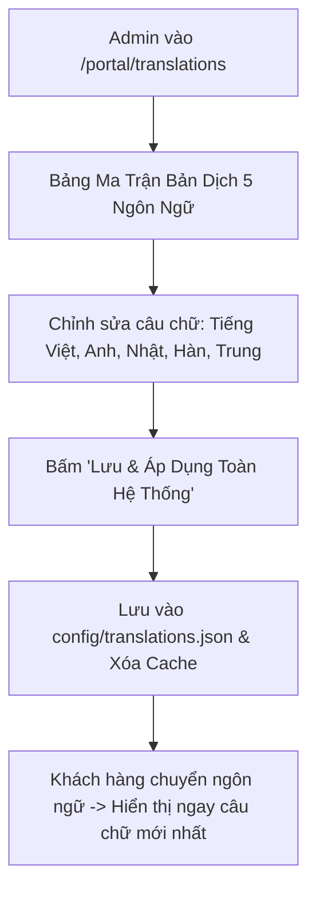

# Thiết Kế Phân Hệ Quản Trị Nội Dung & Biên Dịch Đa Ngôn Ngữ Động (Dynamic i18n & Content CMS)
## Dự Án: Nở Hoa Thả Bình (`telua_flower`)

---

## 1. Tổng Quan Phân Hệ (Overview)

Thay vì viết cố định (hardcode) các chuỗi từ điển trong mã nguồn JavaScript (`js/translations.js`), phân hệ **Dynamic i18n & Content CMS** cho phép Quản trị viên (`super_admin`) và Quản lý (`branch_manager`):
1. **Chỉnh sửa bản dịch trực tiếp trên giao diện Web:** Thay đổi nội dung hiển thị của cả 5 ngôn ngữ (🇻🇳 Tiếng Việt, 🇬🇧 English, 🇯🇵 日本語, 🇰🇷 한국어, 🇨🇳 中文) một cách trực quan mà không cần can thiệp vào code.
2. **Cập nhật nội dung các khối trang (Page Blocks CMS):** Slogan, Hotline, Giờ hoạt động, Tiêu đề banner, Giới thiệu showroom và các chính sách giao hàng/đổi trả.
3. **Hiệu lực tức thì:** Khi bấm **"Lưu Bản Dịch"**, toàn bộ dữ liệu lưu xuống `config/translations.json` và tự động cập nhật ngay trên giao diện khách hàng.



---

## 2. Giao Diện Quản Trị Biên Dịch Đa Ngôn Ngữ (`/portal/translations`)

Màn hình hiển thị dạng bảng lưới ma trận (Grid Table) theo từng nhóm nội dung (Header, Hero, Showroom, Footer, Giỏ hàng...):

### Bảng Ma Trận Biên Dịch Trực Quan (Chỉ Chứa Nhãn & Nội Dung Dịch):

| Nhóm / Key | 🇻🇳 Tiếng Việt (Gốc) | 🇬🇧 English | 🇯🇵 日本語 | 🇰🇷 한국어 | 🇨🇳 中文 | Thao tác |
| :--- | :--- | :--- | :--- | :--- | :--- | :---: |
| `hero_heading` | Gửi Trọn Vẹn Cảm Xúc | Deliver Pure Emotions | 想いを届ける華やかな彩り | 마음을 전하는 우아한 플라워 | 传递真挚浪漫与感动 | ✏️ Sửa |
| `hotline` | Hotline: | Hotline: | ホットライン: | 고객센터: | 服务热线: | ✏️ Sửa |
| `feat_delivery_title` | Giao Hàng Nhanh 2H | 2H Fast Delivery | 2時間特急配達 | 2시간 빠른 배송 | 2小时极速送达 | ✏️ Sửa |
| `store_lbl_address` | Địa chỉ cửa hàng: | Store Address: | 店舗所在地: | 매장 주소: | 门店地址: | ✏️ Sửa |
| `store_lbl_hotline` | Hotline đặt hoa nhanh: | Fast Order Hotline: | ご注文ホットライン: | 빠른 주문 핫라인: | 快速订花热线: | ✏️ Sửa |

---

## 3. Nguyên Tắc Tách Bạch Dữ Liệu & Bản Dịch (Separation of Concerns)

1. **`translations.json` (Biên Dịch Đa Ngôn Ngữ)**:
   - **Chỉ lưu trữ nhãn giao diện (UI Labels, Buttons, Headings, Policies)**: Ví dụ: `hotline` ("Hotline:"), `store_lbl_address` ("Địa chỉ cửa hàng:"), `footer_contact_title` ("Thông Tin Liên Hệ").
   - **Không lưu trữ dữ liệu doanh nghiệp cố định**: Loại bỏ các chuỗi chứa số điện thoại, email, địa chỉ cố định khỏi từ điển để tránh trùng lặp và xung đột dữ liệu.
2. **`infoCompany.json` (Thông Tin Doanh Nghiệp - Single Source of Truth)**:
   - Lưu trữ toàn bộ dữ liệu thực tế: `companyName`, `hotline`, `phone`, `email`, `address`, `workingHours`, `taxCode`, `website`, `zalo`, `mapUrl`.
   - Mọi thay đổi về số điện thoại hoặc địa chỉ trong `infoCompany.json` sẽ tự động hiển thị trên toàn bộ giao diện mà không cần chỉnh sửa từ điển dịch thuật.
```

---

## 4. Thiết Kế API Endpoints Quản Trị Bản Dịch

| Method | Endpoint | Quyền hạn | Mô tả |
| :--- | :--- | :--- | :--- |
| `GET` | `/api/translations` | Public | Tải toàn bộ từ điển 5 ngôn ngữ mới nhất (hỗ trợ HTTP ETag Cache) |
| `GET` | `/api/admin/translations` | Staff, Manager, Admin | Xem bảng ma trận từ điển để hiển thị trên CMS |
| `PUT` | `/api/admin/translations` | Manager, Admin | **Lưu cập nhật nội dung bản dịch của 1 hoặc nhiều key** |
| `POST` | `/api/admin/translations/key` | `super_admin` | Thêm từ khóa (key) bản dịch mới vào từ điển |
| `DELETE`| `/api/admin/translations/key/<key>`| `super_admin` | Xóa từ khóa bản dịch không còn sử dụng |

#### Request mẫu cập nhật bản dịch (`PUT /api/admin/translations`):
```json
{
  "key": "hotline",
  "translations": {
    "vi": "Hotline:",
    "en": "Hotline:",
    "ja": "ホットライン:",
    "ko": "고객센터:",
    "zh": "服务热线:"
  }
}
```

---

## 4. Đồng Bộ Hotline & Thông Tin Doanh Nghiệp Tự Động (`infoCompany.json` -> UI)

Hệ thống loại bỏ hoàn toàn việc hardcode số điện thoại hotline trên toàn bộ giao diện:
1. **Nguồn dữ liệu duy nhất (Single Source of Truth)**: Toàn bộ số điện thoại hotline và email được quản lý tại file `config/anne/infoCompany.json` qua API `/api/company-info`.
2. **Cơ chế nạp động phía Frontend (`applyStorefrontCompanyInfo`)**:
   - Tự động gán số hotline động vào thanh tiêu đề Top Header Bar (`#topHeaderHotlineVal`, `#topHeaderHotlineLink`).
   - Tự động gán email động vào Top Header Bar (`#topHeaderEmailVal`, `#topHeaderEmailLink`).
   - Tự động đồng bộ số hotline vào Footer (`#footerPhone`), Bản đồ cửa hàng (`#storeHotlineLink`), và Nút gọi nổi góc màn hình (`#floatingHotlineLink`, `#floatingHotlineText`).
   - Tự động hiển thị nhãn dịch qua `data-i18n="hotline"` độc lập với số điện thoại thực tế nạp từ `infoCompany.json` vào `#topHeaderHotlineVal`.

---

## 5. Tối Ưu Hiệu Năng Phía Client (Frontend Caching)

1. Khi người dùng mở trang web, hàm `setLanguage(lang)` trong `js/i18n.js` sẽ:
   - Kiểm tra xem từ điển đã có trong `localStorage` chưa.
   - Nếu chưa hoặc đã hết hạn $\rightarrow$ Gọi `GET /api/translations` để nạp từ điển động mới nhất về.
2. Khi Admin chỉnh sửa bản dịch trên CMS $\rightarrow$ API tự động tăng phiên bản cache (`translation_version`) để trình duyệt của toàn bộ khách hàng tự động cập nhật bản dịch mới nhất.
