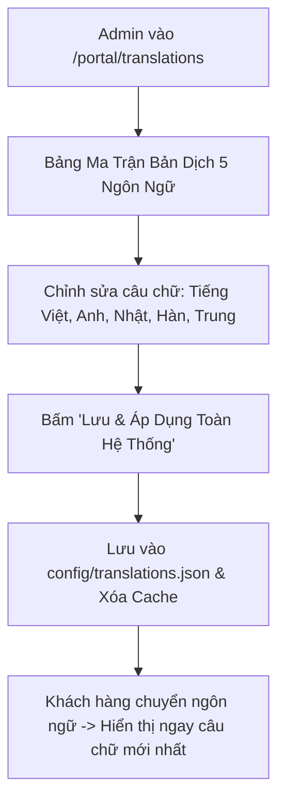

# Thiết Kế Phân Hệ Quản Trị Nội Dung & Biên Dịch Đa Ngôn Ngữ Động (Dynamic i18n & Content CMS)
## Dự Án: Nở Hoa Thả Bình (`telua_flower`)

---

## 1. Tổng Quan Phân Hệ (Overview)

Thay vì viết cố định (hardcode) các chuỗi từ điển trong mã nguồn JavaScript (`js/translations.js`), phân hệ **Dynamic i18n & Content CMS** cho phép Quản trị viên (`super_admin`) và Quản lý (`branch_manager`):
1. **Chỉnh sửa bản dịch trực tiếp trên giao diện Web:** Thay đổi nội dung hiển thị của cả 5 ngôn ngữ (🇻🇳 Tiếng Việt, 🇬🇧 English, 🇯🇵 日本語, 🇰🇷 한국어, 🇨🇳 中文) một cách trực quan mà không cần can thiệp vào code.
2. **Cập nhật nội dung các khối trang (Page Blocks CMS):** Slogan, Hotline, Giờ hoạt động, Tiêu đề banner, Giới thiệu showroom và các chính sách giao hàng/đổi trả.
3. **Hiệu lực tức thì:** Khi bấm **"Lưu Bản Dịch"**, toàn bộ dữ liệu lưu xuống `config/translations.json` và tự động cập nhật ngay trên giao diện khách hàng.



---

## 2. Giao Diện Quản Trị Biên Dịch Đa Ngôn Ngữ (`/portal/translations`)

Màn hình hiển thị dạng bảng lưới ma trận (Grid Table) theo từng nhóm nội dung (Header, Hero, Showroom, Footer, Giỏ hàng...):

### Bảng Ma Trận Biên Dịch Trực Quan:

| Nhóm / Key | 🇻🇳 Tiếng Việt (Gốc) | 🇬🇧 English | 🇯🇵 日本語 | 🇰🇷 한국어 | 🇨🇳 中文 | Thao tác |
| :--- | :--- | :--- | :--- | :--- | :--- | :---: |
| `hero_heading` | Gửi Trọn Vẹn Cảm Xúc | Deliver Pure Emotions | 想いを届ける華やかな彩り | 마음을 전하는 우아한 플라워 | 传递真挚浪漫与感动 | ✏️ Sửa |
| `top_hotline` | Hotline: 0976.491.322 | Hotline: +84 976.491.322 | ホットライン: 0976.491.322 | 고객센터: 0976.491.322 | 服务热线: 0976.491.322 | ✏️ Sửa |
| `feat_delivery_title` | Giao Hàng Nhanh 2H | 2H Fast Delivery | 2時間特急配達 | 2시간 빠른 배송 | 2小时极速送达 | ✏️ Sửa |
| `store_address_val` | 183/37 Đường 3/2, P.11, Q.10, TP.HCM | 183/37 3/2 St, W.11, D.10, HCMC | 183/37 3/2通り, 11街区, 10区, ホーチミン市 | 183/37 3/2 거리, 11동, 10군, 호치민시 | 胡志明市第10郡2月3日街183/37号 | ✏️ Sửa |

---

## 3. Cấu Trúc Dữ Liệu Lưu Trữ (`config/translations.json`)

```json
{
  "vi": {
    "site_title": "Nở Hoa Thả Bình - Đặt Hoa Online Giao Tận Nơi",
    "top_hotline": "Hotline: 0976.491.322",
    "hero_heading": "Gửi Trọn Vẹn Cảm Xúc",
    "store_address_val": "183/37 Đường 3 Tháng 2, Phường 11, Quận 10, TP. Hồ Chí Minh"
  },
  "en": {
    "site_title": "Nở Hoa Thả Bình - Online Fresh Flower Delivery",
    "top_hotline": "Hotline: +84 976.491.322",
    "hero_heading": "Deliver Pure Emotions",
    "store_address_val": "183/37 3/2 Street, Ward 11, District 10, Ho Chi Minh City"
  },
  "ja": {
    "site_title": "Nở Hoa Thả Bình - オンラインフラワーデリバリー",
    "top_hotline": "ホットライン: 0976.491.322",
    "hero_heading": "想いを届ける華やかな彩り",
    "store_address_val": "183/37 3/2通り, 11街区, 10区, ホーチミン市"
  },
  "ko": {
    "site_title": "Nở Hoa Thả Bình - 온라인 꽃 배달 서비스",
    "top_hotline": "고객센터: 0976.491.322",
    "hero_heading": "마음을 전하는 우아한 플라워",
    "store_address_val": "183/37 3/2 거리, 11동, 10군, 호치민시"
  },
  "zh": {
    "site_title": "Nở Hoa Thả Bình - 鲜花在线订购与配送",
    "top_hotline": "服务热线: 0976.491.322",
    "hero_heading": "传递真挚浪漫与感动",
    "store_address_val": "胡志明市第10郡第11坊2月3日街183/37号"
  }
}
```

---

## 4. Thiết Kế API Endpoints Quản Trị Bản Dịch

| Method | Endpoint | Quyền hạn | Mô tả |
| :--- | :--- | :---: | :--- |
| `GET` | `/api/translations` | Public | Tải toàn bộ từ điển 5 ngôn ngữ mới nhất (hỗ trợ HTTP ETag Cache) |
| `GET` | `/api/admin/translations` | Staff, Manager, Admin | Xem bảng ma trận từ điển để hiển thị trên CMS |
| `PUT` | `/api/admin/translations` | Manager, Admin | **Lưu cập nhật nội dung bản dịch của 1 hoặc nhiều key** |
| `POST` | `/api/admin/translations/key` | `super_admin` | Thêm từ khóa (key) bản dịch mới vào từ điển |
| `DELETE`| `/api/admin/translations/key/<key>`| `super_admin` | Xóa từ khóa bản dịch không còn sử dụng |

#### Request mẫu cập nhật bản dịch (`PUT /api/admin/translations`):
```json
{
  "key": "top_hotline",
  "translations": {
    "vi": "Hotline hỗ trợ: 0976.491.322",
    "en": "Customer Hotline: +84 976.491.322",
    "ja": "お問い合わせ窓口: 0976.491.322",
    "ko": "주문 핫라인: 0976.491.322",
    "zh": "快速订花热线: 0976.491.322"
  }
}
```

---

## 4. Đồng Bộ Hotline & Thông Tin Doanh Nghiệp Tự Động (`infoCompany.json` -> UI)

Hệ thống loại bỏ hoàn toàn việc hardcode số điện thoại hotline trên toàn bộ giao diện:
1. **Nguồn dữ liệu duy nhất (Single Source of Truth)**: Toàn bộ số điện thoại hotline và email được quản lý tại file `config/anne/infoCompany.json` qua API `/api/company-info`.
2. **Cơ chế nạp động phía Frontend (`applyStorefrontCompanyInfo`)**:
   - Tự động gán số hotline động vào thanh tiêu đề Top Header Bar (`#topHeaderHotlineVal`, `#topHeaderHotlineLink`).
   - Tự động gán email động vào Top Header Bar (`#topHeaderEmailVal`, `#topHeaderEmailLink`).
   - Tự động đồng bộ số hotline vào Footer (`#footerPhone`), Bản đồ cửa hàng (`#storeHotlineLink`), và Nút gọi nổi góc màn hình (`#floatingHotlineLink`, `#floatingHotlineText`).
   - Tự động cập nhật số điện thoại trong ma trận từ điển đa ngôn ngữ (`window.translations[*].top_hotline`) để khi người dùng chuyển ngôn ngữ (Anh, Nhật, Hàn, Trung), số hotline mới nhất từ `infoCompany.json` vẫn luôn được hiển thị chính xác.

---

## 5. Tối Ưu Hiệu Năng Phía Client (Frontend Caching)

1. Khi người dùng mở trang web, hàm `setLanguage(lang)` trong `js/i18n.js` sẽ:
   - Kiểm tra xem từ điển đã có trong `localStorage` chưa.
   - Nếu chưa hoặc đã hết hạn $\rightarrow$ Gọi `GET /api/translations` để nạp từ điển động mới nhất về.
2. Khi Admin chỉnh sửa bản dịch trên CMS $\rightarrow$ API tự động tăng phiên bản cache (`translation_version`) để trình duyệt của toàn bộ khách hàng tự động cập nhật bản dịch mới nhất.
