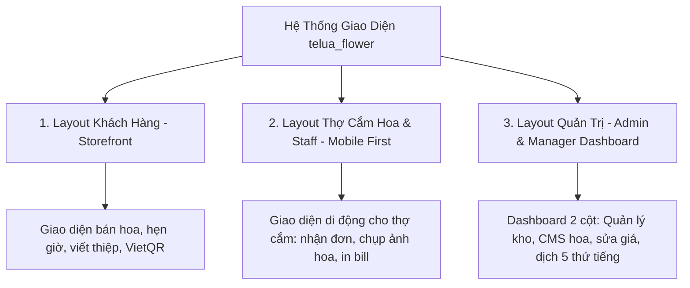
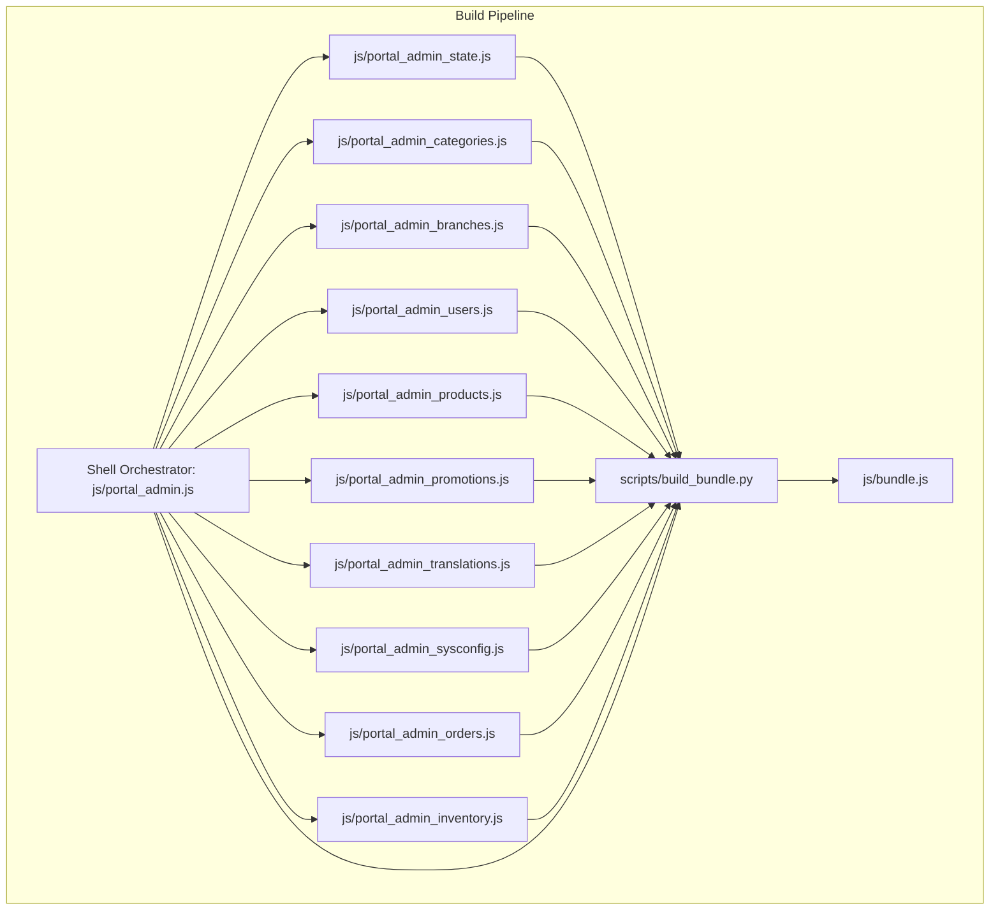

# Thiết Kế Bố Cục Giao Diện Frontend (Frontend UI/UX Layout Architecture)
## Dự Án: Nở Hoa Thả Bình (`telua_flower`)

---

## 1. Tổng Quan Kiến Trúc Bố Cục (Layout Architecture Overview)

Hệ thống được thiết kế với **3 Bố cục giao diện (Layouts)** chuyên biệt, tối ưu theo từng đối tượng người dùng:



---

## 2. Layout 1: Giao Diện Khách Hàng (Customer / Storefront Layout)

Tối ưu cho cả máy tính (Desktop) và điện thoại (Mobile) với phong cách thiết kế sang trọng (Màu hồng sen chủ đạo `#d81b60`, font Quicksand & Playfair Display).

### Sơ Đồ Bố Cục Giao Diện Khách Hàng:

```text
+-------------------------------------------------------------------------------+
| TOP PROMO BAR: "🔥 Mừng 20/10: Nhập PHUNU15 giảm 15% + Tặng thiệp thiết kế"    |
+-------------------------------------------------------------------------------+
| [LOGO NỞ HOA THẢ BÌNH] | [Search Bar...] | [🇻🇳 VI ▾] [📍 Tìm Shop] [🛒(2)] [👤 Login] |
+-------------------------------------------------------------------------------+
| [Trang Chủ] [Bó Hoa Tươi] [Lẵng Hoa] [Kệ Khai Trương] [Bình Cắm Hoa] [Khuyến Mãi] |
+-------------------------------------------------------------------------------+
| HERO BANNER SLIDER:                                                           |
| "Gửi Trọn Vẹn Cảm Xúc" - Giao hoa hỏa tốc 2H tại TP.HCM        [ Khám Phá Ngay ] |
+-------------------------------------------------------------------------------+
| DANH MỤC NHANH: (Bó Hoa) (Lẵng Hoa) (Kệ Hoa) (Lan Hồ Điệp) (Hoa Cưới) (Bình Hoa) |
+-------------------------------------------------------------------------------+
| SẢN PHẨM BÁN CHẠY (GRID CARDS 4 CỘT):                                         |
| +----------------+ +----------------+ +----------------+ +----------------+  |
| | [Ảnh Bó Hoa 1] | | [Ảnh Bó Hoa 2] | | [Ảnh Bó Hoa 3] | | [Ảnh Kệ Hoa 4] |  |
| | Mây Trắng (-7%)| | Ohara Pink(Hot)| | Tulip Lam Tinh | | Kệ Phát Lộc   |  |
| | 420k (🟢 Còn 10)| | 880k (🟢 Còn 8) | | 1.980k(🟠Còn 1)| | 2.500k(🟢Còn 5) |  |
| | [Thêm Giỏ Hàng]| | [Thêm Giỏ Hàng]| | [Thêm Giỏ Hàng]| | [Thêm Giỏ Hàng]|  |
| +----------------+ +----------------+ +----------------+ +----------------+  |
+-------------------------------------------------------------------------------+
| BANNER QUẢNG BÁ KHAI TRƯƠNG & SỰ KIỆN                                         |
+-------------------------------------------------------------------------------+
| CAM KẾT 4 TIÊU CHUẨN: (Giao 2H) (Hoa tươi mới) (Chụp ảnh trước) (Thanh toán linh hoạt)|
+-------------------------------------------------------------------------------+
| SHOWROOM LOCATOR: Thông tin 183/37 Đ. 3/2, Q.10 | [Bản Đồ Google Maps Nhúng]  |
| [📍 Chỉ Đường Đến Shop]   [📋 Sao Chép Địa Chỉ]                               |
+-------------------------------------------------------------------------------+
| FOOTER: Giới thiệu | Thông tin liên hệ | Chính sách đổi trả 60p | Đăng ký Email (-10%) |
+-------------------------------------------------------------------------------+
| FLOATING BUTTONS: [ 📞 Hotline Rung Chuông ]          [ 💬 Chat Zalo OA 24/7 ] |
+-------------------------------------------------------------------------------+
```

### 2.1 Kiến Trúc Trải Nghiệm Tìm Kiếm Trực Tiếp Đa Nền Tảng (Unified Live Search Dropdown on PC & Mobile):

- **Trên Máy Tính (Desktop Screen `md:` >= 768px)**:
  - Khi gõ tìm kiếm, bảng kết quả trực tiếp **(Desktop Live Search Dropdown - `#desktopLiveSearchResults`)** xuất hiện ngay dưới thanh tìm kiếm ở Header.
  - Hiển thị danh sách hoa tươi khớp từ khóa với ảnh thumbnail, tên hoa, giá bán VND, nhãn khuyến mãi và nút thêm vào giỏ hàng tức thì.
  - Tích hợp nút xem chi tiết nhanh và nút *"Xem toàn bộ kết quả dạng lưới bên dưới"* (tự động cuộn trang xuống `#search-results-section`).
  - Hỗ trợ đóng nhanh bằng phím ESC, nhấp ra ngoài hoặc bấm nút đóng.
- **Trên Điện Thoại (Mobile Screen `< 768px`)**:
  - Hiển thị bảng kết quả trực tiếp **(Mobile Live Search Dropdown - `#mobileLiveSearchResults`)** ngay dưới thanh tìm kiếm mobile, tránh việc bàn phím ảo che mất kết quả.
  - Trải nghiệm đồng bộ, nhanh chóng và mượt mà trên cả máy tính lẫn điện thoại di động.
### 2.2 Cơ Chế Xử Lý Lỗi Tải Sản Phẩm Quá Hạn (5-Second Load Timeout & Graceful Recovery):

- Khi người dùng truy cập trang chủ, hệ thống hiển thị Skeleton Loader và bắt đầu nạp danh mục/sản phẩm từ Backend API.
- **Quy tắc 5 giây (5000ms Timeout Policy)**:
  - Nếu sau 5 giây việc tải sản phẩm bị thất bại hoặc không thể kết nối tới máy chủ (`allStorefrontProducts` rỗng):
    - Tự động thay thế Skeleton bằng **Khối Thông Báo Lỗi Trang Chủ (Error Recovery State)** ngay tại `#dynamicCategorySections`.
    - Hiển thị thông điệp hướng dẫn rõ ràng: *"Không thể tải danh sách hoa tươi từ máy chủ. Vui lòng kiểm tra kết nối mạng."*
    - Cung cấp nút **"Thử lại ngay" (`Tải lại sản phẩm`)** để kích hoạt nạp lại dữ liệu mà không cần tải lại toàn bộ trang web.
    - Kích hoạt thông báo cảnh báo Toast đỏ để người dùng nhận biết ngay lập tức.


## 3. Layout 2: Cổng Thợ Cắm Hoa & Nhân Viên Chi Nhánh (`/portal/staff`)

Thiết kế **Mobile-First 100%** giúp thợ cắm hoa cầm điện thoại thao tác nhanh ngay tại bàn cắm hoa:

```text
+-------------------------------------------------------------+
| 🌸 NỞ HOA THẢ BÌNH - THỢ CẮM HOA | CN Quận 10 | [👤 Lan Lê]   |
+-------------------------------------------------------------+
| TABS: [📋 Đơn Cần Cắm (3)] [📷 Đã Chụp Ảnh (5)] [🚚 Đang Giao] |
+-------------------------------------------------------------+
| CARD ĐƠN HÀNG #NHTB_001 | Hẹn giao: 09:00 - 11:00 (Còn 45p)  |
| ----------------------------------------------------------- |
| Mẫu: Bó hoa Mây Trắng Bồng Bềnh (Level 1)                   |
| Thành phần: 10 Hồng trắng Ohara, Hoa sao xanh, Lá bạc       |
| Lời chúc: "Chúc em sinh nhật vui vẻ và luôn rạng ngời!"     |
| Ghi chú: Tòa Bitexco Tầng 12 - Gửi lễ tân                   |
| ----------------------------------------------------------- |
| [ 📷 CHỤP & UPLOAD ẢNH THẬT ]       [ 🖨️ IN PHIẾU GIAO K80 ] |
| [ 🟢 HOÀN TẤT CẮM HOA -> GỬI KHÁCH DUYỆT ]                  |
+-------------------------------------------------------------+
| CARD ĐƠN HÀNG #NHTB_002 | Hẹn giao: 13:00 - 15:00           |
| ...                                                         |
+-------------------------------------------------------------+
```

---

## 4. Layout 3: Bảng Quản Trị Admin & Quản Lý Chi Nhánh (`/portal/admin`)

Thiết kế **Dashboard 2 Cột Chuẩn (Responsive Sidebar + Main Content)**:

```text
+---------------------+---------------------------------------------------------+
| [🌸 Nở Hoa Thả Bình] | 🔍 [Tìm kiếm đơn/sản phẩm...] | [CN Q.10 ▾] [🔔(3)] [👤 Admin] |
| BẢNG QUẢN TRỊ       +---------------------------------------------------------+
|                     | KPI CARDS:                                              |
| 📊 Tổng Quan        | [Doanh Thu: 18.5M] [Đơn Trong Ngày: 24] [Sắp Hết: 2 Mẫu]|
| 🌸 Quản Lý Sản Phẩm +---------------------------------------------------------+
| 🏬 Quản Lý Chi Nhánh| KHÔNG GIAN LÀM VIỆC CHÍNH (DYNAMIC WORKSPACE):          |
| 📦 Ma Trận Tồn Kho  |                                                         |
| 🏷️ Khuyến Mãi (CMS) | - Màn hình Sửa Sản Phẩm & Phân Tầng Giá (Price Levels)  |
| 🌐 Biên Dịch 5 Thứ Tiếng| - Màn hình Ma Trận Tồn Kho Đa Chi Nhánh (🟢/🟠/🔴)       |
| 👥 Quản Lý Nhân Sự  | - Màn hình Quản Lý Khuyến Mãi (Công tắc Bật/Tắt ON/OFF)  |
| 👑 Khách Hàng CRM   | - Màn hình Biên Dịch Ma Trận 5 Ngôn Ngữ (Dynamic i18n)  |
| 🥀 Báo Cáo Hao Hụt  | - Màn hình Báo Cáo Hao Hụt & Phê Duyệt Chi Phí          |
|                     |                                                         |
| [🚪 Đăng Xuất]       |                                                         |
+---------------------+---------------------------------------------------------+
```

---

## 4b. Bảng Điều Khiển Đơn Hàng Nội Bộ (`#orderDashboardModal`)

Modal tổng quan đơn hàng **read-only** dành cho toàn bộ vai trò nội bộ (super_admin, branch_manager, florist, sales_consultant), mô phỏng Dashboard "Đơn Hàng Của Tôi" của khách hàng để mọi nhân sự nắm nhanh tình hình đơn.

- **Điểm vào:** Nút "📊 Bảng Điều Khiển Đơn Hàng" trong dropdown tài khoản (cả desktop `#userDropdownMenu` và mobile `#mobileAccountBtn`), hiển thị cho mọi vai trò nội bộ.
- **Phân quyền phạm vi dữ liệu:**
  - `super_admin`: Toàn chuỗi cửa hàng.
  - `branch_manager`: Đơn của chi nhánh mình (backend `query_admin_orders` tự ép theo `branchId`).
  - `florist` / `sales_consultant`: Đơn của chi nhánh mình (frontend truyền `branchId`).
- **Nguồn dữ liệu:** `GET /api/flower/v1/admin/orders?timeframe=all[&branchId=...]` → `data.orders`.
- **Nội dung:** 4 thẻ thống kê (Tổng đơn, Đang xử lý, Hoàn thành, Doanh thu) + danh sách đơn read-only kèm bộ lọc tháng, lọc trạng thái, ô tìm kiếm tức thì và **Dropdown Sắp xếp đa tiêu chí (`#dashSortSelect`)**:
  - *Mới cập nhật gần nhất* (`updatedAt_desc` - mặc định)
  - *Mới đặt nhất* (`createdAt_desc`)
  - *Giá trị cao nhất* (`totalAmount_desc`)
  - *Giá trị thấp nhất* (`totalAmount_asc`)
- Mỗi thẻ đơn hàng hiển thị huy hiệu thời điểm cập nhật mới nhất (`<i class="fa-solid fa-clock-rotate-left"></i> Cập nhật: ...`), giúp nhân viên theo dõi sát sao đơn vừa có biến động.
- **Module:** `js/order_dashboard.js` (bundled sau `staff_portal.js`).

```text
+-------------------------------------------------------------+
| 📈 BẢNG ĐIỀU KHIỂN ĐƠN HÀNG   Phạm vi: Toàn chuỗi   [↻] [✕] |
+-------------------------------------------------------------+
| [Tổng đơn: 128] [Đang xử lý: 12] [Hoàn thành: 110] [DT: 82M]|
| [Lọc tháng ▾] [Sắp xếp: Mới cập nhật ▾] [Trạng thái ▾] [🔍] |
+-------------------------------------------------------------+
| #NHTB_128 | 12/06 | CN Q.10   [Đang cắm hoa] [Đã thanh toán]|
|  👤 Trần Hoa · Bó Mây Trắng x1               1.250.000₫     |
|  🕒 Cập nhật: 10:15 02/09                                    |
+-------------------------------------------------------------+
| #NHTB_127 | 12/06 | CN Q.1    [Giao thành công] [Đã TT]     |
|  👤 Lê An · Giỏ Tulip x2 +1 món khác          2.400.000₫    |
|  🕒 Cập nhật: 09:30 02/09                                    |
+-------------------------------------------------------------+
```

---

## 4c. Modal Chi Tiết Đơn Hàng & Thanh Tiến Trình 5 Bước (`#orderDetailModal`)

Dùng chung cho Khách Hàng (Customer Portal), Nhân Viên (Staff Portal), Quản Lý và Dashboard:

- **Thanh Tiến Trình Trực Quan (`#ordDetailProgressCard`):**
  - Thanh phần trăm tổng quan (e.g. `20%`, `40%`, `60%`, `80%`, `100% Hoàn Tất`).
  - Lưới 5 bước theo luồng `delivery` hoặc `pickup`.
  - **3 Trạng thái bước rõ rệt:**
    - `Hoàn thành`: Vòng tròn xanh ngọc kèm tích check `fa-check` và ngày giờ hoàn tất trích xuất từ `order.history`.
    - `Đang xử lý`: Vòng tròn viền phát sáng (Pulse ring) và ngày giờ cập nhật mới nhất.
    - `Chưa tới`: Vòng tròn số nét đứt xám (`Chưa tới`) hiển thị các bước tiếp theo để khách hàng và nhân viên biết còn bao nhiêu bước nữa.
- **Thanh tác vụ nghiệp vụ nội bộ (`#ordDetailStaffActions`):** Chỉ hiển thị cho nhân viên chi nhánh để Upload ảnh hoa, Thu tiền mặt (COD), và Chuyển nhanh trạng thái.

---

## 4d. Kiến Trúc Phân Tách Module Bảng Quản Trị Admin (`js/portal_admin_*.js`)

Trước đây, file `js/portal_admin.js` có độ dài vượt quá **5.350 dòng (> 254 KB)**, kết hợp quá nhiều trách nhiệm nghiệp vụ gây khó khăn cho việc bảo trì và nâng cấp. Hệ thống đã được tái cấu trúc triệt để theo kiến trúc **Domain-Driven Modular Sub-modules**:



### Chi Tiết 10 Sub-Module Chuyên Biệt:

| STT | File Module | Số dòng | Trách Nhiệm Nghiệp Vụ & API Chính |
| :---: | :--- | :---: | :--- |
| **01** | [`js/portal_admin_state.js`](file:///d:/wmshare/telua_flower/js/portal_admin_state.js) | 48 | Khai báo State chia sẻ chung (`allAdminCategories`, `allAdminBranches`, `allAdminStaff`,...), cấu hình phân tầng giá `PRICE_LEVEL_CONFIG`, các tiện ích `lockScreen`, `unlockScreen`, `notifyUser`. |
| **02** | [`js/portal_admin_categories.js`](file:///d:/wmshare/telua_flower/js/portal_admin_categories.js) | 656 | Quản lý danh mục hoa & phụ kiện (CRUD, kéo thả sắp xếp thứ tự hiển thị, draft đa ngữ nhãn danh mục, đổ dữ liệu vào các dropdown danh mục). |
| **03** | [`js/portal_admin_branches.js`](file:///d:/wmshare/telua_flower/js/portal_admin_branches.js) | 301 | Quản lý hệ thống Showroom/Chi nhánh, tọa độ GPS (vĩ độ, kinh độ), bán kính giao hàng (km), trạng thái kích hoạt `isActive` và đổ dropdown chi nhánh (`populateBranchDropdowns`). |
| **04** | [`js/portal_admin_users.js`](file:///d:/wmshare/telua_flower/js/portal_admin_users.js) | 427 | Quản trị phân quyền tài khoản nhân sự nội bộ (RBAC - 5 vai trò) và bảng khách hàng CRM (điểm tích lũy, chi tiêu trọn đời, xếp hạng thành viên VIP). |
| **05** | [`js/portal_admin_products.js`](file:///d:/wmshare/telua_flower/js/portal_admin_products.js) | 909 | CMS quản lý mẫu hoa, kiểm tra hàng rào giá an toàn theo Price Levels, tải ảnh Base64 & upload ảnh thật, bộ sưu tập gallery, render động định ngạch tồn kho (`renderProductModalStockFields`). |
| **06** | [`js/portal_admin_promotions.js`](file:///d:/wmshare/telua_flower/js/portal_admin_promotions.js) | 757 | Quản lý mã giảm giá (Vouchers), chính sách xóa mềm/khôi phục, cấu hình phụ kiện mua kèm (Add-ons) và upload hình ảnh phụ kiện. |
| **07** | [`js/portal_admin_translations.js`](file:///d:/wmshare/telua_flower/js/portal_admin_translations.js) | 501 | Quản lý từ điển 5 ngôn ngữ (VI, EN, FR, JA, KO), bảng ma trận dịch thuật toàn hệ thống, tìm kiếm nhanh theo mã Text ID và cập nhật trực tiếp xuống server. |
| **08** | [`js/portal_admin_sysconfig.js`](file:///d:/wmshare/telua_flower/js/portal_admin_sysconfig.js) | 746 | Cấu hình thông tin công ty (`infoCompany.json`), công tắc bật/tắt các phương thức thanh toán, chính sách hiển thị phụ kiện và trình quản lý ảnh Slider Banner trang chủ. |
| **09** | [`js/portal_admin_orders.js`](file:///d:/wmshare/telua_flower/js/portal_admin_orders.js) | 170 | Quản lý danh sách đơn hàng phía Admin, bộ lọc trạng thái, tra cứu đơn hàng và thực hiện chuyển trạng thái đơn hàng (xác nhận, giao hàng, hủy). |
| **10** | [`js/portal_admin_inventory.js`](file:///d:/wmshare/telua_flower/js/portal_admin_inventory.js) | 655 | Ma trận tồn kho thời gian thực đa chi nhánh (Live Inventory Matrix 🟢/🟠/🔴), cập nhật hạn mức hàng loạt (Batch Quick Stock), modal lập phiếu báo hủy hoa hỏng cuối ca và tính toán chi phí hao hụt. |
| **Shell** | [`js/portal_admin.js`](file:///d:/wmshare/telua_flower/js/portal_admin.js) | 468 | File điều phối trung tâm (Shell Orchestrator): Lắng nghe `DOMContentLoaded`, kiểm tra phiên đăng nhập & phân quyền truy cập, chuyển tab giao diện, đóng/mở modal Admin và re-export/gán `window.*` bảo toàn tính tương thích HTML 100%. |

### Quy Chuẩn Tương Thích & Vòng Đời Các File Tạo Tự Động (Generated Artifacts Lifecycle):

Hệ thống quản lý chặt chẽ 3 file tạo tự động từ script build và container pipeline:

1. **Trình Đóng Gói [`scripts/build_bundle.py`](file:///d:/wmshare/telua_flower/scripts/build_bundle.py):**
   - **Mục đích:** Script Python tự động quét và gộp toàn bộ **22 modular JavaScript components** (bao gồm `utils.js`, `roles_const.js`, `config_layout.js`, `i18n.js`, `products.js`, `checkout.js`, `auth.js`, `customer_portal.js`, `staff_portal.js`, `order_dashboard.js`, 10 sub-modules `portal_admin_*.js`, `portal_admin.js`, và `flower_app.js`) theo đúng thứ tự phụ thuộc (dependency order).
   - **Nguyên lý hoạt động:** 
     - Loại bỏ các câu lệnh `import` và `export` ES6 cục bộ.
     - Bao bọc toàn bộ mã nguồn bên trong một IIFE khép kín `(function() { 'use strict'; ... })();` nhằm bảo vệ namespace và tối ưu hóa hiệu năng 0ms import.
     - Sinh ra file đích [`js/bundle.js`](file:///d:/wmshare/telua_flower/js/bundle.js).
   - **Quy tắc bắt buộc đối với Lập trình viên:** Khi chỉnh sửa bất kỳ logic JS nào trong các file con thuộc `js/`, **phải chạy lại** `python scripts/build_bundle.py` (hoặc `npm run build`) để đồng bộ mã nguồn vào `js/bundle.js`.

2. **File Đóng Gói Hợp Nhất [`js/bundle.js`](file:///d:/wmshare/telua_flower/js/bundle.js):**
   - **Mục đích:** File bundle JavaScript duy nhất phục vụ toàn bộ giao diện Storefront & Admin Portal trên môi trường Production/SPA.
   - **Đặc tính:** Là **Generated File** được tạo hoàn toàn bởi `scripts/build_bundle.py`. Lập trình viên **không chỉnh sửa trực tiếp** file này mà chỉnh sửa tại các sub-module nguồn tương ứng.
   - **Cơ chế Binding Global Scope:** Do mã nguồn nằm trong IIFE, toàn bộ hàm được gọi từ inline HTML event handlers (`onclick`, `oninput`, `onchange`, `onsubmit` - ví dụ: `saveCurrentProdI18nDraft()`, `syncSingleKeyInputToDictionary()`, `openProductModal()`,...) đều được gắn tường minh vào đối tượng `window.*` ở cuối mỗi sub-module và re-export tại Shell Orchestrator `portal_admin.js`.
   - **Chống Cache Trình Duyệt (Cache Busting):** `index.html` gọi bundle với tham số phiên bản `js/bundle.js?v=...`, đồng thời backend Flask (`src/app.py`) gửi kèm headers `Cache-Control: no-cache, no-store, must-revalidate` để ngăn chặn trình duyệt lưu cache cũ gây lỗi `ReferenceError`.

3. **File Sao Lưu & Trích Xuất Container [`config/index.html`](file:///d:/wmshare/telua_flower/config/index.html):**
   - **Mục đích:** Bản sao lưu index.html và là artifact trích xuất từ container Docker phục vụ dự phòng (fallback).
   - **Cơ chế phát sinh:** Được tạo ra tự động bởi lệnh `docker cp telua_python_flower:/app/dist/index.html ./config/index.html` trong script [`cli_docker.sh`](file:///d:/wmshare/telua_flower/cli_docker.sh) (hàm `start`) sau khi container hoàn thành build Vite SingleFile (`dist/index.html`).
   - **Độ ưu tiên nạp file trong Flask:** Trong `src/app.py`, hàm `get_index_file()` ưu tiên phục vụ file nguồn đang phát triển trực tiếp `index.html` ở thư mục gốc trước, và chỉ fallback về `config/index.html` nếu các file trên không tồn tại.

---

## 4e. Kiến Trúc Cấu Hình Điều Hướng & Ánh Xạ TabKey (Centralized Navigation & TabKey-to-Module Mapping)

Để loại bỏ hoàn toàn việc hardcode menu điều hướng trong HTML và đảm bảo khả năng mở rộng dạng **Micro-Module**, hệ thống sử dụng 2 file cấu hình trung tâm:

### 1. File Hằng Số Phân Quyền [`js/roles_const.js`](file:///d:/wmshare/telua_flower/js/roles_const.js)
Đóng vai trò là **Single Source of Truth** cho toàn bộ RBAC Frontend:
- Khai báo hằng số `ROLES`: `SUPER_ADMIN`, `BRANCH_MANAGER`, `FLORIST`, `SALES_CONSULTANT`, `CUSTOMER`.
- Khai báo nhóm quyền `ROLE_GROUPS`: `INTERNAL_STAFF`, `ADMIN_MANAGERS`, `ROOT_ADMIN`.
- Cung cấp tiện ích kiểm tra quyền: `isSuperAdmin()`, `isInternalStaff()`, `isAdminOrManager()`, `hasPermission(role, allowedRoles)`.
- Bảng metadata hiển thị `ROLE_DISPLAY_MAP` (nhãn tiếng Việt, class Tailwind badge, icon).

### 2. File Schema Điều Hướng [`js/config_layout.js`](file:///d:/wmshare/telua_flower/js/config_layout.js)
Định nghĩa toàn bộ 4 nhóm phân hệ (`cms`, `order_dashboard`, `system_config`, `profile`) cùng **16 Tab nghiệp vụ**. Mỗi tab được định danh bằng một `tabKey` duy nhất và ánh xạ 1:1 sang file module JS chịu trách nhiệm cùng hàm tải dữ liệu (`loadFn`):

| Nhóm Phân Hệ | TabKey | Tên Hiển Thị | Module JS Phụ Trách | Hàm Nạp Dữ Liệu | Modal Đích | Vai Trò Cho Phép (Roles) |
| :--- | :--- | :--- | :--- | :--- | :--- | :--- |
| **CMS** | `orders` | Đơn Hàng | [`portal_admin_orders.js`](file:///d:/wmshare/telua_flower/js/portal_admin_orders.js) | `loadAdminOrders` | `#adminPortalModal` | Admin, Manager, Florist, Sales |
| **CMS** | `products` | Mẫu Hoa & Bảng Giá | [`portal_admin_products.js`](file:///d:/wmshare/telua_flower/js/portal_admin_products.js) | `loadAdminProducts` | `#adminPortalModal` | Admin, Manager |
| **CMS** | `inventory` | Kho & Hao Hụt | [`portal_admin_inventory.js`](file:///d:/wmshare/telua_flower/js/portal_admin_inventory.js) | `loadAdminInventory` | `#adminPortalModal` | Admin, Manager, Florist |
| **CMS** | `categories` | Danh Mục Hoa | [`portal_admin_categories.js`](file:///d:/wmshare/telua_flower/js/portal_admin_categories.js) | `loadAdminCategories` | `#adminPortalModal` | Admin |
| **CMS** | `staff` | Nhân Sự Nội Bộ | [`portal_admin_users.js`](file:///d:/wmshare/telua_flower/js/portal_admin_users.js) | `loadAdminUsers` | `#adminPortalModal` | Admin, Manager |
| **CMS** | `customers` | Khách Hàng CRM | [`portal_admin_users.js`](file:///d:/wmshare/telua_flower/js/portal_admin_users.js) | `loadAdminCustomers` | `#adminPortalModal` | Admin, Manager, Sales |
| **CMS** | `branches` | Chuỗi Showroom | [`portal_admin_branches.js`](file:///d:/wmshare/telua_flower/js/portal_admin_branches.js) | `loadAdminBranches` | `#adminPortalModal` | Admin |
| **CMS** | `promotions` | Khuyến Mãi | [`portal_admin_promotions.js`](file:///d:/wmshare/telua_flower/js/portal_admin_promotions.js) | `loadAdminPromotions` | `#adminPortalModal` | Admin |
| **CMS** | `addons` | Sản Phẩm Kèm Theo | [`portal_admin_promotions.js`](file:///d:/wmshare/telua_flower/js/portal_admin_promotions.js) | `loadAdminAddons` | `#adminPortalModal` | Admin |
| **CMS** | `banners` | Banner Trang Chủ | [`portal_admin_sysconfig.js`](file:///d:/wmshare/telua_flower/js/portal_admin_sysconfig.js) | `loadAdminBanners` | `#adminPortalModal` | Admin |
| **Order Dashboard** | `order_dashboard_view` | Tổng Quan Đơn Hàng | [`order_dashboard.js`](file:///d:/wmshare/telua_flower/js/order_dashboard.js) | `openOrderDashboardModal` | `#orderDashboardModal` | Tất cả nhân sự nội bộ |
| **Cấu Hình** | `company` | Thông Tin Doanh Nghiệp | [`portal_admin_sysconfig.js`](file:///d:/wmshare/telua_flower/js/portal_admin_sysconfig.js) | `loadCompanyInfo` | `#systemConfigModal` | Admin |
| **Cấu Hình** | `translations` | Biên Dịch Đa Ngữ | [`portal_admin_translations.js`](file:///d:/wmshare/telua_flower/js/portal_admin_translations.js) | `loadAdminTranslations` | `#systemConfigModal` | Admin |
| **Cấu Hình** | `payment` | Cổng Thanh Toán | [`portal_admin_sysconfig.js`](file:///d:/wmshare/telua_flower/js/portal_admin_sysconfig.js) | `loadPaymentGateways` | `#systemConfigModal` | Admin |
| **Cấu Hình** | `addonvis` | Hiển Thị Phụ Kiện | [`portal_admin_sysconfig.js`](file:///d:/wmshare/telua_flower/js/portal_admin_sysconfig.js) | `loadAddonVisibility` | `#systemConfigModal` | Admin |
| **Cấu Hình** | `banners` | Banner Trình Chiếu | [`portal_admin_sysconfig.js`](file:///d:/wmshare/telua_flower/js/portal_admin_sysconfig.js) | `loadAdminBanners` | `#systemConfigModal` | Admin |
| **Hồ Sơ & Bảo Mật** | `profile_info` | Thông Tin Cá Nhân | [`user_profile.js`](file:///d:/wmshare/telua_flower/js/user_profile.js) | `openUserProfileModal` | `#userProfileModal` | Tất cả người dùng |
| **Hồ Sơ & Bảo Mật** | `profile_password` | Đổi Mật Khẩu | [`user_profile.js`](file:///d:/wmshare/telua_flower/js/user_profile.js) | `openUserProfileModal` | `#userProfileModal` | Tất cả người dùng |
| **Khách Hàng** | `my_orders` | Đơn Hàng Của Tôi | [`customer_portal.js`](file:///d:/wmshare/telua_flower/js/customer_portal.js) | `openCustomerPortalModal` | `#customerPortalModal` | Khách Hàng |

### 3. Quy Chuẩn 3 Bước Khi Bổ Sung Một Tab / Module Mới:
Khi phát triển thêm tính năng mới trong tương lai:
1. **Bước 1 (Tạo Module JS):** Tạo file JS chuyên biệt (ví dụ: `js/portal_admin_reports.js`) xử lý logic và giao diện tab đó.
2. **Bước 2 (Đăng ký vào `config_layout.js`):** Khai báo một object tab mới gồm `tabKey`, `label`, `icon`, `module`, `loadFn`, `action` và danh sách `roles` được phép truy cập.
3. **Bước 3 (Đồng bộ Bundle):** Thêm tên file vào mảng `MODULE_ORDER` trong [`scripts/build_bundle.py`](file:///d:/wmshare/telua_flower/scripts/build_bundle.py) và chạy `python scripts/build_bundle.py` để đóng gói tự động.

---

## 5. Bảng Màu Sắc & Typography Quy Chuẩn (Design Tokens)

- **Màu sắc chủ đạo:**
  - `primary`: `#d81b60` (Hồng cánh sen sang trọng - Màu nhận diện thương hiệu).
  - `primaryHover`: `#ad1457` (Hồng đậm khi hover).
  - `accent`: `#ff4081` (Hồng phấn tươi trẻ làm điểm nhấn).
  - `light`: `#fdfbfb` (Trắng ngọc trai nền trang nhã).
  - `dark`: `#222222` (Xám đen chữ thanh lịch).
  - `statusGreen`: `#10b981` (Đèn xanh tồn kho còn nhiều 🟢).
  - `statusOrange`: `#f59e0b` (Đèn cam tồn kho sắp hết 🟠).
  - `statusRed`: `#ef4444` (Đèn đỏ hết hàng 🔴).
- **Typography:**
  - Tiêu đề & Tên thương hiệu: **Playfair Display** (Serif quý phái, thanh lịch).
  - Nội dung & Bảng điều khiển: **Quicksand** kết hợp **Noto Sans đa ngữ** (Việt, Anh, Nhật, Hàn, Trung mềm mại, dễ đọc).
