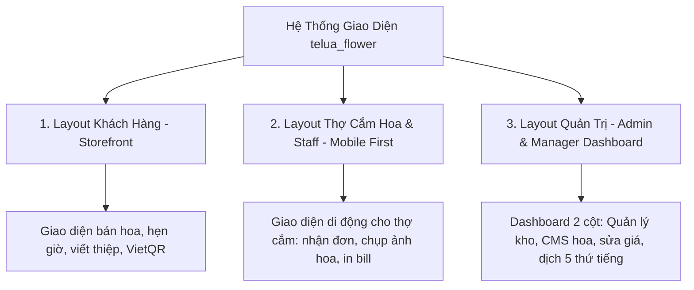

# Thiết Kế Bố Cục Giao Diện Frontend (Frontend UI/UX Layout Architecture)
## Dự Án: Nở Hoa Thả Bình (`telua_flower`)

---

## 1. Tổng Quan Kiến Trúc Bố Cục (Layout Architecture Overview)

Hệ thống được thiết kế với **3 Bố cục giao diện (Layouts)** chuyên biệt, tối ưu theo từng đối tượng người dùng:



---

## 2. Layout 1: Giao Diện Khách Hàng (Customer / Storefront Layout)

Tối ưu cho cả máy tính (Desktop) và điện thoại (Mobile) với phong cách thiết kế sang trọng (Màu hồng sen chủ đạo `#d81b60`, font Quicksand & Playfair Display).

### Sơ Đồ Bố Cục Giao Diện Khách Hàng:

```text
+-------------------------------------------------------------------------------+
| TOP PROMO BAR: "🔥 Mừng 20/10: Nhập PHUNU15 giảm 15% + Tặng thiệp thiết kế"    |
+-------------------------------------------------------------------------------+
| [LOGO NỞ HOA THẢ BÌNH] | [Search Bar...] | [🇻🇳 VI ▾] [📍 Tìm Shop] [🛒(2)] [👤 Login] |
+-------------------------------------------------------------------------------+
| [Trang Chủ] [Bó Hoa Tươi] [Lẵng Hoa] [Kệ Khai Trương] [Bình Cắm Hoa] [Khuyến Mãi] |
+-------------------------------------------------------------------------------+
| HERO BANNER SLIDER:                                                           |
| "Gửi Trọn Vẹn Cảm Xúc" - Giao hoa hỏa tốc 2H tại TP.HCM        [ Khám Phá Ngay ] |
+-------------------------------------------------------------------------------+
| DANH MỤC NHANH: (Bó Hoa) (Lẵng Hoa) (Kệ Hoa) (Lan Hồ Điệp) (Hoa Cưới) (Bình Hoa) |
+-------------------------------------------------------------------------------+
| SẢN PHẨM BÁN CHẠY (GRID CARDS 4 CỘT):                                         |
| +----------------+ +----------------+ +----------------+ +----------------+  |
| | [Ảnh Bó Hoa 1] | | [Ảnh Bó Hoa 2] | | [Ảnh Bó Hoa 3] | | [Ảnh Kệ Hoa 4] |  |
| | Mây Trắng (-7%)| | Ohara Pink(Hot)| | Tulip Lam Tinh | | Kệ Phát Lộc   |  |
| | 420k (🟢 Còn 10)| | 880k (🟢 Còn 8) | | 1.980k(🟠Còn 1)| | 2.500k(🟢Còn 5) |  |
| | [Thêm Giỏ Hàng]| | [Thêm Giỏ Hàng]| | [Thêm Giỏ Hàng]| | [Thêm Giỏ Hàng]|  |
| +----------------+ +----------------+ +----------------+ +----------------+  |
+-------------------------------------------------------------------------------+
| BANNER QUẢNG BÁ KHAI TRƯƠNG & SỰ KIỆN                                         |
+-------------------------------------------------------------------------------+
| CAM KẾT 4 TIÊU CHUẨN: (Giao 2H) (Hoa tươi mới) (Chụp ảnh trước) (Thanh toán linh hoạt)|
+-------------------------------------------------------------------------------+
| SHOWROOM LOCATOR: Thông tin 183/37 Đ. 3/2, Q.10 | [Bản Đồ Google Maps Nhúng]  |
| [📍 Chỉ Đường Đến Shop]   [📋 Sao Chép Địa Chỉ]                               |
+-------------------------------------------------------------------------------+
| FOOTER: Giới thiệu | Thông tin liên hệ | Chính sách đổi trả 60p | Đăng ký Email (-10%) |
+-------------------------------------------------------------------------------+
| FLOATING BUTTONS: [ 📞 Hotline Rung Chuông ]          [ 💬 Chat Zalo OA 24/7 ] |
+-------------------------------------------------------------------------------+
```

### 2.1 Kiến Trúc Trải Nghiệm Tìm Kiếm Đa Thiết Bị (Responsive Search UX):

- **Trên Máy Tính (Desktop Screen `md:` >= 768px)**:
  - Khi gõ tìm kiếm, kết quả được hiển thị toàn diện dạng lưới sản phẩm 4 cột (`#search-results-section`) trong khu vực `#dynamicCategorySections`.
  - Tự động cuộn trang mượt mà (Smooth scroll) để người dùng bao quát toàn bộ sản phẩm.
- **Trên Điện Thoại (Mobile Screen `< 768px`)**:
  - Do màn hình điện thoại nhỏ và bàn phím ảo che khuất nửa dưới, kết quả tìm kiếm xuất hiện **NGAY DƯỚI THANH TÌM KIẾM** dưới dạng **Bảng Kết Quả Trực Tiếp (Mobile Live Search Dropdown - `#mobileLiveSearchResults`)**.
  - Hiển thị danh sách thẻ hoa nhỏ gọn: Ảnh thu nhỏ (Thumbnail), Tên hoa, Phân loại, Giá bán VND, Trạng thái còn hàng và Nút xem chi tiết/Đặt mua tức thì.
  - Hỗ trợ nút đóng nhanh và nút cuộn xuống dạng lưới nếu muốn duyệt toàn bộ.

---

## 3. Layout 2: Cổng Thợ Cắm Hoa & Nhân Viên Chi Nhánh (`/portal/staff`)

Thiết kế **Mobile-First 100%** giúp thợ cắm hoa cầm điện thoại thao tác nhanh ngay tại bàn cắm hoa:

```text
+-------------------------------------------------------------+
| 🌸 NỞ HOA THẢ BÌNH - THỢ CẮM HOA | CN Quận 10 | [👤 Lan Lê]   |
+-------------------------------------------------------------+
| TABS: [📋 Đơn Cần Cắm (3)] [📷 Đã Chụp Ảnh (5)] [🚚 Đang Giao] |
+-------------------------------------------------------------+
| CARD ĐƠN HÀNG #NHTB_001 | Hẹn giao: 09:00 - 11:00 (Còn 45p)  |
| ----------------------------------------------------------- |
| Mẫu: Bó hoa Mây Trắng Bồng Bềnh (Level 1)                   |
| Thành phần: 10 Hồng trắng Ohara, Hoa sao xanh, Lá bạc       |
| Lời chúc: "Chúc em sinh nhật vui vẻ và luôn rạng ngời!"     |
| Ghi chú: Tòa Bitexco Tầng 12 - Gửi lễ tân                   |
| ----------------------------------------------------------- |
| [ 📷 CHỤP & UPLOAD ẢNH THẬT ]       [ 🖨️ IN PHIẾU GIAO K80 ] |
| [ 🟢 HOÀN TẤT CẮM HOA -> GỬI KHÁCH DUYỆT ]                  |
+-------------------------------------------------------------+
| CARD ĐƠN HÀNG #NHTB_002 | Hẹn giao: 13:00 - 15:00           |
| ...                                                         |
+-------------------------------------------------------------+
```

---

## 4. Layout 3: Bảng Quản Trị Admin & Quản Lý Chi Nhánh (`/portal/admin`)

Thiết kế **Dashboard 2 Cột Chuẩn (Responsive Sidebar + Main Content)**:

```text
+---------------------+---------------------------------------------------------+
| [🌸 Nở Hoa Thả Bình] | 🔍 [Tìm kiếm đơn/sản phẩm...] | [CN Q.10 ▾] [🔔(3)] [👤 Admin] |
| BẢNG QUẢN TRỊ       +---------------------------------------------------------+
|                     | KPI CARDS:                                              |
| 📊 Tổng Quan        | [Doanh Thu: 18.5M] [Đơn Trong Ngày: 24] [Sắp Hết: 2 Mẫu]|
| 🌸 Quản Lý Sản Phẩm +---------------------------------------------------------+
| 🏬 Quản Lý Chi Nhánh| KHÔNG GIAN LÀM VIỆC CHÍNH (DYNAMIC WORKSPACE):          |
| 📦 Ma Trận Tồn Kho  |                                                         |
| 🏷️ Khuyến Mãi (CMS) | - Màn hình Sửa Sản Phẩm & Phân Tầng Giá (Price Levels)  |
| 🌐 Biên Dịch 5 Thứ Tiếng| - Màn hình Ma Trận Tồn Kho Đa Chi Nhánh (🟢/🟠/🔴)       |
| 👥 Quản Lý Nhân Sự  | - Màn hình Quản Lý Khuyến Mãi (Công tắc Bật/Tắt ON/OFF)  |
| 👑 Khách Hàng CRM   | - Màn hình Biên Dịch Ma Trận 5 Ngôn Ngữ (Dynamic i18n)  |
| 🥀 Báo Cáo Hao Hụt  | - Màn hình Báo Cáo Hao Hụt & Phê Duyệt Chi Phí          |
|                     |                                                         |
| [🚪 Đăng Xuất]       |                                                         |
+---------------------+---------------------------------------------------------+
```

---

## 5. Bảng Màu Sắc & Typography Quy Chuẩn (Design Tokens)

- **Màu sắc chủ đạo:**
  - `primary`: `#d81b60` (Hồng cánh sen sang trọng - Màu nhận diện thương hiệu).
  - `primaryHover`: `#ad1457` (Hồng đậm khi hover).
  - `accent`: `#ff4081` (Hồng phấn tươi trẻ làm điểm nhấn).
  - `light`: `#fdfbfb` (Trắng ngọc trai nền trang nhã).
  - `dark`: `#222222` (Xám đen chữ thanh lịch).
  - `statusGreen`: `#10b981` (Đèn xanh tồn kho còn nhiều 🟢).
  - `statusOrange`: `#f59e0b` (Đèn cam tồn kho sắp hết 🟠).
  - `statusRed`: `#ef4444` (Đèn đỏ hết hàng 🔴).
- **Typography:**
  - Tiêu đề & Tên thương hiệu: **Playfair Display** (Serif quý phái, thanh lịch).
  - Nội dung & Bảng điều khiển: **Quicksand** kết hợp **Noto Sans đa ngữ** (Việt, Anh, Nhật, Hàn, Trung mềm mại, dễ đọc).
