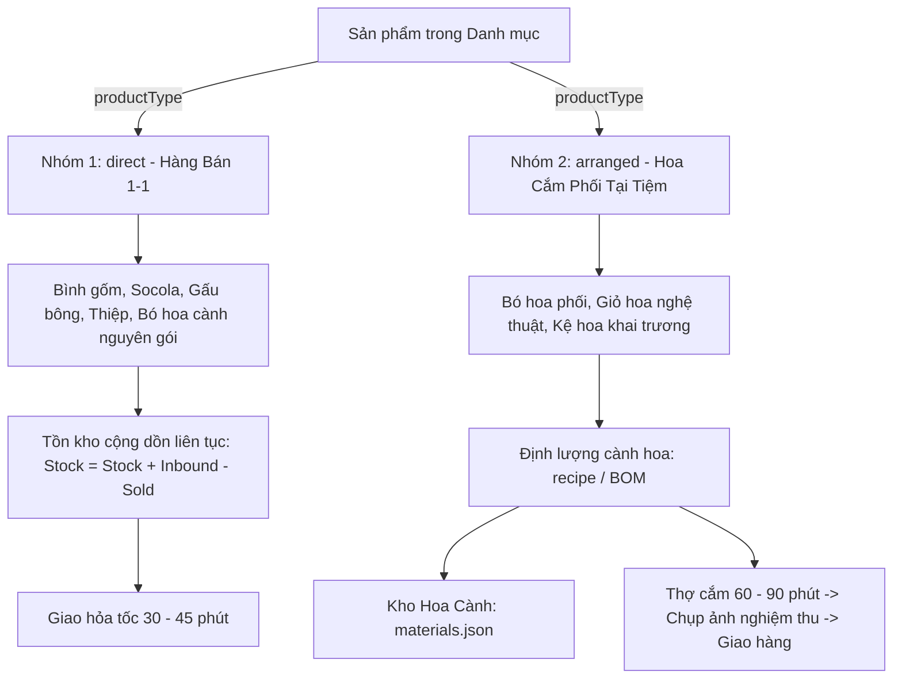
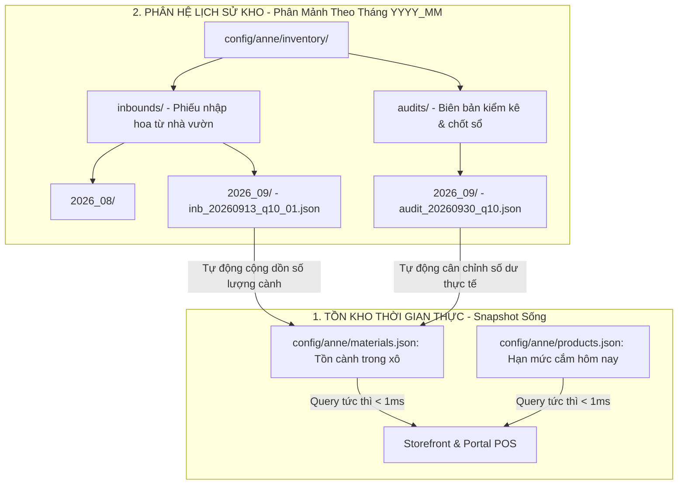
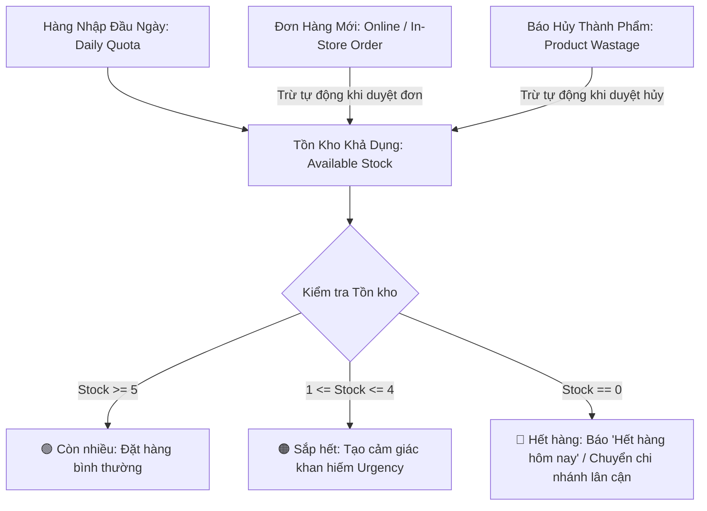

# Thiết Kế Vòng Đời Tồn Kho, Nhập Hàng, Bán Ra, Hao Hụt & Khắc Phục Hardcode Chi Nhánh
## Tài Liệu Thiết Kế Kỹ Thuật (Technical Design Document)
### Mã Nhiệm Vụ Liên Quan: `TASK_06_INVENTORY_AND_MULTI_BRANCH_ROUTING`

---

## 1. Bối Cảnh & Vấn Đề Cần Giải Quyết (Problem Statement)

### 1.1. Hiện trạng Hardcode khi "Thêm Mẫu Hoa Mới Vào Catalogue"
Trong giao diện Quản trị Catalogue (`#productModal` trong `index.html` và hàm `handleProductSubmit` trong `js/portal_admin.js`), hệ thống đang gặp lỗi **hardcode tĩnh cố định danh sách chi nhánh và số lượng ban đầu**:

1. **Giao diện HTML (`index.html` lines 2835-2849):**
   - Đang fix cứng 3 ô nhập cho 3 chi nhánh: `Kho Q.10` (`prodStockQ10`), `Kho Q.1` (`prodStockQ1`), `Kho Thảo Điền` (`prodStockTD`).
   - Số lượng mặc định bị gán cứng lần lượt là `10`, `5`, `5`.
2. **Logic JavaScript (`js/portal_admin.js` lines 2283-2285 & 2328-2351):**
   - Chỉ đọc từ 3 ID cố định: `prodStockQ10`, `prodStockQ1`, `prodStockTD`.
   - Đóng gói payload gửi về backend cố định 3 key: `branch_q10`, `branch_q1`, `branch_thao_dien`.
3. **Hệ quả tiêu cực:**
   - Khi doanh nghiệp mở thêm chi nhánh mới (hoặc chỉnh sửa thông tin trong `config/anne/branches.json`), modal thêm hoa mới **hoàn toàn không hiển thị chi nhánh mới**.
   - Không phản ánh đúng thực tế năng lực nhập hàng và cắm hoa của từng cửa hàng.

### 1.2. Nhu cầu quản lý vòng đời số lượng hoa tươi hoàn chỉnh
Hoa tươi là ngành hàng có vòng đời ngắn (2 - 4 ngày). Quản trị viên và Quản lý chi nhánh cần một hệ thống quản lý trọn vẹn 4 chỉ số:
- **Hàng nhập (Daily Inbound / Quota):** Hạn mức số lượng hoa tươi nhập về showroom mỗi sáng.
- **Hàng đã bán (Sold):** Số lượng hoa đã được khách đặt mua qua đơn hàng.
- **Tồn tại hiện tại (Current Available Stock):** Số lượng thực tế còn lại có thể bán tiếp trên website.
- **Số lượng hao hụt (Wastage):** Hoa bị dập cánh do vận chuyển, nở sớm do thời tiết, hoặc gãy cành trong quá trình cắm cần được lập biên bản báo hủy cuối ca.

### 1.3. Thách Thức Nghiệp Vụ Thực Tế: Nhập 10 Loại Hoa Cành Tạo Ra 20 Mẫu Hoa Bán Lẻ
Trong thực tế vận hành tiệm hoa tươi, không có nhà vườn nào cung cấp sẵn 20 mẫu bó/giỏ thành phẩm.
- **Lúc nhập hàng (Inbound):** Tiệm chỉ nhập **10 - 15 loại nguyên vật liệu hoa cành & phụ kiện** (VD: 100 cành Hồng Ohara, 50 cành Cúc mẫu đơn, 20 cành Tú cầu, 10 bó Baby, 20 giỏ mây, xốp cắm, giấy gói...).
- **Lúc mở bán trên Website (Sales Catalog):** Từ 10 loại nguyên liệu trên, đội ngũ thợ cắm hoa (florists) có thể phối màu và tạo ra **20 đến 50 mẫu sản phẩm khác nhau** (Bó hoa, Giỏ hoa, Kệ hoa, Hộp hoa).
- **Vấn đề cốt lõi:** Hoa cành là **tài nguyên dùng chung (Shared Resources)**. Nếu chỉ quản lý tồn kho ở cấp độ sản phẩm bán lẻ mà không quản lý kho hoa cành, tiệm sẽ:
  1. Không kiểm soát được số lượng cành hoa thực tế trong xô bảo quản, gây thất thoát hoa cành không rõ nguyên nhân.
  2. Bị tình trạng "bán vượt quá lượng hoa cành hiện có" (over-selling).
  3. Không tính toán được chính xác chi phí giá vốn (COGS) và lợi nhuận gộp của từng mẫu hoa.

---

## 2. Mô Hình Dữ Liệu, Phân Tách Nhóm Hàng & Chu Kỳ Vận Hành (Data Model, Product Classification & Daily Cycle)

### 2.0. Phân Tách 2 Nhóm Sản Phẩm Bằng Cờ `productType`

Hệ thống phân định rạch ròi 2 bản chất hàng hóa trong `config/anne/products.json`:



#### Bảng so sánh 2 nhóm sản phẩm:

| Tiêu chí | 📦 Nhóm 1: Bán Trực Tiếp (`direct`) | 🌸 Nhóm 2: Hoa Cắm Phối Tại Tiệm (`arranged`) |
| :--- | :--- | :--- |
| **Mặt hàng đại diện** | Bình cắm hoa, lọ gốm, thiệp chúc mừng, socola, gấu bông, hoặc bó hoa cành nhập về bán nguyên bó (không cắm lại). | Bó hoa phối nhiều loại, giỏ hoa vintage, kệ hoa khai trương, hộp hoa tươi nghệ thuật. |
| **Bản chất tồn kho** | **Tồn kho cộng dồn liên tục (Continuous Stock):** Nhập 50 cái, bán 2 cái còn 48 cái. Tồn kho giữ nguyên qua các ngày, không bị reset. | **Hạn mức mở bán trong ngày (Daily Quota) + Kho Cành:** Phụ thuộc vào lượng hoa cành tươi nhập về xưởng và định lượng cắm của thợ hoa. |
| **Quy trình nhập hàng** | Admin/Thủ kho nhập trực tiếp số lượng nhập thêm (`+20 bình gốm`). | Nhập số lượng cành vào **Kho Hoa Cành** (`materials.json`). Sau đó hệ thống gợi ý hoặc thợ hoa xác nhận Hạn mức cắm mở bán (`dailyQuota`). |
| **Cơ chế trừ tồn kho khi có đơn** | Trừ 1 : 1 trực tiếp vào số lượng sản phẩm. | 1. Trừ 1 vào hạn mức mở bán của mẫu hoa.<br>2. **Tự động trừ số lượng cành hoa tương ứng trong Kho Hoa Cành** theo công thức định lượng (`recipe`). |
| **Thời gian chuẩn bị đơn** | Có sẵn trên kệ: Đóng gói và giao ngay trong 30 - 45 phút. | Cần thời gian cắm hoa nghệ thuật: 60 - 90 phút (Thợ nhận đơn $\rightarrow$ cắm $\rightarrow$ chụp ảnh hoa thật gửi khách $\rightarrow$ giao hàng). |
| **Kiểm soát thất thoát (Wastage)** | Báo hủy rơi vỡ, móp méo, hết hạn sử dụng. | - Báo hủy cành hoa dập/gãy trong quá trình cắm.<br>- Báo hủy cả bó/giỏ hoa đã cắm xong nhưng khách hủy đơn để lâu héo. |

---

### 2.0.1. Kiến Trúc Quản Lý Kho Hoa Cành (Raw Stems Inventory) & Công Thức Cắm Hoa (Recipe BOM)

#### A. Cấu trúc Kho Hoa Cành & Phụ Liệu (`config/anne/materials.json`):
Mỗi cành hoa tươi và phụ liệu được quản lý như một nguyên vật liệu riêng biệt với tồn kho theo từng chi nhánh:
```json
[
  {
    "id": "mat_rose_ohara",
    "name": "Hoa Hồng Ohara Pink",
    "unit": "cành",
    "category": "flower_main",
    "costPrice": 18000,
    "stockByBranch": {
      "branch_q10": 120,
      "branch_q1": 80,
      "branch_thao_dien": 60
    }
  },
  {
    "id": "mat_baby_white",
    "name": "Hoa Baby Trắng Nhập Khẩu",
    "unit": "nhánh",
    "category": "flower_filler",
    "costPrice": 12000,
    "stockByBranch": {
      "branch_q10": 45,
      "branch_q1": 30,
      "branch_thao_dien": 20
    }
  },
  {
    "id": "mat_basket_rattan",
    "name": "Giỏ Mây Vintage Bầu Dục",
    "unit": "cái",
    "category": "accessory",
    "costPrice": 45000,
    "stockByBranch": {
      "branch_q10": 20,
      "branch_q1": 15,
      "branch_thao_dien": 10
    }
  }
]
```

#### B. Công thức định lượng cắm hoa trong sản phẩm `arranged` (`products/{id}.json`):
```json
{
  "id": "gio_hoa_01",
  "name": "Giỏ Hoa Nắng Sớm",
  "productType": "arranged",
  "priceNumber": 880000,
  "dailyQuota": 8,
  "recipe": [
    { "materialId": "mat_rose_ohara", "name": "Hồng Ohara", "quantity": 8, "unit": "cành", "isMain": true },
    { "materialId": "mat_baby_white", "name": "Baby Trắng", "quantity": 3, "unit": "nhánh", "isMain": false },
    { "materialId": "mat_basket_rattan", "name": "Giỏ Mây Vintage", "quantity": 1, "unit": "cái", "isMain": true }
  ]
}
```

#### C. Quy trình trừ kho cành & Kiểm soát thất thoát hoa cành cuối ngày:
1. **Lúc nhận đơn:** Khách đặt Giỏ Hoa Nắng Sớm $\rightarrow$ Trừ 1 vào Hạn mức cắm trong ngày (`Daily Quota`).
2. **Lúc thợ hoàn thành cắm hoa (`status = arranging -> photo_sent`):**
   - Hệ thống tự động trừ ngầm trong `materials.json` của chi nhánh:
     - `mat_rose_ohara`: Giảm 8 cành.
     - `mat_baby_white`: Giảm 3 nhánh.
     - `mat_basket_rattan`: Giảm 1 cái.
   - Thợ cắm hoa có thể điều chỉnh số lượng thực tế nếu dùng thêm/bớt hoa do kích thước bông to/nhỏ.
3. **Kiểm kê & Phát hiện thất thoát hoa cành cuối ca:**
   $$\text{Tồn cành thực tế trong xô} = \text{Nhập đầu ca} - \text{Tổng cành đã cắm vào đơn} - \text{Hao hụt báo hủy}$$
   - Nếu $\text{Kiểm đếm thực tế} < \text{Tồn lý thuyết}$ $\rightarrow$ Hệ thống cảnh báo ngay lượng cành hoa thất thoát bất thường để Quản lý chi nhánh kiểm tra ca làm việc.

---

### 2.0.2. Kiến Trúc Phân Mảnh Thư Mục Theo Tháng Quản Lý Nhập Kho & Kiểm Kê (`config/anne/inventory/`)

Tuân thủ nghiêm ngặt nguyên lý **Memory Optimization & Large Data Handling**, hệ thống phân tách rạch ròi giữa **Dữ liệu Tồn kho Hiện tại (Master Snapshot)** và **Lịch sử Giao dịch Theo Thời gian (Time-series Inbound & Audit Logs)**:



#### A. Cấu trúc Cây Thư Mục Chi Tiết:
```text
config/anne/
├── materials.json                     # Tồn kho hoa cành thời gian thực (hiện tại trong xô)
├── products.json                      # Danh mục sản phẩm & hạn mức cắm hôm nay
│
└── inventory/                         # 📁 Phân hệ Lịch sử Nhập hàng & Kiểm kê
    ├── inbounds/                      # Phiếu nhập hoa tươi từ nhà vườn (Inbound Receipts)
    │   ├── 2026_08/
    │   │   └── inb_20260830_q10_01.json
    │   └── 2026_09/
    │       ├── inb_20260901_q10_01.json
    │       └── inb_20260913_q10_01.json
    │
    └── audits/                        # Biên bản kiểm kê & chốt sổ thất thoát định kỳ
        └── 2026_09/
            ├── audit_20260915_mid_q10.json   # Kiểm kê giữa tháng
            └── audit_20260930_end_q10.json   # Chốt sổ cuối tháng
```

#### B. Cấu trúc File Phiếu Nhập Hoa Cành (`inbounds/2026_09/inb_20260913_q10_01.json`):
```json
{
  "id": "inb_20260913_q10_01",
  "inboundCode": "NH_20260913_001",
  "branchId": "branch_q10",
  "branchName": "Nở Hoa Thả Bình - Showroom Quận 10",
  "supplier": "Nhà Vườn Dalat Hasfarm",
  "importDate": "2026-09-13",
  "receivedBy": "staff_001",
  "receiverName": "Trần Thị Mai (Quản lý CN)",
  "items": [
    {
      "materialId": "mat_rose_ohara_white",
      "materialName": "Hồng Trắng Ohara",
      "quantity": 100,
      "unit": "cành",
      "costPrice": 18000,
      "totalAmount": 1800000
    },
    {
      "materialId": "mat_daisy_tana",
      "materialName": "Cúc Tana",
      "quantity": 50,
      "unit": "nhánh",
      "costPrice": 6000,
      "totalAmount": 300000
    }
  ],
  "totalItems": 2,
  "totalStems": 150,
  "totalCost": 2100000,
  "notes": "Hoa tươi mới cắt sáng sớm, cánh đều đẹp không dập.",
  "createdAt": "2026-09-13T07:15:00Z"
}
```

#### C. Cấu trúc File Biên Bản Kiểm Kê Chốt Sổ (`audits/2026_09/audit_20260930_end_q10.json`):
```json
{
  "id": "audit_20260930_end_q10",
  "auditCode": "KK_20260930_Q10",
  "branchId": "branch_q10",
  "auditDate": "2026-09-30",
  "auditedBy": "staff_001",
  "auditorName": "Trần Thị Mai",
  "items": [
    {
      "materialId": "mat_rose_ohara_white",
      "materialName": "Hồng Trắng Ohara",
      "systemQuantity": 15,
      "actualQuantity": 12,
      "discrepancy": -3,
      "unitCost": 18000,
      "lossAmount": 54000,
      "reason": "Thất thoát không giải trình được trong ca tối"
    }
  ],
  "totalDiscrepancyStems": -3,
  "totalLossAmount": 54000,
  "status": "confirmed",
  "createdAt": "2026-09-30T21:30:00Z"
}
```

#### D. Chu Trình Tự Động Hóa 3 Bước:
1. **Lúc nhập hàng:**
   - Nhân viên điền phiếu nhập $\rightarrow$ Lưu file vào `inventory/inbounds/YYYY_MM/inb_...json`.
   - Hệ thống tự động mở `materials.json`, cộng số cành nhập vào `stockByBranch[branchId]` tương ứng.
2. **Trong ca làm việc:**
   - Mỗi đơn hoa cắm hoàn tất $\rightarrow$ Tự động trừ cành hoa trong `materials.json`.
3. **Lúc kiểm kê chốt sổ:**
   - Nhân viên đếm cành thực tế trong xô $\rightarrow$ Lưu biên bản vào `inventory/audits/YYYY_MM/audit_...json`.
   - Hệ thống tự động cập nhật `materials.json` khớp với số lượng thực tế kiểm đếm, ghi nhận chênh lệch vào báo cáo tài chính hao hụt.

---

### 2.1. Công thức cân bằng kho thời gian thực
Tại bất kỳ thời điểm nào trong ngày, số lượng tồn khả dụng của một mẫu hoa tại một chi nhánh tuân thủ công thức:

$$\text{Tồn khả dụng (Available)} = \text{Hàng nhập trong ngày (Daily Quota)} - \text{Đã bán (Sold)} - \text{Hao hụt thành phẩm (Product Wastage)}$$

Trong đó:
- **Hàng nhập trong ngày ($\text{Daily Quota}$):** Số lượng cắm được tối đa của mẫu hoa đó tại chi nhánh trong ngày (mặc định lấy từ `stockByBranch[branchId]` hoặc cập nhật nhanh mỗi sáng).
- **Đã bán ($\text{Sold}$):** Tổng số lượng sản phẩm nằm trong các đơn hàng của chi nhánh đó trong ngày (ở các trạng thái: `pending`, `confirmed`, `arranging`, `in_progress`, `photo_sent`, `delivered`, `completed` - loại trừ các đơn `cancelled`).
- **Hao hụt thành phẩm ($\text{Product Wastage}$):** Tổng số lượng bó/bình hoa nguyên vẹn bị hỏng phải hủy trong ngày (có gắn `productId`).
- **Điều kiện an toàn:** $\text{Available} \ge 0$. Khi $\text{Available} = 0$, hệ thống tự động khóa nút đặt hoặc chuyển sang trạng thái "Hết hàng hôm nay".



---

### 2.2. Chu kỳ vận hành theo ngày (Daily Scope - Giờ Việt Nam GMT+7)

> [!IMPORTANT]
> **Quy tắc phân định ngày (Date Boundary):**
> Do đặc thù hoa tươi nhập mới mỗi sáng, chỉ số **Đã bán (`Sold`)** và **Hao hụt (`Wastage`)** được tính theo phạm vi **Ngày hiện tại (00:00:00 đến 23:59:59 GMT+7)**.

* **Đầu ca sáng (07:00 - 08:30):**
  - Khi xe hoa từ Đà Lạt/nhà vườn về, Quản lý/Thợ cắm hoa vào `/portal/admin` $\rightarrow$ Tab **Kho & Hao Hụt** để kiểm tra và cập nhật nhanh hạn mức cắm hoa hôm nay (**Batch Quick Stock Update**).
  - Hạn mức này lưu vào `stockByBranch` của từng mẫu hoa trong `products.json`.
* **Trong ca làm việc:**
  - Mỗi đơn hàng phát sinh sẽ tự động tính dồn vào chỉ số `Sold` của chi nhánh được gán đơn trong ngày.
  - Tồn khả dụng `Available` giảm dần theo thời gian thực.
* **Cuối ca làm việc (20:30 - 21:30):**
  - Nhân viên kiểm kê lượng hoa dập nát, gãy cành hoặc nở quá độ $\rightarrow$ Lập phiếu **Báo Hủy Hoa Hỏng** (`wastage_reports.json`).
* **Sang ngày mới (00:00 GMT+7):**
  - Chỉ số `Sold` và `Wastage` tự động reset về `0` cho ngày mới.
  - Chỉ số Hạn mức nhập `Daily Quota` được giữ nguyên cấu hình làm mốc chuẩn cho đến khi nhân viên cập nhật lại.

---

### 2.3. Phân loại 2 hình thức Báo Hủy Hoa Hỏng (Wastage Classification)

Phiếu báo hủy hỗ trợ linh hoạt 2 trường hợp:

| Loại hình báo hủy | Khái niệm & Ví dụ | Ảnh hưởng đến Tồn kho | Ảnh hưởng Tài chính |
| :--- | :--- | :--- | :--- |
| **1. Hủy Mẫu hoa thành phẩm (`productId`)** | Bó/bình hoa đã cắm xong nhưng bị khách đổi ý không lấy để lâu héo, hoặc bị rơi đổ dập nát thành phẩm. | **Trừ trực tiếp** vào tồn khả dụng của mẫu hoa đó tại chi nhánh. | Ghi nhận thiệt hại giá vốn của toàn bộ mẫu hoa. |
| **2. Hủy Hoa nguyên liệu theo cành (`flowerType`)** | Cành hoa tươi nguyên liệu bị gãy dập khi dỡ kiện hàng, úa lá trong xô bảo quản (VD: 5 cành Hồng Spirit, 3 cành Tú Cầu). | **Không trừ mẫu thành phẩm**, chỉ ghi nhận hao hụt nguyên liệu. | Tính toán thiệt hại chi phí vốn = $\text{Số cành} \times \text{Đơn giá vốn}$. |

---

### 2.4. Ma Trận Phân Quyền Vai Trò (RBAC Matrix)

| Chức năng | Super Admin | Quản Lý Chi Nhánh (`branch_manager`) | Thợ Cắm Hoa (`florist`) | Tư Vấn Bán Hàng (`sales_consultant`) |
| :--- | :---: | :---: | :---: | :---: |
| **Xem Ma trận tồn kho toàn chuỗi** | ✅ Toàn quyền | ⚠️ Xem được (mặc định highlight CN mình) | ⚠️ Xem được | ⚠️ Xem được |
| **Sửa hạn mức tồn kho (Batch Update)** | ✅ Mọi chi nhánh | ⚠️ **Chỉ sửa chi nhánh mình phụ trách** (`user.branchId`) | ❌ Không có quyền | ❌ Không có quyền |
| **Tạo phiếu báo hủy hoa hỏng** | ✅ Mọi chi nhánh | ✅ Chi nhánh mình | ✅ **Chi nhánh mình** | ❌ Không có quyền |
| **Xem lịch sử phiếu báo hủy** | ✅ Xem toàn chuỗi | ⚠️ Xem chi nhánh mình | ⚠️ Xem chi nhánh mình | ❌ Không có quyền |

---

### 2.5. Cấu trúc dữ liệu chi tiết (JSON Schemas)

#### A. Cấu trúc tồn kho sản phẩm trong `config/anne/products.json`
Động hóa hoàn toàn `stockByBranch` không giới hạn số lượng chi nhánh:
```json
{
  "id": "bo_hoa_01",
  "name": "Mây Trắng Bồng Bềnh",
  "category": "bo_hoa",
  "priceNumber": 420000,
  "stockByBranch": {
    "branch_q10": 10,
    "branch_q1": 5,
    "branch_thao_dien": 5,
    "branch_binh_thanh": 8
  },
  "dailyQuota": 28,
  "isActive": true,
  "updatedAt": "2026-09-09T08:00:00Z"
}
```

#### B. Cấu trúc phiếu báo hủy hoa hỏng trong `config/anne/wastage_reports.json`
```json
[
  {
    "id": "wastage_20260909_q10_01",
    "branchId": "branch_q10",
    "branchName": "Nở Hoa Thả Bình - Showroom Quận 10",
    "date": "2026-09-09",
    "reportedBy": "staff_002",
    "reporterName": "Lê Thị Cẩm Tú (Thợ cắm hoa)",
    "wastageType": "product",
    "items": [
      {
        "productId": "bo_hoa_01",
        "productName": "Mây Trắng Bồng Bềnh",
        "flowerType": "Hồng trắng Ohara",
        "quantity": 1,
        "damagedStems": 10,
        "reason": "Dập cánh khi vận chuyển từ nhà vườn về",
        "unitCost": 150000,
        "totalLoss": 150000
      }
    ],
    "totalLossAmount": 150000,
    "notes": "Kiểm kê hao hụt cuối ca chiều ngày 09/09/2026",
    "createdAt": "2026-09-09T18:30:00Z"
  }
]
```

---

### 2.6. Phân Hệ Báo Cáo Nhập – Xuất – Tồn Theo Tháng (Monthly Inventory Balance Report)

Để giải quyết bài toán quản trị tài sản kho và theo dõi các mặt hàng có thời hạn lưu kho dài (như Bình hoa, Lọ gốm, Socola, Quà tặng kèm, Phụ liệu cắm hoa - nhóm `productType: "direct"`) song song với hoa tươi cành ngắn ngày (`materials`), hệ thống thiết lập chu kỳ cân bằng kho theo tháng (Monthly Cycle).

#### 2.6.1. Công Thức Cân Bằng Kho Tháng Chuẩn Kế Toán:
$$\mathbf{Tồn\ Cuối\ Tháng\ (Closing\ Stock)} = \mathbf{Tồn\ Đầu\ Tháng\ (Opening)} + \mathbf{Tổng\ Nhập\ Trong\ Tháng\ (Inbound)} - \mathbf{Tổng\ Xuất\ Bán\ (Sold)} - \mathbf{Hao\ Hụt/Hủy\ (Wastage)}$$

Trong đó:
- **Tồn Đầu Tháng ($\text{Opening}$):** Số lượng tồn kho thực tế chốt tại biên bản kiểm kê cuối tháng liền kề trước đó (`inventory/audits/{PREV_MONTH}/audit_...json`). Nếu là tháng đầu tiên khởi tạo, lấy từ tồn kho ban đầu khi khai báo sản phẩm/nguyên liệu.
- **Tổng Nhập Trong Tháng ($\text{Inbound}$):** Tổng số lượng từ tất cả các phiếu nhập hàng phát sinh từ ngày 01 đến ngày cuối tháng lưu trong `inventory/inbounds/{YYYY_MM}/*.json`.
- **Tổng Xuất Bán ($\text{Sold}$):** Tổng số lượng sản phẩm/cành hoa nằm trong các đơn hàng thành công của tháng (`orders/{branch_id}/{YYYY_MM}/`).
- **Hao Hụt / Báo Hủy ($\text{Wastage}$):** Tổng số lượng bị dập, vỡ, hỏng ghi nhận trong các phiếu báo hủy của tháng (`wastage_reports.json`).
- **Tồn Cuối Tháng ($\text{Closing}$):** Số lượng tồn thực tế trên kệ/trong xô lúc kết thúc tháng $\rightarrow$ Tự động trở thành **Tồn Đầu Tháng** của tháng tiếp theo.

#### 2.6.2. So Sánh Đặc Thù Giữa Hàng Bền Trữ Lâu vs. Hoa Tươi Ngắn Ngày:

| Tiêu chí | 🏺 Hàng Bền Trữ Lâu (`direct`) <br> *(Bình gốm, lọ hoa, socola, phụ liệu)* | 🌸 Hoa Cành Ngắn Ngày (`materials`) <br> *(Hồng Ohara, Cát tường, Baby...)* |
| :--- | :--- | :--- |
| **Thời gian lưu kho** | Dài hạn (3 - 12 tháng hoặc nhiều năm). | Ngắn hạn (2 - 4 ngày). |
| **Biến động số dư** | Tồn kho cộng dồn liên tục qua từng ngày và từng tháng. Tháng 8 còn 20 bình $\rightarrow$ Tháng 9 bán 5 còn 15 bình $\rightarrow$ Tháng 10 bán tiếp. | Nhập mới hàng ngày hoặc cách ngày. Số lượng thừa cuối ca héo phải hủy. |
| **Giá trị tồn kho** | Chiếm tỷ trọng vốn lưu động lớn của showroom (hàng chục đến hàng trăm triệu tiền bình gốm nghệ thuật). | Giá trị luân chuyển nhanh, chi phí vốn tính vào COGS của từng bó hoa. |
| **Mục đích báo cáo** | Kiểm soát thất thoát tài sản tĩnh, tính vòng quay hàng tồn kho (Inventory Turnover). | Kiểm soát thất thoát hoa tươi, đánh giá tỷ lệ hao hụt do thời tiết/tay nghề thợ. |

#### 2.6.3. Quy Trình Chốt Sổ & Kết Chuyển Tháng Tự Động:
1. **Ngày cuối tháng (21:30 ngày 30 hoặc 31):**
   - Quản lý chi nhánh đối soát số lượng thực tế trên kệ showroom và trong xô hoa.
   - Bấm nút **"Lập Biên Bản Chốt Sổ Tháng"** trên Admin Dashboard.
   - Hệ thống so sánh:
     $$\text{Chênh lệch (Discrepancy)} = \text{Tồn Thực Tế Kiểm Đếm} - \text{Tồn Lý Thuyết Kế Toán}$$
2. **Lưu trữ biên bản:** Lưu vào `config/anne/inventory/audits/{YYYY_MM}/audit_{YYYYMMDD}_end_{branch}.json`.
3. **Kết chuyển tự động:** Số lượng thực tế kiểm đếm lập tức trở thành số dư `Opening Stock` cho tháng mới, đảm bảo tính liên tục của dữ liệu mà không cần can thiệp thủ công vào code.

---

## 3. Thiết Kế Giao Diện & Trải Nghiệm Người Dùng (UI/UX)

### 3.1. Động hóa Modal "Thêm Mẫu Hoa Mới Vào Catalogue"
- **Loại bỏ hoàn toàn HTML hardcode:** Thay thế `<div class="grid grid-cols-3 gap-3">` cố định bằng một container rỗng:
  ```html
  <div class="p-3.5 bg-gray-50/80 rounded-2xl border border-gray-200/80 space-y-2">
      <div class="flex items-center justify-between">
          <label class="block text-xs font-bold text-gray-800 flex items-center">
              <i class="fa-solid fa-boxes-stacked text-primary mr-1.5"></i>
              Số Lượng Tồn Kho Nhập Ban Đầu Theo Từng Chi Nhánh *
          </label>
          <span class="text-[11px] text-gray-500">Tự động lấy theo danh sách chi nhánh hoạt động</span>
      </div>
      <div id="productStockByBranchDynamicContainer" class="grid grid-cols-1 sm:grid-cols-2 md:grid-cols-3 gap-3 pt-1">
          <!-- Render động qua JavaScript từ branches.json -->
      </div>
  </div>
  ```
- **Hàm JavaScript render động:**
  - Lấy danh sách chi nhánh từ bộ nhớ/API (`window.adminBranches` hoặc `branches.json`).
  - Lọc các chi nhánh đang mở (`isActive !== false`).
  - Tạo các ô nhập số lượng tương ứng với `name="branch_stock_${b.id}"` và giá trị cũ nếu đang ở chế độ chỉnh sửa.
  - Khi submit form, hàm `handleProductSubmit` quét qua container để gom thành `stockByBranch: { [b.id]: stockVal }`.

---

### 3.2. Tab Quản Lý Kho & Hao Hụt Trong Cổng Quản Trị (`/portal/admin`)
Thanh điều hướng Quản trị chuyển đến Tab **"Kho & Hao Hụt"** (`tabBtnInventory`, `viewInventory`).

Để quản trị toàn diện cả dòng hàng ngắn ngày và hàng lưu kho dài hạn, màn hình này được trang bị thanh **4 Phân Hệ Con (Sub-Tabs)** chuyển đổi mượt mà không reload trang:

```text
[ 🌸 1. Tồn Kho Trong Ngày ]  [ 📊 2. Báo Cáo Nhập - Xuất - Tồn Tháng ]  [ 📥 3. Sổ Phiếu Nhập Hoa Cành ]  [ 🗑️ 4. Báo Hủy & Hao Hụt ]
```

- **Sub-Tab 1: Ma Trận Tồn Kho Trong Ngày (`#subViewInventoryDaily`)**: Xem KPI ngày, Live Matrix 🟢/🟠/🔴, cập nhật nhanh hạn mức bán hôm nay (Batch Update).
- **Sub-Tab 2: Báo Cáo Nhập - Xuất - Tồn Tháng (`#subViewInventoryMonthly`)**: Theo dõi biến động số dư kho theo tháng, phân tích hàng bền (`direct`: bình gốm, thiệp, socola) và hoa cành tươi (`materials`).
- **Sub-Tab 3: Sổ Phiếu Nhập Hoa Cành (`#subViewInventoryInbounds`)**: Xem danh sách hóa đơn nhập hoa tươi từ nhà vườn theo tháng (`inventory/inbounds/{YYYY_MM}/`), tạo phiếu nhập mới.
- **Sub-Tab 4: Báo Hủy & Hao Hụt (`#subViewInventoryWastage`)**: Lập biên bản báo hủy hoa dập/héo cuối ca và xem lịch sử hao hụt.

---

### 3.2.1. Chi Tiết Sub-Tab 1: Ma Trận Tồn Kho Trong Ngày (`#subViewInventoryDaily`)
Giao diện gồm 2 khối chức năng trực quan:

#### Khối 1: Thống Kê Tổng Quan Tồn Kho Toàn Chuỗi (KPI Cards)
- **Tổng mẫu hoa đang bán:** Ví dụ: `24 mẫu`.
- **Tổng lượng hoa đã nhập hôm nay (Daily Quota):** Ví dụ: `250 bó/bình`.
- **Đã bán hôm nay:** Ví dụ: `142 bó/bình`.
- **Hao hụt / Báo hủy hôm nay:** Ví dụ: `6 bó/bình (Thiệt hại: 320.000₫)`.
- **Tồn khả dụng toàn chuỗi:** Ví dụ: `102 bó/bình`.

#### Khối 2: Bảng Ma Trận Tồn Kho Thời Gian Thực (Live Inventory Matrix)
Bảng hiển thị ma trận toàn chuỗi:
| Ảnh | Tên Mẫu Hoa | Giá Niêm Yết | CN Quận 10 | CN Quận 1 | CN Thảo Điền | Tổng Nhập | Đã Bán | Hao Hụt | Còn Lại | Trạng Thái |
| :---: | :--- | :---: | :---: | :---: | :---: | :---: | :---: | :---: | :---: | :---: |
| 🖼️ | **Mây Trắng Bồng Bềnh** | 420.000₫ | `[ 10 ]` 🟢 | `[ 4 ]` 🟠 | `[ 0 ]` 🔴 | 20 | 5 | 1 | **14** | 🟢 Đủ bán |
| 🖼️ | **Ohara Pink Viency** | 880.000₫ | `[ 5 ]` 🟢 | `[ 3 ]` 🟠 | `[ 2 ]` 🟠 | 15 | 4 | 1 | **10** | 🟠 Sắp hết |

- **Tính năng Cập Nhật Nhanh Hàng Loạt (Batch Stock Update):**
  - Quản lý/nhân viên có thể gõ trực tiếp số lượng vào các ô input `[ ... ]` tại từng cột chi nhánh.
  - Nút **"💾 Lưu Toàn Bộ Hạn Mức Tồn Kho Hôm Nay"** gửi một request batch lên server để lưu lại ngay lập tức mà không cần mở từng sản phẩm.
  - Kiểm tra quyền: Nếu là `branch_manager`, các ô input của chi nhánh khác sẽ bị `disabled` (chỉ xem), chỉ ô input thuộc chi nhánh của mình mới cho phép sửa.

---

### 3.2.2. Chi Tiết Sub-Tab 2: Báo Cáo Nhập – Xuất – Tồn Tháng (`#subViewInventoryMonthly`)

#### A. Bố Cục Giao Diện & Bộ Lọc Nhanh (Toolbar):
- **Thanh lọc tiêu chí:**
  - `<select id="filterMonthlyReportMonth">`: Chọn tháng đối soát (Ví dụ: `2026-09`, `2026-08`...).
  - `<select id="filterMonthlyReportBranch">`: Lọc theo showroom (`Toàn Chuỗi`, `Quận 10`, `Quận 1`, `Thảo Điền`).
  - `<select id="filterMonthlyReportType">`: Lọc theo loại hàng:
    - `Tất cả mặt hàng`
    - `🏺 Hàng Bền Lưu Kho (Bình hoa, gốm, quà tặng - direct)`
    - `🌸 Hoa Cành Tươi & Phụ Liệu (materials)`
  - **Nút hành động:**
    - `[ ↻ Làm mới ]`: Nạp lại dữ liệu tính toán từ backend.
    - `[ 📥 Xuất Báo Cáo Excel / CSV ]`: Xuất file bảng tính nộp kế toán.
    - `[ 📋 Lập Biên Bản Chốt Sổ Tháng ]`: Mở modal kiểm đếm thực tế và chốt số dư sang tháng sau.

#### B. 4 Thẻ KPI Tài Chính Kho Tháng:
- **Tổng Giá Trị Tồn Đầu Tháng:** e.g. `145.200.000₫`
- **Tổng Tiền Hàng Nhập Trong Tháng:** e.g. `82.400.000₫`
- **Tổng Tiền Hàng Đã Bán (Giá Vốn COGS):** e.g. `68.500.000₫`
- **Tổng Giá Trị Tồn Kho Hiện Tại (Closing Value):** e.g. `154.600.000₫`

#### C. Bảng Dữ Liệu Báo Cáo 10 Cột Chuẩn Kế Toán:

| Mã hàng | Tên mặt hàng | Nhóm | ĐVT | Tồn Đầu Tháng | Nhập Trong Tháng | Xuất Bán | Hao Hụt | Tồn Cuối Kỳ | Giá Trị Tồn Kho |
| :--- | :--- | :---: | :---: | :---: | :---: | :---: | :---: | :---: | :---: |
| `binh_hoa_01` | **Bình Gốm Men Hỏa Biến** | 🏺 direct | Cái | **10** | **+ 25** | **- 16** | **- 1** (vỡ) | **18** | 27.000.000₫ |
| `binh_hoa_02` | **Lọ Thủy Tinh Khói Cao Cấp** | 🏺 direct | Cái | **5** | **+ 20** | **- 12** | **0** | **13** | 8.450.000₫ |
| `mat_rose_ohara` | **Hồng Trắng Ohara** | 🌸 raw | Cành | **0** | **+ 1.200** | **- 1.120** | **- 35** (dập) | **45** | 810.000₫ |
| `mat_daisy_tana` | **Cúc Tana Đà Lạt** | 🌸 raw | Nhánh | **0** | **+ 850** | **- 780** | **- 20** | **50** | 300.000₫ |
| `mat_basket_01` | **Giỏ Mây Đan Tay Bầu Dục**| 🧺 raw | Cái | **12** | **+ 50** | **- 40** | **0** | **22** | 990.000₫ |

---

### 3.2.3. Chi Tiết Sub-Tab 3: Sổ Phiếu Nhập Hoa Cành (`#subViewInventoryInbounds`)
- **Nút:** `+ Tạo Phiếu Nhập Hoa Cành Sáng Sớm`
- **Bảng danh sách phiếu nhập trong tháng:**
  - Hiển thị: Mã phiếu (`NH_20260913_001`), Ngày nhập, Showroom nhận, Nhà vườn cung cấp, Người nhận, Tổng số cành, Tổng tiền, Trạng thái thanh toán (`Đã trả` / `Công nợ`).
  - Bấm vào từng dòng để mở xem chi tiết từng cành hoa nhập.

---

### 3.2.4. Chi Tiết Sub-Tab 4: Báo Hủy & Hao Hụt (`#subViewInventoryWastage`)
- **Nút bấm:** `+ Tạo Phiếu Báo Hủy Hoa Hỏng Cuối Ca`.
- **Modal Báo Hủy (`#wastageModal`):**
  - Chọn Chi nhánh lập phiếu (mặc định theo quyền user).
  - Chọn Loại hình báo hủy: `Mẫu hoa thành phẩm` hoặc `Hoa tươi nguyên liệu theo cành`.
  - Chọn Sản phẩm / Loại hoa bị hỏng.
  - Nhập số lượng cành/bó hỏng.
  - Nhập đơn giá vốn ước tính (VNĐ).
  - Chọn lý do hủy (Menu chọn nhanh: *Dập cánh khi vận chuyển*, *Nở quá độ do thời tiết nóng*, *Gãy cành khi cắm hoa*, *Héo úa do bảo quản*...).
  - Ghi chú kiểm kê.
- **Bảng Danh Sách Phiếu Báo Hủy Gần Nhất:**
  - Hiển thị ngày giờ, chi nhánh, người báo cáo, danh sách hoa hủy, tổng tiền thiệt hại và nút xem chi tiết.

---

## 4. Đặc Tả Kỹ Thuật Backend RESTful API & Dịch Vụ (`src/inventory_service.py`)

### 4.1. Danh Sách API Endpoints

| Method | Endpoint | Quyền hạn (RBAC) | Mô tả |
| :--- | :--- | :---: | :--- |
| `GET` | `/api/flower/v1/admin/inventory/matrix` | Staff, Manager, Super Admin | Lấy ma trận tồn kho toàn chuỗi theo ngày (Daily Live Matrix) |
| `PUT` | `/api/flower/v1/admin/inventory/batch` | Manager, Super Admin | Cập nhật nhanh số lượng hạn mức bán hôm nay hàng loạt |
| `GET` | `/api/flower/v1/admin/inventory/monthly-report` | Manager, Super Admin | **Lấy Báo Cáo Nhập – Xuất – Tồn theo tháng (Hỗ trợ lọc theo tháng, chi nhánh, loại hàng)** |
| `GET` | `/api/flower/v1/admin/inventory/inbounds` | Manager, Super Admin | Lấy danh sách các phiếu nhập hoa tươi từ nhà vườn theo tháng |
| `POST` | `/api/flower/v1/admin/inventory/inbounds` | Manager, Super Admin | Tạo phiếu nhập hoa tươi mới (tự động cộng dồn vào `materials.json`) |
| `POST` | `/api/flower/v1/admin/inventory/audits` | Manager, Super Admin | Lập biên bản kiểm kê chốt sổ cuối tháng và kết chuyển số dư |
| `GET` | `/api/flower/v1/admin/inventory/wastage` | Staff, Manager, Super Admin | Lấy danh sách lịch sử các phiếu báo hủy hoa hỏng |
| `POST` | `/api/flower/v1/admin/inventory/wastage` | Staff, Manager, Super Admin | Tạo phiếu báo hủy hoa hỏng mới (tự động trừ kho khả dụng) |
| `GET` | `/api/flower/v1/products/<id>/stock` | Public Storefront | Lấy thông tin tồn kho chi tiết của 1 mẫu hoa tại các showroom |
| `POST` | `/api/flower/v1/inventory/smart-route` | Internal / Order Service | Thuật toán xác định chi nhánh gần địa chỉ giao hàng nhất còn đủ hàng |

---

### 4.2. Chi Tiết Request & Response Mẫu

#### 1. API Lấy Ma Trận Tồn Kho (`GET /api/flower/v1/admin/inventory/matrix`):
**Response `200 OK`:**
```json
{
  "success": true,
  "data": {
    "date": "2026-09-09",
    "branches": [
      { "id": "branch_q10", "name": "Showroom Quận 10", "code": "CN_Q10" },
      { "id": "branch_q1", "name": "Showroom Quận 1", "code": "CN_Q1" },
      { "id": "branch_thao_dien", "name": "Showroom Thảo Điền", "code": "CN_Q2" }
    ],
    "summary": {
      "totalProducts": 24,
      "totalImported": 250,
      "totalSold": 142,
      "totalWastage": 6,
      "totalAvailable": 102,
      "totalLossAmount": 320000
    },
    "matrix": [
      {
        "productId": "bo_hoa_01",
        "productName": "Mây Trắng Bồng Bềnh",
        "category": "bo_hoa",
        "priceNumber": 420000,
        "image": "/api/flower/v1/images/bo_hoa_01.jpg",
        "branchStocks": {
          "branch_q10": { "imported": 10, "sold": 3, "wastage": 1, "available": 6, "status": "in_stock" },
          "branch_q1": { "imported": 5, "sold": 3, "wastage": 0, "available": 2, "status": "low_stock" },
          "branch_thao_dien": { "imported": 5, "sold": 5, "wastage": 0, "available": 0, "status": "out_of_stock" }
        },
        "totalImported": 20,
        "totalSold": 11,
        "totalWastage": 1,
        "totalAvailable": 8
      }
    ]
  }
}
```

#### 2. API Cập Nhật Hạn Mức Tồn Kho Hàng Loạt (`PUT /api/flower/v1/admin/inventory/batch`):
**Request Payload:**
```json
{
  "updates": [
    {
      "productId": "bo_hoa_01",
      "stockByBranch": {
        "branch_q10": 12,
        "branch_q1": 6,
        "branch_thao_dien": 4
      }
    }
  ]
}
```

#### 3. API Tạo Phiếu Báo Hủy Hoa Hỏng (`POST /api/flower/v1/admin/inventory/wastage`):
**Request Payload:**
```json
{
  "branchId": "branch_q10",
  "date": "2026-09-09",
  "reportedBy": "staff_002",
  "reporterName": "Lê Thị Cẩm Tú",
  "wastageType": "product",
  "items": [
    {
      "productId": "bo_hoa_01",
      "productName": "Mây Trắng Bồng Bềnh",
      "flowerType": "Hồng Ohara Trắng",
      "quantity": 1,
      "damagedStems": 3,
      "reason": "Dập cánh khi vận chuyển",
      "unitCost": 20000,
      "totalLoss": 60000
    }
  ],
  "notes": "Kiểm kê ca sáng"
}
```

---

## 5. Thuật Toán Điều Phối Đơn Hàng Thông Minh (Smart Order Routing)

Khi khách hàng hoàn tất đặt đơn hàng trên Storefront:
1. **Bước 1 (Định vị chi nhánh gần nhất):**
   - Xác định tọa độ giao hàng hoặc tên Quận/Huyện của khách.
   - Tính khoảng cách Haversine hoặc thứ tự ưu tiên Quận đến các Showroom (`branch_q10`, `branch_q1`, `branch_thao_dien`...).
2. **Bước 2 (Kiểm tra tồn kho chi nhánh tối ưu):**
   - Lấy `available_stock` của sản phẩm tại chi nhánh gần nhất.
   - Nếu `available_stock >= order_quantity` $\rightarrow$ Gán đơn cho chi nhánh này. Tự động trừ kho tại chi nhánh đó.
3. **Bước 3 (Fallback điều phối thông minh):**
   - Nếu chi nhánh gần nhất hết hàng (`available_stock < order_quantity`) $\rightarrow$ Quét chi nhánh gần thứ nhì có tồn kho đủ.
   - Tự động gán đơn sang chi nhánh thứ nhì và ghi chú trong đơn hàng: *"Đã tự động điều phối từ CN A sang CN B do CN A hết hàng trong ngày"*.

---

## 6. Kế Hoạch Triển Khai & Kiểm Thử (Testing & Verification Plan)

### 6.1. Danh Sách Tệp Sửa Đổi & Bổ Sung
1. **Tài liệu Thiết kế (Design Docs):**
   - `docs/design/INVENTORY_AND_WASTAGE_LIFECYCLE_DESIGN.md` (Đã hoàn thiện).
   - Cập nhật mục lục tại `docs/design/README.md`.
2. **Frontend UI & Logic:**
   - Cập nhật `index.html` và `config/index.html`:
     - Xóa khối hardcode tồn kho trong `#productModal`, thay bằng container động `#productStockByBranchDynamicContainer`.
     - Thêm Tab Điều hướng `Kho & Hao Hụt` và màn hình `viewInventory` (Live Matrix + Báo hủy).
    - Cập nhật Module Quản Trị Admin (Modular Sub-modules & Bundler):
      - `js/portal_admin_products.js`: Hàm `renderProductModalStockFields()` render động chi nhánh từ `branches.json`, hàm `handleProductSubmit()` thu thập dữ liệu tồn kho động.
      - `js/portal_admin_inventory.js`: Hàm `renderAdminInventoryTab()` tải ma trận tồn kho, hiển thị đèn 🟢/🟠/🔴, xử lý lưu batch (`handleSaveBatchInventory`) và quản lý báo hủy hoa hỏng (`handleWastageSubmit`).
      - `js/portal_admin.js`: Bộ điều phối trung tâm mở modal, chuyển tab `inventory` và re-export các hàm ra `window.*`.
      - `scripts/build_bundle.py`: Đóng gói 10 sub-module vào `js/bundle.js`.
3. **Backend Python:**
   - Tạo mới `src/inventory_service.py`: Cung cấp các hàm tính toán ma trận tồn kho (Nhập, Bán, Tồn, Hủy), ghi nhận phiếu báo hủy và cập nhật kho theo chi nhánh.
   - Bổ sung routes vào `src/restful_blueprint_flower_connect.py`: Các API `/admin/inventory/matrix`, `/admin/inventory/batch`, `/admin/inventory/wastage`.
4. **Unit Test:**
   - Tạo `src/unittest/test_inventory_service.py` kiểm thử:
     - Động hóa chi nhánh và hạn mức tồn kho ban đầu.
     - Tính toán đúng ma trận Nhập - Bán - Tồn - Hủy.
     - Ghi nhận phiếu báo hủy và tự động trừ kho khả dụng.
     - Kiểm thử điều phối đơn hàng sang chi nhánh còn hàng gần nhất.
     - Kiểm soát phân quyền RBAC: Quản lý chi nhánh không được ghi đè kho chi nhánh khác.

---
*Tài liệu được cập nhật và phê duyệt làm kim chỉ nam triển khai trực tiếp cho Task 06 trong toàn bộ hệ thống.*
