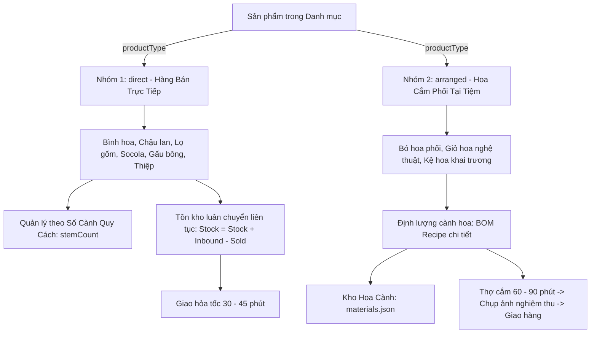
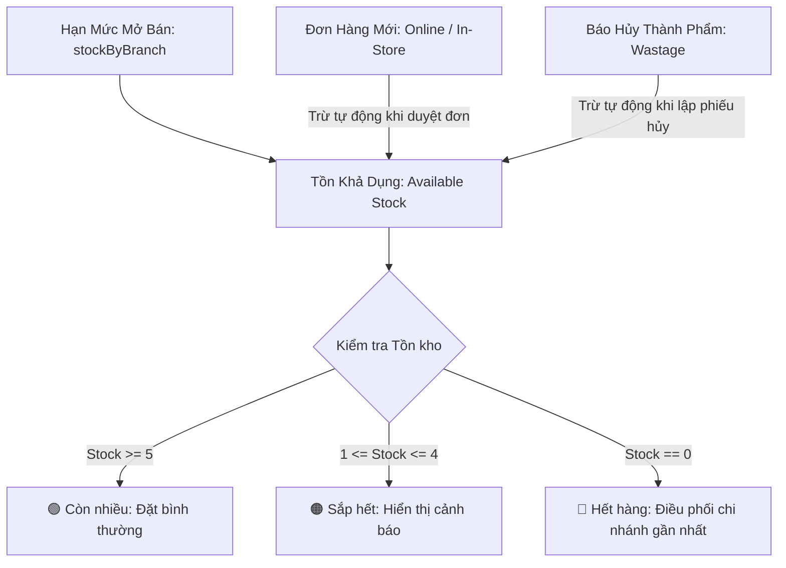
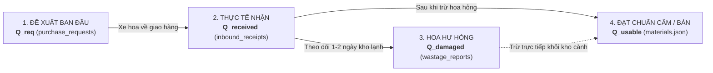

# Kiến Trúc Quản Lý Tồn Kho, Chu Kỳ Nhập Hàng, Bán Ra & Hao Hụt
## Tài Liệu Thiết Kế Kỹ Thuật (Technical Design Document)
### Phân Hệ: Inventory Management, Inbound Receipts, Wastage & Multi-Branch Routing

---

## 1. Tổng Quan Kiến Trúc & Chu Kỳ Vận Hành Thực Tế

### 1.1. Chu kỳ nhập hàng thực tế (2 - 3 ngày/đợt)
Trong thực tế vận hành tiệm hoa tươi, hoa tươi nhập từ nhà vườn (Đà Lạt, Hà Lan, Ecuador...) không nhập mỗi ngày mà đi theo chuyến **cách 2 - 3 ngày một đợt** (thường rơi vào Thứ Hai – Thứ Tư – Thứ Sáu, hoặc trước các dịp lễ). 
- Hoa về được dưỡng trong kho lạnh (chiller 4°C - 8°C) và cắm bán dần trong 2 đến 4 ngày tiếp theo.
- **Tồn kho hoa cành (`materials.json`)** và **Tồn kho hàng bán trực tiếp (`products.json`)** hoạt động theo cơ chế **Tồn kho luân chuyển tích lũy (Rolling Cumulative Stock)**: số lượng không bị reset về 0 sau mỗi ngày, chỉ tăng khi có Phiếu Nhập Kho (`Inbound`) và giảm khi bán hàng (`Order`) hoặc báo hủy (`Wastage`).

### 1.2. Phân tách 2 nhóm sản phẩm bằng cờ `productType`

Hệ thống phân định 2 bản chất hàng hóa rõ rệt:



#### Bảng so sánh 2 nhóm sản phẩm:

| Tiêu chí | 🏺 Nhóm 1: Bán Trực Tiếp (`direct`) | 🌸 Nhóm 2: Hoa Cắm Phối Tại Tiệm (`arranged`) |
| :--- | :--- | :--- |
| **Mặt hàng đại diện** | Bình hoa, chậu lan hồ điệp, lọ gốm, thiệp chúc mừng, socola, gấu bông, hoặc bó hoa cành nhập về bán nguyên bó (không cắm lại). | Bó hoa phối nhiều loại, giỏ hoa vintage, kệ hoa khai trương, hộp hoa tươi nghệ thuật. |
| **Bản chất tồn kho** | **Tồn kho cộng dồn liên tục (Continuous Stock):** Nhập 50 cái, bán 2 cái còn 48 cái. Tồn kho giữ nguyên qua các ngày. | **Hạn Mức Mở Bán (Available Quota) + Kho Cành:** Phụ thuộc vào lượng hoa cành tươi nhập về theo đợt (2 - 3 ngày/lần) và định lượng cắm của thợ hoa. |
| **Quản lý cành hoa nguyên liệu** | **Số Cành Quy Cách (`stemCount`):** Cấu hình số cành quy đổi (vd: Chậu 5 cành Lan, Bình 10 cành Tulip, hoặc 0 nếu là phụ kiện). Giúp thủ kho khi nhập 10 chậu sẽ nắm ngay được 50 cành hoa thực tế trong kho. | **BOM Recipe Động:** Cấu hình chi tiết từng cành hoa và phụ liệu từ kho nguyên liệu (`materials.json`) với số lượng cành cần dùng cho mẫu hoa. |
| **Quy trình nhập hàng** | Admin/Thủ kho tạo Phiếu Nhập Kho (`Inbound`) nhập số lượng thành phẩm trực tiếp (`+10 chậu lan`, `+20 bình gốm`). | Nhập số lượng cành vào **Kho Hoa Cành** (`materials.json`). Hệ thống cập nhật Hạn Mức Mở Bán (`stockByBranch` / `dailyQuota`). |
| **Cơ chế trừ kho khi có đơn** | Trừ 1 đơn vị trực tiếp vào số lượng sản phẩm tại chi nhánh. | 1. Trừ 1 vào hạn mức mở bán của mẫu hoa tại chi nhánh.<br>2. **Tự động trừ số lượng cành hoa tương ứng trong Kho Cành (`materials.json`)** theo công thức định lượng (`recipe`). |
| **Thời gian chuẩn bị đơn** | Có sẵn trên kệ: Đóng gói và giao ngay trong 30 - 45 phút. | Cần thời gian cắm hoa nghệ thuật: 60 - 90 phút (Thợ nhận đơn $\rightarrow$ cắm $\rightarrow$ chụp ảnh hoa thật gửi khách $\rightarrow$ giao hàng). |
| **Kiểm soát thất thoát (Wastage)** | Báo hủy rơi vỡ, móp méo, hết hạn sử dụng. | - Báo hủy cành hoa dập/gãy trong quá trình cắm.<br>- Báo hủy cả bó/giỏ hoa đã cắm xong nhưng khách hủy đơn để lâu héo. |

---

## 2. Mô Hình Dữ Liệu & Công Thức Cân Bằng Tồn Kho Thời Gian Thực

### 2.1. Công thức cân bằng kho tại chi nhánh

Tại bất kỳ thời điểm nào, số lượng tồn khả dụng của một mẫu hoa tại một chi nhánh tuân thủ công thức:

$$\mathbf{Tồn\ Khả\ Dụng\ (Available)} = \mathbf{Hạn\ Mức\ Mở\ Bán\ (Quota)} - \mathbf{Đã\ Bán\ (Sold)} - \mathbf{Hao\ Hụt\ (Wastage)}$$

Trong đó:
- **Hạn Mức Mở Bán ($\text{Quota}$):** Số lượng mở bán tối đa của mẫu hoa đó tại chi nhánh cho đợt hàng (lấy từ `stockByBranch[branchId]` trong `products.json`).
- **Đã Bán ($\text{Sold}$):** Tổng số lượng sản phẩm nằm trong các đơn hàng của chi nhánh (ở các trạng thái: `pending`, `confirmed`, `arranging`, `in_progress`, `photo_sent`, `delivered`, `completed` - loại trừ các đơn `cancelled`).
- **Hao Hụt ($\text{Wastage}$):** Tổng số lượng bó/bình hoa nguyên vẹn bị hỏng phải hủy có gắn `productId`.
- **Ngưỡng hiển thị đèn tín hiệu:**
  - $\text{Available} \ge 5$: 🟢 **Còn nhiều** (Đủ bán).
  - $1 \le \text{Available} < 5$: 🟠 **Sắp hết** (Tạo cảm giác khan hiếm).
  - $\text{Available} = 0$: 🔴 **Hết hàng** (Tự động khóa nút đặt hoặc chuyển sang chi nhánh lân cận).



---

## 3. Cấu Trúc Dữ Liệu Thực Tế (JSON Schemas)

### 3.1. Kho Hoa Cành & Phụ Liệu (`config/anne/materials.json`)
Quản lý cành hoa tươi và phụ liệu thô theo từng chi nhánh:
```json
[
  {
    "id": "mat_rose_ohara_white",
    "code": "STEM_ROSE_OHARA_W",
    "name": "Hồng Trắng Ohara Nhập Khẩu",
    "category": "flower_main",
    "unit": "cành",
    "costPrice": 18000,
    "minStockAlert": 20,
    "stockByBranch": {
      "branch_q10": 120,
      "branch_q1": 70,
      "branch_thao_dien": 50
    },
    "isActive": true,
    "updatedAt": "2026-09-13T07:00:00Z"
  }
]
```

### 3.2. Mẫu Sản Phẩm (`config/anne/products.json` & `products/{id}.json`)
Động hóa hoàn toàn `stockByBranch` theo danh sách chi nhánh trong `branches.json`:
```json
{
  "id": "bo_hoa_01",
  "name": "Mây Trắng Bồng Bềnh",
  "category": "bo_hoa",
  "productType": "arranged",
  "stemCount": 18,
  "recipe": [
    { "materialId": "mat_rose_ohara_white", "name": "Hồng Trắng Ohara Nhập Khẩu", "quantity": 10, "unit": "cành", "isMain": true },
    { "materialId": "mat_daisy_tana", "name": "Cúc Tana Đà Lạt", "quantity": 5, "unit": "nhánh", "isMain": false },
    { "materialId": "mat_foliage_eucalyptus", "name": "Lá Khuynh Diệp Bạc", "quantity": 3, "unit": "nhánh", "isMain": false }
  ],
  "stockByBranch": {
    "branch_q10": 10,
    "branch_q1": 5,
    "branch_thao_dien": 5
  },
  "dailyQuota": 20,
  "priceLevelId": "price_lvl_01",
  "priceNumber": 420000,
  "isActive": true
}
```

### 3.3. Phiếu Nhập Hàng (`config/anne/inventory/inbounds/{YYYY_MM}/inb_...json`)
Lưu trữ giao dịch nhập hoa cành hoặc hàng bán trực tiếp:
```json
{
  "id": "inb_1789310000_abc",
  "inboundCode": "NH_20260913_001",
  "branchId": "branch_q10",
  "branchName": "Nở Hoa Thả Bình - Showroom Quận 10",
  "supplier": "Nhà Vườn Dalat Hasfarm",
  "importDate": "2026-09-13",
  "receivedBy": "staff_001",
  "receiverName": "Trần Thị Mai (Quản lý CN)",
  "items": [
    {
      "type": "material",
      "itemId": "mat_rose_ohara_white",
      "name": "Hồng Trắng Ohara Nhập Khẩu",
      "quantity": 100,
      "costPrice": 18000,
      "total": 1800000
    }
  ],
  "totalCost": 1800000,
  "notes": "Nhập hoa tươi đợt đầu tuần",
  "createdAt": "2026-09-13T07:15:00Z"
}
```

### 3.4. Phiếu Báo Hủy Hoa Hỏng (`config/anne/wastage_reports.json` & `config/anne/inventory/wastage/{YYYY_MM}/`)
Hỗ trợ hủy hoa hỏng, dập cánh khi vận chuyển hoặc tồn úa cuối ca, đi kèm **ảnh chụp minh chứng** để làm bằng chứng đối soát công nợ với nhà vườn / đơn vị vận chuyển:

- **Thư mục lưu ảnh minh chứng:** `config/anne/wastage/images/{YYYY_MM}/` (tự động phân thư mục theo tháng, upload trực tiếp từ Camera / File và phục vụ qua `/api/flower/v1/images/...`).
- **Thư mục lưu phiếu chi tiết:** `config/anne/inventory/wastage/{YYYY_MM}/wastage_{timestamp}_{branch}_{id}.json`.
- **File tổng hợp trung tâm:** `config/anne/wastage_reports.json`.

```json
[
  {
    "id": "wastage_20260913_183000_a1b2",
    "branchId": "branch_q10",
    "branchName": "Nở Hoa Thả Bình - Showroom Quận 10",
    "date": "2026-09-13",
    "reportedBy": "staff_002",
    "reporterName": "Lê Thị Cẩm Tú (Thợ cắm hoa)",
    "items": [
      {
        "materialId": "mat_rose_ohara_white",
        "productId": "bo_hoa_01",
        "flowerType": "Hồng Trắng Ohara",
        "damagedStems": 10,
        "reason": "Dập cánh khi vận chuyển từ nhà vườn về",
        "unitCost": 18000,
        "totalLoss": 180000
      }
    ],
    "proofImages": [
      "/api/flower/v1/images/wastage_1789310000_dap_canh.webp"
    ],
    "totalLossAmount": 180000,
    "notes": "Hoa về bị đè góc thùng xe lạnh từ Đà Lạt",
    "createdAt": "2026-09-13T18:30:00Z"
  }
]
```

### 3.5. Phiếu Yêu Cầu Nhập Hàng Chi Nhánh (`config/anne/purchase_requests.json` & `config/anne/inventory/requests/{YYYY_MM}/`)
Cho phép quản lý chi nhánh và thợ cắm hoa gửi đề xuất nhu cầu hoa cành/phụ liệu cần nhập cho đợt tiếp theo:

```json
[
  {
    "id": "req_1789400000_q10",
    "requestCode": "YCNH_20260916_001",
    "branchId": "branch_q10",
    "branchName": "Nở Hoa Thả Bình - Showroom Quận 10",
    "requestedBy": "staff_001",
    "requesterName": "Trần Thị Mai (Quản lý CN)",
    "requestDate": "2026-09-16",
    "expectedDate": "2026-09-17",
    "items": [
      {
        "materialId": "mat_rose_ohara_white",
        "name": "Hồng Trắng Ohara Nhập Khẩu",
        "currentStock": 8,
        "requestedQty": 100,
        "unit": "cành",
        "reason": "Chuẩn bị đơn tiệc cưới cuối tuần"
      },
      {
        "materialId": "mat_daisy_tana",
        "name": "Cúc Tana Đà Lạt",
        "currentStock": 5,
        "requestedQty": 50,
        "unit": "nhánh",
        "reason": "Kho cạn dưới mức tối thiểu"
      }
    ],
    "status": "pending",
    "approvedBy": null,
    "fulfilledInboundId": null,
    "notes": "Ưu tiên hoa tươi cành cứng chuẩn bị sự kiện",
    "createdAt": "2026-09-16T08:00:00Z"
  }
]
```

---

## 4. Các Luồng Nghiệp Vụ Chính Trong Mã Nguồn

### 4.1. Khởi tạo & Cập nhật Mẫu Hoa (`#productModal`)
- Modal tự động nạp danh sách chi nhánh hoạt động từ `branches.json` qua hàm `renderProductModalStockFields()`, tạo các ô nhập hạn mức tương ứng với `data-branch-id`.
- Khi chọn loại `arranged`: Tự động mở khối **BOM Recipe**, nạp danh sách cành hoa từ `materials.json` để thêm cành và hiển thị tổng số cành.
- Khi chọn loại `direct`: Tự động mở khối **Số Cành Quy Cách (`stemCount`)** để lưu số cành đại diện (vd: bình 5 cành, bình 10 cành).
- Khi bấm **"Lưu Mẫu Hoa"**: `handleProductSubmit()` gửi payload bao gồm `productType`, `stemCount`, `recipe`, `stockByBranch` và `dailyQuota`.

### 4.2. Cập nhật Nhanh Hạn Mức Mở Bán Hàng Loạt (Batch Stock Update)
- Tại Tab **Kho & Hao Hụt** $\rightarrow$ Sub-Tab **1. Hạn Mức Mở Bán**:
  - Bảng ma trận hiển thị tất cả mẫu hoa kèm các ô nhập số lượng mở bán cho từng chi nhánh.
  - Quản lý có thể điều chỉnh trực tiếp các ô input và bấm **"Lưu Hạn Mức Mở Bán"**.
  - Hàm `saveBatchInventory()` gửi mảng `updates: [{ productId, branchId, quota }]` lên endpoint `PUT /api/flower/v1/admin/inventory/batch`.
  - Backend `update_batch_inventory()` cập nhật đồng thời `stockByBranch` và tính lại `dailyQuota = sum(stockByBranch.values())`.

### 4.3. Tự động trừ kho cành khi hoàn tất cắm hoa (`deduct_order_materials`)
- Khi đơn hàng hoa cắm phối (`arranged`) chuyển sang trạng thái sẵn sàng giao (`photo_sent` / `delivered`):
  - Hàm `deduct_order_materials(order_dict, branch_id)` quét từng món hàng trong đơn.
  - Nếu sản phẩm có `recipe`: Tự động trừ số lượng cành trong `materials.json` tại chi nhánh tương ứng:
    $$\text{Tồn kho cành mới} = \max(0, \text{Tồn kho cành cũ} - (\text{quantity} \times \text{order\_item\_qty}))$$

### 4.4. Tính toán Giá Vốn (COGS) & Lợi Nhuận Gộp Đơn Hàng (`calculate_order_cogs_and_profit`)
- Backend quét danh sách nguyên liệu của từng món trong đơn hàng:
  - Giá vốn cành hoa = $\sum (\text{Số cành} \times \text{costPrice trong materials.json})$.
  - Đối với hàng bán trực tiếp (`direct`): Giá vốn = $50\% \times \text{priceNumber}$ (hoặc theo chi phí nhập).
  - Lợi nhuận gộp = $\text{Doanh thu đơn} - \text{Tổng giá vốn COGS}$.

### 4.5. Thuật toán Điều Phối Đơn Hàng Thông Minh (Smart Order Routing)
Khi khách đặt đơn trên Website:
1. **Bước 1 (Xác định khoảng cách):** Tìm chi nhánh gần nhất với quận/huyện giao hàng của khách (dựa trên bảng khoảng cách quận định nghĩa trong `inventory_service.py`).
2. **Bước 2 (Kiểm tra tồn kho):** Kiểm tra `available_stock` tại chi nhánh ưu tiên:
   - Nếu đủ hàng: Gán đơn cho chi nhánh này.
3. **Bước 3 (Fallback điều phối):** Nếu chi nhánh gần nhất hết hàng:
   - Quét chi nhánh gần tiếp theo còn đủ tồn kho khả dụng để gán đơn và đính kèm ghi chú điều phối.

### 4.6. Báo Cáo Nhập – Xuất – Tồn Theo Tháng (`get_monthly_inventory_report`)
- Hỗ trợ lọc theo tháng (`YYYY-MM`), chi nhánh (`branchId`) và phân loại hàng (`direct` vs `materials`).
- Công thức kế toán chuẩn:
  $$\mathbf{Tồn\ Cuối\ Kỳ} = \mathbf{Tồn\ Đầu} + \mathbf{Nhập\ Trong\ Tháng} - \mathbf{Xuất\ Bán} - \mathbf{Hao\ Hụt}$$
- Dữ liệu xuất ra gồm: Bảng tổng hợp số lượng, giá vốn COGS, giá trị tồn kho và tổng tiền thiệt hại do hoa hỏng.

### 4.7. Chu Trình Quản Trị Nhập Kho Khép Kín & Báo Hỏng 5 Bước (Standardized 5-Step Inbound Lifecycle)

Nhằm triệt tiêu hoàn toàn nguy cơ thất thoát, gian lận và sai lệch kế toán, hệ thống **bãi bỏ hoàn toàn việc lập phiếu nhập kho thủ công tự do** và **báo hoa hỏng độc lập**. Mọi đợt nhập hoa đều phải tuân thủ nghiêm ngặt chu trình 5 bước:

```mermaid
graph TD
    S1["<b>Bước 1: Đề Xuất Nhập Hàng</b><br>(status: pending)"] -->|Quản lý / Super Admin duyệt| S2["<b>Bước 2: Phê Duyệt Ngân Sách</b><br>(status: approved)"]
    S1 -.->|Không đạt kế hoạch| S1_REJ["Từ chối (rejected)<br>Lưu lý do từ chối"]
    
    S2 -->|Xuất hiện ở Hàng Đợi Tab Xử Lý Nhập Kho| S3["<b>Bước 3: Nhận Hàng & Đối Soát Kiểm Kê</b><br>Popup xác nhận: ĐỒNG Ý -> ĐÃ NHẬN HÀNG"]
    
    S3 -->|Khóa Bất Biến (Immutable)| S4["<b>Bước 4: Theo Dõi Kho Lạnh 1-2 Ngày</b><br>(status: fulfilled)<br>Nút [Báo Hỏng] tại Tab Xử Lý Nhập Kho"]
    
    S4 -->|Sau 2-3 ngày theo dõi| S5["<b>Bước 5: Chốt Đóng Đơn (Closed)</b><br>(status: closed)<br>Super Admin bấm [Đóng Đơn] -> Khóa vĩnh viễn"]
    
    S5 --> S_ACC["Phòng Kế Toán chốt công nợ:<br><b>Thanh toán = Thực Nhận - Hoa Hỏng</b>"]
```

#### Chi tiết 5 bước vận hành thực tế:

1. **Bước 1 - Lập Phiếu Đề Xuất / Yêu Cầu Nhập Hàng (`status: pending`)**:
   - Nhân viên / Quản lý chi nhánh theo dõi tồn cành hoa và bấm **"Lập Phiếu Yêu Cầu Nhập Hàng"**.
   - Hỗ trợ ô chọn mặt hàng dạng **SelectBox tìm kiếm thông minh (Auto-complete / Combobox)**: Gõ tên hoa hoặc mã cành để lọc nhanh giữa hàng trăm loại hoa.
   - Bảng chi tiết mặt hàng cần nhập được thiết kế rộng rãi, tự động giãn dòng, hiển thị đầy đủ tên hoa, tồn kho hiện tại, đơn giá vốn, ô nhập số lượng đề xuất ban đầu (`requestedQty`) và đơn vị tính (`cành`/`bình`/`bó`).
   - Mỗi đơn được cấp một mã duy nhất định danh (`id` dạng `req_...` và `requestCode` dạng `YCNH_...`).

2. **Bước 2 - Thẩm Định & Phê Duyệt (`approved` / `rejected`)**:
   - Quản lý chi nhánh hoặc Super Admin thẩm định nhu cầu kinh doanh và ngân sách.
   - Thao tác trực tiếp: Bấm nút `[Duyệt]` hoặc `[Từ chối]` (kèm lý do lưu vào `processNotes`).
   - **Quy tắc phân luồng**: **CHỈ CÁC ĐƠN ĐÃ DUYỆT (`approved`)** mới được đẩy sang Hàng Đợi Xe Về tại Tab **Xử Lý Nhập Kho**. Các đơn `pending` hoặc `rejected` tuyệt đối không thể nhập kho.

3. **Bước 3 - Xe Hoa Về: Kiểm Đếm Thực Tế & Nhận Hàng (Đối Soát Trực Quan)**:
   - Tại Tab **Xử Lý Nhập Kho**, hàng đợi xe về hiển thị đơn `approved` với nút **`[⚡ Xử Lý Nhập Kho]`**.
   - Khi bấm, Modal Phiếu Nhập Kho mở ra với giao diện hỗ trợ kiểm kê tối đa:
     - **Tên mặt hàng in đậm, nổi bật**: Hiển thị rõ ràng tên hoa (vd: **Chậu Lan Hồ Điệp Phú Quý (5 Cành)**, **Hoa Hồng Đỏ Ecuador**).
     - **Mã định danh SKU**: Badge `Mã: lan_01` sắc nét.
     - **Khóa loại hàng**: Nhãn `<i class="fa-solid fa-lock"></i> Đã khóa` (không cho phép tự ý đổi loại hoa khác với đề xuất đã duyệt).
     - **Đối soát số lượng**: Hiển thị rõ ràng dòng: `Đề xuất ban đầu: X cành/bình`.
     - **Cột Số Thực Nhận**: Ô nhập số lượng viền xanh nổi bật với nhãn **"SỐ THỰC NHẬN"** để thủ kho đếm thực tế xe hoa giao tới và cập nhật vào (nếu vườn giao thiếu hoặc dôi dư).
   - **Popup Xác Nhận Bất Biến**: Khi bấm gửi phiếu, hệ thống hiển thị xác nhận:
     > *"Xác nhận đã nhận hàng thực tế từ xe hoa? Sau khi bấm ĐỒNG Ý, hệ thống sẽ chốt số lượng hoa vào kho và chuyển đơn hàng sang trạng thái [ĐÃ NHẬN HÀNG] (khóa bất biến, không thể sửa/hủy)."*
   - Sau khi bấm Đồng ý:
     - Hệ thống sinh Phiếu Nhập Kho (`inbound_receipts.json`) gắn mã `purchaseRequestId` / `requestCode`.
     - Tự động cộng số lượng thực nhận vào kho cành `materials.json` của chi nhánh.
     - Đơn chuyển sang trạng thái **`fulfilled` (ĐÃ NHẬN HÀNG)**.
     - **Tính bất biến (Immutable)**: Chặn hoàn toàn việc quay lui trạng thái về `pending`, `approved` hay `rejected`.

4. **Bước 4 - Theo Dõi Tại Kho Lạnh (1-2 Ngày) & Báo Hoa Hỏng Ngay Tại Tab Xử Lý Nhập Kho**:
   - **Vị trí nút Báo Hỏng**: Sau khi đã xác nhận nhận hàng, đơn `fulfilled` vẫn nằm trực tiếp trên Bảng tiến độ tại Tab **Xử Lý Nhập Kho** (và Tab Đề xuất) với nút **`[⚠️ Báo Hỏng]`** nổi bật.
   - **Bộ lọc nhanh 3 chế độ (Pill Filter)**:
     - `Tất cả`: Xem toàn bộ đơn hàng đợi và theo dõi.
     - `Chờ nhận (Approved)`: Danh sách đơn xe hoa đang về chờ kiểm đếm.
     - `Đã nhận hàng - Báo hỏng (Fulfilled)`: Danh sách các đơn vừa nhận hàng trong 1-2 ngày để thủ kho tập trung theo dõi và báo hoa hỏng.
   - **Kiểm soát chặt chẽ**:
     - Bấm **`[⚠️ Báo Hỏng]`** sẽ tự động liên kết với chính xác mã đợt nhập của đơn đó.
     - Khống chế số cành báo hỏng $\le$ số cành thực nhận của đợt nhập.
     - Hệ thống trừ thẳng số cành hỏng ra khỏi kho `materials.json` và lưu ảnh chụp minh chứng.

5. **Bước 5 - Đóng Đơn Hàng Sau 2-3 Ngày (Closed) & Chốt Sổ Công Nợ**:
   - Sau thời gian theo dõi hoa tươi trong kho lạnh (thông thường 2 - 3 ngày), **Super Admin** có nút **`[🔒 Đóng Đơn]`** trực tiếp trên dòng đơn hàng.
   - Khi bấm Đóng Đơn: Trạng thái chuyển thành badge xám **`Đã đóng đơn (Closed) / Đã chốt sổ`**.
   - **Khóa vĩnh viễn**: Kể từ lúc này, hệ thống khóa hoàn toàn tính năng báo hoa hỏng đối với đợt nhập này.
   - Kế toán chốt số liệu công nợ cuối cùng để chuyển khoản cho nhà vườn:
     $$\mathbf{Sản\ Lượng\ Thanh\ Toán} = Q_{\text{received}} - Q_{\text{damaged}}$$

---

### 4.8. Mô Hình Đối Soát 4 Chỉ Số Vận Hành (Requested $\rightarrow$ Received $\rightarrow$ Damaged $\rightarrow$ Usable)

Để kiểm soát chặt chẽ thất thoát và tối ưu giá vốn hàng bán (COGS), chu kỳ nhập – kiểm – hủy tuân thủ mô hình 4 chỉ số cân bằng khép kín:



#### 1. Các công thức đối soát chuẩn nghiệp vụ:

| Chỉ số | Ký hiệu | Công thức xác định | Ý nghĩa quản trị |
| :--- | :---: | :--- | :--- |
| **Số lượng Đề Xuất** | $Q_{\text{req}}$ | Lấy từ `requestedQty` trên đơn yêu cầu nhập hàng. | Nhu cầu dự kiến theo kế hoạch kinh doanh của showroom. |
| **Số lượng Thực Nhận** | $Q_{\text{received}}$ | Nhập vào ô "Số thực nhận" trên phiếu nhập kho khi kiểm xe hoa. | Số lượng thực tế nhà vườn giao tới cửa hàng. |
| **Số lượng Hoa Hỏng** | $Q_{\text{damaged}}$ | Lập trên phiếu báo hủy gắn với ID đợt nhập ($Q_{\text{damaged}} \le Q_{\text{received}}$). | Số cành bị dập cánh, gãy cành, thối gốc không sử dụng được. |
| **Số lượng Đạt Chuẩn** | $Q_{\text{usable}}$ | $$\mathbf{Q_{\text{usable}} = Q_{\text{received}} - Q_{\text{damaged}}}$$ | **Số cành hoa lành lặn thực tế đưa vào kho lạnh để cắm và bán.** |

#### 2. Các chỉ số KPI đánh giá rủi ro & hiệu quả:

- **Tỷ lệ cung ứng của Nhà Vườn (Supplier Fulfillment Rate)**:
  $$\text{Tỷ lệ cung ứng} = \frac{Q_{\text{received}}}{Q_{\text{req}}} \times 100\%$$
  - $\ge 95\%$: Nhà vườn uy tín, cung ứng đúng cam kết đơn hàng.
  - $< 90\%$: Nhà vườn giao thiếu hàng, cần bổ sung nguồn dự phòng.

- **Tỷ lệ hao hụt / hư hỏng của Đợt Nhập (Inbound Wastage Rate)**:
  $$\text{Tỷ lệ hỏng} = \frac{Q_{\text{damaged}}}{Q_{\text{received}}} \times 100\%$$
  - $\le 3\%$: Hao hụt tự nhiên cho phép trong quá trình đóng thùng vận chuyển.
  - $3\% - 7\%$: Hao hụt trung bình (do thời tiết nắng nóng hoặc đi đường xa).
  - $> 7\%$: **Cảnh báo đỏ (Critical Warning)**: Kích hoạt biên bản khiếu nại nhà vườn, yêu cầu trừ tiền công nợ hoặc gửi hoa bù ở chuyến tiếp theo.

- **Tỷ lệ thu hồi hoa đạt chuẩn (Yield / Usability Rate)**:
  $$\text{Tỷ lệ đạt chuẩn} = \frac{Q_{\text{usable}}}{Q_{\text{received}}} \times 100\% = 100\% - \text{Tỷ lệ hỏng}$$

- **Giá vốn thực tế trên mỗi cành hoa đạt chuẩn (Effective Cost Per Usable Stem)**:
  $$\text{COGS thực tế / cành đạt} = \frac{\text{Tổng tiền thanh toán đợt nhập} - \text{Tiền nhà vườn bồi thường hỏng}}{Q_{\text{usable}}}$$
  *(Giúp thợ hoa và kế toán tính toán đúng biên lợi nhuận của từng mẫu hoa phối, không bị lỗ do hao hụt ngầm).*

---

## 5. Ma Trận Phân Quyền Vai Trò (RBAC Matrix)

| Chức năng | Super Admin | Quản Lý Chi Nhánh (`branch_manager`) | Thợ Cắm Hoa (`florist`) | Tư Vấn Bán Hàng (`sales_consultant`) |
| :--- | :---: | :---: | :---: | :---: |
| **Xem Ma trận tồn kho toàn chuỗi** | ✅ Toàn quyền | ⚠️ Xem được (mặc định lọc theo CN mình) | ⚠️ Xem được | ⚠️ Xem được |
| **Sửa hạn mức mở bán (Batch Update)** | ✅ Mọi chi nhánh | ⚠️ **Chỉ sửa chi nhánh mình phụ trách** (`user.branchId`) | ❌ Không có quyền | ❌ Không có quyền |
| **Tạo Yêu Cầu Nhập Hàng (Requisition)** | ✅ Mọi chi nhánh | ✅ **Chi nhánh mình phụ trách** | ✅ **Chi nhánh mình** | ❌ Không có quyền |
| **Duyệt / Từ Chối Yêu Cầu (Approve / Reject)** | ✅ Toàn quyền | ⚠️ **Chi nhánh mình phụ trách** | ❌ Không có quyền | ❌ Không có quyền |
| **Xử lý Nhập Kho theo Đơn Đã Duyệt** | ✅ Toàn quyền | ⚠️ **Chi nhánh mình phụ trách** | ❌ Không có quyền | ❌ Không có quyền |
| **Báo hoa hỏng gắn đợt nhập (1-2 ngày)** | ✅ Mọi chi nhánh | ✅ Chi nhánh mình | ✅ **Chi nhánh mình (bắt buộc gắn ID đợt)** | ❌ Không có quyền |
| **Đóng Đơn Hàng Sau 2-3 Ngày (`closed`)** | ✅ **Toàn quyền (Duy nhất Super Admin)** | ❌ Không có quyền | ❌ Không có quyền | ❌ Không có quyền |
| **Xem Báo cáo Nhập - Xuất - Tồn tháng** | ✅ Toàn quyền | ⚠️ Xem chi nhánh mình | ❌ Không có quyền | ❌ Không có quyền |

---

## 6. Danh Sách RESTful API Endpoints

Tất cả các endpoints vận hành tại [src/restful_blueprint_flower_connect.py](file:///d:/wmshare/telua_flower/src/restful_blueprint_flower_connect.py):

| Method | Endpoint | Quyền (RBAC) | Chức năng thực tế trong Code |
| :--- | :--- | :---: | :--- |
| `GET` | `/api/flower/v1/admin/inventory/matrix` | Staff, Manager, Super Admin | Lấy dữ liệu bảng ma trận tồn kho toàn chuỗi (Hạn mức mở bán, Đã bán, Hao hụt, Tồn khả dụng). |
| `PUT` / `POST` | `/api/flower/v1/admin/inventory/batch` | Manager, Super Admin | Cập nhật nhanh số lượng hạn mức mở bán cho nhiều sản phẩm/chi nhánh cùng lúc. |
| `GET` | `/api/flower/v1/admin/inventory/materials` | Staff, Manager, Super Admin | Lấy danh sách cành hoa và phụ liệu trong kho (`materials.json`). |
| `GET` | `/api/flower/v1/admin/inventory/requests` | Staff, Manager, Super Admin | Lấy danh sách các phiếu yêu cầu nhập hàng từ các chi nhánh (`purchase_requests.json`). Hỗ trợ lọc theo `branchId`, `status`, `month`. |
| `POST` | `/api/flower/v1/admin/inventory/requests` | Staff, Manager, Super Admin | Tạo phiếu yêu cầu nhập hoa cành/nguyên phụ liệu từ chi nhánh. |
| `PUT` | `/api/flower/v1/admin/inventory/requests/<id>` | Manager, Super Admin | Cập nhật trạng thái phiếu yêu cầu (`approved`, `rejected`, `closed`) kèm ghi chú xử lý `processNotes` và truy vết người duyệt/từ chối/đóng đơn. |
| `POST` | `/api/flower/v1/admin/inventory/requests/<id>/fulfill` | Manager, Super Admin | Xử lý yêu cầu nhập hàng, đối soát số lượng thực tế nhận với số lượng đề xuất, tạo Phiếu Nhập Kho và cập nhật tồn cành (chuyển sang `fulfilled` bất biến). |
| `GET` | `/api/flower/v1/admin/inventory/inbounds` | Manager, Super Admin | Lấy danh sách các phiếu nhập hàng theo tháng và chi nhánh. |
| `GET` | `/api/flower/v1/admin/inventory/inbounds/<id>` | Staff, Manager, Super Admin | Lấy chi tiết một phiếu nhập kho kèm danh sách cành hoa và số lượng thực nhận phục vụ báo hỏng. |
| `POST` | `/api/flower/v1/admin/inventory/inbounds` | Manager, Super Admin | Tạo phiếu nhập kho mới, tự động cộng dồn số lượng cành vào `materials.json` hoặc `products.json`. |
| `GET` | `/api/flower/v1/admin/inventory/wastage` | Staff, Manager, Super Admin | Lấy danh sách lịch sử các phiếu báo hủy hoa hỏng (có kèm thông tin đợt nhập ID và NCC). |
| `POST` | `/api/flower/v1/admin/inventory/wastage` | Staff, Manager, Super Admin | Tạo phiếu báo hủy hoa hỏng bắt buộc gắn với `inboundId`, kiểm tra không vượt quá số cành thực nhận của đợt nhập và chặn nếu đơn đã `closed`. |
| `GET` | `/api/flower/v1/admin/inventory/monthly-report` | Manager, Super Admin | Lấy báo cáo Nhập – Xuất – Tồn theo tháng (hỗ trợ lọc tháng, chi nhánh, loại hàng). |
| `GET` | `/api/flower/v1/products/<id>/stock` | Public Storefront | Lấy tồn kho thời gian thực của 1 mẫu hoa tại tất cả chi nhánh. |
| `POST` | `/api/flower/v1/inventory/smart-route` | Internal / Orders | Xác định chi nhánh gần địa chỉ nhận nhất còn đủ tồn kho để giao hàng. |

