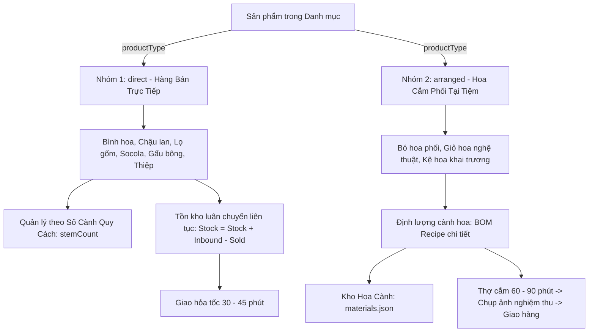
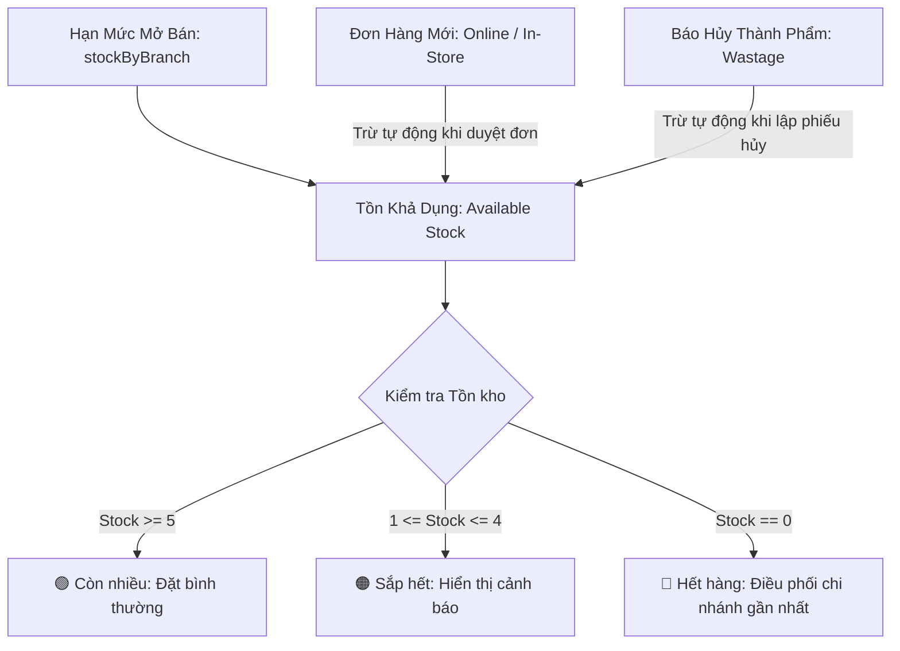

# Kiến Trúc Quản Lý Tồn Kho, Chu Kỳ Nhập Hàng, Bán Ra & Hao Hụt
## Tài Liệu Thiết Kế Kỹ Thuật (Technical Design Document)
### Phân Hệ: Inventory Management, Inbound Receipts, Wastage & Multi-Branch Routing

---

## 1. Tổng Quan Kiến Trúc & Chu Kỳ Vận Hành Thực Tế

### 1.1. Chu kỳ nhập hàng thực tế (2 - 3 ngày/đợt)
Trong thực tế vận hành tiệm hoa tươi, hoa tươi nhập từ nhà vườn (Đà Lạt, Hà Lan, Ecuador...) không nhập mỗi ngày mà đi theo chuyến **cách 2 - 3 ngày một đợt** (thường rơi vào Thứ Hai – Thứ Tư – Thứ Sáu, hoặc trước các dịp lễ). 
- Hoa về được dưỡng trong kho lạnh (chiller 4°C - 8°C) và cắm bán dần trong 2 đến 4 ngày tiếp theo.
- **Tồn kho hoa cành (`materials.json`)** và **Tồn kho hàng bán trực tiếp (`products.json`)** hoạt động theo cơ chế **Tồn kho luân chuyển tích lũy (Rolling Cumulative Stock)**: số lượng không bị reset về 0 sau mỗi ngày, chỉ tăng khi có Phiếu Nhập Kho (`Inbound`) và giảm khi bán hàng (`Order`) hoặc báo hủy (`Wastage`).

### 1.2. Phân tách 2 nhóm sản phẩm bằng cờ `productType`

Hệ thống phân định 2 bản chất hàng hóa rõ rệt:



#### Bảng so sánh 2 nhóm sản phẩm:

| Tiêu chí | 🏺 Nhóm 1: Bán Trực Tiếp (`direct`) | 🌸 Nhóm 2: Hoa Cắm Phối Tại Tiệm (`arranged`) |
| :--- | :--- | :--- |
| **Mặt hàng đại diện** | Bình hoa, chậu lan hồ điệp, lọ gốm, thiệp chúc mừng, socola, gấu bông, hoặc bó hoa cành nhập về bán nguyên bó (không cắm lại). | Bó hoa phối nhiều loại, giỏ hoa vintage, kệ hoa khai trương, hộp hoa tươi nghệ thuật. |
| **Bản chất tồn kho** | **Tồn kho cộng dồn liên tục (Continuous Stock):** Nhập 50 cái, bán 2 cái còn 48 cái. Tồn kho giữ nguyên qua các ngày. | **Hạn Mức Mở Bán (Available Quota) + Kho Cành:** Phụ thuộc vào lượng hoa cành tươi nhập về theo đợt (2 - 3 ngày/lần) và định lượng cắm của thợ hoa. |
| **Quản lý cành hoa nguyên liệu** | **Số Cành Quy Cách (`stemCount`):** Cấu hình số cành quy đổi (vd: Chậu 5 cành Lan, Bình 10 cành Tulip, hoặc 0 nếu là phụ kiện). Giúp thủ kho khi nhập 10 chậu sẽ nắm ngay được 50 cành hoa thực tế trong kho. | **BOM Recipe Động:** Cấu hình chi tiết từng cành hoa và phụ liệu từ kho nguyên liệu (`materials.json`) với số lượng cành cần dùng cho mẫu hoa. |
| **Quy trình nhập hàng** | Admin/Thủ kho tạo Phiếu Nhập Kho (`Inbound`) nhập số lượng thành phẩm trực tiếp (`+10 chậu lan`, `+20 bình gốm`). | Nhập số lượng cành vào **Kho Hoa Cành** (`materials.json`). Hệ thống cập nhật Hạn Mức Mở Bán (`stockByBranch` / `dailyQuota`). |
| **Cơ chế trừ kho khi có đơn** | Trừ 1 đơn vị trực tiếp vào số lượng sản phẩm tại chi nhánh. | 1. Trừ 1 vào hạn mức mở bán của mẫu hoa tại chi nhánh.<br>2. **Tự động trừ số lượng cành hoa tương ứng trong Kho Cành (`materials.json`)** theo công thức định lượng (`recipe`). |
| **Thời gian chuẩn bị đơn** | Có sẵn trên kệ: Đóng gói và giao ngay trong 30 - 45 phút. | Cần thời gian cắm hoa nghệ thuật: 60 - 90 phút (Thợ nhận đơn $\rightarrow$ cắm $\rightarrow$ chụp ảnh hoa thật gửi khách $\rightarrow$ giao hàng). |
| **Kiểm soát thất thoát (Wastage)** | Báo hủy rơi vỡ, móp méo, hết hạn sử dụng. | - Báo hủy cành hoa dập/gãy trong quá trình cắm.<br>- Báo hủy cả bó/giỏ hoa đã cắm xong nhưng khách hủy đơn để lâu héo. |

---

## 2. Mô Hình Dữ Liệu & Công Thức Cân Bằng Tồn Kho Thời Gian Thực

### 2.1. Công thức cân bằng kho tại chi nhánh

Tại bất kỳ thời điểm nào, số lượng tồn khả dụng của một mẫu hoa tại một chi nhánh tuân thủ công thức:

$$\mathbf{Tồn\ Khả\ Dụng\ (Available)} = \mathbf{Hạn\ Mức\ Mở\ Bán\ (Quota)} - \mathbf{Đã\ Bán\ (Sold)} - \mathbf{Hao\ Hụt\ (Wastage)}$$

Trong đó:
- **Hạn Mức Mở Bán ($\text{Quota}$):** Số lượng mở bán tối đa của mẫu hoa đó tại chi nhánh cho đợt hàng (lấy từ `stockByBranch[branchId]` trong `products.json`).
- **Đã Bán ($\text{Sold}$):** Tổng số lượng sản phẩm nằm trong các đơn hàng của chi nhánh (ở các trạng thái: `pending`, `confirmed`, `arranging`, `in_progress`, `photo_sent`, `delivered`, `completed` - loại trừ các đơn `cancelled`).
- **Hao Hụt ($\text{Wastage}$):** Tổng số lượng bó/bình hoa nguyên vẹn bị hỏng phải hủy có gắn `productId`.
- **Ngưỡng hiển thị đèn tín hiệu:**
  - $\text{Available} \ge 5$: 🟢 **Còn nhiều** (Đủ bán).
  - $1 \le \text{Available} < 5$: 🟠 **Sắp hết** (Tạo cảm giác khan hiếm).
  - $\text{Available} = 0$: 🔴 **Hết hàng** (Tự động khóa nút đặt hoặc chuyển sang chi nhánh lân cận).



---

## 3. Cấu Trúc Dữ Liệu Thực Tế (JSON Schemas)

### 3.1. Kho Hoa Cành & Phụ Liệu (`config/anne/materials.json`)
Quản lý cành hoa tươi và phụ liệu thô theo từng chi nhánh:
```json
[
  {
    "id": "mat_rose_ohara_white",
    "code": "STEM_ROSE_OHARA_W",
    "name": "Hồng Trắng Ohara Nhập Khẩu",
    "category": "flower_main",
    "unit": "cành",
    "costPrice": 18000,
    "minStockAlert": 20,
    "stockByBranch": {
      "branch_q10": 120,
      "branch_q1": 70,
      "branch_thao_dien": 50
    },
    "isActive": true,
    "updatedAt": "2026-09-13T07:00:00Z"
  }
]
```

### 3.2. Mẫu Sản Phẩm (`config/anne/products.json` & `products/{id}.json`)
Động hóa hoàn toàn `stockByBranch` theo danh sách chi nhánh trong `branches.json`:
```json
{
  "id": "bo_hoa_01",
  "name": "Mây Trắng Bồng Bềnh",
  "category": "bo_hoa",
  "productType": "arranged",
  "stemCount": 18,
  "recipe": [
    { "materialId": "mat_rose_ohara_white", "name": "Hồng Trắng Ohara Nhập Khẩu", "quantity": 10, "unit": "cành", "isMain": true },
    { "materialId": "mat_daisy_tana", "name": "Cúc Tana Đà Lạt", "quantity": 5, "unit": "nhánh", "isMain": false },
    { "materialId": "mat_foliage_eucalyptus", "name": "Lá Khuynh Diệp Bạc", "quantity": 3, "unit": "nhánh", "isMain": false }
  ],
  "stockByBranch": {
    "branch_q10": 10,
    "branch_q1": 5,
    "branch_thao_dien": 5
  },
  "dailyQuota": 20,
  "priceLevelId": "price_lvl_01",
  "priceNumber": 420000,
  "isActive": true
}
```

### 3.3. Phiếu Nhập Hàng (`config/anne/inventory/inbounds/{YYYY_MM}/inb_...json`)
Lưu trữ giao dịch nhập hoa cành hoặc hàng bán trực tiếp:
```json
{
  "id": "inb_1789310000_abc",
  "inboundCode": "NH_20260913_001",
  "branchId": "branch_q10",
  "branchName": "Nở Hoa Thả Bình - Showroom Quận 10",
  "supplier": "Nhà Vườn Dalat Hasfarm",
  "importDate": "2026-09-13",
  "receivedBy": "staff_001",
  "receiverName": "Trần Thị Mai (Quản lý CN)",
  "items": [
    {
      "type": "material",
      "itemId": "mat_rose_ohara_white",
      "name": "Hồng Trắng Ohara Nhập Khẩu",
      "quantity": 100,
      "costPrice": 18000,
      "total": 1800000
    }
  ],
  "totalCost": 1800000,
  "notes": "Nhập hoa tươi đợt đầu tuần",
  "createdAt": "2026-09-13T07:15:00Z"
}
```

### 3.4. Phiếu Báo Hủy Hoa Hỏng (`config/anne/wastage_reports.json` & `config/anne/inventory/wastage/{YYYY_MM}/`)
Hỗ trợ hủy hoa hỏng, dập cánh khi vận chuyển hoặc tồn úa cuối ca, đi kèm **ảnh chụp minh chứng** để làm bằng chứng đối soát công nợ với nhà vườn / đơn vị vận chuyển:

- **Thư mục lưu ảnh minh chứng:** `config/anne/wastage/images/{YYYY_MM}/` (tự động phân thư mục theo tháng, upload trực tiếp từ Camera / File và phục vụ qua `/api/flower/v1/images/...`).
- **Thư mục lưu phiếu chi tiết:** `config/anne/inventory/wastage/{YYYY_MM}/wastage_{timestamp}_{branch}_{id}.json`.
- **File tổng hợp trung tâm:** `config/anne/wastage_reports.json`.

```json
[
  {
    "id": "wastage_20260913_183000_a1b2",
    "branchId": "branch_q10",
    "branchName": "Nở Hoa Thả Bình - Showroom Quận 10",
    "date": "2026-09-13",
    "reportedBy": "staff_002",
    "reporterName": "Lê Thị Cẩm Tú (Thợ cắm hoa)",
    "items": [
      {
        "materialId": "mat_rose_ohara_white",
        "productId": "bo_hoa_01",
        "flowerType": "Hồng Trắng Ohara",
        "damagedStems": 10,
        "reason": "Dập cánh khi vận chuyển từ nhà vườn về",
        "unitCost": 18000,
        "totalLoss": 180000
      }
    ],
    "proofImages": [
      "/api/flower/v1/images/wastage_1789310000_dap_canh.webp"
    ],
    "totalLossAmount": 180000,
    "notes": "Hoa về bị đè góc thùng xe lạnh từ Đà Lạt",
    "createdAt": "2026-09-13T18:30:00Z"
  }
]
```

### 3.5. Phiếu Yêu Cầu Nhập Hàng Chi Nhánh (`config/anne/purchase_requests.json` & `config/anne/inventory/requests/{YYYY_MM}/`)
Cho phép quản lý chi nhánh và thợ cắm hoa gửi đề xuất nhu cầu hoa cành/phụ liệu cần nhập cho đợt tiếp theo:

```json
[
  {
    "id": "req_1789400000_q10",
    "requestCode": "YCNH_20260916_001",
    "branchId": "branch_q10",
    "branchName": "Nở Hoa Thả Bình - Showroom Quận 10",
    "requestedBy": "staff_001",
    "requesterName": "Trần Thị Mai (Quản lý CN)",
    "requestDate": "2026-09-16",
    "expectedDate": "2026-09-17",
    "items": [
      {
        "materialId": "mat_rose_ohara_white",
        "name": "Hồng Trắng Ohara Nhập Khẩu",
        "currentStock": 8,
        "requestedQty": 100,
        "unit": "cành",
        "reason": "Chuẩn bị đơn tiệc cưới cuối tuần"
      },
      {
        "materialId": "mat_daisy_tana",
        "name": "Cúc Tana Đà Lạt",
        "currentStock": 5,
        "requestedQty": 50,
        "unit": "nhánh",
        "reason": "Kho cạn dưới mức tối thiểu"
      }
    ],
    "status": "pending",
    "approvedBy": null,
    "fulfilledInboundId": null,
    "notes": "Ưu tiên hoa tươi cành cứng chuẩn bị sự kiện",
    "createdAt": "2026-09-16T08:00:00Z"
  }
]
```

---

## 4. Các Luồng Nghiệp Vụ Chính Trong Mã Nguồn

### 4.1. Khởi tạo & Cập nhật Mẫu Hoa (`#productModal`)
- Modal tự động nạp danh sách chi nhánh hoạt động từ `branches.json` qua hàm `renderProductModalStockFields()`, tạo các ô nhập hạn mức tương ứng với `data-branch-id`.
- Khi chọn loại `arranged`: Tự động mở khối **BOM Recipe**, nạp danh sách cành hoa từ `materials.json` để thêm cành và hiển thị tổng số cành.
- Khi chọn loại `direct`: Tự động mở khối **Số Cành Quy Cách (`stemCount`)** để lưu số cành đại diện (vd: bình 5 cành, bình 10 cành).
- Khi bấm **"Lưu Mẫu Hoa"**: `handleProductSubmit()` gửi payload bao gồm `productType`, `stemCount`, `recipe`, `stockByBranch` và `dailyQuota`.

### 4.2. Cập nhật Nhanh Hạn Mức Mở Bán Hàng Loạt (Batch Stock Update)
- Tại Tab **Kho & Hao Hụt** $\rightarrow$ Sub-Tab **1. Hạn Mức Mở Bán**:
  - Bảng ma trận hiển thị tất cả mẫu hoa kèm các ô nhập số lượng mở bán cho từng chi nhánh.
  - Quản lý có thể điều chỉnh trực tiếp các ô input và bấm **"Lưu Hạn Mức Mở Bán"**.
  - Hàm `saveBatchInventory()` gửi mảng `updates: [{ productId, branchId, quota }]` lên endpoint `PUT /api/flower/v1/admin/inventory/batch`.
  - Backend `update_batch_inventory()` cập nhật đồng thời `stockByBranch` và tính lại `dailyQuota = sum(stockByBranch.values())`.

### 4.3. Tự động trừ kho cành khi hoàn tất cắm hoa (`deduct_order_materials`)
- Khi đơn hàng hoa cắm phối (`arranged`) chuyển sang trạng thái sẵn sàng giao (`photo_sent` / `delivered`):
  - Hàm `deduct_order_materials(order_dict, branch_id)` quét từng món hàng trong đơn.
  - Nếu sản phẩm có `recipe`: Tự động trừ số lượng cành trong `materials.json` tại chi nhánh tương ứng:
    $$\text{Tồn kho cành mới} = \max(0, \text{Tồn kho cành cũ} - (\text{quantity} \times \text{order\_item\_qty}))$$

### 4.4. Tính toán Giá Vốn (COGS) & Lợi Nhuận Gộp Đơn Hàng (`calculate_order_cogs_and_profit`)
- Backend quét danh sách nguyên liệu của từng món trong đơn hàng:
  - Giá vốn cành hoa = $\sum (\text{Số cành} \times \text{costPrice trong materials.json})$.
  - Đối với hàng bán trực tiếp (`direct`): Giá vốn = $50\% \times \text{priceNumber}$ (hoặc theo chi phí nhập).
  - Lợi nhuận gộp = $\text{Doanh thu đơn} - \text{Tổng giá vốn COGS}$.

### 4.5. Thuật toán Điều Phối Đơn Hàng Thông Minh (Smart Order Routing)
Khi khách đặt đơn trên Website:
1. **Bước 1 (Xác định khoảng cách):** Tìm chi nhánh gần nhất với quận/huyện giao hàng của khách (dựa trên bảng khoảng cách quận định nghĩa trong `inventory_service.py`).
2. **Bước 2 (Kiểm tra tồn kho):** Kiểm tra `available_stock` tại chi nhánh ưu tiên:
   - Nếu đủ hàng: Gán đơn cho chi nhánh này.
3. **Bước 3 (Fallback điều phối):** Nếu chi nhánh gần nhất hết hàng:
   - Quét chi nhánh gần tiếp theo còn đủ tồn kho khả dụng để gán đơn và đính kèm ghi chú điều phối.

### 4.6. Báo Cáo Nhập – Xuất – Tồn Theo Tháng (`get_monthly_inventory_report`)
- Hỗ trợ lọc theo tháng (`YYYY-MM`), chi nhánh (`branchId`) và phân loại hàng (`direct` vs `materials`).
- Công thức kế toán chuẩn:
  $$\mathbf{Tồn\ Cuối\ Kỳ} = \mathbf{Tồn\ Đầu} + \mathbf{Nhập\ Trong\ Tháng} - \mathbf{Xuất\ Bán} - \mathbf{Hao\ Hụt}$$
- Dữ liệu xuất ra gồm: Bảng tổng hợp số lượng, giá vốn COGS, giá trị tồn kho và tổng tiền thiệt hại do hoa hỏng.

### 4.7. Chu trình Xử Lý Nhập Kho Dựa Vào Yêu Cầu Nhập Hàng (Requisition-based Inbound Fulfillment)
1. **Bước 1 - Đề xuất nhu cầu (Sub-Tab 2: Yêu Cầu Nhập Hàng)**:
   - Quản lý chi nhánh theo dõi tồn cành và bấm **"Lập Phiếu Yêu Cầu Nhập Hàng"** (chọn cành, số lượng cần, ngày cần, lý do).
   - Phiếu ở trạng thái `pending` (Chờ duyệt).
2. **Bước 2 - Gom đơn & Duyệt nhập (Sub-Tab 3: Xử Lý Nhập Kho & Báo Hủy)**:
   - Super Admin duyệt yêu cầu, gom đơn đặt nhà vườn (`approved`).
   - Khi xe hoa về showroom: Thủ kho click **"Duyệt & Nhập Kho Nhanh"**, hệ thống tự động điền danh sách mặt hàng vào Phiếu Nhập Kho (`Inbound Receipt`).
3. **Bước 3 - Đối soát & Báo hủy**:
   - Nếu hoa giao đủ và tươi: Xác nhận nhập kho $\rightarrow$ tự động cộng số cành vào `materials.json` của chi nhánh $\rightarrow$ chuyển trạng thái yêu cầu sang `fulfilled`.
   - Nếu có hoa dập gãy khi vận chuyển: Tạo trực tiếp **Phiếu Báo Hủy (Wastage Report)** đính kèm ảnh chụp để làm bằng chứng đối soát với nhà vườn.

---

## 5. Ma Trận Phân Quyền Vai Trò (RBAC Matrix)

| Chức năng | Super Admin | Quản Lý Chi Nhánh (`branch_manager`) | Thợ Cắm Hoa (`florist`) | Tư Vấn Bán Hàng (`sales_consultant`) |
| :--- | :---: | :---: | :---: | :---: |
| **Xem Ma trận tồn kho toàn chuỗi** | ✅ Toàn quyền | ⚠️ Xem được (mặc định lọc theo CN mình) | ⚠️ Xem được | ⚠️ Xem được |
| **Sửa hạn mức mở bán (Batch Update)** | ✅ Mọi chi nhánh | ⚠️ **Chỉ sửa chi nhánh mình phụ trách** (`user.branchId`) | ❌ Không có quyền | ❌ Không có quyền |
| **Tạo Yêu Cầu Nhập Hàng (Requisition)** | ✅ Mọi chi nhánh | ✅ **Chi nhánh mình phụ trách** | ✅ **Chi nhánh mình** | ❌ Không có quyền |
| **Duyệt & Xử lý Nhập Kho theo Yêu Cầu** | ✅ Toàn quyền | ⚠️ **Chi nhánh mình phụ trách** | ❌ Không có quyền | ❌ Không có quyền |
| **Tạo phiếu báo hủy hoa hỏng kèm ảnh** | ✅ Mọi chi nhánh | ✅ Chi nhánh mình | ✅ **Chi nhánh mình** | ❌ Không có quyền |
| **Xem Báo cáo Nhập - Xuất - Tồn tháng** | ✅ Toàn quyền | ⚠️ Xem chi nhánh mình | ❌ Không có quyền | ❌ Không có quyền |

---

## 6. Danh Sách RESTful API Endpoints

Tất cả các endpoints vận hành tại [src/restful_blueprint_flower_connect.py](file:///d:/wmshare/telua_flower/src/restful_blueprint_flower_connect.py):

| Method | Endpoint | Quyền (RBAC) | Chức năng thực tế trong Code |
| :--- | :--- | :---: | :--- |
| `GET` | `/api/flower/v1/admin/inventory/matrix` | Staff, Manager, Super Admin | Lấy dữ liệu bảng ma trận tồn kho toàn chuỗi (Hạn mức mở bán, Đã bán, Hao hụt, Tồn khả dụng). |
| `PUT` / `POST` | `/api/flower/v1/admin/inventory/batch` | Manager, Super Admin | Cập nhật nhanh số lượng hạn mức mở bán cho nhiều sản phẩm/chi nhánh cùng lúc. |
| `GET` | `/api/flower/v1/admin/inventory/materials` | Staff, Manager, Super Admin | Lấy danh sách cành hoa và phụ liệu trong kho (`materials.json`). |
| `GET` | `/api/flower/v1/admin/inventory/requests` | Staff, Manager, Super Admin | Lấy danh sách các phiếu yêu cầu nhập hàng từ các chi nhánh (`purchase_requests.json`). |
| `POST` | `/api/flower/v1/admin/inventory/requests` | Staff, Manager, Super Admin | Tạo phiếu yêu cầu nhập hoa cành/nguyên phụ liệu từ chi nhánh. |
| `POST` | `/api/flower/v1/admin/inventory/requests/<id>/fulfill` | Manager, Super Admin | Xử lý yêu cầu nhập hàng, chuyển đổi thành Phiếu Nhập Kho và cập nhật tồn cành. |
| `GET` | `/api/flower/v1/admin/inventory/inbounds` | Manager, Super Admin | Lấy danh sách các phiếu nhập hàng theo tháng và chi nhánh. |
| `POST` | `/api/flower/v1/admin/inventory/inbounds` | Manager, Super Admin | Tạo phiếu nhập kho mới, tự động cộng dồn số lượng cành vào `materials.json` hoặc `products.json`. |
| `GET` | `/api/flower/v1/admin/inventory/wastage` | Staff, Manager, Super Admin | Lấy danh sách lịch sử các phiếu báo hủy hoa hỏng. |
| `POST` | `/api/flower/v1/admin/inventory/wastage` | Staff, Manager, Super Admin | Tạo phiếu báo hủy hoa hỏng mới (trừ trực tiếp vào tồn kho khả dụng). |
| `GET` | `/api/flower/v1/admin/inventory/monthly-report` | Manager, Super Admin | Lấy báo cáo Nhập – Xuất – Tồn theo tháng (hỗ trợ lọc tháng, chi nhánh, loại hàng). |
| `GET` | `/api/flower/v1/products/<id>/stock` | Public Storefront | Lấy tồn kho thời gian thực của 1 mẫu hoa tại tất cả chi nhánh. |
| `POST` | `/api/flower/v1/inventory/smart-route` | Internal / Orders | Xác định chi nhánh gần địa chỉ nhận nhất còn đủ tồn kho để giao hàng. |

