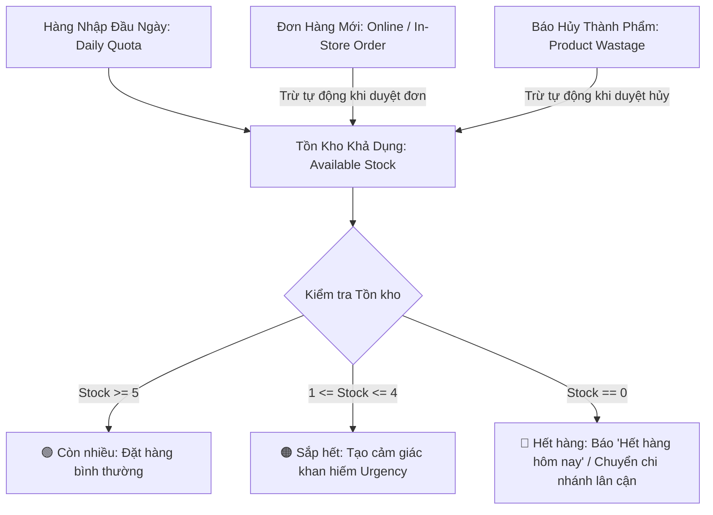

# Thiết Kế Vòng Đời Tồn Kho, Nhập Hàng, Bán Ra, Hao Hụt & Khắc Phục Hardcode Chi Nhánh
## Tài Liệu Thiết Kế Kỹ Thuật (Technical Design Document)
### Mã Nhiệm Vụ Liên Quan: `TASK_06_INVENTORY_AND_MULTI_BRANCH_ROUTING`

---

## 1. Bối Cảnh & Vấn Đề Cần Giải Quyết (Problem Statement)

### 1.1. Hiện trạng Hardcode khi "Thêm Mẫu Hoa Mới Vào Catalogue"
Trong giao diện Quản trị Catalogue (`#productModal` trong `index.html` và hàm `handleProductSubmit` trong `js/portal_admin.js`), hệ thống đang gặp lỗi **hardcode tĩnh cố định danh sách chi nhánh và số lượng ban đầu**:

1. **Giao diện HTML (`index.html` lines 2835-2849):**
   - Đang fix cứng 3 ô nhập cho 3 chi nhánh: `Kho Q.10` (`prodStockQ10`), `Kho Q.1` (`prodStockQ1`), `Kho Thảo Điền` (`prodStockTD`).
   - Số lượng mặc định bị gán cứng lần lượt là `10`, `5`, `5`.
2. **Logic JavaScript (`js/portal_admin.js` lines 2283-2285 & 2328-2351):**
   - Chỉ đọc từ 3 ID cố định: `prodStockQ10`, `prodStockQ1`, `prodStockTD`.
   - Đóng gói payload gửi về backend cố định 3 key: `branch_q10`, `branch_q1`, `branch_thao_dien`.
3. **Hệ quả tiêu cực:**
   - Khi doanh nghiệp mở thêm chi nhánh mới (hoặc chỉnh sửa thông tin trong `config/anne/branches.json`), modal thêm hoa mới **hoàn toàn không hiển thị chi nhánh mới**.
   - Không phản ánh đúng thực tế năng lực nhập hàng và cắm hoa của từng cửa hàng.

### 1.2. Nhu cầu quản lý vòng đời số lượng hoa tươi hoàn chỉnh
Hoa tươi là ngành hàng có vòng đời ngắn (2 - 4 ngày). Quản trị viên và Quản lý chi nhánh cần một hệ thống quản lý trọn vẹn 4 chỉ số:
- **Hàng nhập (Daily Inbound / Quota):** Hạn mức số lượng hoa tươi nhập về showroom mỗi sáng.
- **Hàng đã bán (Sold):** Số lượng hoa đã được khách đặt mua qua đơn hàng.
- **Tồn tại hiện tại (Current Available Stock):** Số lượng thực tế còn lại có thể bán tiếp trên website.
- **Số lượng hao hụt (Wastage):** Hoa bị dập cánh do vận chuyển, nở sớm do thời tiết, hoặc gãy cành trong quá trình cắm cần được lập biên bản báo hủy cuối ca.

---

## 2. Mô Hình Dữ Liệu, Công Thức & Chu Kỳ Vận Hành (Data Model, Formula & Daily Cycle)

### 2.1. Công thức cân bằng kho thời gian thực
Tại bất kỳ thời điểm nào trong ngày, số lượng tồn khả dụng của một mẫu hoa tại một chi nhánh tuân thủ công thức:

$$\text{Tồn khả dụng (Available)} = \text{Hàng nhập trong ngày (Daily Quota)} - \text{Đã bán (Sold)} - \text{Hao hụt thành phẩm (Product Wastage)}$$

Trong đó:
- **Hàng nhập trong ngày ($\text{Daily Quota}$):** Số lượng cắm được tối đa của mẫu hoa đó tại chi nhánh trong ngày (mặc định lấy từ `stockByBranch[branchId]` hoặc cập nhật nhanh mỗi sáng).
- **Đã bán ($\text{Sold}$):** Tổng số lượng sản phẩm nằm trong các đơn hàng của chi nhánh đó trong ngày (ở các trạng thái: `pending`, `confirmed`, `arranging`, `in_progress`, `photo_sent`, `delivered`, `completed` - loại trừ các đơn `cancelled`).
- **Hao hụt thành phẩm ($\text{Product Wastage}$):** Tổng số lượng bó/bình hoa nguyên vẹn bị hỏng phải hủy trong ngày (có gắn `productId`).
- **Điều kiện an toàn:** $\text{Available} \ge 0$. Khi $\text{Available} = 0$, hệ thống tự động khóa nút đặt hoặc chuyển sang trạng thái "Hết hàng hôm nay".



---

### 2.2. Chu kỳ vận hành theo ngày (Daily Scope - Giờ Việt Nam GMT+7)

> [!IMPORTANT]
> **Quy tắc phân định ngày (Date Boundary):**
> Do đặc thù hoa tươi nhập mới mỗi sáng, chỉ số **Đã bán (`Sold`)** và **Hao hụt (`Wastage`)** được tính theo phạm vi **Ngày hiện tại (00:00:00 đến 23:59:59 GMT+7)**.

* **Đầu ca sáng (07:00 - 08:30):**
  - Khi xe hoa từ Đà Lạt/nhà vườn về, Quản lý/Thợ cắm hoa vào `/portal/admin` $\rightarrow$ Tab **Kho & Hao Hụt** để kiểm tra và cập nhật nhanh hạn mức cắm hoa hôm nay (**Batch Quick Stock Update**).
  - Hạn mức này lưu vào `stockByBranch` của từng mẫu hoa trong `products.json`.
* **Trong ca làm việc:**
  - Mỗi đơn hàng phát sinh sẽ tự động tính dồn vào chỉ số `Sold` của chi nhánh được gán đơn trong ngày.
  - Tồn khả dụng `Available` giảm dần theo thời gian thực.
* **Cuối ca làm việc (20:30 - 21:30):**
  - Nhân viên kiểm kê lượng hoa dập nát, gãy cành hoặc nở quá độ $\rightarrow$ Lập phiếu **Báo Hủy Hoa Hỏng** (`wastage_reports.json`).
* **Sang ngày mới (00:00 GMT+7):**
  - Chỉ số `Sold` và `Wastage` tự động reset về `0` cho ngày mới.
  - Chỉ số Hạn mức nhập `Daily Quota` được giữ nguyên cấu hình làm mốc chuẩn cho đến khi nhân viên cập nhật lại.

---

### 2.3. Phân loại 2 hình thức Báo Hủy Hoa Hỏng (Wastage Classification)

Phiếu báo hủy hỗ trợ linh hoạt 2 trường hợp:

| Loại hình báo hủy | Khái niệm & Ví dụ | Ảnh hưởng đến Tồn kho | Ảnh hưởng Tài chính |
| :--- | :--- | :--- | :--- |
| **1. Hủy Mẫu hoa thành phẩm (`productId`)** | Bó/bình hoa đã cắm xong nhưng bị khách đổi ý không lấy để lâu héo, hoặc bị rơi đổ dập nát thành phẩm. | **Trừ trực tiếp** vào tồn khả dụng của mẫu hoa đó tại chi nhánh. | Ghi nhận thiệt hại giá vốn của toàn bộ mẫu hoa. |
| **2. Hủy Hoa nguyên liệu theo cành (`flowerType`)** | Cành hoa tươi nguyên liệu bị gãy dập khi dỡ kiện hàng, úa lá trong xô bảo quản (VD: 5 cành Hồng Spirit, 3 cành Tú Cầu). | **Không trừ mẫu thành phẩm**, chỉ ghi nhận hao hụt nguyên liệu. | Tính toán thiệt hại chi phí vốn = $\text{Số cành} \times \text{Đơn giá vốn}$. |

---

### 2.4. Ma Trận Phân Quyền Vai Trò (RBAC Matrix)

| Chức năng | Super Admin | Quản Lý Chi Nhánh (`branch_manager`) | Thợ Cắm Hoa (`florist`) | Tư Vấn Bán Hàng (`sales_consultant`) |
| :--- | :---: | :---: | :---: | :---: |
| **Xem Ma trận tồn kho toàn chuỗi** | ✅ Toàn quyền | ⚠️ Xem được (mặc định highlight CN mình) | ⚠️ Xem được | ⚠️ Xem được |
| **Sửa hạn mức tồn kho (Batch Update)** | ✅ Mọi chi nhánh | ⚠️ **Chỉ sửa chi nhánh mình phụ trách** (`user.branchId`) | ❌ Không có quyền | ❌ Không có quyền |
| **Tạo phiếu báo hủy hoa hỏng** | ✅ Mọi chi nhánh | ✅ Chi nhánh mình | ✅ **Chi nhánh mình** | ❌ Không có quyền |
| **Xem lịch sử phiếu báo hủy** | ✅ Xem toàn chuỗi | ⚠️ Xem chi nhánh mình | ⚠️ Xem chi nhánh mình | ❌ Không có quyền |

---

### 2.5. Cấu trúc dữ liệu chi tiết (JSON Schemas)

#### A. Cấu trúc tồn kho sản phẩm trong `config/anne/products.json`
Động hóa hoàn toàn `stockByBranch` không giới hạn số lượng chi nhánh:
```json
{
  "id": "bo_hoa_01",
  "name": "Mây Trắng Bồng Bềnh",
  "category": "bo_hoa",
  "priceNumber": 420000,
  "stockByBranch": {
    "branch_q10": 10,
    "branch_q1": 5,
    "branch_thao_dien": 5,
    "branch_binh_thanh": 8
  },
  "dailyQuota": 28,
  "isActive": true,
  "updatedAt": "2026-09-09T08:00:00Z"
}
```

#### B. Cấu trúc phiếu báo hủy hoa hỏng trong `config/anne/wastage_reports.json`
```json
[
  {
    "id": "wastage_20260909_q10_01",
    "branchId": "branch_q10",
    "branchName": "Nở Hoa Thả Bình - Showroom Quận 10",
    "date": "2026-09-09",
    "reportedBy": "staff_002",
    "reporterName": "Lê Thị Cẩm Tú (Thợ cắm hoa)",
    "wastageType": "product",
    "items": [
      {
        "productId": "bo_hoa_01",
        "productName": "Mây Trắng Bồng Bềnh",
        "flowerType": "Hồng trắng Ohara",
        "quantity": 1,
        "damagedStems": 10,
        "reason": "Dập cánh khi vận chuyển từ nhà vườn về",
        "unitCost": 150000,
        "totalLoss": 150000
      }
    ],
    "totalLossAmount": 150000,
    "notes": "Kiểm kê hao hụt cuối ca chiều ngày 09/09/2026",
    "createdAt": "2026-09-09T18:30:00Z"
  }
]
```

---

## 3. Thiết Kế Giao Diện & Trải Nghiệm Người Dùng (UI/UX)

### 3.1. Động hóa Modal "Thêm Mẫu Hoa Mới Vào Catalogue"
- **Loại bỏ hoàn toàn HTML hardcode:** Thay thế `<div class="grid grid-cols-3 gap-3">` cố định bằng một container rỗng:
  ```html
  <div class="p-3.5 bg-gray-50/80 rounded-2xl border border-gray-200/80 space-y-2">
      <div class="flex items-center justify-between">
          <label class="block text-xs font-bold text-gray-800 flex items-center">
              <i class="fa-solid fa-boxes-stacked text-primary mr-1.5"></i>
              Số Lượng Tồn Kho Nhập Ban Đầu Theo Từng Chi Nhánh *
          </label>
          <span class="text-[11px] text-gray-500">Tự động lấy theo danh sách chi nhánh hoạt động</span>
      </div>
      <div id="productStockByBranchDynamicContainer" class="grid grid-cols-1 sm:grid-cols-2 md:grid-cols-3 gap-3 pt-1">
          <!-- Render động qua JavaScript từ branches.json -->
      </div>
  </div>
  ```
- **Hàm JavaScript render động:**
  - Lấy danh sách chi nhánh từ bộ nhớ/API (`window.adminBranches` hoặc `branches.json`).
  - Lọc các chi nhánh đang mở (`isActive !== false`).
  - Tạo các ô nhập số lượng tương ứng với `name="branch_stock_${b.id}"` và giá trị cũ nếu đang ở chế độ chỉnh sửa.
  - Khi submit form, hàm `handleProductSubmit` quét qua container để gom thành `stockByBranch: { [b.id]: stockVal }`.

---

### 3.2. Tab Quản Lý Kho & Hao Hụt Trong Cổng Quản Trị (`/portal/admin`)
Thêm Tab **"Kho & Hao Hụt"** (`tabBtnInventory`, `viewInventory`) trên thanh điều hướng Quản trị:

```
[ Đơn hàng ] [ Sản phẩm ] [ Danh mục ] [ Kho & Hao Hụt 🟢 ] [ Nhân sự ] [ Khách hàng ] [ Chi nhánh ] ...
```

Giao diện tab gồm 3 khối chức năng trực quan:

#### Khối 1: Thống Kê Tổng Quan Tồn Kho Toàn Chuỗi (KPI Cards)
- **Tổng mẫu hoa đang bán:** Ví dụ: `24 mẫu`.
- **Tổng lượng hoa đã nhập hôm nay (Daily Quota):** Ví dụ: `250 bó/bình`.
- **Đã bán hôm nay:** Ví dụ: `142 bó/bình`.
- **Hao hụt / Báo hủy hôm nay:** Ví dụ: `6 bó/bình (Thiệt hại: 320.000₫)`.
- **Tồn khả dụng toàn chuỗi:** Ví dụ: `102 bó/bình`.

#### Khối 2: Bảng Ma Trận Tồn Kho Thời Gian Thực (Live Inventory Matrix)
Bảng hiển thị ma trận toàn chuỗi:
| Ảnh | Tên Mẫu Hoa | Giá Niêm Yết | CN Quận 10 | CN Quận 1 | CN Thảo Điền | Tổng Nhập | Đã Bán | Hao Hụt | Còn Lại | Trạng Thái |
| :---: | :--- | :---: | :---: | :---: | :---: | :---: | :---: | :---: | :---: | :---: |
| 🖼️ | **Mây Trắng Bồng Bềnh** | 420.000₫ | `[ 10 ]` 🟢 | `[ 4 ]` 🟠 | `[ 0 ]` 🔴 | 20 | 5 | 1 | **14** | 🟢 Đủ bán |
| 🖼️ | **Ohara Pink Viency** | 880.000₫ | `[ 5 ]` 🟢 | `[ 3 ]` 🟠 | `[ 2 ]` 🟠 | 15 | 4 | 1 | **10** | 🟠 Sắp hết |

- **Tính năng Cập Nhật Nhanh Hàng Loạt (Batch Stock Update):**
  - Quản lý/nhân viên có thể gõ trực tiếp số lượng vào các ô input `[ ... ]` tại từng cột chi nhánh.
  - Nút **"💾 Lưu Toàn Bộ Hạn Mức Tồn Kho Hôm Nay"** gửi một request batch lên server để lưu lại ngay lập tức mà không cần mở từng sản phẩm.
  - Kiểm tra quyền: Nếu là `branch_manager`, các ô input của chi nhánh khác sẽ bị `disabled` (chỉ xem), chỉ ô input thuộc chi nhánh của mình mới cho phép sửa.

#### Khối 3: Phân Hệ Báo Hủy Hoa Hỏng (Wastage Management)
- **Nút bấm:** `+ Tạo Phiếu Báo Hủy Hoa Hỏng Cuối Ca`.
- **Modal Báo Hủy (`#wastageModal`):**
  - Chọn Chi nhánh lập phiếu (nếu là `branch_manager` hoặc `florist` thì mặc định chọn sẵn và khóa chi nhánh).
  - Chọn Loại hình báo hủy: `Mẫu hoa thành phẩm` hoặc `Hoa tươi nguyên liệu theo cành`.
  - Chọn Sản phẩm / Loại hoa bị hỏng.
  - Nhập số lượng cành/bó hỏng.
  - Nhập đơn giá vốn ước tính (VNĐ).
  - Chọn lý do hủy (Menu chọn nhanh: *Dập cánh khi vận chuyển*, *Nở quá độ do thời tiết nóng*, *Gãy cành khi cắm hoa*, *Héo úa do bảo quản* hoặc nhập lý do khác).
  - Ghi chú kiểm kê.
- **Bảng Danh Sách Phiếu Báo Hủy Gần Nhất:**
  - Hiển thị ngày giờ, chi nhánh, người báo cáo, danh sách hoa hủy, tổng tiền thất thoát và nút xem chi tiết.

---

## 4. Đặc Tả Kỹ Thuật Backend RESTful API & Dịch Vụ (`src/inventory_service.py`)

### 4.1. Danh Sách API Endpoints

| Method | Endpoint | Quyền hạn (RBAC) | Mô tả |
| :--- | :--- | :---: | :--- |
| `GET` | `/api/flower/v1/admin/inventory/matrix` | Staff, Manager, Super Admin | Lấy ma trận tồn kho toàn chuỗi (Nhập, Bán, Tồn, Hủy theo từng chi nhánh trong ngày hôm nay) |
| `PUT` | `/api/flower/v1/admin/inventory/batch` | Manager, Super Admin | Cập nhật nhanh số lượng hạn mức bán hôm nay hàng loạt theo chi nhánh |
| `GET` | `/api/flower/v1/admin/inventory/wastage` | Staff, Manager, Super Admin | Lấy danh sách lịch sử các phiếu báo hủy hoa hỏng |
| `POST` | `/api/flower/v1/admin/inventory/wastage` | Staff, Manager, Super Admin | Tạo phiếu báo hủy hoa hỏng mới (tự động trừ kho khả dụng nếu là thành phẩm) |
| `GET` | `/api/flower/v1/products/<id>/stock` | Public Storefront | Lấy thông tin tồn kho chi tiết của 1 mẫu hoa tại các showroom |
| `POST` | `/api/flower/v1/inventory/smart-route` | Internal / Order Service | Thuật toán xác định chi nhánh gần địa chỉ giao hàng nhất còn đủ hàng |

---

### 4.2. Chi Tiết Request & Response Mẫu

#### 1. API Lấy Ma Trận Tồn Kho (`GET /api/flower/v1/admin/inventory/matrix`):
**Response `200 OK`:**
```json
{
  "success": true,
  "data": {
    "date": "2026-09-09",
    "branches": [
      { "id": "branch_q10", "name": "Showroom Quận 10", "code": "CN_Q10" },
      { "id": "branch_q1", "name": "Showroom Quận 1", "code": "CN_Q1" },
      { "id": "branch_thao_dien", "name": "Showroom Thảo Điền", "code": "CN_Q2" }
    ],
    "summary": {
      "totalProducts": 24,
      "totalImported": 250,
      "totalSold": 142,
      "totalWastage": 6,
      "totalAvailable": 102,
      "totalLossAmount": 320000
    },
    "matrix": [
      {
        "productId": "bo_hoa_01",
        "productName": "Mây Trắng Bồng Bềnh",
        "category": "bo_hoa",
        "priceNumber": 420000,
        "image": "/api/flower/v1/images/bo_hoa_01.jpg",
        "branchStocks": {
          "branch_q10": { "imported": 10, "sold": 3, "wastage": 1, "available": 6, "status": "in_stock" },
          "branch_q1": { "imported": 5, "sold": 3, "wastage": 0, "available": 2, "status": "low_stock" },
          "branch_thao_dien": { "imported": 5, "sold": 5, "wastage": 0, "available": 0, "status": "out_of_stock" }
        },
        "totalImported": 20,
        "totalSold": 11,
        "totalWastage": 1,
        "totalAvailable": 8
      }
    ]
  }
}
```

#### 2. API Cập Nhật Hạn Mức Tồn Kho Hàng Loạt (`PUT /api/flower/v1/admin/inventory/batch`):
**Request Payload:**
```json
{
  "updates": [
    {
      "productId": "bo_hoa_01",
      "stockByBranch": {
        "branch_q10": 12,
        "branch_q1": 6,
        "branch_thao_dien": 4
      }
    }
  ]
}
```

#### 3. API Tạo Phiếu Báo Hủy Hoa Hỏng (`POST /api/flower/v1/admin/inventory/wastage`):
**Request Payload:**
```json
{
  "branchId": "branch_q10",
  "date": "2026-09-09",
  "reportedBy": "staff_002",
  "reporterName": "Lê Thị Cẩm Tú",
  "wastageType": "product",
  "items": [
    {
      "productId": "bo_hoa_01",
      "productName": "Mây Trắng Bồng Bềnh",
      "flowerType": "Hồng Ohara Trắng",
      "quantity": 1,
      "damagedStems": 3,
      "reason": "Dập cánh khi vận chuyển",
      "unitCost": 20000,
      "totalLoss": 60000
    }
  ],
  "notes": "Kiểm kê ca sáng"
}
```

---

## 5. Thuật Toán Điều Phối Đơn Hàng Thông Minh (Smart Order Routing)

Khi khách hàng hoàn tất đặt đơn hàng trên Storefront:
1. **Bước 1 (Định vị chi nhánh gần nhất):**
   - Xác định tọa độ giao hàng hoặc tên Quận/Huyện của khách.
   - Tính khoảng cách Haversine hoặc thứ tự ưu tiên Quận đến các Showroom (`branch_q10`, `branch_q1`, `branch_thao_dien`...).
2. **Bước 2 (Kiểm tra tồn kho chi nhánh tối ưu):**
   - Lấy `available_stock` của sản phẩm tại chi nhánh gần nhất.
   - Nếu `available_stock >= order_quantity` $\rightarrow$ Gán đơn cho chi nhánh này. Tự động trừ kho tại chi nhánh đó.
3. **Bước 3 (Fallback điều phối thông minh):**
   - Nếu chi nhánh gần nhất hết hàng (`available_stock < order_quantity`) $\rightarrow$ Quét chi nhánh gần thứ nhì có tồn kho đủ.
   - Tự động gán đơn sang chi nhánh thứ nhì và ghi chú trong đơn hàng: *"Đã tự động điều phối từ CN A sang CN B do CN A hết hàng trong ngày"*.

---

## 6. Kế Hoạch Triển Khai & Kiểm Thử (Testing & Verification Plan)

### 6.1. Danh Sách Tệp Sửa Đổi & Bổ Sung
1. **Tài liệu Thiết kế (Design Docs):**
   - `docs/design/INVENTORY_AND_WASTAGE_LIFECYCLE_DESIGN.md` (Đã hoàn thiện).
   - Cập nhật mục lục tại `docs/design/README.md`.
2. **Frontend UI & Logic:**
   - Cập nhật `index.html` và `config/index.html`:
     - Xóa khối hardcode tồn kho trong `#productModal`, thay bằng container động `#productStockByBranchDynamicContainer`.
     - Thêm Tab Điều hướng `Kho & Hao Hụt` và màn hình `viewInventory` (Live Matrix + Báo hủy).
   - Cập nhật `js/portal_admin.js`:
     - Hàm `renderProductModalStockFields()` render động chi nhánh từ `branches.json`.
     - Hàm `handleProductSubmit()` thu thập dữ liệu tồn kho động.
     - Hàm `renderAdminInventoryTab()` tải ma trận tồn kho, hiển thị đèn 🟢/🟠/🔴, xử lý lưu batch và quản lý báo hủy.
3. **Backend Python:**
   - Tạo mới `src/inventory_service.py`: Cung cấp các hàm tính toán ma trận tồn kho (Nhập, Bán, Tồn, Hủy), ghi nhận phiếu báo hủy và cập nhật kho theo chi nhánh.
   - Bổ sung routes vào `src/restful_blueprint_flower_connect.py`: Các API `/admin/inventory/matrix`, `/admin/inventory/batch`, `/admin/inventory/wastage`.
4. **Unit Test:**
   - Tạo `src/unittest/test_inventory_service.py` kiểm thử:
     - Động hóa chi nhánh và hạn mức tồn kho ban đầu.
     - Tính toán đúng ma trận Nhập - Bán - Tồn - Hủy.
     - Ghi nhận phiếu báo hủy và tự động trừ kho khả dụng.
     - Kiểm thử điều phối đơn hàng sang chi nhánh còn hàng gần nhất.
     - Kiểm soát phân quyền RBAC: Quản lý chi nhánh không được ghi đè kho chi nhánh khác.

---
*Tài liệu được cập nhật và phê duyệt làm kim chỉ nam triển khai trực tiếp cho Task 06 trong toàn bộ hệ thống.*
