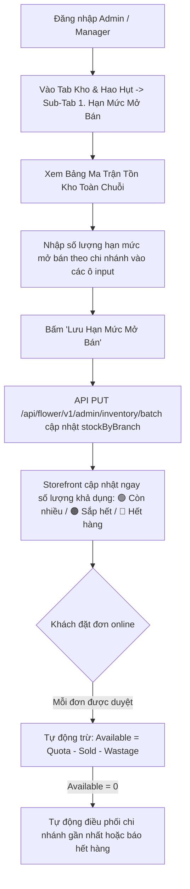

# Thiết Kế Quy Trình Nhập Sản Phẩm & Quản Lý Tồn Kho Hoa Tươi (Inventory & Product Management)
## Dự Án: Nở Hoa Thả Bình (`telua_flower`)

---

## 1. Đặc Thù Nghiệp Vụ Hoa Tươi Thực Tế (Flower Inventory Specifics)

Hoa tươi là mặt hàng có tính chất đặc thù về chuỗi cung ứng:
1. **Chu kỳ nhập đợt 2 - 3 ngày/lần:** Hoa tươi từ nhà vườn (Đà Lạt, Hà Lan, Ecuador...) về tiệm theo chuyến cách 2 - 3 ngày. Hoa được dưỡng trong kho mát (chiller 4°C - 8°C) và cắm bán luân chuyển trong 2 đến 4 ngày.
2. **Tồn kho luân chuyển tích lũy (Rolling Cumulative Stock):** Cả Kho Cành (`materials.json`) và Kho Hàng Bán Trực Tiếp (`products.json`) lưu số lượng liên tục qua các ngày, không bị reset trắng kho mỗi ngày.
3. **Quản lý Hạn Mức Mở Bán (Available Quota):** Mỗi chi nhánh mở bán theo số lượng có thể phục vụ trong đợt nhập (`stockByBranch`), tự động trừ khi khách đặt đơn hoặc khi có biên bản báo hủy hoa hỏng.
4. **Trạng thái hết hàng thông minh:** Khi số lượng tồn khả dụng bằng 0 $\rightarrow$ Hệ thống tự động kích hoạt thuật toán Điều Phối Thông Minh (Smart Order Routing) sang chi nhánh lân cận còn hàng hoặc gắn nhãn **"Hết hàng hôm nay"** trên Storefront.

---

## 2. Quy Trình 2 Cách Nhân Viên Quản Lý Tồn Kho Trên Cổng Quản Trị

### 🌸 Cách 1: Cập Nhật Nhanh Hạn Mức Mở Bán Hàng Loạt (Batch Stock Update)
*Dành cho Quản lý chi nhánh / Thợ cắm hoa tại Tab **"Kho & Hao Hụt"** (`/portal/admin`):*



---

### ➕ Cách 2: Thêm Hoặc Chỉnh Sửa Mẫu Sản Phẩm (`#productModal`)
*Dành cho Quản lý / Super Admin khi ra mắt mẫu hoa mới hoặc chỉnh sửa mẫu cũ:*

1. **Bước 1: Mở Modal Thêm/Sửa Mẫu Hoa** (`openProductModal()` / `editProduct(productId)`).
2. **Bước 2: Chọn Loại Sản Phẩm (`prodProductType`):**
   - **`🌸 Hoa Cắm Phối` (`arranged`):**
     - Hệ thống tự động mở khối **Định Lượng Cành Hoa (BOM Recipe)**.
     - Dropdown nạp danh sách cành hoa từ kho `materials.json` (phân loại Hoa chính, Hoa phụ, Lá đệm, Phụ liệu).
     - Nhập số lượng cành cần dùng và bấm **"Thêm Cành"** vào công thức.
     - Hiển thị badge tổng: `Tổng: X cành hoa (Y loại)`.
   - **`🏺 Bán Trực Tiếp` (`direct`):**
     - Hệ thống tự động chuyển sang khối **Số Cành Quy Cách (`stemCount`)**.
     - Nhập số cành đại diện cho sản phẩm đóng gói sẵn (vd: Chậu lan 5 cành, Bình tulip 10 cành, hoặc 0 cành nếu là thiệp/gấu bông/bình rỗng).
3. **Bước 3: Nhập Hạn Mức Mở Bán Cho Từng Chi Nhánh:**
   - Container `#productStockByBranchDynamicContainer` tự động kết xuất danh sách chi nhánh hoạt động từ `branches.json`.
   - Nhập số lượng tồn kho mở bán ban đầu cho từng showroom.
4. **Bước 4: Bấm "Lưu Mẫu Hoa":**
   - Payload gửi về API `POST /api/flower/v1/admin/products` hoặc `PUT /api/flower/v1/admin/products/<id>`.
   - Backend lưu đồng bộ cả `recipe`, `stemCount`, `stockByBranch` và `dailyQuota`.

---

## 3. Cấu Trúc Dữ Liệu Sản Phẩm Thực Tế (`config/anne/products.json`)

Mỗi sản phẩm lưu trữ đầy đủ các trường phân loại và tồn kho đa chi nhánh:

```json
{
  "id": "bo_hoa_01",
  "name": "Mây Trắng Bồng Bềnh",
  "category": "bo_hoa",
  "productType": "arranged",
  "stemCount": 18,
  "recipe": [
    { "materialId": "mat_rose_ohara_white", "name": "Hồng Trắng Ohara Nhập Khẩu", "quantity": 10, "unit": "cành", "isMain": true },
    { "materialId": "mat_daisy_tana", "name": "Cúc Tana Đà Lạt", "quantity": 5, "unit": "nhánh", "isMain": false },
    { "materialId": "mat_foliage_eucalyptus", "name": "Lá Khuynh Diệp Bạc", "quantity": 3, "unit": "nhánh", "isMain": false }
  ],
  "priceLevelId": "price_lvl_01",
  "priceNumber": 420000,
  "salePrice": "420,000₫",
  "badge": "Mới",
  "image": "https://images.unsplash.com/photo-1562690868-60bbe7293e94?w=500",
  "stockByBranch": {
    "branch_q10": 10,
    "branch_q1": 5,
    "branch_thao_dien": 5
  },
  "dailyQuota": 20,
  "isActive": true,
  "updatedAt": "2026-09-13T07:00:00Z"
}
```

---

## 4. Danh Sách API Endpoints Quản Lý Tồn Kho & Sản Phẩm

| Method | Endpoint | Quyền hạn (RBAC) | Mô tả thực tế trong Code |
| :--- | :--- | :---: | :--- |
| `POST` | `/api/flower/v1/admin/products` | Super Admin, Manager | Thêm mẫu sản phẩm mới (hỗ trợ `productType`, `stemCount`, `recipe`, `stockByBranch`) |
| `PUT` | `/api/flower/v1/admin/products/<id>` | Super Admin, Manager | Cập nhật thông tin chi tiết và công thức mẫu hoa |
| `PUT` / `POST` | `/api/flower/v1/admin/inventory/batch` | Super Admin, Manager | Cập nhật nhanh Hạn Mức Mở Bán hàng loạt cho nhiều sản phẩm/chi nhánh |
| `GET` | `/api/flower/v1/admin/inventory/matrix` | Staff, Manager, Super Admin | Lấy dữ liệu ma trận tồn kho toàn chuỗi theo ngày |
| `GET` | `/api/flower/v1/admin/inventory/materials` | Staff, Manager, Super Admin | Lấy danh sách tồn kho cành hoa nguyên liệu (`materials.json`) |
| `POST` | `/api/flower/v1/admin/inventory/inbounds` | Super Admin, Manager | Tạo phiếu nhập kho theo đợt (tự động cộng dồn cành hoa hoặc hàng trực tiếp) |
| `POST` | `/api/flower/v1/admin/inventory/wastage` | Staff, Manager, Super Admin | Tạo phiếu báo hủy hoa dập hỏng (kèm ảnh minh chứng lưu tại `config/anne/wastage/images/{YYYY_MM}/` và phiếu lưu tại `config/anne/inventory/wastage/{YYYY_MM}/`) |
| `POST` | `/api/flower/v1/inventory/smart-route` | Internal / Order Service | Tự động xác định chi nhánh gần khách nhất còn đủ tồn khả dụng để giao hàng |

#### Payload mẫu cập nhật nhanh Hạn Mức Mở Bán hàng loạt (`PUT /api/flower/v1/admin/inventory/batch`):
```json
{
  "updates": [
    { "productId": "bo_hoa_01", "branchId": "branch_q10", "quota": 15 },
    { "productId": "bo_hoa_01", "branchId": "branch_q1", "quota": 8 },
    { "productId": "binh_hoa_01", "branchId": "branch_q10", "quota": 20 }
  ]
}
```

---

## 5. Trải Nghiệm Khách Hàng Khi Hết Hàng (Out-of-Stock UX)

1. **Đèn tín hiệu tồn kho thời gian thực:**
   - 🟢 **Còn nhiều (`available >= 5`):** Khách đặt bình thường, hỗ trợ giao hỏa tốc hoặc hẹn giờ.
   - 🟠 **Sắp hết (`1 <= available < 5`):** Hiển thị nhãn *"Chỉ còn lại X sản phẩm tại chi nhánh này"* tạo cảm giác khẩn trương.
2. **Khi chi nhánh hết hàng (`available == 0`):**
   - **Tự động điều phối:** Thuật toán Smart Routing tự động tìm chi nhánh lân cận còn hàng để nhận đơn.
   - Nếu toàn bộ chuỗi đều hết hàng: Nút *"Đặt hàng"* chuyển sang trạng thái *"Tạm hết hàng"* hoặc gợi ý các mẫu hoa tương tự cùng tầm giá (Price Level).
