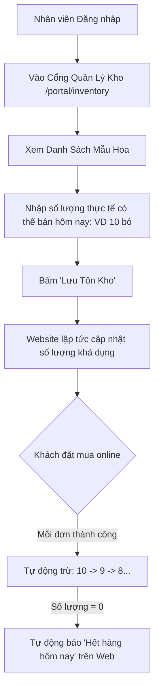

# Thiết Kế Quy Trình Nhập Sản Phẩm & Quản Lý Tồn Kho Hoa Tươi (Inventory & Product Management)
## Dự Án: Nở Hoa Thả Bình (`telua_flower`)

---

## 1. Đặc Thù Nghiệp Vụ Hoa Tươi (Flower Inventory Specifics)

Hoa tươi là mặt hàng có tính chất đặc biệt:
1. **Nhập mới mỗi ngày:** Hoa nguyên liệu và thành phẩm được nhập theo ngày, tuổi thọ ngắn (2 - 4 ngày).
2. **Quản lý số lượng khả dụng trong ngày (Daily Quota):** Mỗi ngày một chi nhánh chỉ có thể cắm tối đa một số lượng bó/kệ hoa nhất định theo lượng hoa tươi nhập về.
3. **Trạng thái hết hàng thông minh:** Khi số lượng bán hết $\rightarrow$ Tự động gắn nhãn **"Hết hàng hôm nay"** hoặc **"Tạm hết hàng"** trên website để tránh nhận đơn vượt quá khả năng phục vụ.

---

## 2. Quy Trình 2 Cách Nhân Viên Nhập Lên Website

### 🌸 Cách 1: Cập Nhật Nhanh Số Lượng Hoa Bán Trong Ngày (Daily Quick Stock Update)
*Dành cho Nhân viên / Thợ cắm hoa / Quản lý chi nhánh mỗi sáng khi hoa tươi về showroom:*



---

### ➕ Cách 2: Đăng Mẫu Hoa Mới Hoặc Bình Mới Lên Website (Create New Product)
*Dành cho Quản lý / Admin khi tiệm ra mắt bộ sưu tập hoa mới hoặc mẫu bình mới:*

1. **Bước 1:** Bấm nút **"Thêm Mẫu Hoa Mới"** (`+ Thêm sản phẩm`).
2. **Bước 2:** Điền biểu mẫu thông tin:
   - **Tên mẫu hoa:** VD: *Mây Trắng Bồng Bềnh*, *Ohara Pink Viency*.
   - **Danh mục:** Chọn *Bó Hoa Tươi*, *Kệ Khai Trương* hoặc *Bình Cắm Hoa*.
   - **Hình ảnh:** Tải ảnh từ máy/điện thoại hoặc dán link ảnh mẫu.
   - **Giá bán gốc & Giá khuyến mãi:** VD: Giá gốc `450.000₫`, Giá bán `420.000₫`.
   - **Nhãn nổi bật (Badge):** `Hot`, `Mới`, `-7%` hoặc để trống.
   - **Số lượng nhập ban đầu (Stock):** VD: `15`.
3. **Bước 3:** Bấm **"Đăng Sản Phẩm Lên Website"** $\rightarrow$ Sản phẩm lập tức xuất hiện trên trang chủ `index.html`.

---

## 3. Cấu Trúc Dữ Liệu Sản Phẩm & Tồn Kho (Data Model)

Mỗi sản phẩm trong `config/products.json` hoặc Database có thêm các trường quản lý tồn kho:

```json
{
  "id": "bo_hoa_01",
  "name": "Mây Trắng Bồng Bềnh",
  "category": "bo_hoa",
  "originalPrice": "450,000₫",
  "salePrice": "420,000₫",
  "priceNumber": 420000,
  "image": "https://images.unsplash.com/photo-1562690868-60bbe7293e94?w=400",
  "badge": "-7%",
  "stockByBranch": {
    "branch_q10": 10,
    "branch_q1": 5
  },
  "isAvailable": true,
  "updatedAt": "2026-08-22T07:00:00Z"
}
```

---

## 4. Thiết Kế API Endpoints Nhập Hàng & Tồn Kho

| Method | Endpoint | Quyền hạn | Mô tả |
| :--- | :--- | :---: | :--- |
| `POST` | `/api/admin/products` | `super_admin`, Manager | Đăng mẫu hoa mới lên website |
| `PUT` | `/api/admin/products/<id>` | `super_admin`, Manager | Sửa thông tin, giá, ảnh của mẫu hoa |
| `PUT` | `/api/branch/<branch_id>/inventory/<product_id>` | Staff, Manager | Cập nhật số lượng tồn kho của 1 sản phẩm |
| `POST` | `/api/branch/<branch_id>/inventory/batch` | Staff, Manager | Cập nhật nhanh số lượng hàng loạt nhiều mẫu hoa |

#### Request mẫu cập nhật nhanh số lượng hàng loạt (`POST .../inventory/batch`):
```json
{
  "items": [
    { "productId": "bo_hoa_01", "stock": 12 },
    { "productId": "bo_hoa_02", "stock": 8 },
    { "productId": "ke_hoa_01", "stock": 5 }
  ]
}
```

---

## 5. Trải Nghiệm Giao Diện Trên Website Khi Hết Hàng (Out-of-Stock UX)

1. **Còn hàng (`stock > 0`):** Nút **"Thêm giỏ hàng"** hiển thị bình thường.
2. **Hết hàng (`stock === 0`):**
   - Ảnh sản phẩm phủ một lớp mờ nhẹ (overlay) với nhãn **"Hết hàng hôm nay"**.
   - Nút *"Thêm giỏ hàng"* được vô hiệu hóa (`disabled`) và chuyển thành nút *"Liên hệ cắm theo yêu cầu"*.
