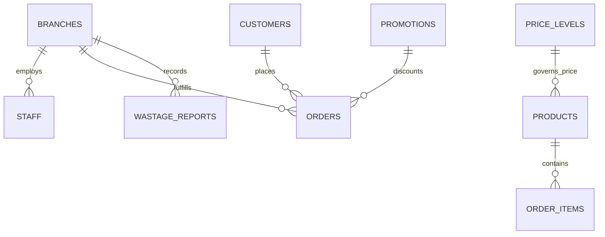

# Thiết Kế Cấu Trúc Dữ Liệu Lưu Trữ JSON (JSON Data Schema & Storage Architecture)
## Dự Án: Nở Hoa Thả Bình (`telua_flower`)

---

## 1. Tổng Quan Kiến Trúc Lưu Trữ JSON (Storage Overview)

Toàn bộ dữ liệu của hệ thống được tổ chức thành các tệp JSON độc lập trong thư mục `config/` (hoặc dễ dàng chuyển đổi sang MongoDB / PostgreSQL khi mở rộng quy mô):



---

## 2. Chi Tiết Các Tệp JSON & Schema Chuẩn

### 🏬 1. `config/branches.json` - Danh Sách Showroom & Chi Nhánh
```json
[
  {
    "id": "branch_q10",
    "code": "CN_Q10",
    "name": "Nở Hoa Thả Bình - Showroom Quận 10 (Flagship)",
    "address": "183/37 Đường 3 Tháng 2, Phường 11, Quận 10, TP. Hồ Chí Minh",
    "lat": 10.7725,
    "lng": 106.6698,
    "phone": "0976.491.322",
    "openHours": "07:00 - 21:00",
    "deliveryRadiusKm": 10,
    "managerId": "staff_001",
    "amenities": "Đậu xe ô tô/xe máy miễn phí, cắm hoa tại chỗ",
    "isActive": true,
    "createdAt": "2026-08-21T00:00:00Z"
  }
]
```

---

### 👔 2. `config/staff_users.json` - Tài Khoản Nhân Sự Nội Bộ Công Ty
Lưu trữ thông tin nhân viên và cấp quản trị (`super_admin`, `branch_manager`, `florist`, `sales_consultant`):
```json
[
  {
    "id": "staff_admin",
    "phone": "0900000000",
    "email": "admin@nohoathabinh.vn",
    "fullName": "Tổng Quản Trị Hệ Thống",
    "passwordHash": "pbkdf2:sha256:260000$...",
    "role": "super_admin",
    "branchId": null,
    "isActive": true,
    "createdAt": "2026-08-21T00:00:00Z"
  },
  {
    "id": "staff_001",
    "phone": "0909123456",
    "email": "mai.tran@nohoathabinh.vn",
    "fullName": "Trần Thị Mai",
    "passwordHash": "pbkdf2:sha256:260000$...",
    "role": "branch_manager",
    "branchId": "branch_q10",
    "isActive": true,
    "createdAt": "2026-08-21T00:00:00Z"
  }
]
```

---

### 👑 2b. `config/customers.json` - Danh Sách Khách Hàng & Dữ Liệu CRM
Lưu trữ tài khoản khách hàng đăng ký mua hoa, tích điểm và hạng thành viên:
```json
[
  {
    "id": "cust_001",
    "phone": "0987654321",
    "email": "nva@gmail.com",
    "fullName": "Nguyễn Văn A",
    "passwordHash": "pbkdf2:sha256:260000$...",
    "role": "customer",
    "tier": "gold",
    "loyaltyPoints": 350,
    "totalSpent": 4500000,
    "orderCount": 5,
    "savedAddresses": [
      "123 Nguyễn Huệ, Phường Bến Nghé, Quận 1, TP.HCM"
    ],
    "isActive": true,
    "createdAt": "2026-08-21T00:00:00Z"
  }
]
```

---

### 📊 3. `config/price_levels.json` - 4 Phân Tầng Mức Giá & Hàng Rào Giá An Toàn
```json
[
  {
    "id": "price_lvl_01",
    "code": "LV_01",
    "name": "Phổ Thông (Standard)",
    "minPrice": 300000,
    "maxPrice": 550000,
    "defaultPrice": 420000
  },
  {
    "id": "price_lvl_02",
    "code": "LV_02",
    "name": "Cao Cấp (Premium)",
    "minPrice": 600000,
    "maxPrice": 950000,
    "defaultPrice": 850000
  },
  {
    "id": "price_lvl_03",
    "code": "LV_03",
    "name": "Sang Trọng (Luxury)",
    "minPrice": 1000000,
    "maxPrice": 2500000,
    "defaultPrice": 1800000
  },
  {
    "id": "price_lvl_04",
    "code": "LV_04",
    "name": "Độc Bản VIP (Exclusive)",
    "minPrice": 2600000,
    "maxPrice": 15000000,
    "defaultPrice": 3500000
  }
]
```

---

### 🌸 4. `config/products.json` - Danh Mục Sản Phẩm Hoa & Bình
```json
[
  {
    "id": "bo_hoa_01",
    "name": "Mây Trắng Bồng Bềnh",
    "category": "bo_hoa",
    "priceLevelId": "price_lvl_01",
    "originalPrice": "450,000₫",
    "salePrice": "420,000₫",
    "priceNumber": 420000,
    "badge": "-7%",
    "image": "https://images.unsplash.com/photo-1562690868-60bbe7293e94?w=500",
    "gallery": [
      "https://images.unsplash.com/photo-1562690868-60bbe7293e94?w=800"
    ],
    "description": "Bó hoa tone trắng dịu êm kết hợp hoa sao xanh thanh lịch.",
    "flowerComposition": "Hồng trắng Ohara (10 cành), Cúc Tana, Hoa Sao Xanh, Lá Bạc Dollar",
    "dimension": "Cao 50cm x Rộng 40cm",
    "careTips": "Cắt gốc 45 độ, phun sương nhẹ cánh hoa mỗi sáng.",
    "stockByBranch": {
      "branch_q10": 10,
      "branch_q1": 2,
      "branch_thao_dien": 0
    },
    "isActive": true,
    "updatedAt": "2026-08-22T07:00:00Z"
  }
]
```

---

### 🛒 5. `config/orders.json` - Đơn Hàng & Thông Tin Quà Tặng
```json
[
  {
    "id": "ord_20260825_001",
    "orderCode": "NHTB_20260825_001",
    "createdAt": "2026-08-22T07:15:00Z",
    "assignedBranchId": "branch_q10",
    "status": "arranging",
    "sender": {
      "name": "Nguyễn Văn A",
      "phone": "0987654321",
      "email": "nva@gmail.com",
      "isAnonymous": false
    },
    "recipient": {
      "name": "Trần Thị Mai",
      "phone": "0911223344",
      "address": "Tòa nhà Bitexco, Tầng 12 - Số 2 Hải Triều, Q.1, TP.HCM",
      "deliveryNotes": "Gửi Lễ tân nếu người nhận đang họp. Gọi trước 15 phút."
    },
    "delivery": {
      "date": "2026-08-25",
      "timeSlot": "09:00 - 11:00",
      "isExpress2H": false
    },
    "customization": {
      "cardMessage": "Chúc mừng sinh nhật em gái yêu quý!",
      "ribbonBanner": "Công ty ABC Kính Chúc"
    },
    "items": [
      {
        "productId": "bo_hoa_01",
        "productName": "Mây Trắng Bồng Bềnh",
        "quantity": 1,
        "price": 420000
      }
    ],
    "pricing": {
      "subtotal": 420000,
      "discountCode": "ANNE10",
      "discountAmount": 42000,
      "shippingFee": 0,
      "finalTotal": 378000
    },
    "payment": {
      "method": "vietqr",
      "status": "paid",
      "paidAt": "2026-08-22T07:16:05Z",
      "transactionId": "TXN_987654321"
    },
    "proof": {
      "realPhotoUrl": "https://storage.nohoathabinh.vn/orders/ord_001_photo.jpg",
      "signedPhotoUrl": null
    },
    "vatInvoice": {
      "isRequested": true,
      "taxCode": "0312345678",
      "companyName": "CÔNG TY CỔ PHẦN CÔNG NGHỆ TELUA",
      "companyAddress": "183/37 Đường 3 Tháng 2, P.11, Q.10, TP.HCM",
      "recipientEmail": "ketoan@telua.vn"
    }
  }
]
```

---

### 🏷️ 6. `config/promotions.json` - Chiến Dịch Khuyến Mãi & Voucher
```json
[
  {
    "id": "promo_2010",
    "title": "Mừng Tháng Phụ Nữ 20/10",
    "code": "PHUNU15",
    "discountType": "percentage",
    "discountValue": 15,
    "maxDiscountAmount": 150000,
    "minOrderAmount": 400000,
    "startDate": "2026-10-15T00:00:00Z",
    "endDate": "2026-10-21T23:59:59Z",
    "usageLimit": 200,
    "usedCount": 45,
    "topBarMessage": "🔥 ƯU ĐÃI 20/10: Nhập mã PHUNU15 giảm 15% + Tặng thiệp hoa thiết kế!",
    "heroBannerUrl": "https://images.unsplash.com/photo-1561181286-d3fee7d55364?w=1200",
    "isActive": true
  }
]
```

---

### 🥀 7. `config/wastage_reports.json` - Báo Cáo Hao Hụt & Hủy Hoa Cuối Ngày
```json
[
  {
    "id": "wastage_20260822_q10",
    "branchId": "branch_q10",
    "date": "2026-08-22",
    "reportedBy": "staff_001",
    "items": [
      {
        "flowerType": "Hồng đỏ Red Naomi",
        "damagedStems": 5,
        "reason": "Dập cánh khi vận chuyển từ Đà Lạt về",
        "unitCost": 15000,
        "totalLoss": 75000
      },
      {
        "flowerType": "Tulip trắng",
        "damagedStems": 3,
        "reason": "Nở quá độ",
        "unitCost": 25000,
        "totalLoss": 75000
      }
    ],
    "totalLossAmount": 150000,
    "createdAt": "2026-08-22T21:00:00Z"
  }
]
```

---

### 👑 8. `config/customers_crm.json` - Cơ Sở Dữ Liệu Khách Hàng CRM & Điểm Thưởng
```json
[
  {
    "id": "cust_001",
    "phone": "0987654321",
    "fullName": "Nguyễn Văn A",
    "email": "nva@gmail.com",
    "birthday": "1995-10-20",
    "tier": "gold",
    "loyaltyPoints": 450,
    "totalSpent": 4500000,
    "orderCount": 5,
    "flowerPreferences": "Thích hoa hồng Ohara pastel và Tulip, không thích hoa màu vàng",
    "savedAddresses": [
      {
        "label": "Công ty",
        "recipientName": "Trần Thị Mai",
        "phone": "0911223344",
        "address": "Tòa Bitexco, Q.1"
      }
    ],
    "createdAt": "2026-01-15T00:00:00Z"
  }
]
```
