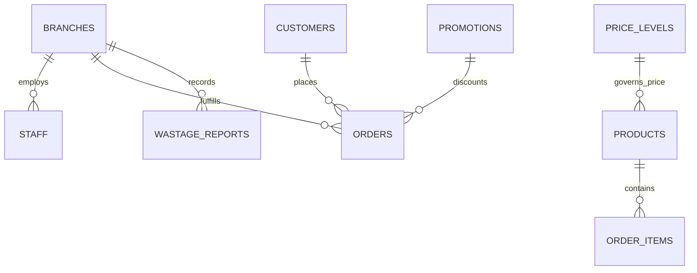
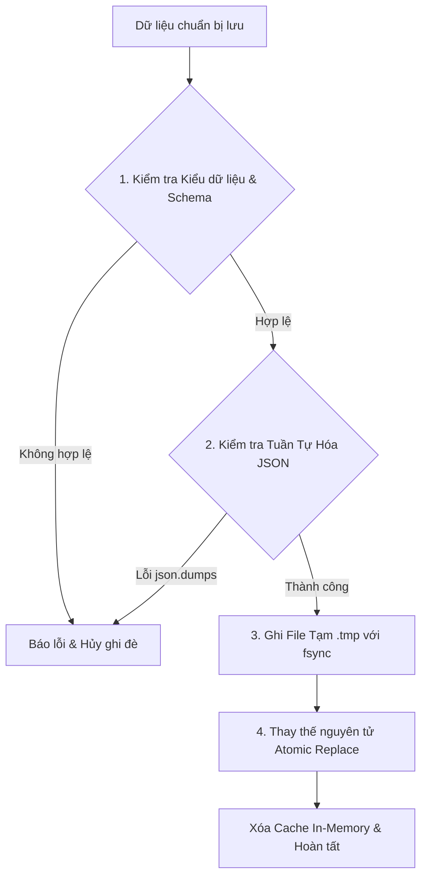

# Thiết Kế Cấu Trúc Dữ Liệu Lưu Trữ JSON (JSON Data Schema & Storage Architecture)
## Dự Án: Nở Hoa Thả Bình (`telua_flower`)

---

## 1. Tổng Quan Kiến Trúc Lưu Trữ JSON & Cơ Chế Nhận Diện Thư Mục Cấu Hình

### 📁 Cơ chế Tự Động Nhận Diện Thư Mục Cấu Hình (`_detect_config_dir`)
Để đảm bảo ứng dụng chạy mượt mà trên mọi môi trường (Windows Workspace, Linux Server, Container Docker `/app`), module [flower_config.py](file:///d:/wmshare/telua_flower/src/flower_config.py) áp dụng thuật toán nhận diện và cô lập dữ liệu theo thứ tự ưu tiên:

1. **Biến môi trường (`FLOWER_CONFIG_DIR`)**: Nếu biến môi trường được thiết lập, ứng dụng sẽ ưu tiên sử dụng đường dẫn này và tự động tạo thư mục nếu chưa tồn tại.
2. **Tìm kiếm thư mục `config/anne` từ Workspace Root**: Tự động duyệt ngược từ vị trí module `flower_config.py` lên các thư mục cha để tìm thư mục `config`. Khi tìm thấy, ứng dụng tự động gắn sub-folder `anne` (`<root>/config/anne`) để cô lập dữ liệu theo nhãn thương hiệu riêng biệt.
3. **Môi trường Docker Linux (`/app/config/anne`)**: Trong môi trường container Linux không phải Windows (`os.name != 'nt'`), tự động ánh xạ vào `/app/config/anne`.
4. **Cơ chế Fallback cục bộ**: Nếu không khớp các điều kiện trên, ứng dụng fallback về thư mục `config` ngay cạnh thư mục controller/source (`<src_parent>/config`).

### 📂 Cấu Trúc Phân Cấp Thư Mục Dữ Liệu (`FLOWER_CONFIG_DIR`)
```text
config/anne/
├── branches.json              # Danh sách showroom, chi nhánh & tọa độ
├── staff_users.json          # Tài khoản nhân sự nội bộ (admin, manager, florist, sales)
├── customers.json            # Hồ sơ khách hàng & tích điểm loyalty
├── products.json             # Danh mục sản phẩm tóm tắt (Zero-Base64)
├── categories.json           # Danh mục phân loại hoa
├── price_levels.json         # Phân tầng mức giá & Price Guardrails
├── promotions.json           # Mã giảm giá Voucher & chiến dịch khuyến mãi
├── paymentConfig.json        # Cấu hình bật/tắt các cổng thanh toán (online VietQR / tiền mặt COD)
├── addons.json               # Danh mục sản phẩm bán kèm (thiệp, gấu bông, nến thơm, topper)
├── addonConfig.json          # Cấu hình bật/tắt toàn cục khu vực bán kèm Add-ons
├── translations.json         # Từ điển đa ngôn ngữ 5 thứ tiếng (Dynamic i18n)
├── wastage_reports.json      # Báo cáo hủy hoa dập/héo hỏng
├── infoCompany.json          # Thông tin thương hiệu, hotline, địa chỉ showroom
├── cache_version.json        # Timestamp đồng bộ cache giữa các workers
├── images/                   # Kho ảnh tĩnh vật lý (.webp / .jpg) - Docker: /app/config/anne/images
├── products/                 # File JSON chi tiết của từng sản phẩm riêng lẻ ({id}.json)
│   └── images/               # Kho ảnh phụ sản phẩm đồng bộ - Docker: /app/config/anne/products/images
├── orders/                   # Sổ đơn hàng Kanban: Chi Nhánh -> Tháng -> Trạng thái -> {order_id}.json
│   ├── branch_q10/           # Showroom Quận 10
│   │   ├── 2026_08/          # Thư mục tháng
│   │   │   ├── pending/      # Chờ xác nhận ({order_id}.json)
│   │   │   ├── arranging/    # Đang cắm hoa
│   │   │   ├── shipping/     # Đang giao
│   │   │   └── delivered/    # Giao thành công
│   │   └── 2026_09/
│   ├── branch_q1/            # Showroom Quận 1
│   │   └── 2026_09/
│   │       └── pending/      # ord_1788368978_739ed2.json
│   ├── branch_thao_dien/     # Showroom Thảo Điền
│   └── admin/                # Đơn chờ điều phối / Ngoại tỉnh / Chưa xác định chi nhánh
└── users/                    # Dữ liệu khách hàng/nhân sự mở rộng ({user_id}/orders.json)

```



---

## 2. Chi Tiết Các Tệp JSON & Schema Chuẩn

### 🏬 1. `config/branches.json` (hoặc `config/anne/branches.json`) - Danh Sách Showroom & Chi Nhánh
```json
[
  {
    "id": "branch_q10",
    "code": "CN_Q10",
    "name": "Nở Hoa Thả Bình - Showroom Quận 10 (Flagship)",
    "address": "183/37 Đường 3 Tháng 2, Phường 11, Quận 10, TP. Hồ Chí Minh",
    "lat": 10.7725,
    "lng": 106.6698,
    "phone": "0976.491.322",
    "openHours": "07:00 - 21:00",
    "deliveryRadiusKm": 10,
    "managerId": "staff_001",
    "amenities": "Đậu xe ô tô/xe máy miễn phí, cắm hoa tại chỗ",
    "isActive": true,
    "createdAt": "2026-08-21T00:00:00Z"
  }
]
```

---

### 👔 2. `config/staff_users.json` - Tài Khoản Nhân Sự Nội Bộ Công Ty
Lưu trữ thông tin nhân viên và cấp quản trị (`super_admin`, `branch_manager`, `florist`, `sales_consultant`):
```json
[
  {
    "id": "staff_admin",
    "phone": "0900000000",
    "email": "admin@nohoathabinh.vn",
    "fullName": "Tổng Quản Trị Hệ Thống",
    "passwordHash": "pbkdf2:sha256:260000$...",
    "role": "super_admin",
    "branchId": null,
    "isActive": true,
    "createdAt": "2026-08-21T00:00:00Z"
  },
  {
    "id": "staff_001",
    "phone": "0909123456",
    "email": "mai.tran@nohoathabinh.vn",
    "fullName": "Trần Thị Mai",
    "passwordHash": "pbkdf2:sha256:260000$...",
    "role": "branch_manager",
    "branchId": "branch_q10",
    "isActive": true,
    "createdAt": "2026-08-21T00:00:00Z"
  }
]
```

---

### 👑 2b. `config/customers.json` - Danh Sách Khách Hàng & Dữ Liệu CRM
Lưu trữ tài khoản khách hàng đăng ký mua hoa, tích điểm và hạng thành viên:
```json
[
  {
    "id": "cust_001",
    "phone": "0987654321",
    "email": "nva@gmail.com",
    "fullName": "Nguyễn Văn A",
    "passwordHash": "pbkdf2:sha256:260000$...",
    "role": "customer",
    "tier": "gold",
    "loyaltyPoints": 350,
    "totalSpent": 4500000,
    "orderCount": 5,
    "savedAddresses": [
      "123 Nguyễn Huệ, Phường Bến Nghé, Quận 1, TP.HCM"
    ],
    "isActive": true,
    "createdAt": "2026-08-21T00:00:00Z"
  }
]
```

---

### 👤 2b. `config/users/{user_identifier}/` - Thư Mục Lưu Trữ Đơn Hàng Cá Nhân Của Từng Khách Hàng (User Order Repository)
Mỗi khách hàng sở hữu một thư mục riêng biệt được tự động đồng bộ thời gian thực:
- `config/users/{phone}/orders.json`: Lưu toàn bộ danh sách đơn hàng đã mua của khách này (nạp cực nhanh khi khách đăng nhập kiểm tra đơn hàng).
- `config/users/{phone}/profile.json`: Hồ sơ tóm tắt, tổng số đơn và lần mua gần nhất.

#### File `config/users/0987654321/profile.json`:
```json
{
  "id": "0987654321",
  "name": "Nguyễn Văn A",
  "phone": "0987654321",
  "email": "nva@gmail.com",
  "lastOrderAt": "2026-08-22T07:15:00Z",
  "totalOrders": 31
}
```

#### File `config/users/0987654321/orders.json`:
```json
[
  {
    "id": "ord_20260825_001",
    "orderCode": "NHTB_20260825_001",
    "createdAt": "2026-08-22T07:15:00Z",
    "assignedBranchId": "branch_q10",
    "status": "completed",
    "items": [
      {
        "productId": "bo_hoa_01",
        "productName": "Mây Trắng Bồng Bềnh",
        "quantity": 1,
        "price": 420000
      }
    ],
    "financials": {
      "subtotal": 420000,
      "shippingFee": 0,
      "totalAmount": 420000
    },
    "payment": {
      "method": "vietqr",
      "status": "paid"
    }
  }
]
```

> **⚠️ Quan trọng — 2 trạng thái độc lập:** Trong schema trên, `status` (cấp đơn hàng) và `payment.status` là **2 khái niệm khác nhau**:
> - `status` = **trạng thái đơn hàng** (vòng đời xử lý & giao nhận): `pending → confirmed → arranging → shipping → delivered` (hoặc `ready_for_pickup → completed` cho pickup; kèm `cancelled`, `returned`).
> - `payment.status` = **trạng thái thanh toán** (tình trạng thu tiền): `unpaid → paid` (+ `refunded`, `failed`).
>
> Hai trạng thái này **tiến hóa độc lập**. Ví dụ: đơn COD có thể `status = delivered` nhưng `payment.status = unpaid` (chờ shipper thu tiền); đơn VietQR trả trước có thể `payment.status = paid` nhưng `status = arranging` (đang cắm hoa).

---

### 🗂️ 3. `config/categories.json` - Danh Mục Mẫu Hoa Động, Timestamps & Xóa Mềm (Soft Delete)
Lưu trữ danh sách các danh mục hoa tươi, ngày tạo (`createdAt`), ngày sửa (`updatedAt`), icon, thứ tự sắp xếp và trạng thái (`status: "active" | "inactive" | "deleted"`):
```json
[
  {
    "id": "bo_hoa",
    "name": "Bó Hoa Tươi",
    "slug": "bo-hoa",
    "image": "https://images.unsplash.com/photo-1591886960571-74d43a9d4166?w=200",
    "icon": "fa-solid fa-spa",
    "order": 1,
    "status": "active",
    "isActive": true,
    "isDeleted": false,
    "description": "Các mẫu bó hoa tươi thiết kế cao cấp cho sinh nhật, tình yêu, tốt nghiệp",
    "createdAt": "2026-08-21T00:00:00Z",
    "updatedAt": "2026-08-23T20:00:00Z"
  },
  {
    "id": "hoa_cuoi",
    "name": "Hoa Cưới & Cầm Tay",
    "slug": "hoa-cuoi",
    "image": "https://images.unsplash.com/photo-1519741497674-611481863552?w=200",
    "icon": "fa-solid fa-heart",
    "order": 6,
    "status": "inactive",
    "isActive": false,
    "isDeleted": false,
    "description": "Hoa cưới cầm tay cô dâu, hoa cài áo và trang trí lễ cưới",
    "createdAt": "2026-08-21T00:00:00Z",
    "updatedAt": "2026-08-23T20:00:00Z"
  },
  {
    "id": "cat_old",
    "name": "Danh Mục Cũ",
    "slug": "danh-muc-cu",
    "status": "deleted",
    "isActive": false,
    "isDeleted": true,
    "deletedAt": "2026-08-23T20:10:00Z",
    "createdAt": "2026-08-21T00:00:00Z",
    "updatedAt": "2026-08-23T20:10:00Z"
  }
]
```

---

### 📊 4. `config/price_levels.json` - 4 Phân Tầng Mức Giá & Hàng Rào Giá An Toàn
```json
[
  {
    "id": "price_lvl_01",
    "code": "LV_01",
    "name": "Phổ Thông (Standard)",
    "minPrice": 300000,
    "maxPrice": 550000,
    "defaultPrice": 420000
  },
  {
    "id": "price_lvl_02",
    "code": "LV_02",
    "name": "Cao Cấp (Premium)",
    "minPrice": 600000,
    "maxPrice": 950000,
    "defaultPrice": 850000
  },
  {
    "id": "price_lvl_03",
    "code": "LV_03",
    "name": "Sang Trọng (Luxury)",
    "minPrice": 1000000,
    "maxPrice": 2500000,
    "defaultPrice": 1800000
  },
  {
    "id": "price_lvl_04",
    "code": "LV_04",
    "name": "Độc Bản VIP (Exclusive)",
    "minPrice": 2600000,
    "maxPrice": 15000000,
    "defaultPrice": 3500000
  }
]
```

---

### 🌸 5. `config/products.json` - Danh Mục Sản Phẩm Tóm Tắt (Summary Catalog - Siêu Nhẹ & Tốc Độ Cao)
Chứa các trường tóm tắt cần thiết nhất để hiển thị thẻ sản phẩm ngoài Grid và Bảng danh mục mà không làm nặng trang.
> [!IMPORTANT]
> **Quy chuẩn Zero-Base64:** Trường `"image"` chỉ chứa chuỗi URL tĩnh (Đường dẫn tiền tố `/flower/images/<file>.webp` hoặc CDN). Tuyệt đối không lưu chuỗi `data:image/...;base64,...` vào JSON để đảm bảo dung lượng file cho 1.000 sản phẩm chỉ từ **200 KB – 350 KB**.

```json
[
  {
    "id": "bo_hoa_1788048775",
    "name": "Bó Hoa Hồng & Hoa Ly Trắng Thanh Lịch",
    "nameTextId": "prod_name_bo_hoa_1788048775",
    "category": "bo_hoa",
    "priceLevelId": "price_lvl_02",
    "originalPrice": "920,000₫",
    "salePrice": "850,000₫",
    "priceNumber": 850000,
    "badge": "Mẫu Mới",
    "image": "/flower/images/bo_hoa_1788048775.webp",
    "i18n": {
      "en": { "name": "Elegant White Rose & Lily Bouquet" },
      "ja": { "name": "エレガント ホワイトローズ＆リリーブーケ" },
      "ko": { "name": "우아한 화이트 장미 & 백합 꽃다발" },
      "zh": { "name": "优雅白玫瑰与百合艺术花束" }
    },
    "stockByBranch": {
      "branch_q10": 10,
      "branch_q1": 5,
      "branch_thao_dien": 5
    },
    "dailyQuota": 20,
    "isActive": true,
    "updatedAt": "2026-08-30T01:30:00Z"
  }
]
```

---

### 🔍 5b. `config/products/{product_id}.json` - Chi Tiết Đầy Đủ Từng Sản Phẩm (On-Demand Lazy Load)
File chi tiết riêng biệt được nạp qua API `GET /api/flower/v1/products/<id>` khi người dùng nhấp vào xem chi tiết hoặc khi Admin mở form sửa:
> [!IMPORTANT]
> **Quy chuẩn Zero-Base64:** Các trường `"image"` và mảng `"gallery": [...]` chỉ lưu URL tĩnh đến file `.webp`/`.jpg` (vd: `/flower/images/<file>.webp`).

```json
{
  "id": "bo_hoa_1788048775",
  "name": "Bó Hoa Hồng & Hoa Ly Trắng Thanh Lịch",
  "nameTextId": "prod_name_bo_hoa_1788048775",
  "category": "bo_hoa",
  "priceLevelId": "price_lvl_02",
  "originalPrice": "920,000₫",
  "salePrice": "850,000₫",
  "priceNumber": 850000,
  "badge": "Mẫu Mới",
  "image": "/flower/images/bo_hoa_1788048775.webp",
  "gallery": [
    "/flower/images/bo_hoa_1788048775.webp"
  ],

  "description": "Bó hoa tone trắng dịu êm kết hợp hoa sao xanh thanh lịch.",
  "flowerComposition": "Hồng trắng Ohara (10 cành), Cúc Tana, Hoa Sao Xanh, Lá Bạc Dollar",
  "dimension": "Cao 50cm x Rộng 40cm",
  "careTips": "Cắt gốc 45 độ, phun sương nhẹ cánh hoa mỗi sáng.",
  "i18n": {
    "en": {
      "name": "Floating White Clouds Bouquet",
      "flowerComposition": "White Ohara Roses (10 stems), Tweedia, Tana Daisies, Silver Dollar Eucalyptus",
      "description": "A pure white bouquet accented with sky blue tweedia, conveying serene elegance and gentle care.",
      "careTips": "Trim stems at 45 degrees, lightly mist petals every morning."
    }
  },
  "stockByBranch": {
    "branch_q10": 12,
    "branch_q1": 6,
    "branch_thao_dien": 4
  },
  "dailyQuota": 20,
  "isActive": true,
  "updatedAt": "2026-08-22T07:00:00Z"
}
```

---

### 🛒 5. `config/orders.json` - Đơn Hàng & Thông Tin Quà Tặng
```json
[
  {
    "id": "ord_20260825_001",
    "orderCode": "NHTB_20260825_001",
    "createdAt": "2026-08-22T07:15:00Z",
    "assignedBranchId": "branch_q10",
    "status": "arranging",
    "sender": {
      "name": "Nguyễn Văn A",
      "phone": "0987654321",
      "email": "nva@gmail.com",
      "isAnonymous": false
    },
    "recipient": {
      "name": "Trần Thị Mai",
      "phone": "0911223344",
      "address": "Tòa nhà Bitexco, Tầng 12 - Số 2 Hải Triều, Q.1, TP.HCM",
      "deliveryNotes": "Gửi Lễ tân nếu người nhận đang họp. Gọi trước 15 phút."
    },
    "delivery": {
      "date": "2026-08-25",
      "timeSlot": "09:00 - 11:00",
      "isExpress2H": false
    },
    "customization": {
      "cardMessage": "Chúc mừng sinh nhật em gái yêu quý!",
      "ribbonBanner": "Công ty ABC Kính Chúc"
    },
    "items": [
      {
        "productId": "bo_hoa_01",
        "productName": "Mây Trắng Bồng Bềnh",
        "quantity": 1,
        "price": 420000
      }
    ],
    "pricing": {
      "subtotal": 420000,
      "discountCode": "ANNE10",
      "discountAmount": 42000,
      "shippingFee": 0,
      "finalTotal": 378000
    },
    "payment": {
      "method": "vietqr",
      "status": "paid",
      "paidAt": "2026-08-22T07:16:05Z",
      "transactionId": "TXN_987654321"
    },
    "proof": {
      "realPhotoUrl": "https://storage.nohoathabinh.vn/orders/ord_001_photo.jpg",
      "signedPhotoUrl": null
    },
    "vatInvoice": {
      "isRequested": true,
      "taxCode": "0312345678",
      "companyName": "CÔNG TY CỔ PHẦN CÔNG NGHỆ TELUA",
      "companyAddress": "183/37 Đường 3 Tháng 2, P.11, Q.10, TP.HCM",
      "recipientEmail": "ketoan@telua.vn"
    }
  }
]
```

> **⚠️ 2 trạng thái độc lập trong schema đơn hàng:**
> - `status` (cấp đơn hàng) = **trạng thái đơn hàng** (vòng đời xử lý & giao nhận): `pending → confirmed → arranging → shipping → delivered` (pickup: `ready_for_pickup → completed`; kèm `cancelled`, `returned`).
> - `payment.status` = **trạng thái thanh toán** (tình trạng thu tiền): `unpaid → paid` (+ `refunded`, `failed`).
>
> Hai trạng thái này **tiến hóa độc lập**. Ví dụ: đơn COD có thể `status = delivered` nhưng `payment.status = unpaid` (chờ shipper thu tiền); đơn VietQR trả trước có thể `payment.status = paid` nhưng `status = arranging` (đang cắm hoa).

---

### 🏷️ 6. `config/promotions.json` - Danh Sách Voucher Hoạt Động & Tạm Dừng
Chỉ lưu các voucher đang được áp dụng hoặc tạm dừng giúp hệ thống nạp nhanh khi checkout:
```json
[
  {
    "id": "promo_2010",
    "title": "Mừng Ngày Phụ Nữ Việt Nam 20/10",
    "code": "PHUNU15",
    "discountType": "percentage",
    "discountValue": 15,
    "maxDiscountAmount": 150000,
    "minOrderAmount": 400000,
    "startDate": "2026-10-01T00:00:00Z",
    "endDate": "2026-10-31T23:59:59Z",
    "usageLimit": 200,
    "usedCount": 45,
    "topBarMessage": "🔥 ƯU ĐÃI 20/10: Nhập mã PHUNU15 giảm 15% + Tặng thiệp hoa thiết kế!",
    "heroBannerUrl": "https://images.unsplash.com/photo-1561181286-d3fee7d55364?w=1200",
    "status": "active",
    "isActive": true,
    "isDeleted": false,
    "createdAt": "2026-08-20T00:00:00Z",
    "updatedAt": "2026-08-23T20:25:00Z"
  }
]
```

---

### 🗄️ 6b. `config/promotions_history.json` - Lịch Sử Lưu Trữ Các Voucher Đã Xóa (Archival History)
Lưu trữ toàn bộ voucher đã xóa mềm có kèm dấu thời gian `deletedAt`, hỗ trợ phục hồi bất cứ lúc nào:
```json
[
  {
    "id": "promo_old_voucher",
    "title": "Voucher Mùa Hè Cũ",
    "code": "SUMMER2025",
    "discountType": "percentage",
    "discountValue": 10,
    "status": "deleted",
    "isActive": false,
    "isDeleted": true,
    "deletedAt": "2026-08-23T20:25:00Z",
    "createdAt": "2025-06-01T00:00:00Z",
    "updatedAt": "2026-08-23T20:25:00Z"
  }
]
```

---

### 🥀 7. `config/wastage_reports.json` - Báo Cáo Hao Hụt & Hủy Hoa Cuối Ngày
```json
[
  {
    "id": "wastage_20260822_q10",
    "branchId": "branch_q10",
    "date": "2026-08-22",
    "reportedBy": "staff_001",
    "items": [
      {
        "flowerType": "Hồng đỏ Red Naomi",
        "damagedStems": 5,
        "reason": "Dập cánh khi vận chuyển từ Đà Lạt về",
        "unitCost": 15000,
        "totalLoss": 75000
      },
      {
        "flowerType": "Tulip trắng",
        "damagedStems": 3,
        "reason": "Nở quá độ",
        "unitCost": 25000,
        "totalLoss": 75000
      }
    ],
    "totalLossAmount": 150000,
    "createdAt": "2026-08-22T21:00:00Z"
  }
]
```

---

### 👑 8. `config/customers_crm.json` - Cơ Sở Dữ Liệu Khách Hàng CRM & Điểm Thưởng
```json
[
  {
    "id": "cust_001",
    "phone": "0987654321",
    "fullName": "Nguyễn Văn A",
    "email": "nva@gmail.com",
    "birthday": "1995-10-20",
    "tier": "gold",
    "loyaltyPoints": 450,
    "totalSpent": 4500000,
    "orderCount": 5,
    "flowerPreferences": "Thích hoa hồng Ohara pastel và Tulip, không thích hoa màu vàng",
    "savedAddresses": [
      {
        "label": "Công ty",
        "recipientName": "Trần Thị Mai",
        "phone": "0911223344",
        "address": "Tòa Bitexco, Q.1"
      }
    ],
    "createdAt": "2026-01-15T00:00:00Z"
  }
]
```

---

### 💐 9. `config/anne/orders/{branch_id}/{YYYY_MM}/{status}/{order_id}.json` - Sổ Đơn Hàng Phân Cấp Theo Trạng Thái (Kanban Folder Partitioning)

Kiến trúc phân cấp 4 tầng tối ưu hóa quy trình nghiệp vụ hoa tươi:
- **Tầng 1 (Chi nhánh)**: Mỗi showroom (`branch_q10`, `branch_q1`, `branch_thao_dien`, `admin`) sở hữu thư mục con riêng biệt.
- **Tầng 2 (Tháng)**: Trong mỗi chi nhánh, đơn hàng được gom nhóm theo thư mục tháng `{YYYY_MM}` (ví dụ: `2026_08`, `2026_09`).
- **Tầng 3 (Trạng thái - Kanban Status)**: Bên trong tháng, đơn hàng được chia vào các thư mục trạng thái con:
  - `pending/`: Chờ xác nhận (Đơn mới tạo trực tuyến)
  - `confirmed/`: Đã duyệt / sẵn sàng nguyên liệu
  - `arranging/` (hoặc `in_progress/`): Đang cắm hoa (Thợ hoa thao tác)
  - `photo_sent/`: Đã chụp & gửi ảnh thành phẩm cho khách duyệt
  - `ready_for_pickup/`: Sẵn sàng nhận tại showroom (đơn nhận tại quầy)
  - `shipping/`: Đang vận chuyển (Shipper giao hoa)
  - `delivered/`: Giao hoa thành công
  - `completed/`: Hoàn tất đơn & đối soát
  - `cancelled/`: Đã hủy đơn
  - `returned/`: Đổi trả / khiếu nại hoa dập hỏng
- **Tầng 4 (Từng đơn hàng riêng lẻ)**: Mỗi đơn hàng là một tệp JSON độc lập `{order_id}.json`.
- **Cơ chế di chuyển (Kanban Transition)**: Khi trạng thái đơn hàng thay đổi (ví dụ từ `pending` sang `arranging`, `photo_sent`, `delivered`), hệ thống thực hiện `os.replace()` di chuyển nguyên tử file từ thư mục status cũ sang thư mục status mới trong $< 0.1$ms.

**Lợi ích đột phá**:
1. **Lọc đơn tức thì (Zero-Scan Filter)**: Thợ cắm hoa chỉ cần nạp thư mục `arranging/`, shipper chỉ cần nạp `shipping/`, không phải duyệt qua hàng nghìn đơn đã xong.
2. **Zero Concurrency Lock**: Các nhân viên cập nhật các đơn khác nhau hoàn toàn độc lập.
3. **Thao tác Kanban nguyên tử**: Chuyển trạng thái đơn hàng trên đĩa tương đương kéo thẻ trên giao diện.

```json
{
  "id": "ord_1725324567_a8f9c1",
  "orderCode": "NHTB-260903-A8K2",
  "createdAt": "2026-09-03T10:15:30Z",
  "orderDate": "2026-09-03T10:15:30Z",
  "updatedAt": "2026-09-03T10:15:30Z",
  "branchId": "branch_q10",
    "customerId": "cust_001",
    "assignedTo": "staff_001",
    "assignedBy": "system",
    "status": "pending",
    "cardMessage": "Chúc em tuổi mới luôn rực rỡ như hoa!",
    "ribbonBanner": "Mừng Khai Trương Hồng Phát",
    "sender": {
      "name": "Người gửi bí mật (Ẩn danh)",
      "realName": "Nguyễn Văn An",
      "phone": "0901234567",
      "email": "an.nguyen@example.com",
      "isAnonymous": true
    },
    "recipient": {
      "name": "Trần Thị Mai",
      "phone": "0987654321",
      "address": "183/37 Đường 3 Tháng 2, Phường 11, Quận 10, TP. Hồ Chí Minh",
      "deliveryNotes": "Giao trước 11h trưa, gửi lễ tân",
      "lat": 10.77123,
      "lng": 106.67345
    },
    "delivery": {
      "deliveryDate": "2026-09-04",
      "timeSlot": "10:00 - 12:00 (Trưa)",
      "isExpress2H": false,
      "fulfillmentType": "delivery"
    },
    "customization": {
      "cardMessage": "Chúc em tuổi mới luôn rực rỡ như hoa!",
      "ribbonBanner": "Mừng Khai Trương Hồng Phát"
    },
    "items": [
      {
        "productId": "prod_pink_bliss_01",
        "productName": "Bó Hoa Hồng Juliet Giấc Mơ Ngọt Ngào",
        "price": 650000,
        "quantity": 1,
        "itemTotal": 650000,
        "image": "/images/products/bo_hoa_hong_juliet.webp"
      }
    ],
    "financials": {
      "subtotal": 650000,
      "shippingFee": 0,
      "discountAmount": 50000,
      "totalAmount": 600000,
      "appliedVoucher": {
        "code": "FLOWERNEW",
        "title": "Ưu đãi khách hàng mới giảm 50K",
        "discountAmount": 50000
      }
    },
    "totalAmount": 600000,
    "payment": {
      "method": "vietqr",
      "status": "unpaid",
      "paidAt": null,
      "transactionId": null,
      "bankInfo": {
        "bankId": "MB",
        "accountNo": "090123456789",
        "accountName": "NO HOA THA BINH"
      },
      "transferContent": "NHTB 260903 A8K2",
      "vietqr": {
        "quickLink": "https://img.vietqr.io/image/MB-090123456789-compact2.png?amount=600000&addInfo=NHTB%20260903%20A8K2&accountName=NO%20HOA%20THA%20BINH"
      }
    },
    "history": [
      {
        "status": "pending",
        "paymentStatus": "unpaid",
        "updatedAt": "2026-09-03T10:15:30Z",
        "note": "Khách hàng tạo đơn hàng trực tuyến",
        "updatedBy": "0901234567"
      }
    ]
  }
]
```

---

### 📂 10. `config/anne/users/{user_id}/orders.json` - Sổ Chỉ Mục Đơn Hàng Cá Nhân (Lightweight Reference Pointer Index)

Nhằm đảm bảo **Single Source of Truth (SSOT)** và ngăn ngừa triệt để sự cố lệch trạng thái khi chi nhánh cập nhật tiến độ cắm hoa/giao hàng, thư mục của từng khách hàng **không sao chép toàn bộ object đơn hàng** mà chỉ lưu các thẻ tham chiếu con trỏ (Reference Pointer) siêu nhẹ (~100 bytes/đơn):

```json
[
  {
    "orderId": "ord_1788368990_b33bc7",
    "orderCode": "NHTB-260903-UJAR",
    "branchId": "branch_q1",
    "yearMonth": "2026_09",
    "createdAt": "2026-09-03T00:09:50Z"
  }
]
```

- **Khi ghi (`sync_order_to_user_folder`)**: Chỉ cập nhật hoặc chèn thẻ tham chiếu gọn nhẹ vào đầu danh sách (Index 0).
- **Khi đọc (`get_user_orders`)**: Hệ thống tự động giải mã (Resolve) thời gian thực từ `orderId`, `branchId`, `yearMonth` sang trực tiếp bản ghi gốc trong `config/anne/orders/{branchId}/orders_{yearMonth}.json`.
- **Lợi ích**: Khách hàng luôn xem được trạng thái mới nhất 100% của chi nhánh, không trùng lặp dung lượng, file user chỉ vài chục bytes.

---

## 11. Quy Trình Kiểm Tra Định Dạng JSON Trước Khi Lưu (Pre-Write Validation & Integrity Guard)

Nhằm ngăn ngừa triệt để lỗi hỏng file (Data Corruption), cú pháp không hợp lệ (Syntax Error), hoặc các kiểu dữ liệu không thể tuần tự hóa (Non-Serializable Objects), toàn bộ thao tác ghi file qua hàm `write_json()` và `save_product_detail()` phải trải qua 4 bước kiểm tra nghiêm ngặt:



### 11.1. Các Quy Tắc Xác Thực Bắt Buộc:
1. **Kiểm Tra Khả Năng Tuần Tự Hóa (JSON Serializability Pre-Check)**:
   - Trước khi mở file, dữ liệu được kiểm tra qua `json.dumps(data, ensure_ascii=False)`.
   - Ngăn chặn triệt để các đối tượng `Set`, `Function`, `datetime` chưa format chuỗi hoặc vòng lặp tham chiếu tuần hoàn (Circular References).
2. **Kiểm Tra Mã Định Danh Hợp Lệ (Sanitized Identifier)**:
   - `product_id` phải là chuỗi an toàn, không chứa ký tự duyệt thư mục trái phép (`..`, `/`, `\`) nhằm ngăn chặn lỗ hổng Path Traversal.
3. **Kiểm Tra Cấu Trúc Bắt Buộc Đối Với Sản Phẩm Chi Tiết (`config/anne/products/*.json`)**:
   - `id`, `name`, `category`, `priceNumber` phải tồn tại và đúng kiểu dữ liệu.
   - `stockByBranch` phải là `dict` chứa số nguyên không âm (`>= 0`).
4. **Cơ Chế Ghi Nguyên Tử (Atomic Write with Fsync)**:
   - Ghi xuống tệp tạm `<filename>.tmp`, gọi `f.flush()` và `os.fsync()`, sau đó thực hiện `os.replace()` để đảm bảo file chính không bao giờ bị cắt cụt (truncated) nếu xảy ra sự cố sập nguồn hoặc ngắt kết nối đột ngột.

---

## 12. `config/anne/paymentConfig.json` - Cấu Hình Phương Thức Thanh Toán (Payment Gateways)

Quản lý trạng thái bật/tắt toàn cục các phương thức thanh toán trực tuyến (VietQR) và ngoại tuyến (Tiền mặt / COD):

```json
{
  "methods": {
    "online": {
      "code": "vietqr",
      "label": "Thanh toán Online (VietQR)",
      "description": "Chuyển khoản tự động qua mã QR chuẩn Napas 247 EMVCo. Hệ thống/backend tự động xác nhận khi nhận được tiền; nhân viên không cần thao tác thu tiền.",
      "enabled": true
    },
    "cash": {
      "code": "cash",
      "label": "Tiền mặt (COD / Tại quầy)",
      "description": "Thanh toán tiền mặt khi nhận hàng (COD) hoặc trực tiếp tại cửa hàng (pickup). Nhân viên xác nhận trạng thái đã thanh toán sau khi thu tiền.",
      "enabled": true
    }
  },
  "updatedAt": "2026-09-02T10:16:13Z"
}
```

---

## 13. `config/anne/addons.json` & `addonConfig.json` - Sản Phẩm Bán Kèm & Cấu Hình Khu Vực Add-ons

Quản lý danh sách các món quà tặng bán kèm (thiệp, thú bông, nến thơm) và công tắc tổng hiển thị:

### A. `config/anne/addonConfig.json` (Công tắc tổng hiển thị trên Storefront):
```json
{
  "showAddons": true,
  "label": "Sản Phẩm Kèm Theo (Add-on)",
  "description": "Hiển thị khu vực 'Chọn Sản Phẩm Kèm Theo Để Thêm Phần Đặc Biệt' trên trang chi tiết sản phẩm",
  "updatedAt": "2026-09-02T00:00:00Z"
}
```

### B. `config/anne/addons.json` (Danh mục sản phẩm bán kèm):
```json
[
  {
    "id": "addon_card_01",
    "name": "Thiệp Thiết Kế Cao Cấp",
    "nameVi": "Thiệp Thiết Kế Cao Cấp",
    "price": 25000,
    "image": "/images/addons/thiep_cao_cap.webp",
    "description": "Thiệp ép kim vàng dập nổi hoa văn trang nhã kèm phong bì",
    "isActive": true,
    "order": 1
  }
]
```

