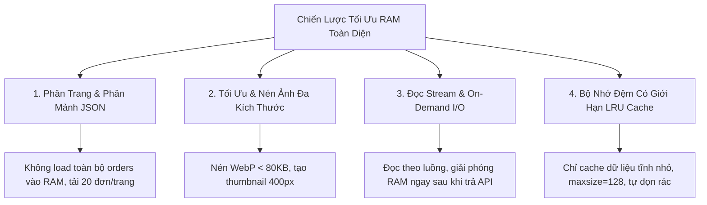

# Thiết Kế Tối Ưu Hóa Bộ Nhớ RAM & Xử Lý Dữ Liệu Lớn (Memory Optimization & Large Data Handling)
## Dự Án: Nở Hoa Thả Bình (`telua_flower`)

---

## 1. Mục Tiêu & Vấn Đề (Problem & Objectives)

Trong môi trường triển khai thực tế (Docker container có giới hạn RAM từ 512MB - 1GB hoặc trên máy chủ VPS):
- **Nguy cơ tràn RAM (Out of Memory - OOM):** Đọc toàn bộ các file JSON lớn (hàng chục nghìn đơn hàng `orders.json` hoặc nhật ký thao tác) vào RAM trong mỗi request sẽ làm RAM phình to nhanh chóng.
- **Tải ảnh nặng làm nghẽn bộ nhớ:** Ảnh hoa chụp từ điện thoại (3MB - 8MB) nếu xử lý trực tiếp trong RAM sẽ làm treo Server và đơ trình duyệt của khách trên di động.
- **Mục tiêu:** Giữ mức tiêu thụ RAM của ứng dụng luôn ở mức **siêu nhẹ (< 150MB RAM)** bất kể lượng truy cập và quy mô dữ liệu.

---

## 2. Bốn Chiến Lược Tối Ưu Hóa RAM Cốt Lõi



---

### 🗂️ 1. Phân Trang & Phân Mảnh Dữ Liệu (Pagination & Chunking)
- **Bắt buộc phân trang (Pagination):** Không bao giờ trả về danh sách toàn bộ dữ liệu. Mọi API danh sách (`/api/orders`, `/api/products`, `/api/admin/customers`) bắt buộc có tham số `page=1&limit=20`.
- **Phân mảnh file JSON theo thời gian (Monthly Chunking):**
  - Thay vì lưu tất cả đơn hàng vào 1 file `orders.json` duy nhất (sẽ phình to theo năm tháng), hệ thống phân mảnh theo tháng:
    - `config/orders/orders_2026_08.json`
    - `config/orders/orders_2026_09.json`
  - Server chỉ nạp đúng file của tháng đang được truy vấn, không bao giờ đọc dữ liệu của toàn bộ các năm vào RAM.

---

### 🖼️ 2. Quản Lý & Tối Ưu Hóa Hình Ảnh (Image Streaming & WebP Compression)
- **Tuyệt đối không lưu ảnh Base64 trong JSON hoặc giữ Buffer ảnh trong RAM:**
  - Ảnh chỉ lưu file tĩnh trên ổ đĩa (`/static/uploads/`) hoặc Cloud Storage (S3 / Cloudinary), cơ sở dữ liệu chỉ lưu đường link URL dạng chuỗi ngắn.
- **Quy trình nén tự động khi tải lên (Auto Compression Pipeline):**
  - Khi nhân viên upload ảnh hoa (5MB) từ điện thoại:
    1. Server dùng thư viện `Pillow` chuyển đổi sang định dạng `.webp` thế hệ mới.
    2. Resize tạo 2 phiên bản:
       - **Thumbnail Card:** Kích thước `400x400px` (Dung lượng chỉ **40KB - 60KB**).
       - **Detail HD:** Kích thước `800x800px` (Dung lượng **120KB - 180KB**).
    3. Giải phóng bộ nhớ đệm RAM ngay sau khi ghi file xuống đĩa.
- **Phía Client (Trình duyệt):**
  - Áp dụng thuộc tính `loading="lazy"` và `decoding="async"`. Trình duyệt chỉ tải ảnh khi người dùng cuộn đến vị trí đó, tránh tải 50 ảnh cùng lúc làm tràn RAM điện thoại.

---

### ⚡ 3. Đọc Ghi Theo Luồng & On-Demand I/O (File Streaming)
- Không giữ các biến mảng dữ liệu khổng lồ (Global Variables) trong RAM của Flask app.
- Khi cần tìm kiếm hoặc lọc dữ liệu: Sử dụng kỹ thuật đọc theo dòng / luồng (Streaming generator) hoặc tra cứu theo file chỉ mục (Index Lookup):
```python
# Ví dụ đọc theo luồng (Generator) không tốn RAM:
def stream_orders_by_branch(branch_id, page=1, limit=20):
    filepath = get_current_month_orders_file()
    with open(filepath, 'r', encoding='utf-8') as f:
        orders = json.load(f)
        # Lọc và phân trang trực tiếp
        filtered = [o for o in orders if o.get('assignedBranchId') == branch_id]
        start = (page - 1) * limit
        return filtered[start:start + limit]
```

---

### 🧠 4. Bộ Nhớ Đệm Có Giới Hạn (Bounded LRU Cache)
- Các tệp dữ liệu tĩnh nhỏ, ít thay đổi như `branches.json`, `price_levels.json`, `translations.json` (kích thước < 100KB) được cache trong RAM bằng `@lru_cache(maxsize=128)`.
- Khi có thao tác Thêm/Sửa/Xóa, hệ thống xóa cache (`cache_clear()`) để nạp lại dữ liệu mới nhất mà không gây rò rỉ bộ nhớ (Memory Leak).

---

## 3. Bảng Tiêu Chuẩn Giới Hạn Kích Thước (Resource Quota Limits)

| Thành Phần | Giới Hạn Tối Đa Cho Phép | Biện Pháp Kiểm Soát |
| :--- | :---: | :--- |
| **Dung lượng 1 request upload ảnh** | **$\le$ 8 MB** | Chặn ở Nginx / Flask `MAX_CONTENT_LENGTH = 8 * 1024 * 1024` |
| **Kích thước ảnh sau nén WebP** | **$\le$ 150 KB** | Tự động resize và nén chất lượng 80% bằng Pillow |
| **Số lượng bản ghi mỗi trang (Page Limit)**| **$\le$ 50 items/page** | Mặc định 20 items, tối đa 50 items |
| **Mức tiêu thụ RAM tổng thể của Container** | **< 150 MB RAM** | Bật Python Garbage Collection và không giữ global buffers |
