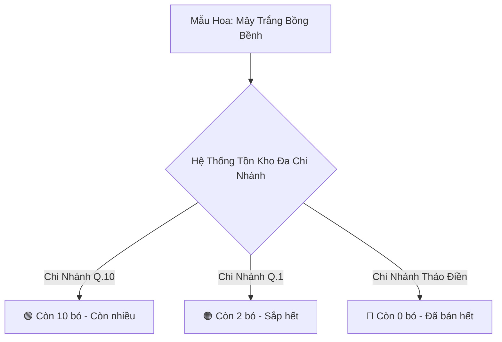

# Thiết Kế Kiểm Tra Tồn Kho Hoa Đa Chi Nhánh (Multi-Branch Real-Time Inventory Tracking)
## Dự Án: Nở Hoa Thả Bình (`telua_flower`)

---

## 1. Tổng Quan Giải Pháp (Overview)

Để biết **cửa hàng/chi nhánh nào còn nhiều hoa hay đã hết hàng**, hệ thống áp dụng cơ chế **Quản lý tồn kho theo thời gian thực phân bổ theo từng Chi nhánh (Branch-Level Real-time Stock Tracking)**:



---

## 2. Góc Nhìn Khách Hàng Trên Website (Customer View)

Khi khách hàng bấm vào xem chi tiết một mẫu hoa trên web:

### 1. Khung hiển thị tình trạng tại các Showroom:
Bên dưới nút mua hàng có mục **"Kiểm tra còn hàng tại Showroom"**:

- 🟢 **Showroom Q.10 (183/37 Đ. 3/2):** *Còn 10 bó (Sẵn sàng giao hỏa tốc 2H)*
- 🟠 **Showroom Q.1 (Nguyễn Trãi):** *Chỉ còn 2 bó (Đặt nhanh kẻo hết)*
- 🔴 **Showroom Thảo Điền (TP. Thủ Đức):** *Tạm hết hàng hôm nay (Có thể đặt cắm trước cho ngày mai)*

### 2. Bộ lọc trạng thái trực quan:
- **Còn nhiều (`stock >= 5`):** Đèn xanh lá 🟢
- **Sắp hết (`1 <= stock <= 3`):** Đèn cam 🟠 tạo hiệu ứng kích thích mua nhanh (Urgency)
- **Hết hàng (`stock == 0`):** Đèn đỏ 🔴 gợi ý khách chọn chi nhánh khác hoặc đặt trước

---

## 3. Góc Nhìn Quản Trị & Nhân Viên (Staff & Admin Dashboard)

Tại màn hình quản lý kho (`/portal/inventory`), Quản lý và Nhân viên xem được **Bảng Ma Trận Tồn Kho Toàn Chuỗi (Inventory Matrix)**:

### Bảng Ma Trận Tồn Kho Thời Gian Thực:

| Tên Mẫu Hoa | Giá Bán | CN Quận 10 | CN Quận 1 | CN Thảo Điền | Tổng Toàn Chuỗi | Trạng Thái Điều Phối |
| :--- | :---: | :---: | :---: | :---: | :---: | :---: |
| **Mây Trắng Bồng Bềnh** | 420.000₫ | <span style="color:green">**10 bó** 🟢</span> | <span style="color:orange">**2 bó** 🟠</span> | <span style="color:red">**0 bó** 🔴</span> | **12 bó** | Gợi ý chuyển 3 bó từ Q.10 $\rightarrow$ Thảo Điền |
| **Ohara Pink Viency** | 880.000₫ | <span style="color:green">**8 bó** 🟢</span> | <span style="color:green">**6 bó** 🟢</span> | <span style="color:green">**5 bó** 🟢</span> | **19 bó** | Đủ hàng toàn chuỗi |
| **Tulip Mix Lam Tinh** | 1.980.000₫ | <span style="color:orange">**1 bó** 🟠</span> | <span style="color:red">**0 bó** 🔴</span> | <span style="color:orange">**1 bó** 🟠</span> | **2 bó** | Cảnh báo: Sắp hết toàn chuỗi |
| **Kệ Khai Trương Phát Lộc**| 2.500.000₫ | <span style="color:green">**5 kệ** 🟢</span> | <span style="color:orange">**1 kệ** 🟠</span> | <span style="color:green">**4 kệ** 🟢</span> | **10 kệ** | Đủ hàng |

---

## 4. Cơ Chế Tự Động Điều Phối Đơn Hàng Thông Minh (Smart Order Routing)

Khi khách hàng đặt đơn hoa online:
1. **Thuật toán kiểm tra:**
   - Hệ thống quét địa chỉ giao của khách $\rightarrow$ Xác định chi nhánh gần nhất (VD: Chi nhánh Thảo Điền).
   - Kiểm tra tồn kho tại Thảo Điền:
     - Nếu **Còn hàng** $\rightarrow$ Gán đơn cho Thảo Điền cắm và giao trong 2H.
     - Nếu **Hết hàng** $\rightarrow$ Hệ thống tự động chuyển đơn sang chi nhánh gần thứ nhì còn hàng (VD: Chi nhánh Q.10) để cắm và giao đến khách, đảm bảo không bị lỡ đơn.

---

## 5. Thiết Kế API Endpoints Kiểm Tra Tồn Kho

| Method | Endpoint | Mô tả |
| :--- | :--- | :--- |
| `GET` | `/api/products/<product_id>/stock` | Khách xem tồn kho của 1 sản phẩm tại tất cả showroom |
| `GET` | `/api/admin/inventory/matrix` | Quản trị viên xem ma trận tồn kho toàn chuỗi theo thời gian thực |
| `POST` | `/api/admin/inventory/transfer` | Điều chuyển số lượng hoa từ Chi nhánh A sang Chi nhánh B |

#### Response mẫu `GET /api/products/bo_hoa_01/stock`:
```json
{
  "productId": "bo_hoa_01",
  "productName": "Mây Trắng Bồng Bềnh",
  "totalStock": 12,
  "branches": [
    {
      "branchId": "branch_q10",
      "branchName": "Nở Hoa Thả Bình - Showroom Q.10",
      "address": "183/37 Đường 3/2, P.11, Q.10",
      "stock": 10,
      "status": "in_stock",
      "label": "Còn 10 bó - Giao hỏa tốc 2H"
    },
    {
      "branchId": "branch_q1",
      "branchName": "Nở Hoa Thả Bình - Showroom Q.1",
      "address": "45 Nguyễn Trãi, P. Bến Thành, Q.1",
      "stock": 2,
      "status": "low_stock",
      "label": "Chỉ còn 2 bó"
    },
    {
      "branchId": "branch_thao_dien",
      "branchName": "Nở Hoa Thả Bình - Thảo Điền",
      "address": "12 Quốc Hương, Thảo Điền, TP. Thủ Đức",
      "stock": 0,
      "status": "out_of_stock",
      "label": "Tạm hết hàng hôm nay"
    }
  ]
}
```
