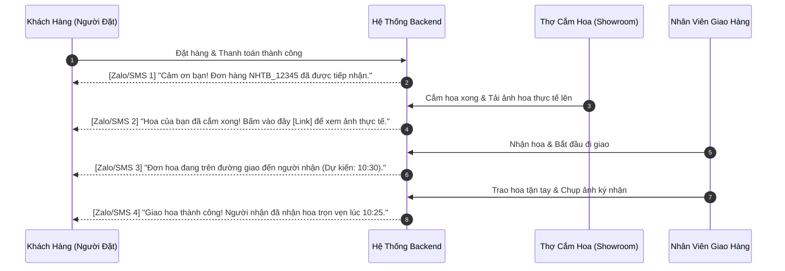

# Thiết Kế Phân Hệ Vận Hành Nâng Cao: Thông Báo Zalo ZNS, Hóa Đơn VAT & In Phiếu Giao (Operational Extensions)
## Dự Án: Nở Hoa Thả Bình (`telua_flower`)

---

## 1. Hệ Thống Thông Báo Tự Động Đa Kênh (Zalo ZNS, SMS & Email)

Để nâng cao trải nghiệm khách hàng và tạo sự an tâm tuyệt đối khi đặt hoa tặng từ xa, hệ thống tự động gửi thông báo theo 4 mốc quan trọng trong vòng đời đơn hàng:



---

## 2. Phân Hệ Xuất Hóa Đơn Điện Tử VAT Doanh Nghiệp (B2B E-Invoice)

Phục vụ các doanh nghiệp, công ty đặt kệ hoa khai trương, sự kiện, chúc mừng đối tác cần xuất hóa đơn đỏ (VAT 8% - 10%):

### 1. Form nhập thông tin VAT tại trang Thanh toán:
Khi khách tích chọn **"☑ Yêu cầu xuất hóa đơn VAT công ty"**:
- **Mã số thuế (MST):** Nhập MST công ty.
- **Tính năng Auto-fill:** Tự động tra cứu Tên công ty và Địa chỉ đăng ký kinh doanh từ cổng Tổng cục Thuế để khách không cần gõ tay.
- **Tên công ty:** (Điền tự động hoặc chỉnh sửa).
- **Địa chỉ trụ sở:** (Điền tự động hoặc chỉnh sửa).
- **Email nhận hóa đơn điện tử (.pdf, .xml):** (Bắt buộc).

### 2. Dữ liệu lưu trữ trong đơn hàng:
```json
{
  "vatInvoice": {
    "isRequested": true,
    "taxCode": "0312345678",
    "companyName": "CÔNG TY CỔ PHẦN CÔNG NGHỆ TELUA",
    "companyAddress": "183/37 Đường 3 Tháng 2, Phường 11, Quận 10, TP.HCM",
    "recipientEmail": "ketoan@telua.vn",
    "invoiceStatus": "issued",
    "invoicePdfUrl": "https://api.einvoice.vn/invoices/2026/NHTB_001.pdf"
  }
}
```

---

## 3. Mẫu In Phiếu Giao Hàng & Tem Dán Bó Hoa (Print Shipper Slip / Tag)

Tại quầy thu ngân của showroom, nhân viên chỉ cần bấm nút 🖨️ **"In Phiếu Giao Hàng"** để in ra máy in nhiệt khổ giấy K80 (80mm) hoặc khổ A5 dán lên bó hoa/kệ hoa.

### Cấu trúc Mẫu In Phiếu Giao Chuẩn:

```text
=====================================================
            🌸 NỞ HOA THẢ BÌNH 🌸
     Showroom: 183/37 Đ. 3/2, P.11, Q.10, TP.HCM
              Hotline: 0976.491.322
=====================================================
PHIẾU GIAO HÀNG (SHIPPER SLIP)
Mã đơn: #NHTB_20260825_001
Ngày giao: 25/08/2026 | Khung giờ: 09:00 - 11:00
-----------------------------------------------------
NGƯỜI NHẬN:
Họ tên : Chị Trần Thị Mai
SĐT    : 0911.223.344
Địa chỉ: Tòa nhà Bitexco, Tầng 12 - Công ty FPT,
         Số 2 Hải Triều, P. Bến Nghé, Quận 1, TP.HCM

⚠️ GHI CHÚ CHỈ DẪN ĐỊA CHỈ:
"Gửi Lễ tân tòa nhà nếu người nhận đang bận họp.
Gọi trước khi đến 15 phút."
-----------------------------------------------------
💌 NỘI DUNG THIỆP / BANNER:
"Chúc mừng sinh nhật em gái yêu quý! Chúc em luôn
rạng ngời, hạnh phúc và thành công rực rỡ!"
-----------------------------------------------------
SẢN PHẨM:
1. Bó hoa Mây Trắng Bồng Bềnh (Ohara pastel)  x 1
-----------------------------------------------------
TIỀN THU (COD): 0 đ (ĐÃ THANH TOÁN ONLINE 100%)
=====================================================
   🌸 Cảm ơn quý khách đã tin chọn Nở Hoa Thả Bình! 🌸
```

---

## 4. Thiết Kế API Endpoints Bổ Sung

| Method | Endpoint | Quyền hạn | Mô tả |
| :--- | :--- | :---: | :--- |
| `GET` | `/api/tax-lookup/<tax_code>` | Public | Tự động tra cứu Tên & Địa chỉ công ty theo Mã số thuế |
| `GET` | `/api/orders/<id>/print-slip` | Staff, Manager | Lấy định dạng HTML / dữ liệu in phiếu giao hàng chuẩn K80 / A5 |
| `POST` | `/api/orders/<id>/resend-notification` | Staff, Manager | Gửi lại tin nhắn Zalo/SMS link ảnh hoa cho người đặt |
