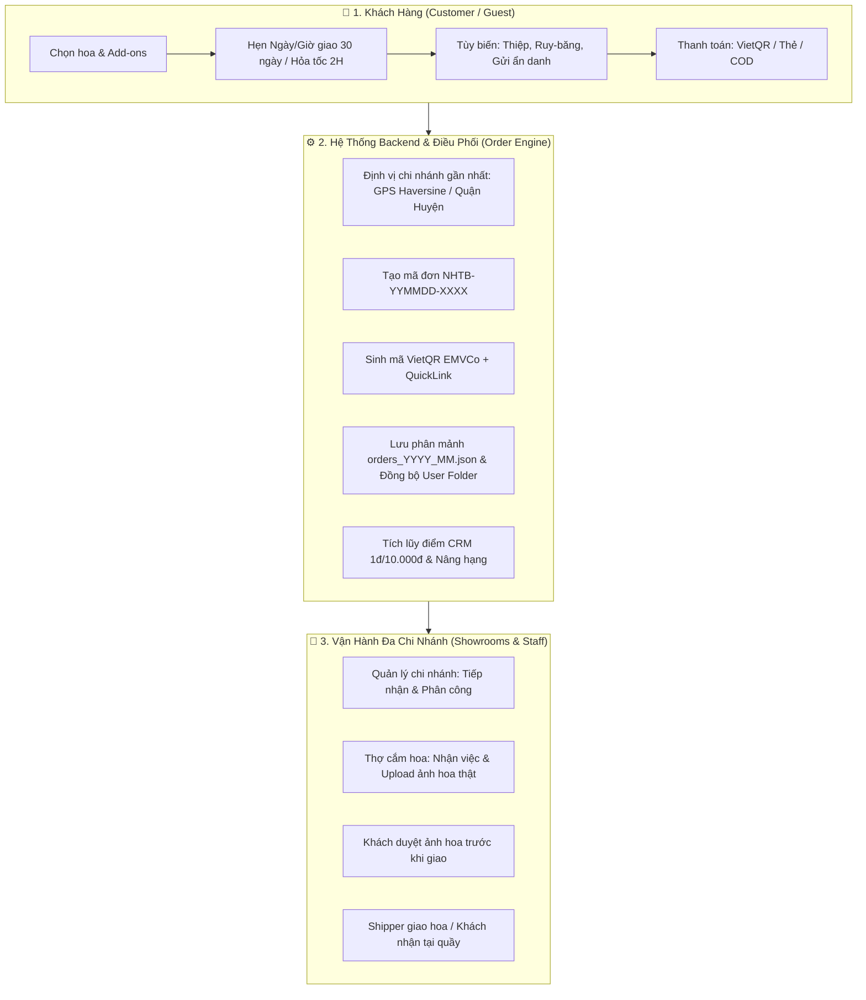
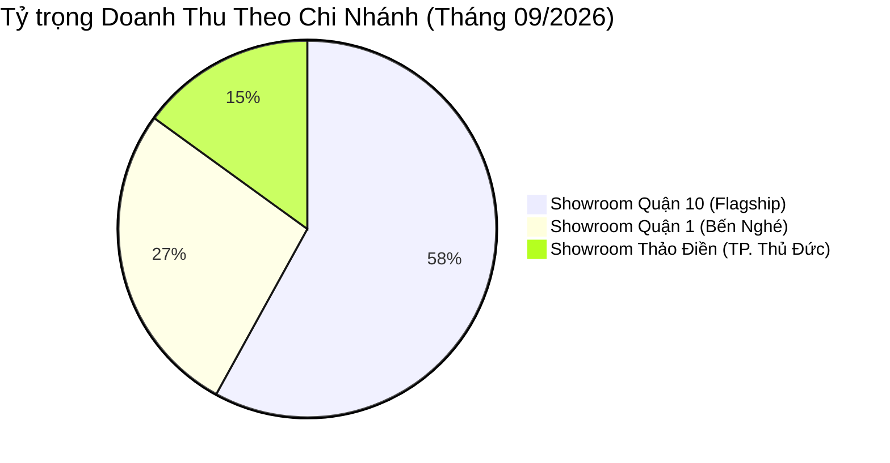

# Tài Liệu Phân Tích & Thiết Kế Hệ Thống Đơn Hàng (Order System Analysis & Architecture Design)
## Dự Án: Nở Hoa Thả Bình (`telua_flower`)

---

## 1. Tổng Quan Phân Hệ Đơn Hàng (Order Management Overview)

Phân hệ Đơn hàng (**Order System**) là trái tim vận hành của hệ thống thương mại điện tử hoa tươi **Nở Hoa Thả Bình**. Do đặc thù của ngành hoa tươi cao cấp mang tính chất **quà tặng cảm xúc, giao hẹn giờ chính xác và thời hạn sử dụng ngắn**, hệ thống đơn hàng được thiết kế chuyên biệt để đáp ứng các yêu cầu nghiệp vụ phức tạp:



### Các Đặc Thù Nghiệp Vụ Hoa Tươi Nổi Bật:
1. **Tách biệt Người Gửi (Sender) & Người Nhận (Recipient)**:
   - Người mua thường đặt hoa để gửi tặng bạn bè, đối tác, người thân.
   - Hỗ trợ tính năng **"Gửi Ẩn Danh (Secret Sender)"**: Tên người gửi sẽ được ẩn đi đối với người nhận nhưng vẫn lưu trữ minh bạch trong hồ sơ nội bộ để phục vụ bảo mật và xác minh thanh toán.
2. **Khung Giờ Giao Hàng Linh Hoạt (Delivery Slots & 2H Express)**:
   - Cho phép chọn ngày giao trước tối đa **30 ngày** (phục vụ đặt trước sinh nhật, ngày lễ 14/2, 8/3, 20/10).
   - 6 khung giờ tiêu chuẩn cố định trong ngày (08:00 - 21:00) hoặc tùy chọn **Giao Hỏa Tốc trong 2 Giờ**.
   - Khống chế tải tự động (Quota Management) và chặn chọn slot quá khứ trong ngày.
3. **Cá Nhân Hóa Đơn Hàng (Customization)**:
   - Soạn thảo lời chúc thiệp đính kèm (Card Message).
   - In thông điệp chúc mừng trên dải ruy-băng cài hoa (Ribbon Banner).
   - Ghi chú chỉ dẫn giao nhận chi tiết (ví dụ: gửi lễ tân tòa nhà, gọi trước 15 phút).
4. **Hệ Thống Thanh Toán Tự Động & VietQR Động**:
   - Tự động sinh mã VietQR chuẩn Napas EMVCo chứa sẵn số tiền chính xác và cú pháp chuyển khoản định danh mã đơn.
   - Tạo URL VietQR QuickLink mở trực tiếp ứng dụng ngân hàng di động trong 1 chạm.
5. **Điều Phối Đơn Đa Chi Nhánh Thông Minh (Smart Branch Dispatching)**:
   - Tự động định vị Showroom gần nhất theo tọa độ GPS (thuật toán Haversine) hoặc tự động phân tích tên Quận/Huyện từ địa chỉ giao hàng.
   - Gán người chịu trách nhiệm xử lý (`assignedTo`) về Quản lý chi nhánh tương ứng.
6. **Lưu Trữ Phân Mảnh Theo Tháng & Đồng Bộ User Profile**:
   - Dữ liệu đơn hàng được phân mảnh theo file tháng `orders_YYYY_MM.json` nhằm tối ưu hóa dung lượng nạp và bộ nhớ RAM.
   - Đồng bộ độc lập vào thư mục cá nhân khách hàng `config/anne/users/{user_id}/orders.json` để truy vấn lịch sử với độ trễ 0ms.

---

## 2. Đặc Tả Cấu Trúc Dữ Liệu Đơn Hàng (Order Schema Specification)

Đơn hàng được lưu trữ dưới dạng JSON Object chuẩn hóa, bao gồm đầy đủ thông tin giao dịch, logistics, tài chính và lịch sử xử lý:

```json
{
  "id": "ord_1725324567_a8f9c1",
  "orderCode": "NHTB-260903-A8K2",
  "createdAt": "2026-09-03T10:15:30Z",
  "orderDate": "2026-09-03T10:15:30Z",
  "branchId": "branch_q10",
  "customerId": "cust_1725300000",
  "assignedTo": "staff_manager_q10",
  "assignedBy": "system",
  "status": "pending",
  "cardMessage": "Chúc em tuổi mới luôn xinh đẹp và rạng rỡ như những đóa hoa!",
  "ribbonBanner": "Mừng Khai Trương Hồng Phát - Cty Alpha Tech",
  
  "sender": {
    "name": "Người gửi bí mật (Ẩn danh)",
    "realName": "Nguyễn Văn An",
    "phone": "0901234567",
    "email": "an.nguyen@example.com",
    "isAnonymous": true
  },
  
  "recipient": {
    "name": "Trần Thị Mai",
    "phone": "0987654321",
    "address": "183/37 Đường 3 Tháng 2, Phường 11, Quận 10, TP. Hồ Chí Minh",
    "deliveryNotes": "Giao giờ hành chính, gọi điện trước khi đến 15 phút",
    "lat": 10.77123,
    "lng": 106.67345
  },
  
  "delivery": {
    "deliveryDate": "2026-09-04",
    "timeSlot": "10:00 - 12:00 (Trưa)",
    "isExpress2H": false,
    "fulfillmentType": "delivery"
  },
  
  "customization": {
    "cardMessage": "Chúc em tuổi mới luôn xinh đẹp và rạng rỡ như những đóa hoa!",
    "ribbonBanner": "Mừng Khai Trương Hồng Phát - Cty Alpha Tech"
  },
  
  "items": [
    {
      "productId": "prod_pink_bliss_01",
      "productName": "Bó Hoa Hồng Juliet Giấc Mơ Ngọt Ngào",
      "price": 650000,
      "quantity": 1,
      "itemTotal": 650000,
      "image": "/images/products/bo_hoa_hong_juliet.webp"
    },
    {
      "productId": "addon_gau_bong_mini",
      "productName": "Gấu Bông Mini Thỏ Trắng",
      "price": 80000,
      "quantity": 1,
      "itemTotal": 80000,
      "image": "/images/addons/gau_bong_mini.webp"
    }
  ],
  
  "financials": {
    "subtotal": 730000,
    "shippingFee": 0,
    "discountAmount": 50000,
    "totalAmount": 680000,
    "appliedVoucher": {
      "code": "FLOWERNEW",
      "title": "Ưu đãi khách hàng mới giảm 50K",
      "discountAmount": 50000
    }
  },
  
  "totalAmount": 680000,
  
  "payment": {
    "method": "vietqr",
    "status": "unpaid",
    "paidAt": null,
    "transactionId": null,
    "bankInfo": {
      "bankId": "MB",
      "accountNo": "090123456789",
      "accountName": "NO HOA THA BINH"
    },
    "transferContent": "NHTB 260903 A8K2",
    "vietqr": {
      "quickLink": "https://img.vietqr.io/image/MB-090123456789-compact2.png?amount=680000&addInfo=NHTB%20260903%20A8K2&accountName=NO%20HOA%20THA%20BINH",
      "qrPayload": "00020101021238540010A0000007270124000697042201100901234567890208QRIBFTTA530370454066800005802VN62200816NHTB 260903 A8K26304E8A2"
    }
  },
  
  "flowerPhoto": {
    "photoUrl": "/images/orders/actual_ord_1725324567.webp",
    "uploadedAt": "2026-09-04T09:30:00Z",
    "uploadedBy": "staff_florist_01",
    "isApprovedByCustomer": true
  },
  
  "history": [
    {
      "status": "pending",
      "paymentStatus": "unpaid",
      "updatedAt": "2026-09-03T10:15:30Z",
      "note": "Khách hàng tạo đơn hàng trực tuyến",
      "updatedBy": "0901234567"
    },
    {
      "status": "confirmed",
      "updatedAt": "2026-09-03T10:20:00Z",
      "note": "Quản lý chi nhánh xác nhận đơn hàng",
      "updatedBy": "staff_manager_q10"
    }
  ]
}
```

---

## 3. Mô Hình Hai Chuỗi Trạng Thái Độc Lập (Dual-State Lifecycle Engine)

Hệ thống quản lý đơn hàng sử dụng kiến trúc **Hai Chuỗi Trạng Thái Độc Lập (Decoupled State Machine)** nhằm phản ánh trung thực thực tế vận hành logistics và tài chính:

```
┌─────────────────────────────────────────────────────────┐
│               1. ORDER FULFILLMENT STATUS               │
│  pending ──> confirmed ──> arranging ──> shipping ──> delivered   │
│     │            │             │                           │    │
│     └────────────┴─────────────┴──> cancelled              └──> returned
└─────────────────────────────────────────────────────────┘

┌─────────────────────────────────────────────────────────┐
│                 2. PAYMENT STATUS                       │
│             unpaid ──────────> paid                     │
│               │                  │                      │
│               └──> failed        └──> refunded          │
└─────────────────────────────────────────────────────────┘
```

### 3.1 Bảng Phân Định Chi Tiết Trạng Thái

#### A. Trạng Thái Vận Hành Đơn Hàng (`order.status`):
| Mã trạng thái | Tên tiếng Việt | Đối tượng thao tác | Hành động tương ứng trong thực tế |
| :--- | :--- | :--- | :--- |
| `pending` | **Chờ xác nhận** | Khách hàng / Hệ thống | Đơn mới tạo trên Web, chưa có nhân viên tiếp nhận. |
| `confirmed` | **Đã duyệt / Xác nhận** | Quản lý / CSKH | Quản lý chi nhánh kiểm tra hoa nguyên liệu, chấp nhận đơn. |
| `arranging` | **Đang cắm hoa** | Thợ cắm hoa (`florist`) | Thợ chọn hoa tươi, thực hiện cắm bó/lẵng theo mẫu. |
| `ready_for_pickup`| **Sẵn sàng nhận hoa** | Thợ / Quản lý | Áp dụng cho đơn nhận tại quầy (`pickup`), hoa đã cắm xong. |
| `shipping` | **Đang vận chuyển** | Quản lý / Shipper | Bàn giao shipper mang hoa đi giao cho người nhận. |
| `delivered` | **Giao thành công** | Shipper / Quản lý | Khách/Người nhận đã nhận hoa nguyên vẹn. |
| `completed` | **Hoàn tất đơn** | Quản lý / Hệ thống | Đơn đã nhận tại quầy hoặc hoàn tất đối soát. |
| `cancelled` | **Đã hủy** | Khách / Quản lý / Admin | Hủy đơn theo quy định (trước khi cắm hoa). |
| `returned` | **Đổi trả / Khiếu nại**| CSKH / Quản lý | Tiếp nhận khiếu nại hoa dập hỏng để đổi mẫu mới hoặc hoàn tiền. |

#### B. Trạng Thái Thanh Toán (`payment.status`):
| Mã trạng thái | Tên tiếng Việt | Cơ chế cập nhật |
| :--- | :--- | :--- |
| `unpaid` | **Chưa thanh toán** | Mặc định khi tạo đơn mới. |
| `paid` | **Đã thanh toán** | Tự động cập nhật khi Webhook Ngân hàng khớp VietQR, hoặc Nhân viên thu tiền COD/POS tại quầy cập nhật. |
| `refunded` | **Đã hoàn tiền** | Admin/Kế toán hoàn tiền chuyển khoản khi đơn bị hủy hợp lệ hoặc đổi trả. |
| `failed` | **Thanh toán lỗi** | Cổng thanh toán thẻ trả về giao dịch bị từ chối/hết hạn. |

### 3.2 Ma Trận Phân Quyền Xử Lý Đơn Hàng (RBAC Matrix)

| Vai trò người dùng (`role`) | Xem đơn | Duyệt đơn (`confirmed`) | Nhận cắm (`arranging`) | Upload ảnh hoa | Chuyển `shipping` | Cập nhật `paid` (Tiền mặt) | Hoàn tiền (`refunded`) |
| :--- | :---: | :---: | :---: | :---: | :---: | :---: | :---: |
| **Khách hàng (`customer`)** | Chỉ đơn của mình | ❌ | ❌ | ❌ (Duyệt ảnh) | ❌ | ❌ | ❌ |
| **Thợ cắm hoa (`florist`)** | Đơn chi nhánh mình | ❌ | ✅ | ✅ | ❌ | ❌ | ❌ |
| **Sales Tư Vấn (`sales`)** | Đơn chi nhánh mình | ✅ | ❌ | ❌ | ✅ | ✅ (POS/COD) | ❌ |
| **Quản lý CN (`branch_manager`)**| Đơn chi nhánh mình | ✅ | ✅ | ✅ | ✅ | ✅ (POS/COD) | ❌ |
| **Super Admin (`super_admin`)** | Toàn bộ chuỗi | ✅ | ✅ | ✅ | ✅ | ✅ | ✅ |

---

## 4. Thuật Toán Định Vị Chi Nhánh & Gán Xử Lý Thông Minh

Để đơn hàng được phục vụ nhanh nhất với chi phí vận chuyển tối ưu và giữ hoa tươi lâu nhất, hệ thống áp dụng cơ chế điều phối chi nhánh tự động 2 cấp:

```mermaid
flowchart TD
    START([Tạo đơn hàng mới]) --> CHECK_EXPLICIT{Khách có chọn chi nhánh cụ thể?}
    
    CHECK_EXPLICIT -->|Có (branchId hợp lệ)| ASSIGN_EXPLICIT[Gán chi nhánh khách chọn]
    CHECK_EXPLICIT -->|Không| CHECK_GPS{Có tọa độ GPS<br/>lat, lng người nhận?}
    
    CHECK_GPS -->|Có| HAVERSINE[Tính khoảng cách Haversine đến từng Showroom]
    HAVERSINE --> MIN_DIST[Chọn Showroom có khoảng cách ngắn nhất]
    
    CHECK_GPS -->|Không| TEXT_MATCH[Phân tích chuỗi địa chỉ giao hàng recipient.address]
    TEXT_MATCH -->|Q1, Q4, Bình Thạnh, Phú Nhuận| CN_Q1[branch_q1: Showroom Quận 1]
    TEXT_MATCH -->|Q2, Q9, Thủ Đức, Thảo Điền| CN_TD[branch_thao_dien: Showroom Thảo Điền]
    TEXT_MATCH -->|Q10, Q3, Q5, Tân Bình, Tân Phú...| CN_Q10[branch_q10: Showroom Flagship Q10]
    TEXT_MATCH -->|Ngoại thành / Không xác định chi nhánh| CN_ADMIN[admin: Đơn chờ Admin / CSKH điều phối]

    MIN_DIST --> SET_BRANCH[Gán branchId cho Đơn hàng]
    CN_Q1 --> SET_BRANCH
    CN_TD --> SET_BRANCH
    CN_Q10 --> SET_BRANCH
    CN_ADMIN --> SET_BRANCH_ADMIN[Gán branchId = 'admin'<br/>Lưu vào orders/admin/orders_YYYY_MM.json]
    ASSIGN_EXPLICIT --> SET_BRANCH

    SET_BRANCH --> ASSIGN_STAFF[Gán assignedTo = Manager của Chi nhánh đó]
    SET_BRANCH_ADMIN --> ASSIGN_ADMIN[Gán assignedTo = staff_admin]
```

### Công thức khoảng cách Haversine:
$$d = 2R \cdot \arcsin\left(\sqrt{\sin^2\left(\frac{\Delta \text{lat}}{2}\right) + \cos(\text{lat}_1)\cos(\text{lat}_2)\sin^2\left(\frac{\Delta \text{lon}}{2}\right)}\right)$$
*(Với $R = 6371 \text{ km}$ là bán kính Trái Đất)*

---

## 5. Quy Chuẩn Tính Toán Tài Chính, Phí Ship & Voucher

### 5.1 Quy Tắc Tính Phí Vận Chuyển (Shipping Fee Policy):
- **Đơn tiêu chuẩn (Standard Delivery)**:
  - Giá trị đơn hàng $< 500.000$ VNĐ $\rightarrow$ Phí vận chuyển cố định **$35.000$ VNĐ**.
  - Giá trị đơn hàng $\ge 500.000$ VNĐ $\rightarrow$ **Miễn phí vận chuyển (Freeship 0đ)**.
- **Giao hỏa tốc 2H (Express 2-Hour Delivery)**:
  - Phí hỏa tốc ưu tiên: **$50.000$ VNĐ** (Áp dụng cho mọi giá trị đơn hàng để đảm bảo shipper ưu tiên riêng).

### 5.2 Quy Tắc Áp Dụng Mã Khuyến Mãi (Voucher & Promotions):
1. **Kiểm tra điều kiện đơn hàng tối thiểu (`minOrderAmount`)**:
   - Nếu `subtotal < minOrderAmount` $\rightarrow$ Từ chối áp dụng voucher.
2. **Chiết khấu theo phần trăm (`discountType = 'percentage'`)**:
   $$\text{discountAmount} = \min\left(\left\lfloor \frac{\text{subtotal} \times \text{discountValue}}{100} \right\rfloor, \text{maxDiscountAmount}\right)$$
3. **Chiết khấu số tiền cố định (`discountType = 'fixed'`)**:
   $$\text{discountAmount} = \min(\text{discountValue}, \text{subtotal})$$
4. **Tổng thanh toán cuối cùng (`finalTotal`)**:
   $$\text{totalAmount} = \max(0, \text{subtotal} + \text{shippingFee} - \text{discountAmount})$$

### 5.3 Tích Lũy Điểm Khách Hàng Thân Thiết (CRM Loyalty Points):
- Tỷ lệ quy đổi: **$10.000$ VNĐ chi tiêu $= 1$ điểm tích lũy**.
- Tự động cộng dồn `loyaltyPoints`, `totalSpent` và số lần mua `orderCount` vào hồ sơ khách hàng tại `config/anne/customers.json`.
- Phân tầng hạng thành viên:
  - **Silver**: $< 5.000.000$ VNĐ
  - **Gold**: $5.000.000 - 15.000.000$ VNĐ (Chiết khấu thường niên 5%)
  - **Diamond**: $> 15.000.000$ VNĐ (Chiết khấu thường niên 10% + Quà sinh nhật)

---

## 6. Kiến Trúc Lưu Trữ Dữ Liệu: Kanban Folder Partitioning ({branch_id}/{YYYY_MM}/{status}/{order_id}.json)

Nhằm tối ưu hóa tốc độ ghi, loại bỏ hoàn toàn đụng độ khóa file và hỗ trợ bảng điều khiển Kanban thời gian thực, hệ thống áp dụng kiến trúc phân cấp 4 tầng:

```text
config/anne/
├── orders/
│   ├── branch_q10/                    # Showroom Flagship Quận 10
│   │   ├── 2026_08/                   # Thư mục tháng 08/2026
│   │   │   ├── pending/               # Chờ xác nhận ({order_id}.json)
│   │   │   ├── arranging/             # Đang cắm hoa
│   │   │   ├── shipping/              # Đang giao hàng
│   │   │   └── delivered/             # Giao thành công
│   │   └── 2026_09/
│   ├── branch_q1/                     # Showroom Quận 1
│   │   └── 2026_09/
│   │       └── pending/
│   │           └── ord_1788368978_739ed2.json
│   ├── branch_thao_dien/              # Showroom Thảo Điền
│   └── admin/                         # 🌟 ĐƠN HÀNG CHƯA ĐỊNH VỊ / TOÀN CHUỖI (Unassigned / Pending Dispatch)
│       └── 2026_09/
│           └── pending/
│               └── ord_1788199999_xyz.json
│
└── users/
    ├── 0901234567/
    │   ├── profile.json               # Hồ sơ cá nhân
    │   └── orders.json                # Sổ chỉ mục con trỏ tham chiếu (Reference Pointer)
    └── 0987654321/
        └── orders.json
```

### 6.1 Cơ Chế Di Chuyển File Khi Đổi Trạng Thái (Kanban Status Transition):
- Khi một đơn hàng đổi trạng thái (ví dụ: từ `pending` sang `arranging`), hệ thống thực hiện:
  1. `os.replace(old_status_path, new_status_path)`: Di chuyển nguyên tử file JSON sang thư mục trạng thái mới.
  2. Cập nhật `order["status"] = new_status` và ghi vết vào `history`.
  3. Cập nhật con trỏ trạng thái trong sổ khách hàng `users/{user_id}/orders.json`.
- Thao tác di chuyển này diễn ra tức thời ($< 0.1$ms) vì diễn ra trên cùng phân vùng lưu trữ.

### 6.2 Vai Trò Đặc Biệt Của Thư Mục `orders/admin/`:
- **Đơn hàng chưa biết gán cho ai (Unassigned Orders)**: Áp dụng khi khách đặt hàng nhưng địa chỉ ngoại tỉnh, chưa xác định showroom, hoặc đơn hợp đồng B2B toàn chuỗi.
- **Quy trình Điều Phối & Chuyển Nhượng Đơn (Order Dispatch & Reassignment)**:
  - Khi Super Admin hoặc CSKH điều phối đơn từ `admin/` sang `branch_q10`:
    1. Hệ thống di chuyển file đơn hàng từ `orders/admin/{YYYY_MM}/{status}/{order_id}.json` sang `orders/branch_q10/{YYYY_MM}/{status}/{order_id}.json`.
    2. Cập nhật `branchId: "branch_q10"` và `assignedTo: "staff_manager_q10"`.
    3. Ghi vết lịch sử vào mảng `history`: *"Điều phối từ Admin sang Showroom Q10 bởi [User]"*.
    4. Tự động đồng bộ cập nhật con trỏ tham chiếu vào sổ đơn của khách hàng tại `users/{user_id}/orders.json`.

### 6.3 Lợi Ích Vượt Trội Của Kanban Folder Partitioning:
1. **Lọc Trạng Thái Không Cần Quét (Zero-Scan Query)**:
   - Khi thợ hoa xem "Đơn cần cắm", backend chỉ đọc thư mục con `arranging/` (5-10 đơn) thay vì đọc 10.000 đơn trong tháng.
2. **Cô lập rủi ro ghi đè 100% (Zero Write Contention & Lock-Free)**:
   - Mỗi đơn hàng là một tệp JSON riêng biệt (~2 KB). Nhiều thợ cắm hoa, thu ngân, shipper cập nhật các đơn khác nhau cùng lúc hoàn toàn độc lập, không sợ đụng độ I/O lock.
2. **Thao tác đơn hàng nguyên tử (Atomic File Operations)**:
   - Thêm, sửa, xóa đơn là thao tác trên tệp đơn lẻ nguyên tử, bảo vệ tính toàn vẹn dữ liệu tối đa.
3. **Truy vấn $O(1)$ trực tiếp**:
   - Khi biết `branchId`, `yearMonth` và `orderId`, hệ thống mở thẳng file `{order_id}.json` trong thời gian $< 0.5$ms.
4. **Đồng bộ con trỏ tham chiếu khách hàng (Lightweight Pointer Index)**:
   - Khách hàng xem lịch sử mua hàng cá nhân qua `users/{user_id}/orders.json` chứa các con trỏ tham chiếu siêu nhẹ, giải mã trực tiếp từ file chi nhánh theo thời gian thực.

---

## 7. Phân Hệ Thống Kê & Báo Cáo Doanh Thu (Admin BI & Order Analytics)

API `/api/admin/orders` cung cấp công cụ phân tích kinh doanh đa chiều cho Quản trị viên và Quản lý showroom:



### Các Bộ Lọc Phân Tích Đa Chiều:
- **Khoảng thời gian (`timeframe`)**:
  - `today`: Đơn phát sinh trong ngày hôm nay từ 00:00:00 đến 23:59:59.
  - `this_week`: Đơn từ Thứ Hai đầu tuần đến Chủ Nhật.
  - `this_month`: Đơn trong tháng hiện tại.
  - `last_month`: Đơn trong tháng trước.
  - `custom`: Tùy chỉnh theo `startDate` và `endDate`.
  - `all`: Quét tổng hợp toàn bộ các tháng lịch sử.
- **Lọc theo Chi nhánh (`branchId`)**: Phân quyền tự động (Quản lý CN chỉ xem số liệu chi nhánh mình, Admin xem toàn chuỗi).
- **Lọc theo Trạng thái Đơn & Thanh Toán**: `status` (`pending`, `arranging`, `shipping`, `completed`, `cancelled`) và `paymentStatus` (`paid`, `unpaid`).
- **Chỉ số đầu ra (Aggregated Metrics Output)**:
  - `totalOrders`: Tổng số lượng đơn thỏa mãn điều kiện.
  - `totalRevenue`: Doanh thu thực tế (đã trừ các đơn `cancelled`).
  - `metrics`: Đếm số đơn theo từng trạng thái cụ thể.
  - `revenueByBranch`: Doanh thu phân bổ theo từng showroom.
  - `revenueByDay`: Doanh thu nhóm theo từng ngày để vẽ biểu đồ tăng trưởng cột/đường (Trend Chart).

---

## 8. Đặc Tả Danh Mục API Endpoints Phân Hệ Đơn Hàng

| Phương thức | Endpoint | Phân quyền | Mô tả chức năng |
| :--- | :--- | :---: | :--- |
| `GET` | `/api/delivery/slots` | Public | Lấy danh sách 6 khung giờ giao hàng và kiểm tra slot còn trống theo ngày. |
| `POST` | `/api/orders` | Public / Auth | Tạo đơn hàng mới (tự động tính ship, voucher, gán chi nhánh, tạo VietQR). |
| `GET` | `/api/orders/<order_id>` | RBAC Guard | Tra cứu chi tiết đơn hàng (Kiểm tra quyền sở hữu của khách hoặc phân quyền chi nhánh của nhân viên). |
| `GET` | `/api/orders/<order_id>/payment-qr` | Public / Auth | Lấy mã VietQR động, QuickLink URL và thông tin chuyển khoản ngân hàng. |
| `GET` | `/api/orders/my-orders` | Customer (JWT) | Lấy danh sách lịch sử đơn hàng của tài khoản đang đăng nhập. |
| `GET` | `/api/branch/<branch_id>/orders` | Staff / Manager | Lấy danh sách đơn hàng được gán cho một chi nhánh cụ thể. |
| `GET` | `/api/admin/orders` | Staff / Manager / Admin | Quản lý, tìm kiếm và thống kê doanh thu đơn hàng theo tuần, tháng, quý. |
| `PUT` | `/api/admin/orders/<order_id>/status` | Staff / Manager / Admin | Cập nhật trạng thái tiến độ đơn (`confirmed` $\rightarrow$ `arranging` $\rightarrow$ `shipping` $\rightarrow$ `delivered`). |
| `PUT` | `/api/admin/orders/<order_id>/payment` | Staff / Manager / Admin | Cập nhật trạng thái thanh toán tiền mặt/COD/POS (chặn sửa đơn thanh toán online). |
| `POST` | `/api/orders/<order_id>/photo` | `florist` / Manager | Thợ cắm hoa upload ảnh hoa thực tế sau khi cắm để gửi khách duyệt. |

---

## 9. Kịch Bản Vận Hành Thực Tế (End-to-End Execution Scenarios)

### Kịch Bản 1: Khách đặt hoa tặng sinh nhật bạn gái (Giao hỏa tốc 2H + VietQR + Ẩn danh)
1. **Khách hàng** duyệt web, chọn bó hoa hồng Juliet, chọn thêm thiệp và gấu bông mini.
2. Tại màn hình Checkout:
   - Tích chọn **"Giao Hỏa Tốc trong 2 Giờ"** $\rightarrow$ Hệ thống tự cộng phí ship $50.000$đ.
   - Nhập lời chúc thiệp và tích chọn **"Gửi Ẩn Danh"**.
   - Chọn phương thức thanh toán **VietQR**.
3. Bấm **"Đặt Hàng"**:
   - Backend phân tích địa chỉ người nhận (Quận 10) $\rightarrow$ Gán về `branch_q10`.
   - Sinh mã đơn `NHTB-260903-XXXX` và tạo payload VietQR chứa sẵn số tiền $730.000$đ.
   - Màn hình hiển thị mã QR kèm nút "Mở App Ngân Hàng".
4. Khách quét mã chuyển khoản thành công:
   - Đơn chuyển sang `paid`.
5. **Thợ cắm hoa tại Q10** nhận thông báo, chuyển đơn sang `arranging`, hoàn thành bó hoa, chụp ảnh hoa thật upload lên hệ thống.
6. Hệ thống gửi link ảnh hoa cho khách xem; shipper nhận hoa chuyển sang `shipping` và giao tận tay người nhận trong vòng 2 tiếng.

---
*Tài liệu được cập nhật đồng bộ với mã nguồn thực tế tại [src/order_service.py](file:///d:/wmshare/telua_flower/src/order_service.py) và [src/restful_blueprint_flower_connect.py](file:///d:/wmshare/telua_flower/src/restful_blueprint_flower_connect.py).*
