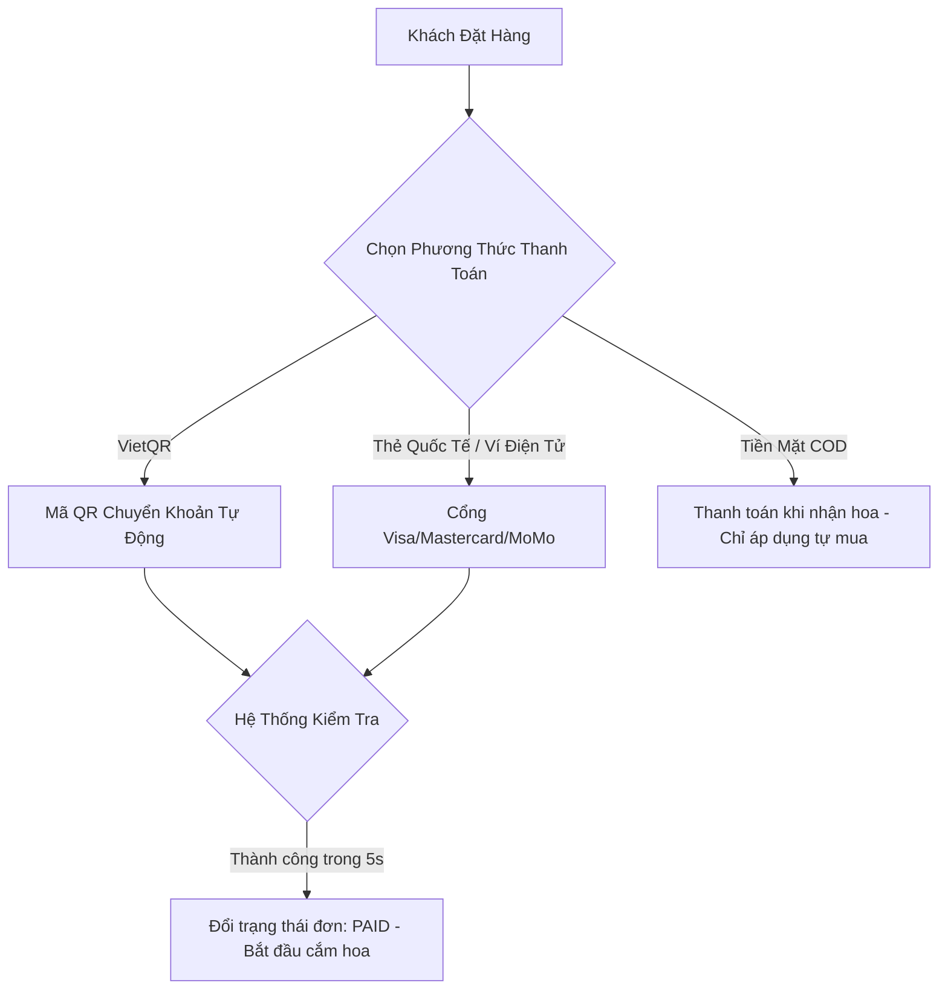
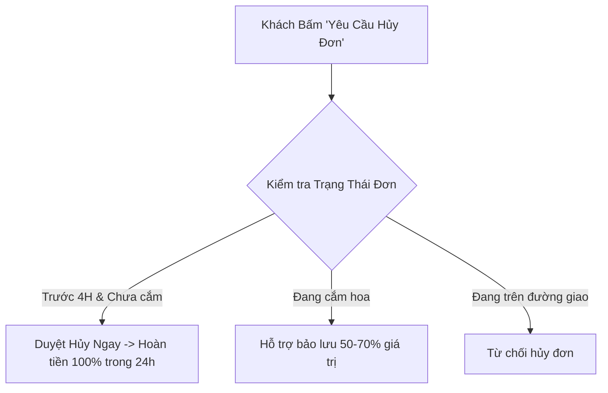

# Thiết Kế Quy Trình Thanh Toán, Hủy Đơn & Đổi Trả / Hoàn Tiền (Payment, Cancellation & Return Policy)
## Dự Án: Nở Hoa Thả Bình (`telua_flower`)

---

## 1. Phương Thức & Quy Trình Thanh Toán (Payment Methods & Flow)

Do đặc thù ngành hoa tươi (người mua thường gửi tặng cho người khác), hệ thống hỗ trợ 4 phương thức thanh toán linh hoạt:



### 1. Chi tiết các phương thức:
1. **Chuyển khoản tự động (VietQR chuẩn Napas EMVCo):**
   - **Cấu hình ngân hàng mặc định của shop:**
     - **Ngân hàng:** `MBBank` (Mã BIN Napas: `970422`, Mã viết tắt: `MB`).
     - **Số tài khoản:** `0976491323` (Trùng số hotline CSKH Nở Hoa Thả Bình).
     - **Tên chủ tài khoản:** `NO HOA THA BINH`.
     - **Cú pháp chuyển khoản:** `NHTB <Mã_Đơn>` (Ví dụ: `NHTB NHTB-20260902-888`).
   - **Cơ chế kỹ thuật sinh mã QR (`src/vietqr_service.py`):**
     - Tự động đóng gói chuỗi chuẩn EMVCo TLV (Tag 00 `Version 01`, Tag 01 `Dynamic 12`, Tag 38 `Napas 247 GUID A000000727 + BIN + Account`, Tag 53 `704 VND`, Tag 54 `Amount`, Tag 58 `VN`, Tag 62 `Additional Info`, Tag 63 `CRC16/CCITT-FALSE`).
     - Tự động sinh QuickLink URL: `https://img.vietqr.io/image/MB-0976491323-compact2.png?amount=<AMOUNT>&addInfo=NHTB%20<ORDER_CODE>&accountName=NO%20HOA%20THA%20BINH`
     - Sinh mã QR Base64 trực tiếp trên máy chủ mà không phụ thuộc bên thứ ba.
   - **Tự động gắn vào đơn hàng:** Khi gọi `POST /api/flower/v1/orders`, `payment` object tự động bao gồm toàn bộ payload QR, link ảnh và thông tin ngân hàng.
2. **Thẻ Quốc Tế (Visa / MasterCard / JCB) & Ví Điện Tử (MoMo / ZaloPay):**
   - Dành cho khách du lịch và kiều bào ở nước ngoài gửi hoa về Việt Nam.
3. **Thanh toán tiền mặt khi nhận hàng (COD):**
   - **Quy tắc:** Chỉ áp dụng khi *Người đặt chính là Người nhận hoa* (tự mua về cắm hoặc mua tặng trực tiếp tại chỗ) với giá trị đơn dưới `1.000.000₫`.
   - Các đơn gửi tặng người khác hoặc đơn trên `1.000.000₫` bắt buộc thanh toán online trước 100% để đảm bảo đơn hàng.

---

## 2. Quy Trình & Chính Sách Hủy Đơn Hàng (Order Cancellation Policy)

Hoa tươi là sản phẩm thiết kế theo yêu cầu và có tính thời vụ cao. Quy trình hủy đơn được chia làm 3 mốc thời gian rõ ràng:

| Thời điểm yêu cầu hủy | Trạng thái đơn | Chính sách xử lý | Tỷ lệ hoàn tiền |
| :--- | :---: | :--- | :---: |
| **Hủy trước giờ giao $\ge$ 4 tiếng** | `pending` (Chờ xử lý) | Hủy đơn tự động trên Web / Hotline | **Hoàn 100%** |
| **Hủy khi đang cắm hoa** | `arranging` (Đang cắm) | Do hoa đã cắt cành theo mẫu riêng, bảo lưu hoặc đổi sang mẫu khác | **Hoàn 50% - 70%** |
| **Hủy khi hoa đã cắm xong hoặc đang giao** | `shipping` (Đang giao) | Không hỗ trợ hủy (trừ lỗi phát sinh do cửa hàng giao trễ hẹn) | **0%** |



---

## 3. Quy Trình Đổi Trả & Đền Bù Hoa (Return, Exchange & Guarantee)

### 🌸 Cam kết chất lượng 100% ("Yên Tâm Trao Gửi"):
Trước khi xuất xưởng, thợ cắm hoa **bắt buộc chụp ảnh hoa thực tế tải lên hệ thống để gửi khách duyệt qua Web/Zalo**. Chỉ khi khách đồng ý mới cho Shipper giao đi.

### 🛡️ Các trường hợp được ĐỔI MỚI 100% hoặc HOÀN TIỀN NGAY:
1. **Hoa bị dập nát, gãy cành, héo úa** trong quá trình vận chuyển của Shipper.
2. **Giao sai mẫu hoa** khác biệt hoàn toàn so với ảnh thật đã duyệt trước đó.
3. **Giao sai nội dung thiệp / banner** hoặc **giao trễ hơn 60 phút** so với khung giờ hẹn mà không báo trước.

### 📝 Quy trình xử lý khiếu nại trong 60 phút:
1. **Bước 1 (Gửi khiếu nại):** Khách chụp ảnh/quay video hoa nhận được gửi qua nút **"Khiếu nại đơn hàng"** trên web hoặc qua Zalo CSKH trong vòng **2 giờ kể từ khi nhận hoa**.
2. **Bước 2 (Xác nhận):** Quản lý chi nhánh tiếp nhận và phản hồi trong vòng **15 phút**.
3. **Bước 3 (Khắc phục):**
   - *Phương án A:* Cắm lại bó hoa mới 100% và giao hỏa tốc tận nơi trong **60 phút** (kèm thiệp xin lỗi và voucher giảm 20%).
   - *Phương án B:* Hoàn trả 100% tiền vào tài khoản ngân hàng của khách trong vòng **2 - 4 giờ**.

---

## 4. Thiết Kế API Endpoints Thanh Toán, Hủy Đơn & Khiếu Nại

| Method | Endpoint | Quyền hạn | Mô tả |
| :--- | :--- | :---: | :--- |
| `GET` | `/api/flower/v1/orders/<id>/payment-qr` | Public / Customer | Lấy chi tiết mã VietQR (EMVCo payload, QuickLink, Base64) để quét thanh toán |
| `POST` | `/api/orders/<id>/cancel` | Customer / Admin | Gửi yêu cầu hủy đơn hàng |
| `POST` | `/api/orders/<id>/claim` | Customer | Gửi khiếu nại đổi trả kèm ảnh chụp hoa bị lỗi |
| `POST` | `/api/admin/orders/<id>/refund` | `super_admin`, Manager | Duyệt hoàn tiền đơn hàng qua tài khoản khách |

#### Request mẫu gửi khiếu nại (`POST /api/orders/ORD_12345/claim`):
```json
{
  "orderId": "ORD_12345",
  "reason": "damaged_delivery",
  "description": "Bó hoa bị dập nát 3 bông hồng khi shipper giao đến",
  "evidenceImages": [
    "https://res.cloudinary.com/telua/image/upload/claim_01.jpg"
  ],
  "preferredResolution": "replace_new"
}
```
