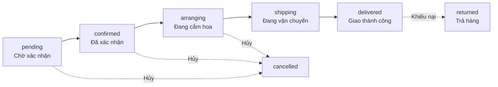
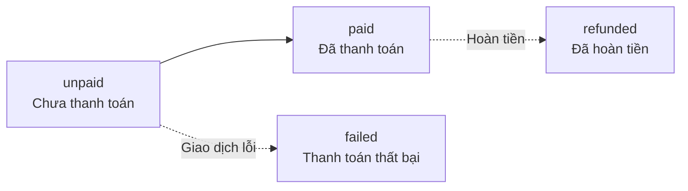
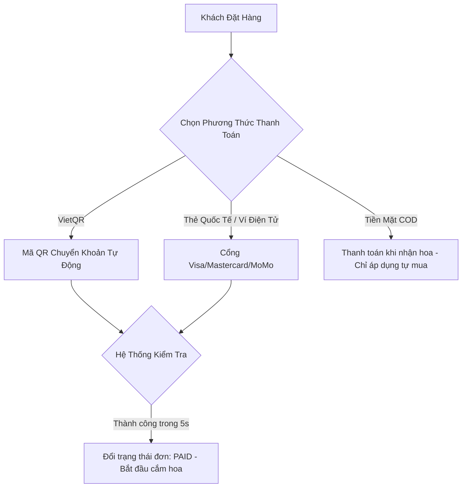
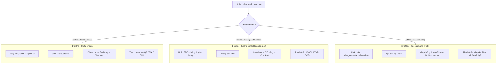
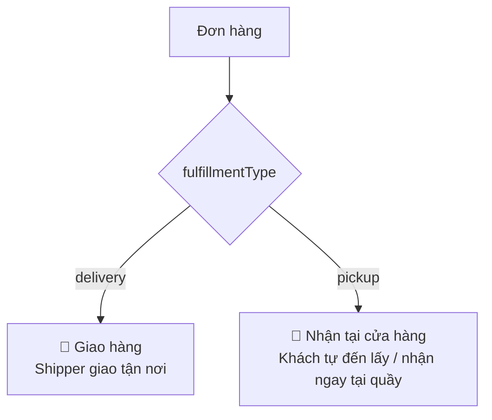
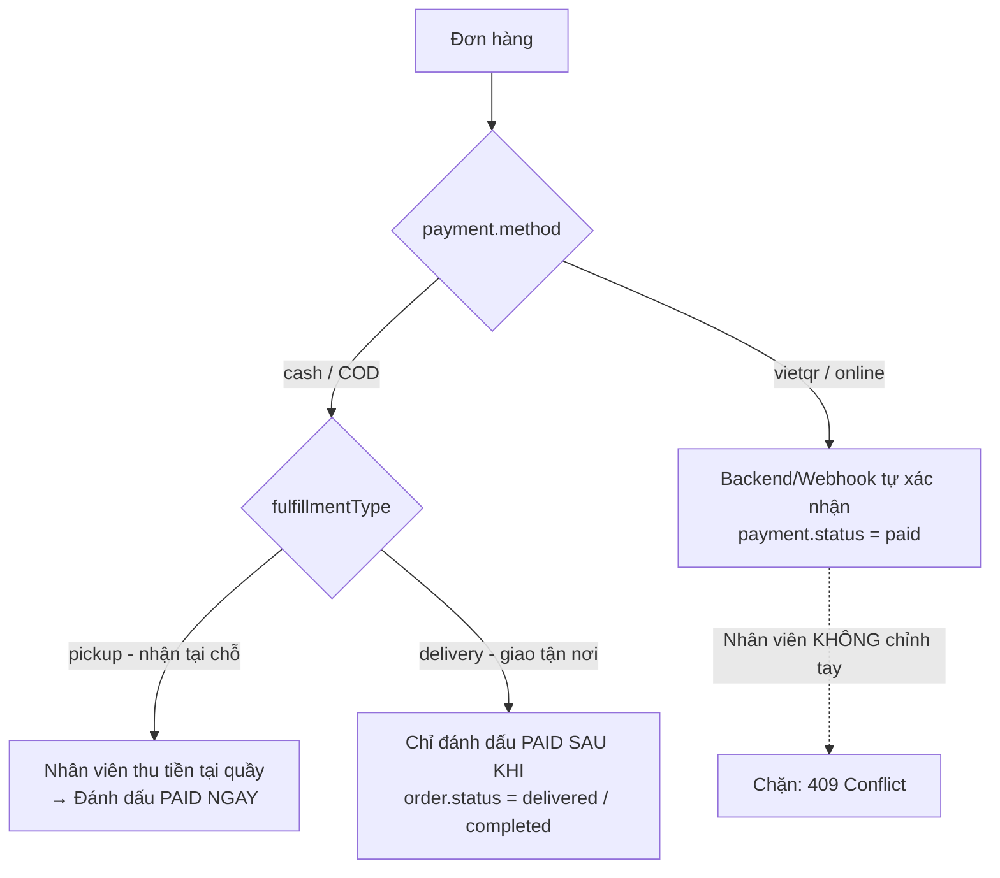
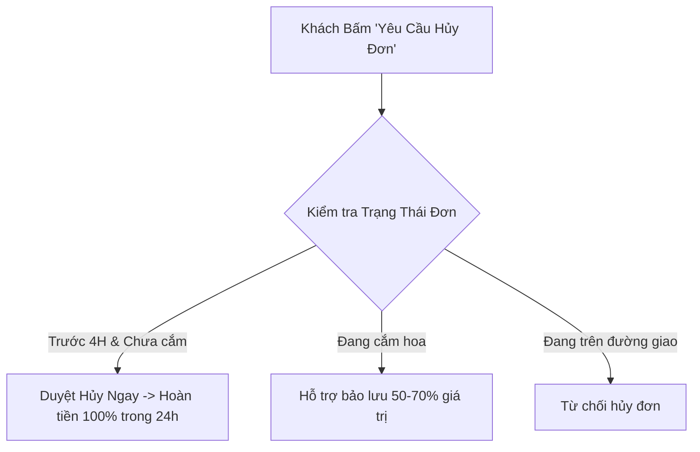

# Thiết Kế Quy Trình Thanh Toán, Hủy Đơn & Đổi Trả / Hoàn Tiền (Payment, Cancellation & Return Policy)
## Dự Án: Nở Hoa Thả Bình (`telua_flower`)

---

## 0. Mô Hình Trạng Thái Đơn Hàng: Tách Rõ 2 Khái Niệm (Order Status vs Payment Status)

Mỗi đơn hàng được quản lý bởi **2 chuỗi trạng thái độc lập**, không gộp chung:

| Khái niệm | Trường dữ liệu | Ý nghĩa | Chuỗi trạng thái |
| :--- | :--- | :--- | :--- |
| **Trạng thái đơn hàng** (Fulfillment) | `order.status` | Vòng đời xử lý & giao nhận đơn | `pending → confirmed → arranging → shipping → delivered` |
| **Trạng thái thanh toán** (Payment) | `payment.status` | Tình trạng thu tiền của đơn | `unpaid → paid` (+ `refunded`, `failed`) |

> **Vì sao phải tách?** Một đơn có thể **đã thanh toán** (`payment.status = paid`) nhưng **chưa giao** (`order.status = shipping`), hoặc **đã giao** (`delivered`) nhưng **chưa thu tiền** (COD `unpaid`). Gộp chung 1 chuỗi sẽ không biểu diễn được các trường hợp này.

### 0.1 Trạng thái đơn hàng (`order.status`) — Vòng đời xử lý & giao nhận



| Trạng thái | Mô tả | Ghi chú |
| :--- | :--- | :--- |
| `pending` | Chờ xác nhận | Đơn vừa tạo, chưa được duyệt |
| `confirmed` | Đã xác nhận | Quản lý/CSKH xác nhận nhận đơn |
| `arranging` | Đang cắm hoa | Thợ cắm hoa đang thực hiện |
| `shipping` | Đang vận chuyển | Shipper đang giao (chỉ với `fulfillmentType = delivery`) |
| `delivered` | Giao thành công | Khách đã nhận hoa |
| `cancelled` | Đã hủy | Theo chính sách hủy (mục 2) |
| `returned` | Trả hàng / hoàn | Theo quy trình đổi trả (mục 3) |

> **Biến thể theo phương thức nhận hàng (`fulfillmentType`):**
> - **Giao hàng (`delivery`):** `pending → confirmed → arranging → shipping → delivered`
> - **Nhận tại cửa hàng (`pickup`):** `pending → confirmed → arranging → ready_for_pickup → completed`
>   - `ready_for_pickup`: Hoa đã cắm xong, chờ khách đến lấy.
>   - `completed`: Khách đã nhận tại quầy (tương đương `delivered`).

### 0.2 Trạng thái thanh toán (`payment.status`) — Tình trạng thu tiền



| Trạng thái | Mô tả |
| :--- | :--- |
| `unpaid` | Chưa thanh toán (mặc định khi tạo đơn) |
| `paid` | Đã thanh toán (VietQR/Thẻ xác nhận, hoặc thu tiền mặt COD/POS) |
| `refunded` | Đã hoàn tiền (khi hủy/đổi trả theo chính sách) |
| `failed` | Giao dịch thanh toán thất bại |

> **Quan hệ giữa 2 trạng thái:** `order.status` và `payment.status` **tiến hóa độc lập**. Ví dụ:
> - Đơn VietQR trả trước: `payment.status = paid` ngay khi webhook xác nhận, trong khi `order.status` vẫn `pending → arranging → ...`.
> - Đơn COD: `order.status = delivered` nhưng `payment.status = unpaid` cho đến khi shipper thu tiền.

---

## 1. Phương Thức & Quy Trình Thanh Toán (Payment Methods & Flow)

Do đặc thù ngành hoa tươi (người mua thường gửi tặng cho người khác), hệ thống hỗ trợ 4 phương thức thanh toán linh hoạt:



### 0. Phân Loại Luồng Mua Hàng & Thanh Toán (3 Kênh)

Hệ thống hỗ trợ **3 luồng mua hàng** khác nhau, mỗi luồng có cách xác thực và thanh toán riêng:



#### Bảng so sánh 3 luồng

| Tiêu chí | 🖥️ Online - Có tài khoản | 🖥️ Online - Guest (không tài khoản) | 🏬 Offline - Tại cửa hàng |
| :--- | :--- | :--- | :--- |
| **Người thao tác** | Khách hàng (tự đặt) | Khách hàng (tự đặt) | Nhân viên `sales_consultant` |
| **Xác thực** | JWT (`role: customer`) | Không cần JWT (chỉ SĐT) | JWT (`role: sales_consultant`) |
| **`createdBy`** | `customer` (id khách) | `guest` (SĐT) | `staff` (id nhân viên) |
| **Lưu lịch sử mua** | ✅ Có (gắn tài khoản) | ⚠️ Không (chỉ SĐT) | ✅ Có (gắn nhân viên + chi nhánh) |
| **Điểm tích lũy** | ✅ Có | ❌ Không | ⚠️ Tùy chính sách |
| **Theo dõi đơn** | Đăng nhập xem | Tra cứu bằng SĐT + mã đơn | Nhân viên xem trong portal |
| **Thanh toán** | VietQR / Thẻ / COD | VietQR / Thẻ / COD | Tiền mặt tại quầy / Quét QR |

#### Chi tiết từng luồng

**1. Online - Có tài khoản (`customer`):**
```
Đăng nhập (SĐT + mật khẩu) → JWT
   → Chọn hoa → Giỏ hàng → Checkout (thông tin tự điền từ sổ địa chỉ)
   → POST /api/orders (kèm JWT, createdBy = customer_id)
   → Chọn thanh toán: VietQR / Thẻ / COD
   → Nhận QR → Thanh toán → Webhook xác nhận → Đơn PAID
```
- Lưu được lịch sử mua hàng, điểm tích lũy, sổ địa chỉ.

**2. Online - Không có tài khoản (Guest):**
```
Không đăng nhập
   → Nhập SĐT người đặt + tên + địa chỉ nhận + thiệp
   → POST /api/orders (KHÔNG cần JWT, createdBy = guest, kèm SĐT)
   → Chọn thanh toán: VietQR / Thẻ / COD
   → Nhận QR → Thanh toán → Đơn PAID
```
- **Theo dõi đơn:** Tra cứu bằng **SĐT + mã đơn** (không cần tài khoản).
- **Gợi ý sau khi mua:** Hiển thị banner "Tạo tài khoản để tích điểm & theo dõi đơn dễ dàng" (không bắt buộc).

**3. Offline - Tại cửa hàng (POS):**
```
Nhân viên sales_consultant đăng nhập (tài khoản NHÂN VIÊN, không phải khách)
   → Tạo đơn hộ khách (createdBy = staff_id, gắn chi nhánh)
   → Nhập thông tin người nhận / thiệp / banner
   → Khách thanh toán tại quầy: Tiền mặt / Quét QR
   → Đơn PAID ngay (hoặc theo trạng thái thanh toán)
```
- **Quan trọng:** Nhân viên dùng **tài khoản nhân viên của họ**, **KHÔNG dùng tài khoản khách**. Thông tin khách chỉ là dữ liệu của đơn hàng.
- Đơn cần gắn `createdBy` (staff id) + `branchId` để quản lý doanh thu theo chi nhánh.

### 0.1 Phương Thức Nhận Hàng: Giao Hàng vs Nhận Tại Cửa Hàng (Pickup)

Ngoài 3 kênh mua hàng, mỗi đơn còn có **phương thức nhận hàng** (`fulfillmentType`). Điều này đặc biệt quan trọng cho trường hợp **khách mua offline và nhận hoa ngay tại cửa hàng (không giao hàng)**.



| Tiêu chí | 🚚 Giao hàng (`delivery`) | 🏬 Nhận tại cửa hàng (`pickup`) |
| :--- | :--- | :--- |
| **Cần shipper?** | ✅ Có | ❌ Không |
| **Cần địa chỉ giao?** | ✅ Có | ❌ Không (chỉ cần chi nhánh) |
| **Trạng thái đơn** | `pending → confirmed → arranging → shipping → delivered` | `pending → confirmed → arranging → ready_for_pickup → completed` |
| **Thanh toán** | VietQR / Thẻ / COD | Tiền mặt tại quầy / Quét QR (không cần COD) |
| **Áp dụng** | Mọi đơn giao tận nơi | Khách mua tại quầy nhận luôn, hoặc khách online chọn tự đến lấy |

#### Luồng "Mua offline nhận luôn tại cửa hàng" (Pickup tại quầy)

```
Khách đến cửa hàng, chọn hoa có sẵn / đặt cắm
   → Nhân viên sales_consultant tạo đơn (fulfillmentType = pickup)
   → Không cần địa chỉ giao, không cần shipper
   → Khách thanh toán tại quầy: Tiền mặt / Quét QR
   → Nếu hoa có sẵn: giao ngay cho khách → Đơn completed
   → Nếu phải cắm mới: pending → arranging → ready_for_pickup → khách quay lại lấy → completed
```

> **Lưu ý:** Trường hợp "tự mua về cắm hoặc mua tặng trực tiếp tại chỗ" (đã đề cập ở phần COD) chính là **pickup** — khách nhận hoa ngay tại cửa hàng, không qua shipper. Docs cần mô hình hóa rõ `fulfillmentType = pickup` thay vì chỉ ngầm hiểu qua điều kiện COD.

### 1. Chi tiết các phương thức:
1. **Chuyển khoản tự động (VietQR chuẩn Napas EMVCo):**
   - **Cấu hình ngân hàng mặc định của shop:**
     - **Ngân hàng:** `MBBank` (Mã BIN Napas: `970422`, Mã viết tắt: `MB`).
     - **Số tài khoản:** `0976491323` (Trùng số hotline CSKH Nở Hoa Thả Bình).
     - **Tên chủ tài khoản:** `NO HOA THA BINH`.
     - **Cú pháp chuyển khoản:** `NHTB <Mã_Đơn>` (Ví dụ: `NHTB NHTB-20260902-888`).
   - **Cơ chế kỹ thuật sinh mã QR (`src/vietqr_service.py`):**
     - Tự động đóng gói chuỗi chuẩn EMVCo TLV (Tag 00 `Version 01`, Tag 01 `Dynamic 12`, Tag 38 `Napas 247 GUID A000000727 + BIN + Account`, Tag 53 `704 VND`, Tag 54 `Amount`, Tag 58 `VN`, Tag 62 `Additional Info`, Tag 63 `CRC16/CCITT-FALSE`).
     - Tự động sinh QuickLink URL: `https://img.vietqr.io/image/MB-0976491323-compact2.png?amount=<AMOUNT>&addInfo=NHTB%20<ORDER_CODE>&accountName=NO%20HOA%20THA%20BINH`
     - Sinh mã QR Base64 trực tiếp trên máy chủ mà không phụ thuộc bên thứ ba.
   - **Tự động gắn vào đơn hàng:** Khi gọi `POST /api/flower/v1/orders`, `payment` object tự động bao gồm toàn bộ payload QR, link ảnh và thông tin ngân hàng.
2. **Thẻ Quốc Tế (Visa / MasterCard / JCB) & Ví Điện Tử (MoMo / ZaloPay):**
   - Dành cho khách du lịch và kiều bào ở nước ngoài gửi hoa về Việt Nam.
3. **Thanh toán tiền mặt khi nhận hàng (COD):**
   - **Quy tắc:** Chỉ áp dụng khi *Người đặt chính là Người nhận hoa* (tự mua về cắm hoặc mua tặng trực tiếp tại chỗ) với giá trị đơn dưới `1.000.000₫`.
   - Các đơn gửi tặng người khác hoặc đơn trên `1.000.000₫` bắt buộc thanh toán online trước 100% để đảm bảo đơn hàng.

---

## 1B. Xác Nhận Thanh Toán Bởi Nhân Viên (Payment Confirmation & RBAC)

Phần này quy định **ai** được đổi `payment.status` và **khi nào**, tách theo phương thức thanh toán (tiền mặt vs online).

### 1B.1 Ai được xác nhận thanh toán tiền mặt

| Vai trò | Được xác nhận `paid` (tiền mặt)? | Phạm vi |
| :--- | :--- | :--- |
| `super_admin` | ✅ | Toàn chuỗi |
| `branch_manager` | ✅ | Chỉ chi nhánh mình (`can_access_branch`) |
| `sales_consultant` | ✅ | Chỉ chi nhánh mình |
| `florist` | ✅ | Chỉ chi nhánh mình |
| `customer` / guest | ❌ | Không có quyền |

> Mọi thao tác đều bị **phân lập chi nhánh**: nhân viên chỉ được xác nhận thanh toán cho đơn thuộc `branchId` của mình; `super_admin` toàn quyền.

### 1B.2 Luồng theo phương thức thanh toán



- **Tiền mặt + Nhận tại chỗ (`fulfillmentType = pickup`):** Nhân viên thu tiền tại quầy → **cập nhật `paid` ngay lập tức**, không cần chờ trạng thái giao.
- **Tiền mặt + Giao hàng (`fulfillmentType = delivery`, COD):** Nhân viên chỉ được xác nhận `paid` **sau khi giao thành công** (`order.status ∈ {delivered, completed}`). Trước đó hệ thống trả lỗi `400`.
- **Online (`payment.method = vietqr` hoặc thẻ/ví):** `payment.status` do **backend/webhook** xác nhận tự động — nhân viên **không được chỉnh tay** (trả `409`). Nhân viên chỉ thao tác trên **trạng thái giao hàng** (`order.status`).

### 1B.3 Endpoint

```
PUT /api/flower/v1/admin/orders/<order_id>/payment
Roles: super_admin, branch_manager, sales_consultant, florist  (+ can_access_branch)
Body:  { "paymentStatus": "paid" | "unpaid" | "refunded", "transactionId"?: string, "note"?: string }
```

**Quy tắc xử lý:**
1. Chặn nếu `payment.method` là online (`vietqr`/thẻ/ví) → `409` `"Đơn thanh toán online do hệ thống tự động xác nhận"`.
2. Khi set `paid` cho đơn `delivery`: yêu cầu `order.status ∈ {delivered, completed}`, ngược lại `400` `"Chỉ xác nhận tiền mặt sau khi giao thành công"`.
3. Ghi `payment.paidAt = now` (khi `paid`), lưu `transactionId` nếu có, và thêm bản ghi vào `order.history` (ai xác nhận, thời điểm).
4. `order.status` **không thay đổi** — chỉ cập nhật `payment`.

**Phản hồi:** `200 { success, data: <order đã cập nhật> }` hoặc mã lỗi tương ứng (`400` / `403` / `404` / `409`).

---

## 1C. Cấu Hình Bật/Tắt Phương Thức Thanh Toán (`paymentConfig.json`)

Hệ thống cho phép **Tổng Quản Trị (super_admin)** bật/tắt từng phương thức thanh toán qua tab **"Phương Thức Thanh Toán"** trong **Cấu Hình Hệ Thống** (`#systemConfigModal`).

### 1C.1 File cấu hình `config/anne/paymentConfig.json`

Mặc định hỗ trợ **2 phương thức**, mỗi phương thức gồm `code`, `label`, `description`, `enabled`:

```json
{
  "methods": {
    "online": {
      "code": "vietqr",
      "label": "Thanh toán Online (VietQR)",
      "description": "Chuyển khoản tự động qua mã QR chuẩn Napas 247 EMVCo. Hệ thống/backend tự động xác nhận khi nhận được tiền; nhân viên không cần thao tác thu tiền.",
      "enabled": true
    },
    "cash": {
      "code": "cash",
      "label": "Tiền mặt (COD / Tại quầy)",
      "description": "Thanh toán tiền mặt khi nhận hàng (COD) hoặc trực tiếp tại cửa hàng (pickup). Nhân viên xác nhận trạng thái đã thanh toán sau khi thu tiền.",
      "enabled": true
    }
  },
  "updatedAt": "2026-09-02T00:00:00Z"
}
```

| Trường | Ý nghĩa |
| :--- | :--- |
| `methods.<key>.code` | Mã kỹ thuật của phương thức (`vietqr`, `cash`) — khớp `payment.method` của đơn |
| `methods.<key>.label` | Nhãn hiển thị cho khách/nhân viên |
| `methods.<key>.description` | Mô tả chi tiết phương thức |
| `methods.<key>.enabled` | Bật/tắt cho phép chọn phương thức (`true`/`false`) |
| `updatedAt` | Thời điểm cập nhật gần nhất (ISO-8601) |

> **Ràng buộc:** Backend từ chối lưu nếu **cả 2 phương thức đều tắt** (`400` — "Phải bật ít nhất một phương thức thanh toán"). Khi lưu chỉ cập nhật cờ `enabled`; `label`/`description`/`code` được giữ nguyên từ cấu hình hiện tại để tránh hỏng dữ liệu.

### 1C.2 Endpoints

```
GET  /api/flower/v1/payment-config           (public) — Storefront đọc phương thức đang bật (ETag/Cache 60s)
GET  /api/flower/v1/admin/payment-config      (super_admin, branch_manager) — cấu hình đầy đủ
PUT  /api/flower/v1/admin/payment-config      (super_admin) — bật/tắt phương thức
     Body: { "methods": { "online": { "enabled": true }, "cash": { "enabled": false } } }
```

### 1C.3 Tích hợp Frontend

- **Backend:** `data_service.get_payment_config()` / `save_payment_config()` (tự khởi tạo file mặc định nếu chưa tồn tại, có RAM cache theo mtime).
- **CMS (`js/portal_admin.js`):** `loadAdminPaymentConfig()` render danh sách phương thức với công tắc bật/tắt; `savePaymentConfig()` gửi `PUT`. Tab điều khiển qua `switchSystemConfigTab('payment')`.
- **Thông báo:** Kết quả lưu hiển thị bằng **toast** (`notifyUser()` → `showToast()` trong `js/utils.js`) thay cho `alert()`: thành công (xanh), cảnh báo khi không bật phương thức nào (vàng), lỗi (đỏ).
- **Giao diện:** Tab "Phương Thức Thanh Toán" (`#tabSysContentPayment`) trong `#systemConfigModal`.

---

## 2. Quy Trình & Chính Sách Hủy Đơn Hàng (Order Cancellation Policy)

Hoa tươi là sản phẩm thiết kế theo yêu cầu và có tính thời vụ cao. Quy trình hủy đơn được chia làm 3 mốc thời gian rõ ràng:

| Thời điểm yêu cầu hủy | Trạng thái đơn | Chính sách xử lý | Tỷ lệ hoàn tiền |
| :--- | :---: | :--- | :---: |
| **Hủy trước giờ giao $\ge$ 4 tiếng** | `pending` (Chờ xử lý) | Hủy đơn tự động trên Web / Hotline | **Hoàn 100%** |
| **Hủy khi đang cắm hoa** | `arranging` (Đang cắm) | Do hoa đã cắt cành theo mẫu riêng, bảo lưu hoặc đổi sang mẫu khác | **Hoàn 50% - 70%** |
| **Hủy khi hoa đã cắm xong hoặc đang giao** | `shipping` (Đang giao) | Không hỗ trợ hủy (trừ lỗi phát sinh do cửa hàng giao trễ hẹn) | **0%** |



---

## 3. Quy Trình Đổi Trả & Đền Bù Hoa (Return, Exchange & Guarantee)

### 🌸 Cam kết chất lượng 100% ("Yên Tâm Trao Gửi"):
Trước khi xuất xưởng, thợ cắm hoa **bắt buộc chụp ảnh hoa thực tế tải lên hệ thống để gửi khách duyệt qua Web/Zalo**. Chỉ khi khách đồng ý mới cho Shipper giao đi.

### 🛡️ Các trường hợp được ĐỔI MỚI 100% hoặc HOÀN TIỀN NGAY:
1. **Hoa bị dập nát, gãy cành, héo úa** trong quá trình vận chuyển của Shipper.
2. **Giao sai mẫu hoa** khác biệt hoàn toàn so với ảnh thật đã duyệt trước đó.
3. **Giao sai nội dung thiệp / banner** hoặc **giao trễ hơn 60 phút** so với khung giờ hẹn mà không báo trước.

### 📝 Quy trình xử lý khiếu nại trong 60 phút:
1. **Bước 1 (Gửi khiếu nại):** Khách chụp ảnh/quay video hoa nhận được gửi qua nút **"Khiếu nại đơn hàng"** trên web hoặc qua Zalo CSKH trong vòng **2 giờ kể từ khi nhận hoa**.
2. **Bước 2 (Xác nhận):** Quản lý chi nhánh tiếp nhận và phản hồi trong vòng **15 phút**.
3. **Bước 3 (Khắc phục):**
   - *Phương án A:* Cắm lại bó hoa mới 100% và giao hỏa tốc tận nơi trong **60 phút** (kèm thiệp xin lỗi và voucher giảm 20%).
   - *Phương án B:* Hoàn trả 100% tiền vào tài khoản ngân hàng của khách trong vòng **2 - 4 giờ**.

---

## 4. Thiết Kế API Endpoints Thanh Toán, Hủy Đơn & Khiếu Nại

| Method | Endpoint | Quyền hạn | Mô tả |
| :--- | :--- | :---: | :--- |
| `GET` | `/api/flower/v1/orders/<id>/payment-qr` | Public / Customer | Lấy chi tiết mã VietQR (EMVCo payload, QuickLink, Base64) để quét thanh toán |
| `POST` | `/api/orders/<id>/cancel` | Customer / Admin | Gửi yêu cầu hủy đơn hàng |
| `POST` | `/api/orders/<id>/claim` | Customer | Gửi khiếu nại đổi trả kèm ảnh chụp hoa bị lỗi |
| `POST` | `/api/admin/orders/<id>/refund` | `super_admin`, Manager | Duyệt hoàn tiền đơn hàng qua tài khoản khách |

#### Request mẫu gửi khiếu nại (`POST /api/orders/ORD_12345/claim`):
```json
{
  "orderId": "ORD_12345",
  "reason": "damaged_delivery",
  "description": "Bó hoa bị dập nát 3 bông hồng khi shipper giao đến",
  "evidenceImages": [
    "https://res.cloudinary.com/telua/image/upload/claim_01.jpg"
  ],
  "preferredResolution": "replace_new"
}
```
