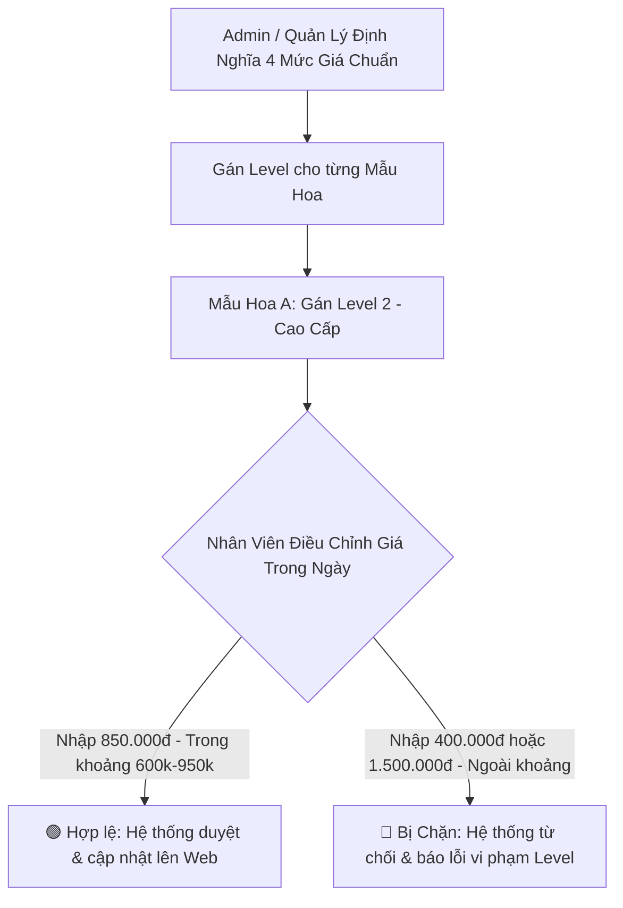

# Thiết Kế Phân Tầng Mức Giá & Kiểm Soát Giá Bán An Toàn (Price Levels & Guardrail Governance)
## Dự Án: Nở Hoa Thả Bình (`telua_flower`)

---

## 1. Mục Tiêu & Vấn Đề Nghiệp Vụ (Problem & Objectives)

- **Vấn đề:** Trong chuỗi cửa hàng hoa, nếu nhân viên được nhập giá tự do có thể dẫn đến rủi ro:
  - Gõ nhầm thêm số 0 hoặc bớt số 0 (VD: `500.000₫` thành `50.000₫` gây lỗ vốn, hoặc `5.000.000₫` làm khách hoang mang).
  - Nhân viên tự ý bán phá giá hoặc nâng giá quá cao làm ảnh hưởng uy tín thương hiệu.
- **Giải pháp:** Hệ thống áp dụng cơ chế **Phân Tầng Mức Giá Chuẩn (Price Levels)** và **Hàng rào kiểm soát giá sàn/giá trần (Price Guardrails)**. **CHỈ ADMIN HOẶC QUẢN LÝ** mới được quyền định nghĩa và gán mức giá cho từng mẫu hoa.



---

## 2. Hệ Thống 4 Tầng Mức Giá Chuẩn (Price Levels Matrix)

Hệ thống định nghĩa sẵn 4 phân tầng giá chuẩn do Admin cấu hình:

| Mã Level | Tên Phân Tầng | Khoảng Giá Cho Phép (Min - Max) | Giá Đề Xuất | Loại Sản Phẩm Điển Hình |
| :---: | :--- | :---: | :---: | :--- |
| **LV_01** | **Phổ Thông (Standard)** | **300.000₫ - 550.000₫** | `420.000₫` | Bó hoa hướng dương, cúc tana, hoa baby trắng, bình thủy tinh mini |
| **LV_02** | **Cao Cấp (Premium)** | **600.000₫ - 950.000₫** | `850.000₫` | Bó hoa hồng Ohara nhập khẩu, Tulip mix, lẵng hoa sinh nhật tone pastel |
| **LV_03** | **Sang Trọng (Luxury)** | **1.000.000₫ - 2.500.000₫** | `1.800.000₫` | Kệ hoa khai trương phát tài phát lộc, bình gốm nghệ thuật cao cấp |
| **LV_04** | **Độc Bản / VIP (Exclusive)**| **2.600.000₫ - 15.000.000₫**| `3.500.000₫` | Đại kệ sự kiện 3 tầng, chậu lan hồ điệp ghép lũa nghệ thuật 10-30 cành |

---

## 3. Cơ Chế Kiểm Soát An Toàn (Price Guardrail Validation Rules)

1. **Ràng buộc sàn/trần (`minPrice` & `maxPrice`):**
   - Khi nhân viên lưu giá một sản phẩm:
     $$\text{minPrice}_{\text{Level}} \le \text{salePrice} \le \text{maxPrice}_{\text{Level}}$$
   - Nếu giá nằm ngoài khoảng này, hệ thống **lập tức chặn lại và báo lỗi đỏ**:
     *`"Lỗi vi phạm mức giá: Sản phẩm này thuộc Level 2 (Cao Cấp), giá bán bắt buộc phải từ 600.000₫ đến 950.000₫. Vui lòng liên hệ Quản lý nếu cần nâng Level sản phẩm!"`*
2. **Quyền hạn quản trị nghiêm ngặt (RBAC Policy):**
   - **Chỉ Super Admin & Quản lý:** Có quyền tạo Level mới, thay đổi khoảng giá `[minPrice, maxPrice]`, hoặc đổi Level của một sản phẩm.
   - **Nhân viên:** Chỉ được phép chọn mức giá nằm trong phạm vi an toàn mà Level đó quy định.

---

## 4. Cấu Trúc Dữ Liệu Phân Tầng Giá (`config/price_levels.json`)

```json
[
  {
    "id": "price_lvl_01",
    "code": "LV_01",
    "name": "Phổ Thông (Standard)",
    "minPrice": 300000,
    "maxPrice": 550000,
    "defaultPrice": 420000,
    "description": "Dành cho bó hoa nhỏ, hoa chúc mừng bạn bè, sinh nhật học sinh sinh viên"
  },
  {
    "id": "price_lvl_02",
    "code": "LV_02",
    "name": "Cao Cấp (Premium)",
    "minPrice": 600000,
    "maxPrice": 950000,
    "defaultPrice": 850000,
    "description": "Dành cho hoa nhập khẩu, thiết kế độc bản tặng người yêu, đối tác"
  },
  {
    "id": "price_lvl_03",
    "code": "LV_03",
    "name": "Sang Trọng (Luxury)",
    "minPrice": 1000000,
    "maxPrice": 2500000,
    "defaultPrice": 1800000,
    "description": "Kệ hoa khai trương, sự kiện công ty, bình hoa thả bình nghệ thuật"
  },
  {
    "id": "price_lvl_04",
    "code": "LV_04",
    "name": "Độc Bản VIP (Exclusive)",
    "minPrice": 2600000,
    "maxPrice": 15000000,
    "defaultPrice": 3500000,
    "description": "Lan hồ điệp khủng, kệ hoa 3 tầng đại hội nghị"
  }
]
```

---

## 5. Thiết Kế API Endpoints Quản Lý Phân Tầng Giá

Các RESTful API endpoints phân quyền nghiêm ngặt theo chuẩn Blueprint `flower_connect_api`:

| Method | Endpoint | Quyền hạn | Mô tả |
| :--- | :--- | :---: | :--- |
| `GET` | `/api/flower/v1/price-levels` | Public / Staff | Xem danh sách các tầng mức giá và khoảng Min-Max (Hỗ trợ ETag Cache) |
| `GET` | `/api/flower/v1/admin/price-levels` | `super_admin`, `branch_manager` | Xem đầy đủ danh sách phân tầng giá thời gian thực cho Cổng Quản Trị |
| `POST` | `/api/flower/v1/admin/price-levels` | `super_admin` | Tạo phân tầng mức giá mới (Xác thực minPrice <= defaultPrice <= maxPrice, code duy nhất) |
| `PUT` | `/api/flower/v1/admin/price-levels/<id>` | `super_admin` | Điều chỉnh tên, mô tả, giá sàn (`minPrice`), giá trần (`maxPrice`), giá đề xuất |
| `DELETE`| `/api/flower/v1/admin/price-levels/<id>` | `super_admin` | Xóa phân tầng giá (Có hàng rào an toàn chặn xóa nếu đang có sản phẩm sử dụng) |

---

## 6. Hàng Rào An Toàn Khi Xóa (Deletion Safety Guardrail)

Để ngăn chặn lỗi mất toàn vẹn dữ liệu (Orphaned Price Levels) khi Admin quản trị phân tầng giá:
1. **Kiểm tra liên kết sản phẩm:** Khi gọi `DELETE /api/flower/v1/admin/price-levels/<level_id>`, hệ thống quét toàn bộ danh mục sản phẩm trong `products.json`.
2. **Từ chối thao tác nếu đang sử dụng:** Nếu có bất kỳ mẫu hoa nào đang được gán `priceLevelId` tương ứng, hệ thống lập tức từ chối và trả về HTTP 400 kèm tên chi tiết của các sản phẩm đang dùng.
3. **Bắt buộc duy trì mức giá tối thiểu:** Hệ thống không cho phép xóa nếu danh sách chỉ còn 1 phân tầng duy nhất.

---

## 7. Giao Diện Quản Trị & Động Hóa Dữ Liệu (No Hardcode JS)

1. **Sub-Tab Quản Trị Trong Cấu Hình Hệ Thống (`index.html`):**
   - Nằm trong modal Cấu hình hệ thống (`systemConfigModal`) với nút tab `tabSysBtnPriceLevels` (Icon `fa-layer-group`).
   - Giao diện dạng thẻ trực quan hiển thị Mã (`code`), Tên, Giá Sàn, Giá Đề Xuất, Giá Trần và các nút Sửa / Xóa.
   - Modal Thêm/Sửa Phân Tầng Giá (`#priceLevelModal`) với bộ kiểm tra số liệu thời gian thực (real-time validation).
2. **Loại Bỏ Hoàn Toàn Dữ Liệu Tĩnh (Hardcoded) Trên Frontend:**
   - [`js/portal_admin_state.js`](file:///d:/wmshare/telua_flower/js/portal_admin_state.js): Xóa bỏ đối tượng `PRICE_LEVEL_CONFIG` gán cứng. Dữ liệu được nạp động từ backend và đồng bộ qua hàm `setAdminPriceLevels()`.
   - [`js/portal_admin_products.js`](file:///d:/wmshare/telua_flower/js/portal_admin_products.js): Hàm `populatePriceLevelSelect()` render động các thẻ `<option>` cho select box chọn mức giá mỗi khi mở modal tạo/sửa mẫu hoa.
   - Thẻ `<select id="prodPriceLevel">` trong `index.html` loại bỏ các `<option>` tĩnh, bảo đảm tính nhất quán khi Admin tạo thêm tầng mới (ví dụ `LV_05`).

---

## 8. Kiểm Thử Tự Động (Automated Unit Tests)

Toàn bộ các luồng nghiệp vụ trên được bảo vệ bởi bộ kiểm thử tự động tại [`src/unittest/test_admin_price_levels.py`](file:///d:/wmshare/telua_flower/src/unittest/test_admin_price_levels.py) (7/7 tests PASS):
- `test_01_get_price_levels_public_and_admin`: Kiểm tra phân quyền truy cập.
- `test_02_create_price_level_success`: Tạo mới mức giá thành công.
- `test_03_create_price_level_validation_errors`: Chặn thiếu code, min > max, default nằm ngoài khoảng, trùng mã code.
- `test_04_update_price_level`: Cập nhật thông tin và khoảng giá.
- `test_05_delete_price_level_guardrail_prevents_in_use`: Chặn xóa mức giá đang có sản phẩm gán.
- `test_06_delete_price_level_success`: Xóa thành công mức giá độc lập.
- `test_07_price_governance_with_new_price_level`: Hàng rào kiểm soát giá nhận diện ngay mức giá mới tạo.

