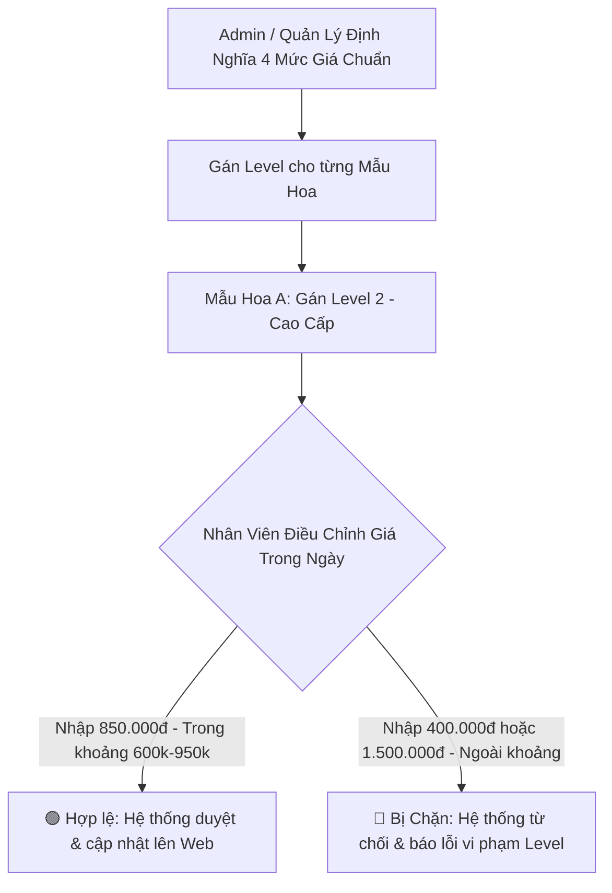

# Thiết Kế Phân Tầng Mức Giá & Kiểm Soát Giá Bán An Toàn (Price Levels & Guardrail Governance)
## Dự Án: Nở Hoa Thả Bình (`telua_flower`)

---

## 1. Mục Tiêu & Vấn Đề Nghiệp Vụ (Problem & Objectives)

- **Vấn đề:** Trong chuỗi cửa hàng hoa, nếu nhân viên được nhập giá tự do có thể dẫn đến rủi ro:
  - Gõ nhầm thêm số 0 hoặc bớt số 0 (VD: `500.000₫` thành `50.000₫` gây lỗ vốn, hoặc `5.000.000₫` làm khách hoang mang).
  - Nhân viên tự ý bán phá giá hoặc nâng giá quá cao làm ảnh hưởng uy tín thương hiệu.
- **Giải pháp:** Hệ thống áp dụng cơ chế **Phân Tầng Mức Giá Chuẩn (Price Levels)** và **Hàng rào kiểm soát giá sàn/giá trần (Price Guardrails)**. **CHỈ ADMIN HOẶC QUẢN LÝ** mới được quyền định nghĩa và gán mức giá cho từng mẫu hoa.



---

## 2. Hệ Thống 4 Tầng Mức Giá Chuẩn (Price Levels Matrix)

Hệ thống định nghĩa sẵn 4 phân tầng giá chuẩn do Admin cấu hình:

| Mã Level | Tên Phân Tầng | Khoảng Giá Cho Phép (Min - Max) | Giá Đề Xuất | Loại Sản Phẩm Điển Hình |
| :---: | :--- | :---: | :---: | :--- |
| **LV_01** | **Phổ Thông (Standard)** | **300.000₫ - 550.000₫** | `420.000₫` | Bó hoa hướng dương, cúc tana, hoa baby trắng, bình thủy tinh mini |
| **LV_02** | **Cao Cấp (Premium)** | **600.000₫ - 950.000₫** | `850.000₫` | Bó hoa hồng Ohara nhập khẩu, Tulip mix, lẵng hoa sinh nhật tone pastel |
| **LV_03** | **Sang Trọng (Luxury)** | **1.000.000₫ - 2.500.000₫** | `1.800.000₫` | Kệ hoa khai trương phát tài phát lộc, bình gốm nghệ thuật cao cấp |
| **LV_04** | **Độc Bản / VIP (Exclusive)**| **2.600.000₫ - 15.000.000₫**| `3.500.000₫` | Đại kệ sự kiện 3 tầng, chậu lan hồ điệp ghép lũa nghệ thuật 10-30 cành |

---

## 3. Cơ Chế Kiểm Soát An Toàn (Price Guardrail Validation Rules)

1. **Ràng buộc sàn/trần (`minPrice` & `maxPrice`):**
   - Khi nhân viên lưu giá một sản phẩm:
     $$\text{minPrice}_{\text{Level}} \le \text{salePrice} \le \text{maxPrice}_{\text{Level}}$$
   - Nếu giá nằm ngoài khoảng này, hệ thống **lập tức chặn lại và báo lỗi đỏ**:
     *`"Lỗi vi phạm mức giá: Sản phẩm này thuộc Level 2 (Cao Cấp), giá bán bắt buộc phải từ 600.000₫ đến 950.000₫. Vui lòng liên hệ Quản lý nếu cần nâng Level sản phẩm!"`*
2. **Quyền hạn quản trị nghiêm ngặt (RBAC Policy):**
   - **Chỉ Super Admin & Quản lý:** Có quyền tạo Level mới, thay đổi khoảng giá `[minPrice, maxPrice]`, hoặc đổi Level của một sản phẩm.
   - **Nhân viên:** Chỉ được phép chọn mức giá nằm trong phạm vi an toàn mà Level đó quy định.

---

## 4. Cấu Trúc Dữ Liệu Phân Tầng Giá (`config/price_levels.json`)

```json
[
  {
    "id": "price_lvl_01",
    "code": "LV_01",
    "name": "Phổ Thông (Standard)",
    "minPrice": 300000,
    "maxPrice": 550000,
    "defaultPrice": 420000,
    "description": "Dành cho bó hoa nhỏ, hoa chúc mừng bạn bè, sinh nhật học sinh sinh viên"
  },
  {
    "id": "price_lvl_02",
    "code": "LV_02",
    "name": "Cao Cấp (Premium)",
    "minPrice": 600000,
    "maxPrice": 950000,
    "defaultPrice": 850000,
    "description": "Dành cho hoa nhập khẩu, thiết kế độc bản tặng người yêu, đối tác"
  },
  {
    "id": "price_lvl_03",
    "code": "LV_03",
    "name": "Sang Trọng (Luxury)",
    "minPrice": 1000000,
    "maxPrice": 2500000,
    "defaultPrice": 1800000,
    "description": "Kệ hoa khai trương, sự kiện công ty, bình hoa thả bình nghệ thuật"
  },
  {
    "id": "price_lvl_04",
    "code": "LV_04",
    "name": "Độc Bản VIP (Exclusive)",
    "minPrice": 2600000,
    "maxPrice": 15000000,
    "defaultPrice": 3500000,
    "description": "Lan hồ điệp khủng, kệ hoa 3 tầng đại hội nghị"
  }
]
```

---

## 5. Thiết Kế API Endpoints Quản Lý Phân Tầng Giá

| Method | Endpoint | Quyền hạn | Mô tả |
| :--- | :--- | :---: | :--- |
| `GET` | `/api/price-levels` | Staff, Manager, Admin | Xem danh sách các tầng mức giá và khoảng Min-Max |
| `POST` | `/api/admin/price-levels` | `super_admin` | Tạo phân tầng mức giá mới |
| `PUT` | `/api/admin/price-levels/<id>` | `super_admin` | Điều chỉnh giá sàn (`minPrice`) hoặc giá trần (`maxPrice`) của Level |
| `PUT` | `/api/admin/products/<id>/price-level` | Manager, Admin | **Gán hoặc Đổi Level mức giá cho một mẫu hoa** |

#### Backend Flask Validator Logic:
```python
def validate_product_price(product_id, new_price):
    product = get_product_by_id(product_id)
    price_level = get_price_level_by_id(product.get('priceLevelId'))
    
    if new_price < price_level['minPrice'] or new_price > price_level['maxPrice']:
        raise ValidationError(
            f"Giá bán {new_price:,.0f}₫ không hợp lệ! "
            f"Mẫu hoa này thuộc phân tầng '{price_level['name']}', "
            f"chỉ cho phép giá từ {price_level['minPrice']:,.0f}₫ đến {price_level['maxPrice']:,.0f}₫."
        )
    return True
```
