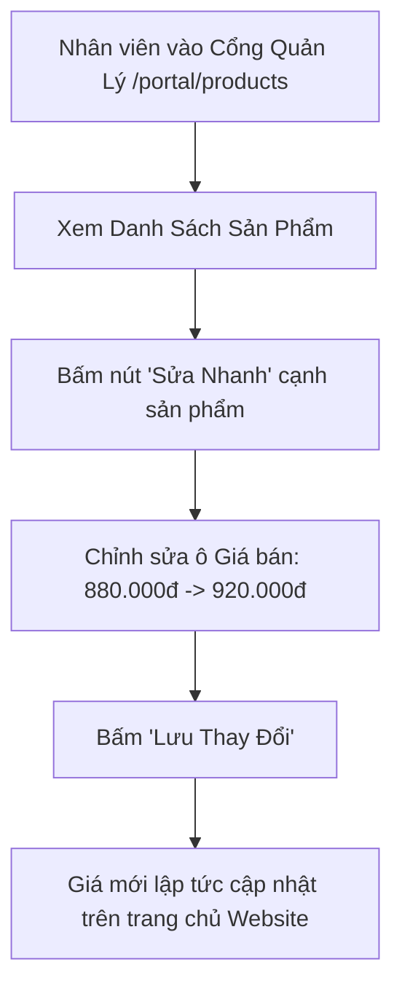

# Thiết Kế Phân Hệ Quản Lý & Chỉnh Sửa Thông Tin, Giá, Hình Ảnh Sản Phẩm (Product CMS Design)
## Dự Án: Nở Hoa Thả Bình (`telua_flower`)

---

## 1. Tổng Quan Phân Hệ (Overview)

Phân hệ **Quản Lý Sản Phẩm (Product CMS)** cho phép Nhân viên (được phân quyền) và Quản lý có thể:
1. **Thêm mới mẫu hoa / bình hoa:** Tải ảnh, đặt tên, chọn danh mục, điền giá và mô tả thành phần hoa.
2. **Chỉnh sửa linh hoạt:** Điều chỉnh giá bán (khi giá hoa tươi thị trường biến động theo mùa/lễ Tết), thay đổi hình ảnh đại diện, cập nhật nhãn khuyến mãi (`Hot`, `-10%`).
3. **Quản lý nội dung chi tiết:** Soạn thảo ý nghĩa bó hoa, thành phần loại hoa (VD: *10 bông hồng Ohara, hoa baby trắng, lá bạc*), kích thước và mẹo giữ hoa tươi lâu.
4. **Bật/Tắt trạng thái hiển thị:** Ẩn tạm thời các mẫu hoa trái mùa hoặc chưa có hoa về mà không cần xóa dữ liệu.

---

## 2. Chi Tiết Các Trường Thông Tin Sản Phẩm (Product Data Fields)

Mỗi mẫu hoa trên website hỗ trợ đầy đủ các trường thông tin:

| Tên trường | Kiểu dữ liệu | Bắt buộc | Mô tả & Ví dụ |
| :--- | :---: | :---: | :--- |
| `name` | String | Có | Tên mẫu hoa: *Mây Trắng Bồng Bềnh*, *Ohara Pink Viency* |
| `category` | Enum | Có | `bo_hoa` (Bó hoa), `lang_hoa` (Lẵng), `ke_hoa` (Kệ khai trương), `binh_hoa` (Bình nghệ thuật), `lan_ho_diep`, `hoa_cuoi` |
| `originalPrice` | Number / String | Có | Giá gốc niêm yết: `950.000₫` |
| `salePrice` | Number / String | Có | Giá bán thực tế: `880.000₫` |
| `badge` | String | Không | Nhãn nổi bật: `Hot`, `Mới`, `-10%`, `Bán chạy` (hoặc để trống) |
| `image` | String (URL) | Có | Ảnh đại diện chính (tải lên từ máy hoặc link ảnh) |
| `gallery` | Array[String] | Không | Danh sách các ảnh chụp góc khác, ảnh chụp cận cảnh hoa |
| `description` | Text / HTML | Không | Đoạn văn mô tả cảm xúc & ý nghĩa bó hoa |
| `flowerComposition`| Array / Text | Không | **Thành phần hoa:** *Hồng Ohara (10 cành), Cúc Tana, Hoa Sao Xanh, Lá Bạc Dollar* |
| `dimension` | String | Không | Kích thước ước tính: *Cao 55cm x Rộng 40cm* |
| `careTips` | Text | Không | Hướng dẫn chăm sóc: *Cắt gốc xéo 45 độ, phun sương nhẹ cánh hoa mỗi sáng* |
| `isActive` | Boolean | Có | `true`: Hiển thị trên web; `false`: Tạm ẩn |

---

## 3. Quy Trình 2 Thao Tác Của Nhân Viên

### 📝 Thao tác 1: Chỉnh sửa nhanh Giá & Trạng thái (Quick Edit)
*Dành cho nhân viên cần cập nhật giá nhanh vào các dịp lễ (14/2, 8/3, 20/10...):*



---

### 🖼️ Thao tác 2: Thêm mới hoặc Sửa toàn diện Thông tin & Hình ảnh (Full Edit Modal)
*Dành cho khi ra mắt mẫu cắm mới hoặc cập nhật ảnh chụp thực tế:*

1. **Bước 1:** Bấm nút **"Thêm Mẫu Hoa Mới"** hoặc bấm biểu tượng ✏️ **"Chỉnh sửa"** trên sản phẩm.
2. **Bước 2 (Quản lý Hình ảnh):**
   - Bấm **"Chọn ảnh từ máy"** (Hỗ trợ kéo thả ảnh `.jpg`, `.png`, `.webp`).
   - Hệ thống tự động nén dung lượng ảnh để tối ưu tốc độ tải trang dưới 1s.
   - Hoặc dán trực tiếp đường link ảnh từ kho ảnh công khai.
3. **Bước 3 (Nhập Nội dung & Giá):**
   - Điền Tên hoa, Danh mục, Giá gốc và Giá khuyến mãi.
   - Nhập danh sách thành phần hoa (VD: *Hồng Ecuador, Tulip Hà Lan*).
   - Nhập lời khuyên chăm sóc hoa tươi lâu.
4. **Bước 4:** Bấm **"Đăng Lên Website"** $\rightarrow$ Hệ thống tự động đồng bộ và hiển thị ngay trên giao diện `index.html`.

---

## 4. Thiết Kế API Endpoints Quản Lý Nội Dung Sản Phẩm

| Method | Endpoint | Quyền hạn | Mô tả |
| :--- | :--- | :---: | :--- |
| `GET` | `/api/admin/products` | Staff, Manager, Admin | Lấy toàn bộ danh sách sản phẩm (kèm các sản phẩm đang ẩn) |
| `POST` | `/api/admin/products` | Manager, Admin | Tạo sản phẩm hoa mới |
| `PUT` | `/api/admin/products/<id>` | Staff, Manager, Admin | Cập nhật toàn bộ thông tin (Tên, Giá, Ảnh, Mô tả, Thành phần) |
| `PATCH`| `/api/admin/products/<id>/price` | Staff, Manager, Admin | **Cập nhật nhanh giá bán** |
| `PATCH`| `/api/admin/products/<id>/status` | Staff, Manager, Admin | Bật / Tắt trạng thái hiển thị (`isActive`: true/false) |
| `POST` | `/api/admin/upload-image` | Staff, Manager, Admin | **Tải ảnh hoa lên máy chủ** (trả về URL ảnh) |

#### Request mẫu cập nhật toàn diện (`PUT /api/admin/products/bo_hoa_01`):
```json
{
  "name": "Mây Trắng Bồng Bềnh",
  "category": "bo_hoa",
  "originalPrice": "480,000₫",
  "salePrice": "450,000₫",
  "badge": "Hot",
  "image": "https://images.unsplash.com/photo-1562690868-60bbe7293e94?w=500",
  "description": "Bó hoa tone trắng tinh khôi kết hợp hoa sao xanh mang đến cảm giác dịu êm, thanh lịch.",
  "flowerComposition": "Hồng trắng Ohara (10 cành), Hoa Sao Xanh, Cúc Tana, Lá Bạc Dollar",
  "dimension": "Cao 50cm x Rộng 40cm",
  "careTips": "Đặt hoa nơi mát mẻ, tránh ánh nắng trực tiếp và quạt gió thổi mạnh.",
  "isActive": true
}
```

---

## 5. Phân Quyền Thao Tác (Permissions)

- **Nhân viên (Staff / Florist / Sales):** Được phép sửa nhanh giá bán trong ngày và upload ảnh chụp thực tế.
- **Quản lý chi nhánh (Branch Manager):** Toàn quyền thêm, sửa giá, sửa nội dung mô tả và ẩn/hiện sản phẩm.
- **Quản trị viên (Super Admin):** Toàn quyền quản lý danh mục và cấu trúc sản phẩm toàn hệ thống.
