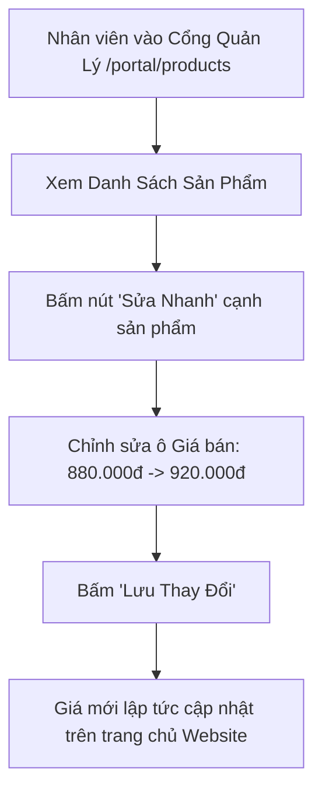
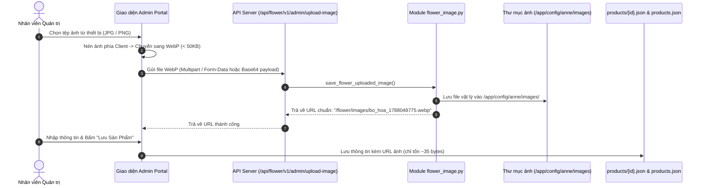

# Thiết Kế Phân Hệ Quản Lý & Chỉnh Sửa Thông Tin, Giá, Hình Ảnh Sản Phẩm (Product CMS Design)
## Dự Án: Nở Hoa Thả Bình (`telua_flower`)

---

## 1. Tổng Quan Phân Hệ (Overview)

Phân hệ **Quản Lý Sản Phẩm (Product CMS)** cho phép Nhân viên (được phân quyền) và Quản lý có thể:
1. **Thêm mới mẫu hoa / bình hoa:** Tải ảnh, đặt tên, chọn danh mục, điền giá và mô tả thành phần hoa.
2. **Chỉnh sửa linh hoạt:** Điều chỉnh giá bán (khi giá hoa tươi thị trường biến động theo mùa/lễ Tết), thay đổi hình ảnh đại diện, cập nhật nhãn khuyến mãi (`Hot`, `-10%`).
3. **Quản lý nội dung chi tiết:** Soạn thảo ý nghĩa bó hoa, thành phần loại hoa (VD: *10 bông hồng Ohara, hoa baby trắng, lá bạc*), kích thước và mẹo giữ hoa tươi lâu.
4. **Bật/Tắt trạng thái hiển thị:** Ẩn tạm thời các mẫu hoa trái mùa hoặc chưa có hoa về mà không cần xóa dữ liệu.

---

## 2. Chi Tiết Các Trường Thông Tin Sản Phẩm (Product Data Fields)

Mỗi mẫu hoa trên website hỗ trợ đầy đủ các trường thông tin:

| Tên trường | Kiểu dữ liệu | Bắt buộc | Mô tả & Ví dụ |
| :--- | :---: | :---: | :--- |
| `name` | String | Có | Tên mẫu hoa: *Mây Trắng Bồng Bềnh*, *Ohara Pink Viency* |
| `category` | Enum | Có | `bo_hoa` (Bó hoa), `lang_hoa` (Lẵng), `ke_hoa` (Kệ khai trương), `binh_hoa` (Bình nghệ thuật), `lan_ho_diep`, `hoa_cuoi` |
| `originalPrice` | Number / String | Có | Giá gốc niêm yết: `950.000₫` |
| `salePrice` | Number / String | Có | Giá bán thực tế: `880.000₫` |
| `badge` | String | Không | Nhãn nổi bật: `Hot`, `Mới`, `-10%`, `Bán chạy` (hoặc để trống) |
| `image` | String (URL) | Có | Ảnh đại diện chính (tải lên từ máy hoặc link ảnh) |
| `gallery` | Array[String] | Không | Danh sách các ảnh chụp góc khác, ảnh chụp cận cảnh hoa |
| `description` | Text / HTML | Không | Đoạn văn mô tả cảm xúc & ý nghĩa bó hoa |
| `flowerComposition`| Array / Text | Không | **Thành phần hoa:** *Hồng Ohara (10 cành), Cúc Tana, Hoa Sao Xanh, Lá Bạc Dollar* |
| `dimension` | String | Không | Kích thước ước tính: *Cao 55cm x Rộng 40cm* |
| `careTips` | Text | Không | Hướng dẫn chăm sóc: *Cắt gốc xéo 45 độ, phun sương nhẹ cánh hoa mỗi sáng* |
| `isActive` | Boolean | Có | `true`: Hiển thị trên web; `false`: Tạm ẩn |

---

## 3. Quy Trình 2 Thao Tác Của Nhân Viên

### 📝 Thao tác 1: Chỉnh sửa nhanh Giá & Trạng thái (Quick Edit)
*Dành cho nhân viên cần cập nhật giá nhanh vào các dịp lễ (14/2, 8/3, 20/10...):*



---

### 🖼️ Thao tác 2: Thêm mới hoặc Sửa toàn diện Thông tin & Hình ảnh (Full Edit Modal)
*Dành cho khi ra mắt mẫu cắm mới hoặc cập nhật ảnh chụp thực tế:*

1. **Bước 1:** Bấm nút **"Thêm Mẫu Hoa Mới"** hoặc bấm biểu tượng ✏️ **"Chỉnh sửa"** trên sản phẩm.
2. **Bước 2 (Quản lý Hình ảnh Đại Diện & Bộ Sưu Tập Gallery):**
   - **Ảnh đại diện chính (`image`):** Upload từ máy hoặc dán link ảnh URL trực tiếp.
   - **Bộ sưu tập ảnh chụp các góc (`gallery`):** Thêm nhiều link ảnh góc chụp khác hoặc upload ảnh phụ, xem thumbnail trực quan và xóa từng ảnh bằng nút ❌.
3. **Bước 3 (Nhập Nội dung Chi tiết & Giá bán):**
   - Điền Tên hoa, Danh mục, Huy hiệu nổi bật (`badge`: Bán Chạy, Mới, Hot...).
   - Thiết lập Phân tầng mức giá (Price Level) và Giá bán kiểm soát sàn/trần.
   - Nhập Kích thước bó hoa (`dimension`: VD: *Cao 55cm x Rộng 45cm*).
   - Nhập Đoạn văn mô tả cảm xúc sản phẩm (`description`).
   - Nhập Thành phần loài hoa chi tiết (`flowerComposition`).
   - Nhập Hướng dẫn chăm sóc hoa tươi lâu (`careTips`).
   - Cập nhật số lượng tồn kho từng chi nhánh (`stockByBranch`: Q.10, Q.1, Thảo Điền).
4. **Bước 4:** Bấm **"Lưu Sản Phẩm"** $\rightarrow$ Hệ thống tự động:
   - Ghi đầy đủ 100% dữ liệu chi tiết vào file `config/anne/products/{id}.json` (kèm mảng `gallery: [...]` đầy đủ).
   - Cập nhật bản tóm tắt tinh gọn vào file `config/anne/products.json`.
   - Hiển thị tức thì trên Modal Chi Tiết Nhanh (`productQuickDetailModal`) và Catalogue trang chủ.

---

### 📸 Thao tác 3: Quản Lý Bộ Sưu Tập Ảnh Phụ (Product Gallery Manager)
1. **Thêm ảnh vào Gallery:**
   - Nhập URL ảnh vào ô **"URL ảnh phụ"** và bấm **"➕ Thêm Ảnh"** (hoặc chọn tệp từ thiết bị).
   - Ảnh mới lập tức xuất hiện trong danh sách thumbnail xem trước của sản phẩm.
2. **Xóa ảnh khỏi Gallery:**
   - Mỗi thumbnail trong danh sách có nút xóa đỏ ❌ ở góc trên.
   - Bấm nút ❌ để loại bỏ ảnh đó khỏi danh sách gallery.
3. **Lưu thay đổi:**
   - Bấm **"Lưu Mẫu Hoa"** để cập nhật mảng `gallery: [...]` vào tệp chi tiết `config/anne/products/{id}.json`.

## 4. Thiết Kế API Endpoints Quản Lý Nội Dung Sản Phẩm

| Method | Endpoint | Quyền hạn | Mô tả |
| :--- | :--- | :---: | :--- |
| `GET` | `/api/admin/products` | Staff, Manager, Admin | Lấy toàn bộ danh sách sản phẩm (kèm các sản phẩm đang ẩn) |
| `POST` | `/api/admin/products` | Manager, Admin | Tạo sản phẩm hoa mới |
| `PUT` | `/api/admin/products/<id>` | Staff, Manager, Admin | Cập nhật toàn bộ thông tin (Tên, Giá, Ảnh, Mô tả, Thành phần) |
| `PATCH`| `/api/admin/products/<id>/price` | Staff, Manager, Admin | **Cập nhật nhanh giá bán** |
| `PATCH`| `/api/admin/products/<id>/status` | Staff, Manager, Admin | Bật / Tắt trạng thái hiển thị (`isActive`: true/false) |
| `POST` | `/api/admin/upload-image` | Staff, Manager, Admin | **Tải ảnh hoa lên máy chủ** (trả về URL ảnh) |

#### Request mẫu cập nhật toàn diện (`PUT /api/admin/products/bo_hoa_01`):
```json
{
  "name": "Mây Trắng Bồng Bềnh",
  "category": "bo_hoa",
  "originalPrice": "480,000₫",
  "salePrice": "450,000₫",
  "badge": "Hot",
  "image": "https://images.unsplash.com/photo-1562690868-60bbe7293e94?w=500",
  "description": "Bó hoa tone trắng tinh khôi kết hợp hoa sao xanh mang đến cảm giác dịu êm, thanh lịch.",
  "flowerComposition": "Hồng trắng Ohara (10 cành), Hoa Sao Xanh, Cúc Tana, Lá Bạc Dollar",
  "dimension": "Cao 50cm x Rộng 40cm",
  "careTips": "Đặt hoa nơi mát mẻ, tránh ánh nắng trực tiếp và quạt gió thổi mạnh.",
  "isActive": true
}
```

---

## 5. Phân Quyền Thao Tác (Permissions)

- **Nhân viên (Staff / Florist / Sales):** Được phép sửa nhanh giá bán trong ngày và upload ảnh chụp thực tế.
- **Quản lý chi nhánh (Branch Manager):** Toàn quyền thêm, sửa giá, sửa nội dung mô tả và ẩn/hiện sản phẩm.
- **Quản trị viên (Super Admin):** Toàn quyền quản lý danh mục và cấu trúc sản phẩm toàn hệ thống.

---

## 6. Kiến Trúc Đa Ngôn Ngữ Phân Tách Cho Mẫu Hoa (Modular Product i18n Architecture)

Nhằm tối ưu hóa hiệu năng tải trang và tránh làm phình to file từ điển hệ thống `translations.json`, toàn bộ nội dung dịch đa ngôn ngữ của mẫu hoa được **lưu trữ trực tiếp và độc lập bên trong từng tệp chi tiết `config/anne/products/{id}.json`**:

### 6.1. Cấu Trúc Khối Dữ Liệu `i18n` Trong `products/{id}.json`:
```json
{
  "id": "bo_hoa_01",
  "name": "Mây Trắng Bồng Bềnh",
  "category": "bo_hoa",
  "priceNumber": 420000,
  "flowerComposition": "Hồng trắng Ohara (10 cành), Cúc Tana, Hoa Sao Xanh, Lá Bạc Dollar",
  "description": "Bó hoa tone trắng tinh khôi kết hợp hoa sao xanh mang đến cảm giác dịu êm, thanh lịch.",
  "careTips": "Cắt gốc 45 độ, phun sương nhẹ cánh hoa mỗi sáng.",
  "i18n": {
# Thiết Kế Phân Hệ Quản Lý & Chỉnh Sửa Thông Tin, Giá, Hình Ảnh Sản Phẩm (Product CMS Design)
## Dự Án: Nở Hoa Thả Bình (`telua_flower`)

---

## 1. Tổng Quan Phân Hệ (Overview)

Phân hệ **Quản Lý Sản Phẩm (Product CMS)** cho phép Nhân viên (được phân quyền) và Quản lý có thể:
1. **Thêm mới mẫu hoa / bình hoa:** Tải ảnh, đặt tên, chọn danh mục, điền giá và mô tả thành phần hoa.
2. **Chỉnh sửa linh hoạt:** Điều chỉnh giá bán (khi giá hoa tươi thị trường biến động theo mùa/lễ Tết), thay đổi hình ảnh đại diện, cập nhật nhãn khuyến mãi (`Hot`, `-10%`).
3. **Quản lý nội dung chi tiết:** Soạn thảo ý nghĩa bó hoa, thành phần loại hoa (VD: *10 bông hồng Ohara, hoa baby trắng, lá bạc*), kích thước và mẹo giữ hoa tươi lâu.
4. **Bật/Tắt trạng thái hiển thị:** Ẩn tạm thời các mẫu hoa trái mùa hoặc chưa có hoa về mà không cần xóa dữ liệu.

---

## 2. Chi Tiết Các Trường Thông Tin Sản Phẩm (Product Data Fields)

Mỗi mẫu hoa trên website hỗ trợ đầy đủ các trường thông tin:

| Tên trường | Kiểu dữ liệu | Bắt buộc | Mô tả & Ví dụ |
| :--- | :---: | :---: | :--- |
| `name` | String | Có | Tên mẫu hoa: *Mây Trắng Bồng Bềnh*, *Ohara Pink Viency* |
| `category` | Enum | Có | `bo_hoa` (Bó hoa), `lang_hoa` (Lẵng), `ke_hoa` (Kệ khai trương), `binh_hoa` (Bình nghệ thuật), `lan_ho_diep`, `hoa_cuoi` |
| `originalPrice` | Number / String | Có | Giá gốc niêm yết: `950.000₫` |
| `salePrice` | Number / String | Có | Giá bán thực tế: `880.000₫` |
| `badge` | String | Không | Nhãn nổi bật: `Hot`, `Mới`, `-10%`, `Bán chạy` (hoặc để trống) |
| `image` | String (URL) | Có | Ảnh đại diện chính (tải lên từ máy hoặc link ảnh) |
| `gallery` | Array[String] | Không | Danh sách các ảnh chụp góc khác, ảnh chụp cận cảnh hoa |
| `description` | Text / HTML | Không | Đoạn văn mô tả cảm xúc & ý nghĩa bó hoa |
| `flowerComposition`| Array / Text | Không | **Thành phần hoa:** *Hồng Ohara (10 cành), Cúc Tana, Hoa Sao Xanh, Lá Bạc Dollar* |
| `dimension` | String | Không | Kích thước ước tính: *Cao 55cm x Rộng 40cm* |
| `careTips` | Text | Không | Hướng dẫn chăm sóc: *Cắt gốc xéo 45 độ, phun sương nhẹ cánh hoa mỗi sáng* |
| `isActive` | Boolean | Có | `true`: Hiển thị trên web; `false`: Tạm ẩn |

---

## 3. Quy Trình 2 Thao Tác Của Nhân Viên

### 📝 Thao tác 1: Chỉnh sửa nhanh Giá & Trạng thái (Quick Edit)
*Dành cho nhân viên cần cập nhật giá nhanh vào các dịp lễ (14/2, 8/3, 20/10...):*


---

### 🖼️ Thao tác 2: Thêm mới hoặc Sửa toàn diện Thông tin & Hình ảnh (Full Edit Modal)
*Dành cho khi ra mắt mẫu cắm mới hoặc cập nhật ảnh chụp thực tế:*

1. **Bước 1:** Bấm nút **"Thêm Mẫu Hoa Mới"** hoặc bấm biểu tượng ✏️ **"Chỉnh sửa"** trên sản phẩm.
2. **Bước 2 (Quản lý Hình ảnh Đại Diện & Bộ Sưu Tập Gallery):**
   - **Ảnh đại diện chính (`image`):** Upload từ máy hoặc dán link ảnh URL trực tiếp.
   - **Bộ sưu tập ảnh chụp các góc (`gallery`):** Thêm nhiều link ảnh góc chụp khác hoặc upload ảnh phụ, xem thumbnail trực quan và xóa từng ảnh bằng nút ❌.
3. **Bước 3 (Nhập Nội dung Chi tiết & Giá bán):**
   - Điền Tên hoa, Danh mục, Huy hiệu nổi bật (`badge`: Bán Chạy, Mới, Hot...).
   - Thiết lập Phân tầng mức giá (Price Level) và Giá bán kiểm soát sàn/trần.
   - Nhập Kích thước bó hoa (`dimension`: VD: *Cao 55cm x Rộng 45cm*).
   - Nhập Đoạn văn mô tả cảm xúc sản phẩm (`description`).
   - Nhập Thành phần loài hoa chi tiết (`flowerComposition`).
   - Nhập Hướng dẫn chăm sóc hoa tươi lâu (`careTips`).
   - Cập nhật số lượng tồn kho từng chi nhánh (`stockByBranch`: Q.10, Q.1, Thảo Điền).
4. **Bước 4:** Bấm **"Lưu Sản Phẩm"** $\rightarrow$ Hệ thống tự động:
   - Ghi đầy đủ 100% dữ liệu chi tiết vào file `config/anne/products/{id}.json` (kèm mảng `gallery: [...]` đầy đủ).
   - Cập nhật bản tóm tắt tinh gọn vào file `config/anne/products.json`.
   - Hiển thị tức thì trên Modal Chi Tiết Nhanh (`productQuickDetailModal`) và Catalogue trang chủ.

---

### 📸 Thao tác 3: Quản Lý Bộ Sưu Tập Ảnh Phụ (Product Gallery Manager)
1. **Thêm ảnh vào Gallery:**
   - Nhập URL ảnh vào ô **"URL ảnh phụ"** và bấm **"➕ Thêm Ảnh"** (hoặc chọn tệp từ thiết bị).
   - Ảnh mới lập tức xuất hiện trong danh sách thumbnail xem trước của sản phẩm.
2. **Xóa ảnh khỏi Gallery:**
   - Mỗi thumbnail trong danh sách có nút xóa đỏ ❌ ở góc trên.
   - Bấm nút ❌ để loại bỏ ảnh đó khỏi danh sách gallery.
3. **Lưu thay đổi:**
   - Bấm **"Lưu Mẫu Hoa"** để cập nhật mảng `gallery: [...]` vào tệp chi tiết `config/anne/products/{id}.json`.

## 4. Thiết Kế API Endpoints Quản Lý Nội Dung Sản Phẩm

| Method | Endpoint | Quyền hạn | Mô tả |
| :--- | :--- | :---: | :--- |
| `GET` | `/api/admin/products` | Staff, Manager, Admin | Lấy toàn bộ danh sách sản phẩm (kèm các sản phẩm đang ẩn) |
| `POST` | `/api/admin/products` | Manager, Admin | Tạo sản phẩm hoa mới |
| `PUT` | `/api/admin/products/<id>` | Staff, Manager, Admin | Cập nhật toàn bộ thông tin (Tên, Giá, Ảnh, Mô tả, Thành phần) |
| `PATCH`| `/api/admin/products/<id>/price` | Staff, Manager, Admin | **Cập nhật nhanh giá bán** |
| `PATCH`| `/api/admin/products/<id>/status` | Staff, Manager, Admin | Bật / Tắt trạng thái hiển thị (`isActive`: true/false) |
| `POST` | `/api/admin/upload-image` | Staff, Manager, Admin | **Tải ảnh hoa lên máy chủ** (trả về URL ảnh) |

#### Request mẫu cập nhật toàn diện (`PUT /api/admin/products/bo_hoa_01`):
```json
{
  "name": "Mây Trắng Bồng Bềnh",
  "category": "bo_hoa",
  "originalPrice": "480,000₫",
  "salePrice": "450,000₫",
  "badge": "Hot",
  "image": "https://images.unsplash.com/photo-1562690868-60bbe7293e94?w=500",
  "description": "Bó hoa tone trắng tinh khôi kết hợp hoa sao xanh mang đến cảm giác dịu êm, thanh lịch.",
  "flowerComposition": "Hồng trắng Ohara (10 cành), Hoa Sao Xanh, Cúc Tana, Lá Bạc Dollar",
  "dimension": "Cao 50cm x Rộng 40cm",
  "careTips": "Đặt hoa nơi mát mẻ, tránh ánh nắng trực tiếp và quạt gió thổi mạnh.",
  "isActive": true
}
```

---

## 5. Phân Quyền Thao Tác (Permissions)

- **Nhân viên (Staff / Florist / Sales):** Được phép sửa nhanh giá bán trong ngày và upload ảnh chụp thực tế.
- **Quản lý chi nhánh (Branch Manager):** Toàn quyền thêm, sửa giá, sửa nội dung mô tả và ẩn/hiện sản phẩm.
- **Quản trị viên (Super Admin):** Toản quyền quản lý danh mục và cấu trúc sản phẩm toàn hệ thống.

---

## 6. Kiến Trúc Đa Ngôn Ngữ Phân Tách Cho Mẫu Hoa (Modular Product i18n Architecture)

Nhằm tối ưu hóa hiệu năng tải trang và tránh làm phình to file từ điển hệ thống `translations.json`, toàn bộ nội dung dịch đa ngôn ngữ của mẫu hoa được **lưu trữ trực tiếp và độc lập bên trong từng tệp chi tiết `config/anne/products/{id}.json`**:

### 6.1. Cấu Trúc Khối Dữ Liệu `i18n` Trong `products/{id}.json`:
```json
{
  "id": "bo_hoa_01",
  "name": "Mây Trắng Bồng Bềnh",
  "category": "bo_hoa",
  "priceNumber": 420000,
  "flowerComposition": "Hồng trắng Ohara (10 cành), Cúc Tana, Hoa Sao Xanh, Lá Bạc Dollar",
  "description": "Bó hoa tone trắng tinh khôi kết hợp hoa sao xanh mang đến cảm giác dịu êm, thanh lịch.",
  "careTips": "Cắt gốc 45 độ, phun sương nhẹ cánh hoa mỗi sáng.",
  "i18n": {
    "en": {
      "name": "Floating White Clouds Bouquet",
      "flowerComposition": "White Ohara Roses (10 stems), Tweedia, Tana Daisies, Silver Dollar Eucalyptus",
      "description": "A pure white bouquet accented with sky blue tweedia, conveying serene elegance and gentle care.",
      "careTips": "Trim stems at 45 degrees, lightly mist petals every morning."
    },
    "ja": {
      "name": "白い雲のフローティングブーケ",
      "flowerComposition": "ホワイトオハラローズ（10本）、ブルースター、タナ菊、ユーカリポポラス",
      "description": "純白の花々とブルースターが織りなす、穏やかで上品な特別なフラワーギフト。",
      "careTips": "茎を45度にカットし、毎朝花びらに軽く霧吹きをしてください。"
    },
    "ko": {
      "name": "몽실몽실 하얀 구름 꽃다발",
      "flowerComposition": "화이트 오하라 장미 (10송이), 옥시페탈룸, 타나 데이지, 유칼립투스",
      "description": "순백의 꽃과 은은한 블루 스타가 어우러져 차분하고 우아한 감동을 선사합니다.",
      "careTips": "줄기 끝을 45도로 비스듬히 자르고 매일 아침 꽃잎에 가볍게 분무해 주세요."
    },
    "zh": {
      "name": "漂浮白云艺术花束",
      "flowerComposition": "白色欧哈拉玫瑰（10支）、蓝星花、塔娜小雏菊、尤加利叶",
      "description": "纯净白白色系搭配淡雅蓝星花，传递宁静优雅与真挚心意。",
      "careTips": "将花茎以45度角剪切，每天早晨轻轻向花瓣喷雾。"
    }
  }
}
```

### 6.2. Giao Thức API Tải Chi Tiết Kèm Tham Số Ngôn Ngữ (`GET /api/flower/v1/products/<id>?lang=...`):
- **Request:** `GET /api/flower/v1/products/bo_hoa_01?lang=en` (hoặc `ja`, `ko`, `zh`, `vi`).
- **Response:**
  * Backend tự động phân giải `name`, `flowerComposition`, `description`, `careTips` tương ứng với `lang` đã chọn.
  * Tự động fallback về tiếng Việt gốc nếu trường đó chưa được dịch sang ngôn ngữ yêu cầu.
  * Trả về đồng thời khối `i18n` đầy đủ để Frontend có thể chuyển đổi ngôn ngữ tức thì trong bộ nhớ cache mà không cần gửi thêm request.

### 6.3. Trải Nghiệm Quản Trị Form Mẫu Hoa (`#productModal`):
- Form cung cấp **Hàng Tab Chuyển Đổi Ngôn Ngữ** `[🇻🇳 Tiếng Việt | 🇬🇧 English | 🇯🇵 日本語 | 🇰🇷 한국어 | 🇨🇳 中文]`.
- Quản trị viên chỉ cần chuyển tab để nhập bản dịch cho mẫu hoa đang chỉnh sửa ngay tại chỗ.

### 6.4. Cấu Trúc File Tóm Tắt Danh Mục Sản Phẩm (`config/anne/products.json`):
```json
[
  {
    "id": "bo_hoa_1788048775",
    "name": "Bó Hoa Hồng & Hoa Ly Trắng Thanh Lịch",
    "category": "bo_hoa",
    "priceLevelId": "price_lvl_02",
    "originalPrice": "920,000₫",
    "salePrice": "850,000₫",
    "priceNumber": 850000,
    "badge": "Mẫu Mới",
    "image": "/flower/images/bo_hoa_1788048775.webp",
    "i18n": {
      "en": { "name": "Elegant White Rose & Lily Bouquet" },
      "ja": { "name": "エレガント ホワイトローズ＆リリーブーケ" },
      "ko": { "name": "우아한 화이트 장미 & 백합 꽃다발" },
      "zh": { "name": "优雅白玫瑰与百合艺术花束" }
    },
    "stockByBranch": {
      "branch_q10": 10,
      "branch_q1": 5,
      "branch_thao_dien": 5
    },
    "dailyQuota": 20,
    "isActive": true,
    "updatedAt": "2026-08-30T01:30:00Z"
  }
]
```

---

## 7. Cấu Trúc Dữ Liệu Quản Trị Danh Mục Hoa Đa Ngôn Ngữ (`config/anne/categories.json`)

Mỗi danh mục hoa trong hệ thống hỗ trợ cả **Mã Dịch Tên (`textId`)**, **Mã Dịch Mô Tả (`descTextId`)** kết nối với `translations.json` và **Khối Dữ Liệu Bản Dịch Nhúng Trực Tiếp (`i18n`)**:

```json
[
  {
    "id": "gio_hoa",
    "name": "Giỏ & Lẵng Hoa",
    "textId": "cat_basket",
    "descTextId": "cat_desc_basket",
    "slug": "gio-hoa",
    "image": "https://images.unsplash.com/photo-1582794543139-8ac9cb0f7b11?ixlib=rb-4.0.3&auto=format&fit=crop&w=200&q=80",
    "icon": "fa-solid fa-basket-shopping",
    "order": 1,
    "status": "active",
    "isActive": true,
    "isDeleted": false,
    "description": "Giỏ hoa và lẵng hoa để bàn sang trọng, tinh tế",
    "i18n": {
      "en": {
        "name": "Baskets & Arrangements",
        "description": "Elegant and sophisticated flower baskets and table arrangements"
      },
      "ja": {
        "name": "バスケット・アレンジメント",
        "description": "華やかで洗練されたテーブルアレンジメント＆フラワーバスケット"
      },
      "ko": {
        "name": "꽃바구니 & 센터피스",
        "description": "고급스럽고 우아한 테이블 센터피스 및 플라워 바구니"
      },
      "zh": {
        "name": "精美花篮与桌花",
        "description": "高雅精致的艺术插花手提花篮与桌面花礼"
      }
    },
    "createdAt": "2026-08-20T08:00:00Z",
    "updatedAt": "2026-08-25T02:12:26Z"
  }
]
```

---

## 8. Quy Chuẩn Lưu Trữ Hình Ảnh & Chống Nghẽn Payload Khi Đạt 1.000+ Sản Phẩm (Image Hosting & Zero-Base64 Architecture)

### 8.1. Vấn Đề Khi Lưu Trực Tiếp Base64 Vào File JSON:
- **Tăng dung lượng phi mã:** 1 chuỗi Base64 nặng gấp 1.33 lần file ảnh nhị phân gốc (~70KB - 150KB/ảnh). Với **1.000 sản phẩm** (kèm ảnh gallery), file `products.json` sẽ phình to lên **~100 MB – 300 MB**.
- **Nghẽn băng thông & Đơ trình duyệt:** Trình duyệt mất 30s - 1 phút để tải và parse một chuỗi JSON 100MB, gây tràn bộ nhớ RAM (ngốn 300MB - 600MB RAM) và treo giao diện.
- **Mất cơ chế Cache:** Không thể tận dụng được bộ nhớ đệm HTTP Disk Cache của trình duyệt (mỗi lần mở trang phải tải lại toàn bộ ảnh từ đầu).

### 8.2. Tiêu Chuẩn Lưu Trữ Không Base64 (Zero-Base64 Standard):
Toàn bộ các tệp JSON (`products.json`, `products/{id}.json`, `categories.json`) **NGHIÊM CẤM** lưu chuỗi Base64 thô và **BẮT BUỘC chỉ lưu đường dẫn URL tĩnh** (kích thước chỉ ~30 - 60 bytes/sản phẩm):

| Loại lưu trữ | Cấu trúc URL hợp lệ | Ví dụ |
| :--- | :--- | :--- |
| **Chuẩn Tiền Tố Flower (Khuyến nghị)** | `/flower/images/<filename>.webp` | `/flower/images/bo_hoa_1788048775.webp` |
| **Cấu trúc Thư mục Con** | `/flower/products/images/<filename>.webp` | `/flower/products/images/bo_hoa_01.webp` |
| **RESTful API v1** | `/api/flower/v1/images/products/<filename>.webp` | `/api/flower/v1/images/products/bo_hoa_01.webp` |
| **GitHub CDN (Kho ảnh tĩnh)** | `https://raw.githubusercontent.com/...` | `https://raw.githubusercontent.com/letrthong/telua_public_marketing/main/config/anne/products/images/bo_hoa_01.webp` |

### 8.3. Sơ Đồ Đường Dẫn Vật Lý & Môi Trường Hoạt Động (Docker vs Local):

Để đảm bảo khả năng tương thích tuyệt đối giữa môi trường phát triển (Local Windows) và môi trường vận hành máy chủ đóng gói (Docker Container Linux), hệ thống chuẩn hóa đường dẫn lưu trữ vật lý như sau:

| Môi Trường | Thư Mục Ảnh Chính (Upload & Cache) | Thư Mục Sản Phẩm Phụ (Sync) | Mô Tả |
| :--- | :--- | :--- | :--- |
| 🐳 **Docker Linux (`/app`)** | `/app/config/anne/images` | `/app/config/anne/products/images` | **Single Source of Truth** trong Container, gắn volume mount persistent |
| 💻 **Local Windows (`telua_flower`)** | `D:\wmshare\telua_flower\config\anne\images` | `D:\wmshare\telua_flower\config\anne\products\images` | Thư mục dữ liệu phát triển cục bộ |
| 📦 **Marketing Repository** | `D:\code\telua_public_marketing\config\anne\products\images` | — | Thư mục đồng bộ Git CDN |

> [!IMPORTANT]
> **Quy Tắc Quản Lý File:** Thư mục `src/static/images` trước đây đã được di chuyển và dọn dẹp hoàn toàn sang `config/anne/images` để tránh phân tán dữ liệu và đảm bảo toàn bộ tệp tĩnh nằm trọn vẹn trong cấu hình nhánh hoa `config/anne/`.

---

### 8.4. Chi Tiết API Endpoints & Quy Trình Tải Lên (Upload) / Tải Về (Load):

#### A. Quy Trình Tải Lên (Upload Image):
- **API Endpoint:** `POST /api/flower/v1/admin/upload-image`
- **Quyền hạn (RBAC):** `super_admin`, `branch_manager`, `florist`
- **Định dạng hỗ trợ:** Multipart Form-Data (tệp binary `.webp`, `.jpg`, `.png`) hoặc chuỗi Base64 Data URI.
- **Xử lý phía Server:**
  1. Ghi file trực tiếp vào `/app/config/anne/images/<filename>`.
  2. Tạo bản sao đồng bộ tại `/app/config/anne/products/images/<filename>`.
  3. Trả về đường dẫn chuẩn hóa: `"/flower/images/<filename>"`.

#### B. Quy Trình Tải Về & Phục Vụ Ảnh (Serve / Load Image):
- **Các Route phục vụ công khai:**
  - `GET /flower/images/<path:filename>`
  - `GET /flower/products/images/<path:filename>`
  - `GET /flower/images/products/<path:filename>`
  - `GET /api/flower/v1/images/<path:filename>`
  - `GET /api/flower/v1/images/products/<path:filename>`
- **Thứ tự ưu tiên tìm kiếm (Lookup Priority):**
  1. `/app/config/anne/images/<filename>` (hoặc `config/anne/images/<filename>`)
  2. `/app/config/anne/products/images/<filename>`
  3. `/app/config/anne/images/products/<filename>`
  4. Nếu chưa có trên đĩa cứng $\rightarrow$ Tự động fetch từ GitHub CDN và ghi vào `/app/config/anne/images/<filename>`.
- **HTTP Cache Header:** `Cache-Control: public, max-age=604800, immutable` (Trình duyệt nạp tức thì trong 0ms từ Disk Cache).

---

### 8.5. Sơ Đồ Tuần Tự (Sequence Diagram):



### 8.6. Tối Ưu Hiệu Năng Phía Frontend Khi Có 1.000+ Mẫu Hoa:
1. **Thuộc tính Native Lazy Loading:** Toàn bộ thẻ `` hiển thị hoa trên Grid Storefront sử dụng tiền tố `/flower/images/...` và có thuộc tính `loading="lazy"`:
   ```html
   
   ```
2. **Cơ chế Fallback & Tự động lưu Cache:** Nếu ảnh chưa có trên đĩa cứng máy chủ, `flower_image.py` tự động nạp từ GitHub CDN và ghi vào cache đĩa để phục vụ các lần tiếp theo trong **0ms**.
3. **Phân trang API (Server-side Pagination):** Hỗ trợ `GET /api/flower/v1/products?page=1&limit=24` để chỉ truyền tải ~5 KB JSON mỗi lần nạp.
4. **Kết quả đo lường:** Dung lượng `products.json` của 1.000 sản phẩm giảm từ **~100 MB** xuống còn **~250 KB** (giảm 99.7%), thời gian phản hồi trang dưới **0.2 giây**.

