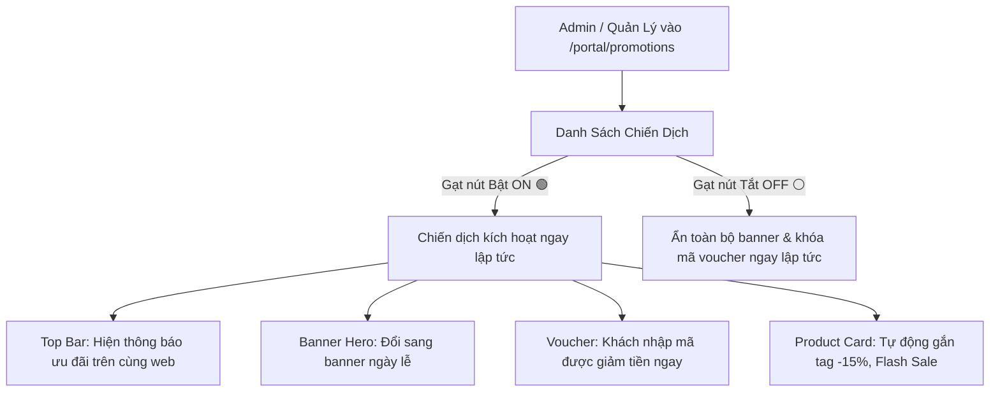

# Thiết Kế Phân Hệ Quản Lý Chiến Dịch Khuyến Mãi (Promotion & Campaign System)
## Dự Án: Nở Hoa Thả Bình (`telua_flower`)

---

## 1. Tổng Quan Phân Hệ (Overview)

Phân hệ **Quản Lý Khuyến Mãi (Promotions & Marketing Campaigns)** cho phép Quản trị viên (`super_admin`) hoặc Quản lý chi nhánh (`branch_manager`) dễ dàng:
1. **Tạo và quản lý các loại khuyến mãi:** Mã giảm giá (Voucher), Banner chiến dịch lễ hội (Valentine, 8/3, 20/10, Tết...), Thanh thông báo nổi đầu trang (Top Announcement Bar), và Popup ưu đãi.
2. **Cơ chế Bật/Tắt linh hoạt (1-Click Toggle Switch):** Admin chỉ cần gạt nút **ON 🟢 / OFF ⚪** để kích hoạt hoặc tạm dừng chiến dịch ngay lập tức trên website.
3. **Hẹn giờ chạy tự động (Auto Schedule):** Lên lịch tự động Bật lúc 00:00 ngày lễ và tự động Tắt khi hết hạn khuyến mãi.



---

## 2. Các Hình Thức Khuyến Mãi Hỗ Trợ Trên Website

### 🏷️ 1. Mã Voucher Giảm Giá (Discount Vouchers)
- **Giảm theo phần trăm (%):** VD: `ANNE10` (Giảm 10% tối đa 100.000₫ cho đơn đầu tiên).
- **Giảm số tiền cố định:** VD: `VALENTINE50K` (Giảm 50.000₫ cho đơn từ 500.000₫).
- **Miễn phí vận chuyển (Free Ship):** VD: `FREESHIP2H` (Miễn phí ship nội thành cho đơn từ 800.000₫).
- **Giới hạn lượt dùng:** Giới hạn tổng số lượt sử dụng (VD: 100 lượt đầu tiên) hoặc 1 lượt/khách hàng.

### 📢 2. Thanh Thông Báo Nổi Đầu Trang (Top Announcement Bar)
- Dòng chữ chạy nổi bật trên cùng website:
  *`🔥 MỪNG NGÀY PHỤ NỮ VIỆT NAM: Nhập mã PHUNU15 giảm ngay 15% + Tặng thiệp hoa thiết kế! 🔥`*
- Admin bật lên để thu hút khách hàng ngay khi vừa mở web.

### 🎨 3. Banner Chiến Dịch Theo Mùa Lễ (Seasonal Hero Banners)
- Admin tải ảnh banner sự kiện (Valentine 14/2, Quốc tế Phụ nữ 8/3, Ngày 20/10, Giáng sinh, Tết).
- Bật banner $\rightarrow$ Slider trên trang chủ lập tức hiển thị bộ sưu tập hoa của mùa lễ đó.

### ⚡ 4. Flash Sale / Giảm Giá Trực Tiếp Sản Phẩm
- Tự động gắn nhãn badge: `-15%`, `Flash Sale`, `Ưu Đãi Lễ`.
- Hiển thị giá gạch ngang (giá gốc) và giá khuyến mãi nổi bật.

---

## 3. Giao Diện Quản Trị & Cơ Chế Bật / Tắt (Admin Dashboard)

Tại màn hình quản trị `/portal/promotions`:

| Tên Chiến Dịch | Loại | Mã Voucher | Thời Gian Áp Dụng | Đã Dùng / Giới Hạn | Trạng Thái (Bật/Tắt) |
| :--- | :---: | :---: | :---: | :---: | :---: |
| **Mừng Tháng Phụ Nữ 20/10** | Giảm 15% + Banner | `PHUNU15` | 15/10/2026 - 21/10/2026 | 45 / 200 lượt | <span style="color:green">**[ ĐANG BẬT 🟢 ]**</span> |
| **Tặng Khách Hàng Mới** | Giảm 10% | `WELCOME10` | 01/01/2026 - 31/12/2026 | 128 / Không giới hạn | <span style="color:green">**[ ĐANG BẬT 🟢 ]**</span> |
| **Ưu Đãi Mùa Cưới 2026** | Free Ship + Quà | `WEDDINGFREE`| 01/09/2026 - 30/11/2026 | 12 / 50 lượt | <span style="color:gray">**[ ĐANG TẮT ⚪ ]**</span> |
| **Flash Sale Ngày Valentine** | Giảm 20% | `LOVE2026` | 10/02/2026 - 15/02/2026 | 300 / 300 (Hết lượt) | <span style="color:red">**[ ĐÃ KẾT THÚC 🔴 ]**</span> |

---

## 4. Cấu Trúc Dữ Liệu Khuyến Mãi (`config/promotions.json`)

```json
[
  {
    "id": "promo_2010",
    "title": "Chiến dịch Tri Ân 20/10",
    "code": "PHUNU15",
    "discountType": "percentage",
    "discountValue": 15,
    "maxDiscountAmount": 150000,
    "minOrderAmount": 400000,
    "startDate": "2026-10-15T00:00:00Z",
    "endDate": "2026-10-21T23:59:59Z",
    "usageLimit": 200,
    "usedCount": 45,
    "topBarMessage": "🔥 ƯU ĐÃI 20/10: Nhập mã PHUNU15 giảm 15% cho tất cả bó hoa!",
    "heroBannerUrl": "https://images.unsplash.com/photo-1561181286-d3fee7d55364?w=1200",
    "isActive": true
  }
]
```

---

## 5. Thiết Kế API Endpoints Khuyến Mãi

| Method | Endpoint | Quyền hạn | Mô tả |
| :--- | :--- | :---: | :--- |
| `GET` | `/api/promotions/active` | Public | Lấy danh sách các khuyến mãi, banner và Top Bar đang được **BẬT** |
| `POST` | `/api/promotions/validate-code` | Public | Khách kiểm tra mã giảm giá và tính toán số tiền giảm khi thanh toán |
| `GET` | `/api/admin/promotions` | Manager, Admin | Xem toàn bộ danh sách chiến dịch khuyến mãi |
| `POST` | `/api/admin/promotions` | Manager, Admin | Tạo chiến dịch khuyến mãi / Voucher mới |
| `PATCH`| `/api/admin/promotions/<id>/toggle` | Manager, Admin | **Bật / Tắt (ON/OFF) chiến dịch khuyến mãi** |
| `DELETE`| `/api/admin/promotions/<id>` | `super_admin` | Xóa chiến dịch |

#### Request mẫu kiểm tra mã giảm giá (`POST /api/promotions/validate-code`):
```json
{
  "code": "PHUNU15",
  "orderSubtotal": 880000
}
```

#### Response mẫu thành công:
```json
{
  "success": true,
  "data": {
    "code": "PHUNU15",
    "discountAmount": 132000,
    "finalTotal": 748000,
    "message": "Áp dụng thành công mã PHUNU15 (Giảm 15% - 132.000₫)"
  }
}
```
