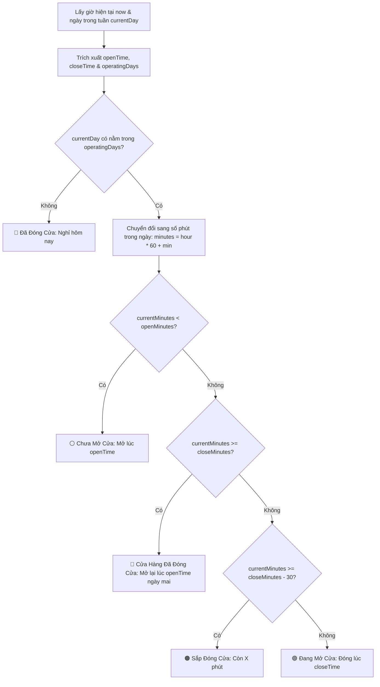

# Thiết Kế Chuẩn Hóa Giờ Hoạt Động (hh:mm), Multi-Select Box Ngày Mở Cửa & Trạng Thái Cửa Hàng Thời Gian Thực

## 1. Giới Thiệu & Bối Cảnh Nghiệp Vụ
Trước đây, thời gian hoạt động của chuỗi và từng showroom được lưu trữ dưới dạng chuỗi văn bản tự do không theo quy chuẩn (ví dụ: `"Thứ 2 - Chủ Nhật: 7:00 - 21:00"` hoặc `"07:30 - 21:00"`). Điều này dẫn đến các hạn chế:
1. **Sai lệch dữ liệu đầu vào**: Người quản trị có thể gõ sai cú pháp (thiếu số 0, sai dấu gạch ngang, gõ nhầm chữ).
2. **Không có khả năng tự động hóa**: Hệ thống Storefront không thể tự động nhận biết lúc nào showroom đang mở cửa hay đã đóng cửa.
3. **Trải nghiệm khách hàng kém**: Khách hàng đặt hoa đêm muộn hoặc sáng sớm không biết cửa hàng đã mở hay chưa, dẫn đến thắc mắc về thời gian giao hàng.

Tài liệu này đặc tả chuẩn hóa toàn diện:
- **Kiểu giờ chuẩn `hh:mm`**: Bộ chọn Select Box từ `05:00` đến `23:30` (bước 30 phút).
- **Multi-Select Box Ngày Hoạt Động**: Chọn linh hoạt từng ngày trong tuần (Thứ 2 $\rightarrow$ Chủ Nhật) hoặc các mẫu nhanh (*Cả tuần*, *Thứ 2 - Thứ 7*, *Thứ 2 - Thứ 6*).
- **Trạng thái đóng / mở cửa thời gian thực (Live Operating Status)**: Tự động phát hiện và cảnh báo khách hàng khi cửa hàng đã đóng cửa hoặc sắp đóng cửa.

---

## 2. Kiến Trúc Dữ Liệu & Quy Chuẩn (Data Schema)

### A. Cấu Trúc Dữ Liệu Doanh Nghiệp (`config/anne/infoCompany.json`)
```json
{
  "companyName": "NỞ HOA THẢ BÌNH",
  "workingHours": "Thứ 2 - Chủ Nhật: 07:00 - 21:00",
  "openTime": "07:00",
  "closeTime": "21:00",
  "operatingDays": ["Thứ 2", "Thứ 3", "Thứ 4", "Thứ 5", "Thứ 6", "Thứ 7", "Chủ Nhật"]
}
```

### B. Cấu Trúc Dữ Liệu Chi Nhánh Showroom (`config/anne/branches.json`)
```json
{
  "id": "branch_q10",
  "name": "Nở Hoa Thả Bình - Showroom Quận 10 (Flagship)",
  "openHours": "07:00 - 21:00",
  "openTime": "07:00",
  "closeTime": "21:00",
  "operatingDays": ["Thứ 2", "Thứ 3", "Thứ 4", "Thứ 5", "Thứ 6", "Thứ 7", "Chủ Nhật"]
}
```

> **Nguyên tắc Tương thích ngược (Backward Compatibility):**
> Các trường truyền thống `workingHours` và `openHours` vẫn luôn được tự động tạo và lưu trữ đầy đủ để tương thích 100% với các API và chức năng hiện hữu của hệ thống.

---

## 3. Thiết Kế Giao Diện Điều Khiển (UI/UX)

### A. Khối Multi-Select Box & Giờ `hh:mm` trong Cấu Hình Hệ Thống (`systemConfigModal`)
1. **Giờ mở cửa & Giờ đóng cửa**: Hai Select Box độc lập với các mốc giờ chuẩn `hh:mm` (`05:00` $\rightarrow$ `23:30`).
2. **Multi-Select Box Ngày Hoạt Động**: 
   - 7 nút badge chọn nhanh cho từng ngày: `[T2] [T3] [T4] [T5] [T6] [T7] [CN]`.
   - Các phím tắt tiện ích: `Tất Cả (T2-CN)`, `T2 - T7`, `T2 - T6`.
   - Người dùng click vào badge để bật/tắt (toggle) từng ngày cụ thể.
3. **Thanh xem trước kết quả thời gian thực**: Hiển thị chuỗi định dạng chuẩn (*Ví dụ: "Thứ 2 - Thứ 7: 08:00 - 21:30"*).

### B. Khối Giờ & Ngày Mở Cửa trong Quản Lý Showroom (`branchModal`)
Áp dụng đồng nhất bộ đôi Select Box `hh:mm` và Multi-Select Box ngày hoạt động cho từng chi nhánh, cho phép showroom có giờ mở cửa và ngày nghỉ riêng biệt (ví dụ: showroom Quận 1 mở cả tuần 08:00 - 22:00, nhưng showroom Thảo Điền mở 07:30 - 21:00).

---

## 4. Thuật Toán Nhận Diện Trạng Thái Đóng / Mở Thời Gian Thực

Thuật toán thực thi tại phía Client (`js/utils.js`) để đảm bảo cập nhật tức thời theo đồng hồ máy khách:



### Các Nhãn Trạng Thái Hiển Thị:
1. 🟢 **Đang Mở Cửa**: Hiển thị badge xanh lá kèm chấm nhấp nháy: `Đang mở cửa • Đóng lúc 21:00`.
2. 🟠 **Sắp Đóng Cửa**: Hiển thị badge cam khi còn dưới 30 phút: `Sắp đóng cửa • Đóng lúc 21:00 (còn 15 phút)`.
3. 🔴 **Cửa Hàng Đã Đóng Cửa**: Hiển thị badge đỏ nổi bật khi đã quá giờ kết thúc: `Cửa hàng đã đóng cửa • Mở cửa lại lúc 07:30 ngày mai`.
4. ⚪ **Chưa Tới Giờ Mở Cửa**: Hiển thị badge xám vào sáng sớm: `Chưa mở cửa • Mở lúc 07:30 sáng nay`.

---

## 5. Vị Trí Hiển Thị Trạng Thái Trên Storefront & Admin

1. **Khối Thông Tin Chi Nhánh Storefront (`#storeInfoCard`)**:
   - Thay thế văn bản giờ mở cửa đơn điệu bằng cụm Badge trạng thái sinh động (`#storeHoursVal`).
2. **Thanh Chọn Showroom Trực Tiếp (`#storeBranchNav`)**:
   - Thêm chấm trạng thái (🟢 / 🔴) bên cạnh tên mỗi showroom để khách hàng nhận biết ngay showroom nào đang hoạt động.
3. **Banner Cảnh Báo Khi Đặt Hàng Ngoài Giờ**:
   - Nếu khách hàng chọn một chi nhánh đang ở trạng thái **🔴 Đã Đóng Cửa**, hiển thị dòng thông báo nhẹ nhàng: *"Showroom hiện đã đóng cửa. Đơn hàng của bạn sẽ được ưu tiên chuẩn bị và giao vào khung giờ mở cửa sáng sớm ngày mai."*

---

## 6. Kế Hoạch Triển Khai & Kiểm Thử

| Bước | Hạng Mục | Tệp Liên Quan | Trạng Thái |
| :--- | :--- | :--- | :--- |
| 1 | Cập nhật tài liệu thiết kế kiến trúc | `docs/design/STORE_OPERATING_HOURS_AND_REALTIME_STATUS_DESIGN.md` | Hoàn thành |
| 2 | Nâng cấp UI Multi-select Box ngày & Select `hh:mm` | `index.html`, `config/index.html` | Sẵn sàng |
| 3 | Xử lý logic đồng bộ trong Cấu hình hệ thống | `js/portal_admin_sysconfig.js` | Sẵn sàng |
| 4 | Xử lý logic đồng bộ trong Quản lý Showroom | `js/portal_admin_branches.js` | Sẵn sàng |
| 5 | Hàm tính toán Realtime & Hiển thị badge Đã Đóng Cửa | `js/utils.js` | Sẵn sàng |
| 6 | Đóng gói bundle & chạy Unit test tự động | `js/bundle.js`, `test_store_operating_hours.py` | Sẵn sàng |
