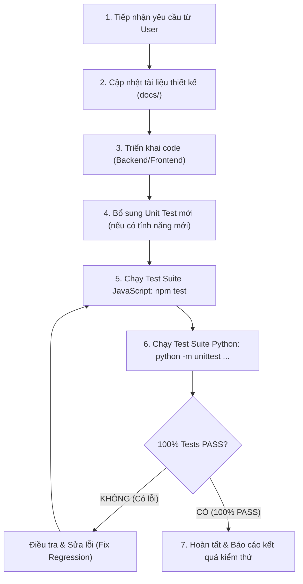

# QUY CHUẨN KIỂM THỬ & BẮT BUỘC CHẠY UNIT TEST (TESTING & QUALITY ASSURANCE MANDATE)

> **MÃ TÀI LIỆU:** DOC-QA-01  
> **ÁP DỤNG CHO:** Toàn bộ hệ thống `telua_flower` (Backend Python Flask + Frontend JavaScript Vanilla ES Modules)  
> **MỨC ĐỘ QUAN TRỌNG:** 🔴 BẮT BUỘC TUÂN THỦ (MANDATORY POLICY)

---

## 1. NGUYÊN TẮC BẮT BUỘC (MANDATORY POLICY)

Mọi quy trình phát triển, nâng cấp, bảo trì hoặc refactor mã nguồn trong dự án `telua_flower` đều phải tuân thủ nghiêm ngặt nguyên tắc:

1. **Cập nhật tài liệu kiến trúc trước khi viết code**: Mọi thay đổi về luồng dữ liệu, API hoặc logic nghiệp vụ phải được phản ánh vào thư mục `docs/` trước.
2. **Luôn luôn chạy toàn bộ Unit Test (cả JavaScript và Python)**: Sau khi hoàn thành bất kỳ chỉnh sửa code nào, lập trình viên/AI Agent BẮT BUỘC phải thực thi toàn bộ 2 bộ test suite của hệ thống.
3. **Tỷ lệ vượt qua 100% (Zero-Regression Policy)**: Không chấp nhận bất kỳ lỗi kiểm thử (Failure / Error) nào. Nếu có lỗi, phải điều tra và khắc phục triệt để trước khi bàn giao.

---

## 2. BỘ KIỂM THỬ JAVASCRIPT (FRONTEND & BUSINESS LOGIC)

Hệ thống Frontend sử dụng **Node.js Built-in Test Runner** (`node:test` & `node:assert`), không phụ thuộc vào thư viện bên ngoài cồng kềnh, tốc độ thực thi siêu nhanh (< 300ms).

### 2.1 Danh mục các Test Suite JavaScript (`js/unittest/`)

| File Test | Số Lượng Test | Nội Dung Kiểm Thử |
| :--- | :--- | :--- |
| **`test-search-filter.js`** | 10 tests | - Chuẩn hóa tiếng Việt không dấu (`removeVietnameseTones`).<br>- Tìm kiếm theo tên hoa, thành phần hoa (`composition`), SKU/ID.<br>- Bộ lọc trạng thái Đang bán / Đã ẩn (`isActive`).<br>- Trích xuất từ khóa tìm kiếm từ Hash routing chuẩn (`/#/search?q=...`).<br>- Nút xóa tìm kiếm (dấu X) theo trạng thái text.<br>- Phân biệt trải nghiệm tìm kiếm Responsive Mobile (<768px) vs Desktop (>=768px). |
| **`test-staff-rbac.js`** | 4 tests | - Ma trận hiển thị và phân quyền 5 nhóm vai trò (`super_admin`, `branch_manager`, `florist`, `sales_consultant`, `customer`).<br>- Quản lý chi nhánh chỉ được tạo nhân sự thuộc chi nhánh của mình.<br>- Super Admin có toàn quyền tạo mọi vai trò trên mọi chi nhánh. |
| **`test-portal-governance.js`** | 3 tests | - Kiểm soát biên độ giá theo tầng giá (Price Governance Guardrails).<br>- Chặn đặt giá thấp hơn giá sàn (`minPrice`) hoặc vượt giá trần (`maxPrice`). |
| **`test-products.js`** | 5 tests | - Xác thực tính hợp lệ của tệp dữ liệu `products.json`.<br>- Kiểm tra đầy đủ các trường bắt buộc (`id`, `name`, `priceNumber`, `category`, `stockByBranch`).<br>- Kiểm tra sự tồn tại của các file chi tiết trong `config/anne/products/`.<br>- Kiểm tra đầy đủ các trường chi tiết (`badge`, `dimension`, `description`, `careTips`, `flowerComposition`).<br>- Cơ chế phát hiện lỗi tải quá hạn 5s (Load Timeout & Graceful Recovery). |
| **`test-checkout.js`** | 3 tests | - Tính toán tổng tiền giỏ hàng (`calculateSubtotal`).<br>- Định dạng tiền tệ VND (`formatVND`).<br>- Quy tắc tính phí vận chuyển theo khoảng cách / hỏa tốc. |
| **`test-auth.js`** | 2 tests | - Giải mã JWT Payload phía client.<br>- Xử lý an toàn khi token không hợp lệ hoặc bị hỏng format. |
| **`test-translations.js`** | 5 tests | - Xác thực ma trận từ điển đa ngôn ngữ (Việt, Anh, Nhật, Hàn, Trung).<br>- Đồng bộ đầy đủ các khóa từ điển giữa các ngôn ngữ, không để trống giá trị.<br>- Đồng bộ số điện thoại Hotline động từ `infoCompany.json` vào Top Header và từ điển.<br>- Kiểm tra an toàn escape dấu ngoặc kép và cú pháp JSON đa ngôn ngữ. |

**Tổng cộng: 33 / 33 Tests PASS (100%)**

### 2.2 Câu lệnh thực thi Unit Test JavaScript

```bash
# Cách 1: Sử dụng lệnh npm chuẩn
npm test

# Cách 2: Chạy trực tiếp qua Node.js Runner
node --test js/unittest/*.js
```

---

## 3. BỘ KIỂM THỬ PYTHON (BACKEND API & DATA PROTECTION)

Hệ thống Backend sử dụng thư viện chuẩn `unittest` của Python, kết hợp với `Flask.test_client()` để kiểm thử toàn diện từ tầng I/O dữ liệu, xác thực bảo mật tới RESTful API Endpoints.

### 3.1 Danh mục 9 Test Suite Python (`src/unittest/`)

| Test Suite Python | Số Lượng Test | Nghiệp Vụ & An Ninh Kiểm Thử |
| :--- | :--- | :--- |
| **`test_file_structure.py`** | 2 tests | Kiểm tra cấu trúc phân vùng dữ liệu chuẩn `config/anne`, đảm bảo các file JSON cấu hình và thư mục chi tiết sản phẩm tồn tại đầy đủ. |
| **`test_data_service.py`** | 12 tests | Kiểm tra cơ chế đọc JSON có RAM Cache theo `mtime` file (<0.5ms), tự động vô hiệu hóa cache khi ghi, CRUD danh mục, chuyển đổi trạng thái hiển thị (`isActive`), xóa mềm (`isDeleted`). |
| **`test_auth_service.py`** | 14 tests | Kiểm tra mã hóa PBKDF2, sinh & giải mã JWT Token (HMAC-SHA256), đăng ký khách hàng, đăng nhập đa kênh (SĐT/Email), chặn tài khoản bị vô hiệu hóa (`isActive=False`), ma trận điều hướng 5 Roles. |
| **`test_order_service.py`** | 7 tests | Đặt hoa hẹn ngày trước 30 ngày, chọn khung giờ/hỏa tốc 2H, gửi hoa ẩn danh (`isAnonymous`), áp dụng Voucher giảm giá %, gán chi nhánh gần nhất tự động, REST API `/api/orders`. |
| **`test_price_governance.py`** | 8 tests | Kiểm soát biên độ giá theo tầng giá (Price Levels), chống chỉnh sửa giá tùy tiện, chặn vi phạm giá sàn/trần. |
| **`test_product_crud.py`** | 12 tests | Kiểm thử toàn diện CRUD sản phẩm, soft-delete, phân bổ tồn kho đa chi nhánh (`stockByBranch`), định ngạch xuất bán theo ngày (`dailyQuota`). |
| **`test_catalog_and_promotions.py`** | 12 tests | Quản lý khuyến mãi Voucher, cấu hình thời hạn/giá trị giảm tối đa, ghi nhận & thống kê báo cáo hoa hao hụt/hỏng hủy (`wastage_reports.json`), kiểm tra xác thực an toàn định dạng JSON trước khi ghi file (Pre-Write JSON Validation & Multi-Language Matrix Guard). |
| **`test_staff_and_branch_management.py`** | 6 tests | Quản lý nhân sự phân tán theo chi nhánh, tạo/sửa chi nhánh chuỗi cửa hàng, hỗ trợ song song tiền tố chuẩn hóa `/api/flower/v1` và tương thích ngược `/api`. |
| **`test_rbac_data_protection.py`** | 8 tests | Kiểm thử an ninh RBAC: Chặn khách hàng/vãng lai can thiệp API Admin, cách ly tuyệt đối đơn hàng giữa các khách hàng, cách ly kho đơn giữa các chi nhánh showroom. |

**Tổng cộng: 81 / 81 Tests PASS (100%)**

### 3.2 Câu lệnh thực thi Unit Test Python

```powershell
# Windows PowerShell
$env:PYTHONPATH="src"
python -m unittest discover -s src/unittest -p "test_*.py"

# Hoặc liệt kê rõ ràng 9 file test:
python -m unittest src/unittest/test_file_structure.py src/unittest/test_data_service.py src/unittest/test_auth_service.py src/unittest/test_order_service.py src/unittest/test_price_governance.py src/unittest/test_product_crud.py src/unittest/test_catalog_and_promotions.py src/unittest/test_staff_and_branch_management.py src/unittest/test_rbac_data_protection.py
```

```bash
# Linux / Ubuntu / Docker
export PYTHONPATH="src"
python3 -m unittest discover -s src/unittest -p "test_*.py"
```

---

## 4. QUY TRÌNH THỰC HIỆN KHI PHÁT TRIỂN TÍNH NĂNG (DEVELOPMENT WORKFLOW)



---

## 5. TỔNG HỢP KIỂM TRA CHẤT LƯỢNG TOÀN DIỆN (FULL AUDIT CHECKLIST)

Trước khi xác nhận hoàn thành bất kỳ task nào, hệ thống phải đạt đủ các tiêu chí:

- [x] **JavaScript Tests**: 27/27 bài test chạy thành công.
- [x] **Python Tests**: 79/79 bài test chạy thành công.
- [x] **Tài liệu hóa**: Đã cập nhật `docs/` tương ứng với tính năng mới.
- [x] **Hiệu năng & Caching**: Sử dụng RAM Cache theo `mtime` file cho backend và Debounce/Memoization cho frontend.
- [x] **An ninh dữ liệu**: Kiểm tra phân quyền RBAC không cho phép truy cập chéo tài nguyên.
