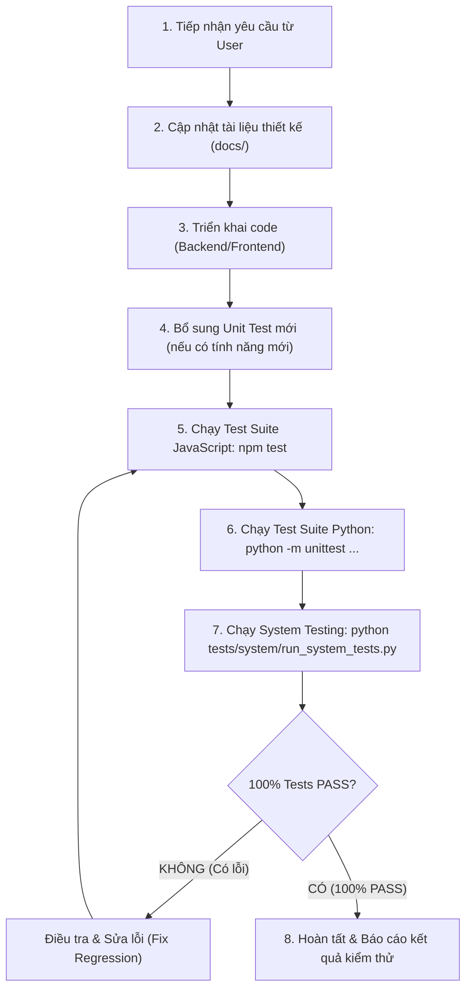

# QUY CHUẨN KIỂM THỬ BẮT BUỘC: UNIT TEST & SYSTEM TEST (TESTING & QUALITY ASSURANCE MANDATE)

> **MÃ TÀI LIỆU:** DOC-QA-01  
> **ÁP DỤNG CHO:** Toàn bộ hệ thống `telua_flower` (Backend Python Flask + Frontend JavaScript Vanilla ES Modules)  
> **MỨC ĐỘ QUAN TRỌNG:** 🔴 BẮT BUỘC TUÂN THỦ (MANDATORY POLICY)

---

## 1. NGUYÊN TẮC BẮT BUỘC (MANDATORY POLICY)

Mọi quy trình phát triển, nâng cấp, bảo trì hoặc refactor mã nguồn trong dự án `telua_flower` đều phải tuân thủ nghiêm ngặt nguyên tắc:

1. **Cập nhật tài liệu kiến trúc trước khi viết code**: Mọi thay đổi về luồng dữ liệu, API hoặc logic nghiệp vụ phải được phản ánh vào thư mục `docs/` trước.
2. **Bắt buộc chạy cả Unit Test và System Test**: Sau khi hoàn thành bất kỳ chỉnh sửa code nào, lập trình viên/AI Agent BẮT BUỘC phải thực thi toàn bộ **3 tầng kiểm thử** của hệ thống:
   - **Tầng 1 - Frontend Unit Tests**: `npm test` hoặc `node --test js/unittest/*.js` (40 bài test).
   - **Tầng 2 - Backend Python Unit & Integration Tests**: `python -m unittest discover -s src/unittest -p "test_*.py"` (159 bài test).
   - **Tầng 3 - Live Server E2E System Tests**: `python tests/system/run_system_tests.py` (7 kịch bản E2E trên cổng TCP thật).
   - *Hoặc chạy nhanh toàn bộ bằng 1 lệnh duy nhất*: `python scripts/run_all_tests.py` (hoặc `npm run test:all`).
3. **Tỷ lệ vượt qua 100% (Zero-Regression Policy)**: Cả 3 bộ test đều phải đạt tỷ lệ PASS 100%. Không chấp nhận bất kỳ lỗi kiểm thử (Failure / Error) nào. Nếu có lỗi, phải điều tra và khắc phục triệt để trước khi bàn giao.

---

## 2. BỘ KIỂM THỬ JAVASCRIPT (FRONTEND & BUSINESS LOGIC)

Hệ thống Frontend sử dụng **Node.js Built-in Test Runner** (`node:test` & `node:assert`), không phụ thuộc vào thư viện bên ngoài cồng kềnh, tốc độ thực thi siêu nhanh (< 300ms).

### 2.1 Danh mục các Test Suite JavaScript (`js/unittest/`)

| File Test | Số Lượng Test | Nội Dung Kiểm Thử |
| :--- | :--- | :--- |
| **`test-search-filter.js`** | 10 tests | - Chuẩn hóa tiếng Việt không dấu (`removeVietnameseTones`).<br>- Tìm kiếm theo tên hoa, thành phần hoa (`composition`), SKU/ID.<br>- Bộ lọc trạng thái Đang bán / Đã ẩn (`isActive`).<br>- Trích xuất từ khóa tìm kiếm từ Hash routing chuẩn (`/#/search?q=...`).<br>- Nút xóa tìm kiếm (dấu X) theo trạng thái text.<br>- Phân biệt trải nghiệm tìm kiếm Responsive Mobile (<768px) vs Desktop (>=768px). |
| **`test-staff-rbac.js`** | 4 tests | - Ma trận hiển thị và phân quyền 5 nhóm vai trò (`super_admin`, `branch_manager`, `florist`, `sales_consultant`, `customer`).<br>- Quản lý chi nhánh chỉ được tạo nhân sự thuộc chi nhánh của mình.<br>- Super Admin có toàn quyền tạo mọi vai trò trên mọi chi nhánh. |
| **`test-portal-governance.js`** | 3 tests | - Kiểm soát biên độ giá theo tầng giá (Price Governance Guardrails).<br>- Chặn đặt giá thấp hơn giá sàn (`minPrice`) hoặc vượt giá trần (`maxPrice`). |
| **`test-products.js`** | 6 tests | - Xác thực tính hợp lệ của tệp dữ liệu `products.json`.<br>- Kiểm tra đầy đủ các trường bắt buộc (`id`, `name`, `priceNumber`, `category`, `stockByBranch`).<br>- Kiểm tra sự tồn tại của các file chi tiết trong `config/anne/products/`.<br>- Kiểm tra đầy đủ các trường chi tiết (`badge`, `dimension`, `description`, `careTips`, `flowerComposition`).<br>- Cơ chế phát hiện lỗi tải quá hạn 5s (Load Timeout & Graceful Recovery).<br>- Phân giải đa ngôn ngữ từ khối `i18n` nhúng trong từng file `products/{id}.json` và cơ chế fallback an toàn. |
| **`test-checkout.js`** | 3 tests | - Tính toán tổng tiền giỏ hàng (`calculateSubtotal`).<br>- Định dạng tiền tệ VND (`formatVND`).<br>- Quy tắc tính phí vận chuyển theo khoảng cách / hỏa tốc. |
| **`test-auth.js`** | 2 tests | - Giải mã JWT Payload phía client.<br>- Xử lý an toàn khi token không hợp lệ hoặc bị hỏng format. |
| **`test-translations.js`** | 11 tests | - Xác thực ma trận từ điển đa ngôn ngữ (Việt, Anh, Nhật, Hàn, Trung).<br>- Đồng bộ đầy đủ các khóa từ điển giữa các ngôn ngữ, không để trống giá trị.<br>- Đồng bộ số điện thoại Hotline động từ `infoCompany.json` vào Top Header và từ điển.<br>- Kiểm tra an toàn escape dấu ngoặc kép và cú pháp JSON đa ngôn ngữ.<br>- Kiểm tra ràng buộc khóa `textId` và `descTextId` giữa `categories.json` và `translations.json`.<br>- Phân loại thuộc tính `type: 'system'` vs `type: 'user'`.<br>- Kiểm tra quy tắc ưu tiên bản dịch `getCategoryDisplayName` và fallback về `name`.<br>- Kiểm tra quy tắc ưu tiên bản dịch mô tả danh mục `getCategoryDescription` (`i18n` -> `descTextId` -> `description`).<br>- Quy trình thêm mới Text ID từ GUI: tự động gán `type='user'` và khởi tạo giá trị 5 ngôn ngữ bằng chính `textId`.<br>- Kiểm tra liên kết đa ngôn ngữ cho sản phẩm (`getProductName`, `getProductComposition`, `getProductDescription`) qua SelectBox Text ID. |

**Tổng cộng: 40 / 40 Tests PASS (100%)**

### 2.2 Câu lệnh thực thi Unit Test JavaScript

```bash
# Cách 1: Sử dụng lệnh npm chuẩn
npm test

# Cách 2: Chạy trực tiếp qua Node.js Runner
node --test js/unittest/*.js
```

---

## 3. BỘ KIỂM THỬ PYTHON (BACKEND API & DATA PROTECTION)

Hệ thống Backend sử dụng thư viện chuẩn `unittest` của Python, kết hợp với `Flask.test_client()` để kiểm thử toàn diện từ tầng I/O dữ liệu, xác thực bảo mật tới RESTful API Endpoints.

### 3.1 Danh mục 9 Test Suite Python (`src/unittest/`)

| Test Suite Python | Số Lượng Test | Nghiệp Vụ & An Ninh Kiểm Thử |
| :--- | :--- | :--- |
| **`test_file_structure.py`** | 2 tests | Kiểm tra cấu trúc phân vùng dữ liệu chuẩn `config/anne`, đảm bảo các file JSON cấu hình và thư mục chi tiết sản phẩm tồn tại đầy đủ. |
| **`test_data_service.py`** | 12 tests | Kiểm tra cơ chế đọc JSON có RAM Cache theo `mtime` file (<0.5ms), tự động vô hiệu hóa cache khi ghi, CRUD danh mục, chuyển đổi trạng thái hiển thị (`isActive`), xóa mềm (`isDeleted`). |
| **`test_auth_service.py`** | 14 tests | Kiểm tra mã hóa PBKDF2, sinh & giải mã JWT Token (HMAC-SHA256), đăng ký khách hàng, đăng nhập đa kênh (SĐT/Email), chặn tài khoản bị vô hiệu hóa (`isActive=False`), ma trận điều hướng 5 Roles. |
| **`test_order_service.py`** | 7 tests | Đặt hoa hẹn ngày trước 30 ngày, chọn khung giờ/hỏa tốc 2H, gửi hoa ẩn danh (`isAnonymous`), áp dụng Voucher giảm giá %, gán chi nhánh gần nhất tự động, REST API `/api/orders`. |
| **`test_price_governance.py`** | 8 tests | Kiểm soát biên độ giá theo tầng giá (Price Levels), chống chỉnh sửa giá tùy tiện, chặn vi phạm giá sàn/trần. |
| **`test_product_crud.py`** | 12 tests | Kiểm thử toàn diện CRUD sản phẩm, soft-delete, phân bổ tồn kho đa chi nhánh (`stockByBranch`), định ngạch xuất bán theo ngày (`dailyQuota`). |
| **`test_catalog_and_promotions.py`** | 14 tests | Quản lý khuyến mãi Voucher, cấu hình thời hạn/giá trị giảm tối đa, ghi nhận & thống kê báo cáo hoa hao hụt/hỏng hủy (`wastage_reports.json`), kiểm tra xác thực an toàn định dạng JSON trước khi ghi file (Pre-Write JSON Validation & Multi-Language Matrix Guard), phân loại System/User và cơ chế chống xóa khóa hệ thống (Immutability Guard), phân giải đa ngôn ngữ qua tham số `?lang=` trong `get_product_by_id`. |
| **`test_staff_and_branch_management.py`** | 6 tests | Quản lý nhân sự phân tán theo chi nhánh, tạo/sửa chi nhánh chuỗi cửa hàng, hỗ trợ song song tiền tố chuẩn hóa `/api/flower/v1` và tương thích ngược `/api`. |
| **`test_rbac_data_protection.py`** | 8 tests | Kiểm thử an ninh RBAC: Chặn khách hàng/vãng lai can thiệp API Admin, cách ly tuyệt đối đơn hàng giữa các khách hàng, cách ly kho đơn giữa các chi nhánh showroom. |

**Tổng cộng: 83 / 83 Tests PASS (100%)**

### 3.2 Câu lệnh thực thi Unit Test Python

```powershell
# Windows PowerShell
$env:PYTHONPATH="src"
python -m unittest discover -s src/unittest -p "test_*.py"

# Hoặc liệt kê rõ ràng 9 file test:
python -m unittest src/unittest/test_file_structure.py src/unittest/test_data_service.py src/unittest/test_auth_service.py src/unittest/test_order_service.py src/unittest/test_price_governance.py src/unittest/test_product_crud.py src/unittest/test_catalog_and_promotions.py src/unittest/test_staff_and_branch_management.py src/unittest/test_rbac_data_protection.py
```

### 3.3 Cơ chế cô lập dữ liệu kiểm thử Sandbox (Cross-Platform OS Temp)

Để tránh việc chạy Unit Test sinh ra hàng chục file đơn hàng, hình ảnh upload và làm thay đổi các file JSON trong thư mục cấu hình gốc `config/anne/`, hệ thống đã tích hợp cơ chế **Test Sandbox Isolation** chuẩn hóa đa nền tảng:

1. **Tự động nhận diện Test Runner & thư mục tạm chuẩn của OS**: Khi chạy qua `unittest` hoặc `pytest` (hoặc đặt biến `FLOWER_TEST_MODE=1`), hệ thống trong [flower_config.py](file:///D:/wmshare/telua_flower/src/flower_config.py) sử dụng `tempfile.gettempdir()` để tự động cô lập:
   - **Trên Windows**: Lưu vào thư mục tạm chuẩn `%TEMP%\telua_flower\config\anne` (ví dụ: `C:\Users\<user>\AppData\Local\Temp\telua_flower\config\anne`), không bao giờ tạo rác `D:\tmp` và không đòi hỏi quyền Admin.
   - **Trên Linux / Docker**: Lưu chuẩn vào `/tmp/telua_flower/config/anne`.
2. **Đồng bộ tự động dữ liệu mẫu (Auto Seed Sync)**: Trước khi test thực thi, toàn bộ dữ liệu mẫu sạch từ `config/anne` được sao chép sang thư mục tạm để đảm bảo bài test có đầy đủ danh mục, sản phẩm, tài khoản nhân viên ban đầu.
3. **Tuyệt đối không ô nhiễm dữ liệu gốc (Zero Side-Effects)**: Mọi thao tác ghi đơn hàng mới, upload ảnh tĩnh, cập nhật khách hàng đều diễn ra trong sandbox tạm thời. Thư mục gốc `config/anne` trong Git luôn giữ trạng thái sạch 100%.
4. **Tùy biến qua biến môi trường**: Bạn cũng có thể chủ động chỉ định bất kỳ thư mục nào bằng:
   - PowerShell: `$env:FLOWER_CONFIG_DIR="C:\custom_test_dir"`
   - Bash/Linux: `export FLOWER_CONFIG_DIR="/tmp/config/anne"`

---

## 4. BỘ KIỂM THỬ HỆ THỐNG (SYSTEM TESTING & LIVE RESTFUL API E2E)

Để đảm bảo toàn bộ hệ thống hoạt động không lỗi (Zero-Error System Guarantee) khi triển khai thực tế trên máy chủ hoặc qua các đường ống CI/CD, hệ thống tích hợp bộ **System Testing** độc lập tại thư mục `tests/system/`.

### 4.1 Mục đích và Sự khác biệt cốt lõi

| Tiêu chí | Unit & Integration Test (`src/unittest/`) | System Testing E2E (`tests/system/`) |
| :--- | :--- | :--- |
| **Bản chất** | Kiểm tra logic hàm, class và service trong bộ nhớ RAM. | **Kiểm thử toàn diện hệ thống như một hộp đen (Black-Box Testing)** đang chạy thực tế. |
| **Môi trường** | Sử dụng `Flask.test_client()` mô phỏng WSGI. | **Khởi động Flask HTTP Server thật** lắng nghe trên cổng mạng TCP (`http://127.0.0.1:PORT`). |
| **Giao thức** | Gọi hàm Python nội bộ. | **Gửi gói tin HTTP qua Socket/Wire Protocol** như trình duyệt hoặc Mobile App. |
| **Phạm vi kiểm tra** | Logic tính toán, thuật toán, validation. | **Toàn bộ chu trình hoạt động**: Network Socket $\rightarrow$ WSGI Server $\rightarrow$ Routing $\rightarrow$ CORS $\rightarrow$ JWT Auth $\rightarrow$ Business Services $\rightarrow$ Disk File I/O. |
| **Phát hiện lỗi đặc thù** | Lỗi code, sai logic. | **Xung đột cổng mạng, rò rỉ luồng (threads), sai lệch Content-Type/MIME, lỗi mã hóa header, lỗi Timeout**. |

### 4.2 Cấu trúc thư mục `tests/system/`

```
tests/
└── system/
    ├── __init__.py
    ├── http_client.py              # HTTP Client chuẩn Python stdlib (GET, POST, PUT, DELETE, Bearer Auth)
    ├── test_live_server_system.py  # Test suite hệ thống: Khởi động live server, gửi API, xác thực kết quả
    └── run_system_tests.py         # CLI Runner cho CI pipeline (exit code 0/1, báo cáo trực quan)
```

### 4.3 Các kịch bản kiểm thử hệ thống (E2E Scenarios)
1. **Khởi động & Sẵn sàng (Server Bootstrap & Healthcheck)**: Tìm cổng mạng trống ngẫu nhiên, bật live server nền trong thread riêng, gửi request ping kiểm tra trạng thái 200 OK.
2. **Xác thực đa vai trò (Auth & RBAC Matrix)**: Gửi `POST /api/flower/v1/auth/login` kiểm tra cấp JWT Token cho 4 nhóm vai trò (`super_admin`, `branch_manager`, `florist`, `sales_consultant`), chặn mật khẩu sai và tài khoản vô hiệu hóa.
3. **Danh mục & Mẫu hoa công khai (Catalog API)**: Gửi `GET /api/flower/v1/products` và `GET /api/flower/v1/categories`, kiểm tra tính toàn vẹn dữ liệu JSON và trường `productType`.
4. **Quản lý kho cành hoa (Raw Materials API)**: Gửi `GET /api/flower/v1/admin/inventory/materials` với token hợp lệ và kiểm tra chặn 401/403 đối với người dùng không có quyền.
5. **Vòng đời phiếu nhập kho từ Admin/Quản lý (Inbound Receipt Flow)**: Gửi `POST /api/flower/v1/admin/inventory/inbounds` tạo phiếu nhập hoa cành và bình hoa, kiểm tra số lượng tồn cành tự động cộng dồn vào `materials.json` của chi nhánh, sau đó `GET` để xác minh lưu trữ trên ổ đĩa.
6. **Báo hủy hoa dập hỏng (Wastage Flow)**: Gửi `POST /api/flower/v1/admin/inventory/wastage` báo hủy cành hoa, kiểm tra số lượng tồn cành tự động trừ đi tương ứng.
7. **Báo cáo cân đối nhập - xuất - tồn tháng (Monthly Balance & PnL Report)**: Gửi `GET /api/flower/v1/admin/inventory/monthly-report` kiểm tra các chỉ số tài chính (Doanh thu, Giá vốn COGS, Lợi nhuận gộp Gross Profit, Biên lợi nhuận %) và bảng cân đối 10 cột.
8. **Quy trình Mua hàng Online - Giao tận nơi (Home Delivery Flow)**: Khách hàng đặt mua hoa Online hẹn giờ, viết thiệp mừng, banner ruy-băng (`fulfillmentType='delivery'`). Super Admin tiếp nhận đơn và điều phối (`/dispatch`) về Showroom Q.10. Quản lý chi nhánh cập nhật quy trình cắm hoa (`confirmed` $\rightarrow$ `arranging` $\rightarrow$ `shipping` $\rightarrow$ `delivered`), thu tiền COD và xác nhận `paid`.
9. **Quy trình Mua hàng Offline / Online - Nhận tại cửa hàng (Store Pickup & Takeaway Flow)**: Khách đặt hoa chọn nhận trực tiếp tại Showroom Q.10 (`fulfillmentType='pickup'`). Nhân viên tại quầy chuẩn bị hoa (`confirmed` $\rightarrow$ `ready_for_pickup`), khách nhận hoa thanh toán tiền mặt/POS tại quầy (`paid`) và hoàn tất đơn (`completed`).
10. **Kiểm thử tải & rò rỉ bộ nhớ (100 Requests Stress & Memory Leak Audit)**: Gửi 100 requests liên tục vào Live Server, đo lường RAM qua `tracemalloc` và `gc.collect()`. Khẳng định $\Delta \text{RAM} < 15\text{MB}$ (thực tế chỉ +0.04MB), chứng minh hệ thống không rò rỉ bộ nhớ.
11. **Đo lường độ trễ & tự động xuất báo cáo hiệu năng (Latency Benchmark & Docs Report Generator)**: Đo lường chính xác thời gian phản hồi (Min, Avg, Median, P95, Max) của toàn bộ các RESTful API cốt lõi qua HTTP socket thật, kiểm tra tuân thủ SLA hiệu năng và tự động kết xuất báo cáo chuẩn Markdown vào [docs/reports/API_LATENCY_AND_BENCHMARK_REPORT.md](file:///d:/wmshare/telua_flower/docs/reports/API_LATENCY_AND_BENCHMARK_REPORT.md).
12. **Cách ly đa chi nhánh (Cross-Branch RBAC Security Isolation)**: Kiểm tra Quản lý Showroom Q.10 (`staff_001`) bị từ chối với mã **HTTP 403 Forbidden** khi cố tình xem danh sách đơn, cập nhật trạng thái đơn hoặc thu tiền đơn hàng thuộc Chi nhánh Quận 1 (`branch_q1`), trong khi Super Admin có toàn quyền và Quản lý Q.10 toàn quyền trên chi nhánh của mình.
13. **Kiểm thử đồng thời đa luồng (Multi-Threaded Concurrency 20 Threads)**: Bắn đồng thời 20 luồng độc lập vừa tạo đơn ghi đĩa vừa tính toán báo cáo PnL, xác nhận 100% hoàn thành trơn tru dưới 1s, cơ chế Atomic File Lock đảm bảo không tranh chấp (Race condition) và không hỏng file JSON.
14. **Đóng kết nối an toàn (Graceful Shutdown)**: Tự động dừng máy chủ và giải phóng cổng mạng TCP sau khi hoàn tất kiểm thử.

### 4.4 Lệnh thực thi System Test
```powershell
# Cách 1: Chạy trực tiếp qua Runner chuẩn CI
python tests/system/run_system_tests.py

# Cách 2: Chạy qua Unittest Discover
python -m unittest discover -s tests/system -p "test_*.py"
```

---

## 5. QUY TRÌNH THỰC HIỆN KHI PHÁT TRIỂN TÍNH NĂNG (DEVELOPMENT WORKFLOW)



---

## 6. TỔNG HỢP KIỂM TRA CHẤT LƯỢNG TOÀN DIỆN (FULL AUDIT CHECKLIST)

Trước khi xác nhận hoàn thành bất kỳ task nào, hệ thống phải đạt đủ các tiêu chí:

- [x] **JavaScript Tests**: 40/40 bài test chạy thành công (`npm test`).
- [x] **Python Unit Tests**: 159/159 bài test chạy thành công (`python -m unittest discover -s src/unittest -p "test_*.py"`).
- [x] **System Tests (E2E)**: Toàn bộ kịch bản kiểm thử Live Server chạy thành công (`python tests/system/run_system_tests.py`).
- [x] **Tài liệu hóa**: Đã cập nhật `docs/` tương ứng với tính năng mới trước khi code.
- [x] **Hiệu năng & Caching**: Sử dụng RAM Cache theo `mtime` file cho backend và Debounce/Memoization cho frontend.
- [x] **An ninh dữ liệu**: Kiểm tra phân quyền RBAC không cho phép truy cập chéo tài nguyên.

