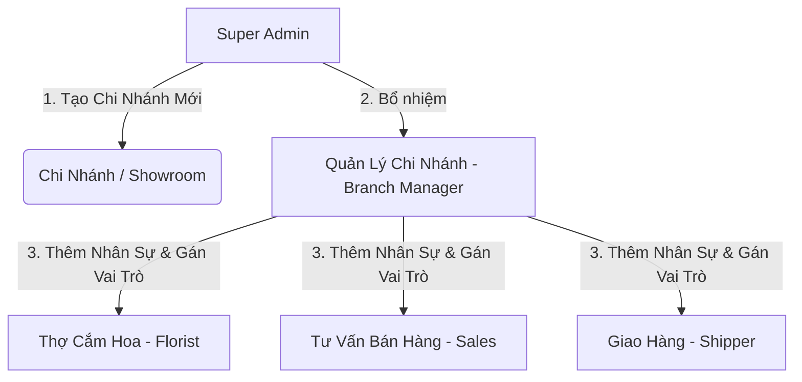

# Hướng Dẫn Quy Trình Tạo Cửa Hàng, Thêm Nhân Viên & Phân Quyền Vai Trò
## Dự Án: Nở Hoa Thả Bình (`telua_flower`)

---

## 1. Tổng Quan Quy Trình Vận Hành (Overview Workflow)

Hệ thống quản trị chuỗi cửa hàng hoa **Nở Hoa Thả Bình** hoạt động theo mô hình phân cấp 3 bước:



---

## 2. Quy Trình Chi Tiết Từng Bước (Step-by-Step Guide)

### 🏬 Bước 1: Tạo Chi Nhánh / Showroom Mới
- **Người thực hiện:** Quản trị viên cấp cao (`super_admin`).
- **Thao tác:**
  1. Vào Bảng quản trị hệ thống $\rightarrow$ Mục **Quản lý Chi Nhánh** $\rightarrow$ Chọn **"Thêm Chi Nhánh Mới"**.
  2. Nhập các thông tin cơ sở:
     - **Tên chi nhánh:** VD: *Showroom Quận 10 (Flagship)*, *Showroom Thảo Điền (Q.2)*.
     - **Mã chi nhánh:** `CN_Q10`, `CN_Q2`...
     - **Địa chỉ:** `183/37 Đường 3 Tháng 2, Phường 11, Quận 10, TP.HCM`.
     - **Tọa độ GPS:** `10.7725, 106.6698` (Dùng để định vị Google Maps và tự động gán đơn giao hàng gần nhất).
     - **Bán kính phục vụ hỏa tốc:** `5 km` - `10 km` (cho cam kết giao trong 2H).
     - **Hotline & Giờ mở cửa riêng của chi nhánh.**

---

### 👤 Bước 2: Thêm Nhân Viên Vào Chi Nhánh
- **Người thực hiện:** `super_admin` hoặc `branch_manager` của chi nhánh đó.
- **Thao tác:**
  1. Vào mục **Quản lý Nhân Sự** $\rightarrow$ Chọn **"Thêm Nhân Viên Mới"**.
  2. Nhập thông tin nhân sự:
     - **Họ và tên:** VD: *Nguyễn Văn A*.
     - **Số điện thoại:** `0912.345.678` (Dùng làm tài khoản đăng nhập).
     - **Email:** `nva@nohoathabinh.vn`.
     - **Mật khẩu khởi tạo ban đầu.**
     - **Chi nhánh trực thuộc:** Chọn chi nhánh nhân viên sẽ làm việc (VD: `CN_Q10`).

---

### 🏷️ Bước 3: Phân Vai Trò (Role) Cho Nhân Viên
Khi thêm mới hoặc chỉnh sửa nhân sự, người quản trị chọn một trong các **Vai trò (Role)** được định nghĩa sẵn trong hệ thống:

| Tên Vai Trò | Mã Role | Nhiệm Vụ & Quyền Hạn Chi Tiết |
| :--- | :---: | :--- |
| **Quản lý chi nhánh** | `branch_manager` | - Toàn quyền quản lý trong chi nhánh.<br>- Phân ca, chấm công cho nhân viên chi nhánh.<br>- Quản lý xuất/nhập kho hoa tươi.<br>- Xem báo cáo doanh thu chi nhánh. |
| **Thợ cắm hoa** | `florist` | - Nhận đơn hàng được giao cắm.<br>- Cập nhật trạng thái: *Đang cắm hoa* $\rightarrow$ *Hoàn tất cắm*.<br>- **Chụp ảnh thực tế sản phẩm hoa** tải lên hệ thống để gửi khách duyệt trước khi giao.<br>- Báo cáo hao hụt/hoa hỏng trong ca. |
| **Tư vấn bán hàng** | `sales_consultant` | - Tiếp nhận đơn hàng mới từ Web/Hotline/Zalo.<br>- Gọi xác nhận thông điệp thiệp, banner với khách.<br>- Tra cứu lịch sử khách hàng (CRM) để tư vấn loại hoa phù hợp.<br>- Thu ngân tại quầy showroom. |
| **Nhân viên giao hàng** | `shipper` | - Nhận đơn hoa đã cắm hoàn tất và ảnh đã được duyệt.<br>- Cập nhật trạng thái: *Đang giao hàng* $\rightarrow$ *Giao thành công*.<br>- Chụp ảnh ký nhận của người nhận hoa tại điểm giao. |

---

## 3. Cấu Trúc Dữ Liệu Lưu Trữ (Data Schema Models)

Hệ thống có thể lưu trữ dưới dạng JSON tĩnh hoặc Database quan hệ / NoSQL:

### 1. Cấu trúc Chi nhánh (`config/branches.json`)
```json
[
  {
    "id": "branch_q10",
    "code": "CN_Q10",
    "name": "Nở Hoa Thả Bình - Showroom Quận 10",
    "address": "183/37 Đường 3 Tháng 2, Phường 11, Quận 10, TP. Hồ Chí Minh",
    "lat": 10.7725,
    "lng": 106.6698,
    "phone": "0976.491.322",
    "openHours": "07:00 - 21:00",
    "deliveryRadiusKm": 10,
    "managerId": "staff_001",
    "isActive": true,
    "createdAt": "2026-08-21T00:00:00Z"
  }
]
```

### 2. Cấu trúc Nhân viên (`config/staff.json`)
```json
[
  {
    "id": "staff_001",
    "username": "manager_q10",
    "fullName": "Trần Thị Mai",
    "phone": "0909123456",
    "email": "mai.tran@nohoathabinh.vn",
    "branchId": "branch_q10",
    "role": "branch_manager",
    "isActive": true,
    "createdAt": "2026-08-21T00:00:00Z"
  },
  {
    "id": "staff_002",
    "username": "florist_lan",
    "fullName": "Lê Ngọc Lan",
    "phone": "0909654321",
    "email": "lan.le@nohoathabinh.vn",
    "branchId": "branch_q10",
    "role": "florist",
    "isActive": true,
    "createdAt": "2026-08-21T00:00:00Z"
  }
]
```

---

## 4. Thiết Kế API Endpoints (Backend API Contract)

### 🏬 Quản lý Chi Nhánh:
- `POST /api/admin/branches`: Tạo chi nhánh mới *(Chỉ `super_admin`)*
- `GET /api/branches`: Lấy danh sách chi nhánh công khai (để hiển thị trên bản đồ web)
- `PUT /api/admin/branches/<id>`: Chỉnh sửa thông tin, tọa độ, bán kính giao hàng
- `DELETE /api/admin/branches/<id>`: Tạm ngưng hoặc xóa chi nhánh

### 👥 Quản lý Nhân Viên & Vai Trò:
- `POST /api/branch/<branch_id>/staff`: Thêm nhân viên mới vào chi nhánh *(Cần quyền `branch_manager` hoặc `super_admin`)*
- `GET /api/branch/<branch_id>/staff`: Danh sách nhân viên của chi nhánh
- `PUT /api/staff/<staff_id>/role`: Thay đổi vai trò nhân sự (`florist`, `sales_consultant`...)
- `PUT /api/staff/<staff_id>/status`: Khóa / Kích hoạt lại tài khoản nhân viên

---

## 5. Luồng Thao Tác Sau Khi Nhân Viên Đăng Nhập

1. **Đăng nhập:** Nhân viên nhập Số điện thoại/Tên đăng nhập và Mật khẩu tại `/login`.
2. **Hệ thống xác thực:** Backend giải mã Token, kiểm tra `role` và `branchId`.
3. **Mở giao diện theo vai trò:**
   - Nếu là **Thợ cắm hoa (`florist`)**: Màn hình chỉ hiển thị danh sách đơn cần cắm trong ngày kèm ảnh mẫu thiết kế, nút bấm chụp ảnh hoa thật để gửi duyệt.
   - Nếu là **Tư vấn viên (`sales_consultant`)**: Màn hình hiển thị danh sách đơn mới đổ về, thông tin người nhận, ghi chú thiệp hoa.
   - Nếu là **Quản lý (`branch_manager`)**: Màn hình Dashboard tổng quan: số đơn đang xử lý, tình trạng hoa tươi trong kho, danh sách nhân viên đang trong ca trực.
